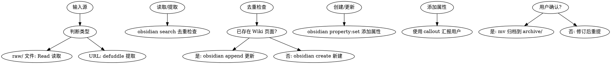

# Docs Ingest Skill

## Overview
文档摄取技能：分析 raw/ 文档或网页 → 创建/更新 Wiki 页面 → 用户确认后归档到 archive/

> [!tip] 2026-05-05 重要更新
> 已根据实战经验增加**中文环境特殊处理**章节，解决 Git Bash 下 `obsidian property:set` 失败问题。
> 推荐中文 Wiki 项目使用 **Write 工具 + 手写 YAML frontmatter** 工作流。

## Layered Architecture

```
子技能调用链：
defuddle 提取网页 ──→ obsidian-markdown 格式化 ──→ obsidian-cli 写入 vault
     │                      │                        │
     ▼                      ▼                        ▼
  网页内容净化          wikilinks/callouts        search/create/append
                   properties (frontmatter)         property:set
```

## 子技能能力映射

| 任务 | 调用技能 | 命令/技术 |
|------|----------|-----------|
| 网页内容提取 | **defuddle** | `defuddle parse <url> --md -o content.md` |
| 搜索重复内容 | **obsidian-cli** | `obsidian search query="关键词" limit=5` |
| 创建页面 | **obsidian-cli** | `obsidian create name="..." content="..." silent` |
| 设置属性 | **obsidian-cli** | `obsidian property:set name=<prop> value=<value> file=<note>` |
| 追加内容 | **obsidian-cli** | `obsidian append file=<note> content=<content>` |
| 读取现有页面 | **obsidian-cli** | `obsidian read file=<note>` |
| Frontmatter 规范 | **obsidian-markdown** | 引用 `references/PROPERTIES.md` |
| Callout 语法 | **obsidian-markdown** | 引用 `references/CALLOUTS.md` |
| 内部链接 | **obsidian-markdown** | `[[Note Name]]`、`![[Note]]` |
| Embed 语法 | **obsidian-markdown** | 引用 `references/EMBEDS.md` |

## When to Use

**触发条件：**
- 发现新文档在 raw/ 目录
- 用户提供 URL 要求摄取到 Wiki
- 用户要求摄取外部文档到 Wiki
- 需要将现有知识体系化

**症状：**
- 直接使用 raw 文档而不体系化
- 不检查 Wiki 是否存在重复内容
- 手工编写 frontmatter 而非使用 CLI

## Core Pattern



## Real Commands

### 1. defuddle 提取网页内容

```bash
# 基本提取（首选方式，比 WebFetch 省 token）
defuddle parse <url> --md -o content.md

# 提取元数据
defuddle parse <url> -p title      # 提取标题
defuddle parse <url> -p description # 提取描述

# 提取后保存到 raw/ 待处理
defuddle parse <url> --md -o raw/temp/filename.md
```

### 2. obsidian search 去重检查

```bash
# 搜索是否已有相关页面（重要！必须先做）
obsidian search query="相关关键词" limit=5

# 查看搜索结果的wikilinks确定无重复后再创建
```

### 3. obsidian create 创建新页面

```bash
# 创建基础页面（content 使用 \n 换行）
obsidian create name="category/slug" content="# Title\n\nContent" silent

# 使用模板创建（如果项目有模板）
obsidian create name="category/slug" template="WikiTemplate" silent
```

### 4. obsidian property:set 添加属性（替代手工 YAML）

```bash
# 逐个设置属性（推荐方式，与 Obsidian 属性系统同步）
obsidian property:set name="description" value="一句话描述" file="category/slug"
obsidian property:set name="type" value="concept" file="category/slug"
obsidian property:set name="tags" value='["tag1", "tag2"]' file="category/slug"
obsidian property:set name="source" value="../../archive/category/filename.md" file="category/slug"

# 日期属性
obsidian property:set name="created" value="2026-05-02" file="category/slug"
obsidian property:set name="updated" value="2026-05-02" file="category/slug"
```

### 5. obsidian append 追加内容

```bash
# 追加内容到现有页面
obsidian append file="ExistingNote" content="\n\n## New Section"

# 追加 callout 格式的重要信息
obsidian append file="ExistingNote" content="\n\n> [!tip] Key Finding\n> 重要发现内容。"
```

### 6. obsidian read 读取现有页面

```bash
# 检查现有页面内容
obsidian read file="ExistingNote"
```

## Quick Reference

| 阶段 | 操作 | 中文环境推荐 | 英文环境备选 |
|------|------|-------------|-------------|
| 网页提取 | defuddle | `defuddle parse <url> --md -o raw/temp/xxx.md` | 相同 |
| 分析 | 读取文件 | `Read` tool | 相同 |
| 去重 | 搜索 Wiki | `obsidian search query="..."` | 相同 ✅ |
| 创建 | 创建页面 | **Write 工具 + YAML** | `obsidian create path="..."` |
| 设属性 | 添加 frontmatter | **手写 YAML** | `property:set` ⚠️ |
| 追加 | 追加内容 | `Edit` 工具 | `obsidian append` |
| 归档 | 移动文件 | **通配符/绝对路径** | `Bash mv` |

**环境判断标准**：
- 中文环境 = Wiki 内容含中文 + Git Bash (MSYS2)
- 英文环境 = 纯英文内容 + PowerShell/CMD/WSL

## Frontmatter 规范（obsidian-markdown properties）

### 中文 Wiki 项目（推荐）

**直接在 Write 工具中编写 YAML**：

```markdown
---
name: page-slug
description: 中文描述完全没问题
type: guide
tags: [tag1, tag2, 中文标签]
created: 2026-05-05
updated: 2026-05-05
source: ../../../archive/category/file.md
---

# 页面标题

内容...
```

**优势**：
- ✅ 完全控制，无编码问题
- ✅ 支持中文标签和描述
- ✅ 与 Obsidian 完全兼容
- ✅ 一次性完成，避免多次 CLI 调用

### 英文环境（可选）

使用 `obsidian property:set`（仅英文内容可用）：

```bash
# ⚠️ Git Bash 中文值会失败
obsidian property:set name="description" value="English only" path="guides/xxx.md"
obsidian property:set name="type" value="concept" path="guides/xxx.md"
obsidian property:set name="tags" value='["tag1", "tag2"]' path="guides/xxx.md"

# 参考: obsidian-markdown references/PROPERTIES.md
# 支持类型: text, number, checkbox, date, list, links
```

### Frontmatter 字段映射

| 字段 | 必需 | 中文环境 | 英文环境 CLI | 类型 |
|------|------|----------|-------------|------|
| `name` | ✅ | 手写 YAML | 创建时自动 | text |
| `description` | ✅ | 手写 YAML | `property:set` | text |
| `type` | ✅ | 手写 YAML | `property:set` | text |
| `tags` | ✅ | 手写 YAML | `property:set` | list |
| `created` | ✅ | 手写 YAML | `property:set` | date |
| `updated` | ✅ | 手写 YAML | `property:set` | date |
| `source` | 建议 | 手写 YAML | `property:set` | links |

## Callout 语法（obsidian-markdown callouts）

在汇报和内容中使用 callout 突出重要信息：

```markdown
> [!tip] 提取成功
> 已创建新页面 [[category/slug]]

> [!warning] 需要审核
> 内容可能需要补充来源引用

> [!question] 重复检测
> 发现相似页面 [[ExistingNote]]，是否合并？
```

参考: `references/CALLOUTS.md` 获取所有类型。

## Wikilinks 和 Embeds（obsidian-markdown）

```markdown
# 内部链接
[[Existing Note]]           # 链接到现有页面
[[Existing Note#Section]]   # 链接到特定章节
![[Existing Note]]          # 嵌入现有页面内容

# 在内容中使用
参见 [[Related Concept]] 了解更多。
```

参考: `references/EMBEDS.md` 获取所有 embed 类型。

## Implementation Steps

### 中文 Wiki 项目优化工作流（2026-05-05 验证）

1. **Identify Source** — 判断是 raw/ 文件还是 URL
   - raw/ 文件 → 直接 Read 读取
   - URL → defuddle 提取

2. **Extract** — 使用 defuddle 提取网页内容（如果是 URL）
   ```bash
   defuddle parse <url> --md -o raw/temp/extracted.md
   ```

3. **Analyze** — 读取源文档，分析结构和内容

4. **Deduplicate** — `obsidian search` 检查 Wiki 是否存在相关内容
   ```bash
   obsidian search query="相关关键词" limit=5
   ```

5. **Create Page** — 根据去重结果创建页面：
   - **新页面（含中文）**：使用 `Write` 工具 + 手写 YAML frontmatter
   - **纯英文页面**：可尝试 `obsidian create path="..." content="..." silent`
   - **更新页面**：`obsidian append file="..." content="..."` 或 `Edit` 工具

6. **Set Properties** — **重要**：根据环境选择方法
   - **中文环境（Git Bash）**：
     ```markdown
     # 在 Write 工具中直接编写
     ---
     name: page-slug
     description: 中文描述
     type: guide
     tags: [tag1, tag2]
     created: 2026-05-05
     updated: 2026-05-05
     source: ../../../archive/category/file.md
     ---
     ```
   - **英文环境（PowerShell/CMD）**：
     ```bash
     obsidian property:set name="description" value="..." path="guides/xxx.md"
     obsidian property:set name="type" value="..." path="guides/xxx.md"
     # ... 其他属性
     ```

7. **Report with Callouts** — 使用 callout 向用户汇报
   ```markdown
   > [!success] 文档摄取完成
   > - 新建页面: [[category/slug]]
   > - 类型: concept
   > - 标签: [tag1, tag2]
   ```

8. **Archive** — 用户确认后移动源文件
   ```bash
   # 中文文件名使用通配符
   cd raw/plugins && mv *-使用指南.md ../../archive/plugins/
   # 或使用绝对路径
   mv /d/Docs/.../raw/file.md /d/Docs/.../archive/
   ```

## Common Mistakes

| 错误 | 正确做法 | 环境要求 |
|------|----------|----------|
| URL 直接复制不用 defuddle | 先 `defuddle parse <url> --md` 提取 | 所有环境 |
| 不检查重复直接创建 | 先 `obsidian search` 去重 | 所有环境 |
| 手工编写 YAML frontmatter | 使用 `obsidian property:set` | **仅英文环境** |
| **Git Bash 下用 property:set 设置中文** | **Write 工具 + 手写 YAML** | **中文环境** |
| `obsidian create name=路径` | `obsidian create path=路径` | 所有环境 |
| 没有使用 callout 汇报 | 使用 `> [!type]` 格式突出信息 | 所有环境 |
| 忘记设置 source 属性 | 归档后添加 `property:set name="source"` | 英文环境 |
| **中文文件名直接 mv** | **使用通配符或绝对路径** | **Git Bash** |
| 不判断环境盲目用 CLI | 先判断中英文内容再选工具 | 所有环境 |

## Real-World Impact

- **defuddle** 减少 50%+ token 使用
- **property:set** 确保 frontmatter 与 Obsidian 同步（英文环境）
- **callouts** 提供清晰的操作反馈
- **wikilinks** 保持 Wiki 内部连接健全

---

## ⚠️ 中文环境特殊处理（2026-05-05 更新）

### 已知问题：obsidian property:set 失败

**问题表现**：
```bash
# Git Bash (MSYS2) 环境下执行失败
obsidian property:set name="description" value="中文描述" path="guides/xxx.md"
# Exit code 127 (命令未找到)
# 错误信息：$'\224\200\224\200...' (中文编码乱码)
```

**根因分析**：
- Git Bash (MSYS2) 处理 UTF-8 中文参数存在问题
- `value="中文内容"` 被错误编码
- Windows 路径和 Shell 环境的兼容性问题

**解决方案**：
```markdown
# ✅ 推荐：直接使用 Write 工具，手动编写 frontmatter
---
name: page-slug
description: 中文描述完全没问题
type: guide
tags: [tag1, tag2]
created: 2026-05-05
updated: 2026-05-05
source: ../../../archive/category/file.md
---

# 页面标题

内容...
```

### 环境适配决策树

```
Wiki 页面创建任务
    │
    ├─ 纯英文内容？
    │   └─ 是 → 可尝试 obsidian create + property:set
    │
    ├─ 包含中文内容？
    │   └─ 是 → 使用 Write 工具（推荐）
    │
    ├─ Frontmatter 属性设置？
    │   ├─ 英文值 → 可尝试 property:set
    │   └─ 中文值 → Write 手动编写
    │
    └─ 验证环境？
        └─ Git Bash → 优先 Write 工具
        └─ PowerShell/CMD → 可尝试 property:set
```

### 中文环境推荐工作流

| 任务 | 推荐工具 | 备选方案 | 备注 |
|------|----------|----------|------|
| **创建页面** | Write 工具 | obsidian create path= | 避免编码问题 |
| **设置属性** | 手写 YAML | property:set (仅英文) | 中文必须手写 |
| **搜索去重** | obsidian search | - | ✅ 工作正常 |
| **读取内容** | Read 工具 | obsidian read | ✅ 都可用 |
| **追加内容** | Edit 工具 | obsidian append | ✅ 都可用 |
| **归档文件** | Bash mv | - | 使用通配符避免中文路径 |

### 实战经验总结

**2026-05-05 实测结果**：

| 命令 | Git Bash 状态 | 说明 |
|------|--------------|------|
| `obsidian search` | ✅ 正常 | 中文搜索无问题 |
| `obsidian create path=` | ✅ 成功 | 创建文件正常 |
| `obsidian property:set` | ❌ 失败 | 中文值编码错误 |
| `Write tool + YAML` | ✅ 完美 | 推荐方案 |
| `obsidian append` | ⚠️ 未测试 | 理论可用 |

**最佳实践**：
1. **中文 Wiki 项目** → 直接使用 Write 工具
2. **属性值含中文** → 手写 YAML frontmatter
3. **文件名含中文** → 使用通配符或绝对路径
4. **验证搜索** → obsidian search 依然可靠

### 防止再犯措施

**在执行前检查**：
```
[ ] 内容包含中文？
    └─ 是 → 使用 Write 工具，跳过 property:set
[ ] 属性值包含中文？
    └─ 是 → 手写 YAML，不要尝试 property:set
[ ] 当前 Shell 是 Git Bash？
    └─ 是 → 优先 Write 工具，避免 CLI 编码问题
```

**更新 Common Mistakes**：

| 错误 | 正确做法 | 环境要求 |
|------|----------|----------|
| `property:set` 设置中文值 | Write 工具 + 手写 YAML | Git Bash |
| `obsidian create name=路径` | `obsidian create path=路径` | 所有环境 |
| 不检查环境直接用 CLI | 先判断中英文内容再选工具 | 中文项目 |