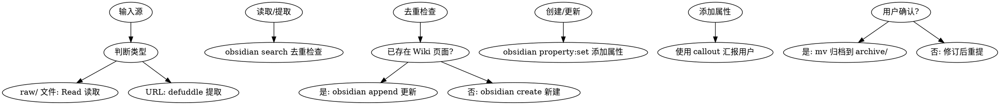

# Docs Ingest Skill

## Overview
文档摄取技能：分析 raw/ 文档或网页 → 创建/更新 Wiki 页面 → 用户确认后归档到 archive/

## Layered Architecture

```
子技能调用链：
defuddle 提取网页 ──→ obsidian-markdown 格式化 ──→ obsidian-cli 写入 vault
     │                      │                        │
     ▼                      ▼                        ▼
  网页内容净化          wikilinks/callouts        search/create/append
                   properties (frontmatter)         property:set
```

## 子技能能力映射

| 任务 | 调用技能 | 命令/技术 |
|------|----------|-----------|
| 网页内容提取 | **defuddle** | `defuddle parse <url> --md -o content.md` |
| 搜索重复内容 | **obsidian-cli** | `obsidian search query="关键词" limit=5` |
| 创建页面 | **obsidian-cli** | `obsidian create name="..." content="..." silent` |
| 设置属性 | **obsidian-cli** | `obsidian property:set name=<prop> value=<value> file=<note>` |
| 追加内容 | **obsidian-cli** | `obsidian append file=<note> content=<content>` |
| 读取现有页面 | **obsidian-cli** | `obsidian read file=<note>` |
| Frontmatter 规范 | **obsidian-markdown** | 引用 `references/PROPERTIES.md` |
| Callout 语法 | **obsidian-markdown** | 引用 `references/CALLOUTS.md` |
| 内部链接 | **obsidian-markdown** | `[[Note Name]]`、`![[Note]]` |
| Embed 语法 | **obsidian-markdown** | 引用 `references/EMBEDS.md` |

## When to Use

**触发条件：**
- 发现新文档在 raw/ 目录
- 用户提供 URL 要求摄取到 Wiki
- 用户要求摄取外部文档到 Wiki
- 需要将现有知识体系化

**症状：**
- 直接使用 raw 文档而不体系化
- 不检查 Wiki 是否存在重复内容
- 手工编写 frontmatter 而非使用 CLI

## Core Pattern



## Real Commands

### 1. defuddle 提取网页内容

```bash
# 基本提取（首选方式，比 WebFetch 省 token）
defuddle parse <url> --md -o content.md

# 提取元数据
defuddle parse <url> -p title      # 提取标题
defuddle parse <url> -p description # 提取描述

# 提取后保存到 raw/ 待处理
defuddle parse <url> --md -o raw/temp/filename.md
```

### 2. obsidian search 去重检查

```bash
# 搜索是否已有相关页面（重要！必须先做）
obsidian search query="相关关键词" limit=5

# 查看搜索结果的wikilinks确定无重复后再创建
```

### 3. obsidian create 创建新页面

```bash
# 创建基础页面（content 使用 \n 换行）
obsidian create name="category/slug" content="# Title\n\nContent" silent

# 使用模板创建（如果项目有模板）
obsidian create name="category/slug" template="WikiTemplate" silent
```

### 4. obsidian property:set 添加属性（替代手工 YAML）

```bash
# 逐个设置属性（推荐方式，与 Obsidian 属性系统同步）
obsidian property:set name="description" value="一句话描述" file="category/slug"
obsidian property:set name="type" value="concept" file="category/slug"
obsidian property:set name="tags" value='["tag1", "tag2"]' file="category/slug"
obsidian property:set name="source" value="../../archive/category/filename.md" file="category/slug"

# 日期属性
obsidian property:set name="created" value="2026-05-02" file="category/slug"
obsidian property:set name="updated" value="2026-05-02" file="category/slug"
```

### 5. obsidian append 追加内容

```bash
# 追加内容到现有页面
obsidian append file="ExistingNote" content="\n\n## New Section"

# 追加 callout 格式的重要信息
obsidian append file="ExistingNote" content="\n\n> [!tip] Key Finding\n> 重要发现内容。"
```

### 6. obsidian read 读取现有页面

```bash
# 检查现有页面内容
obsidian read file="ExistingNote"
```

## Quick Reference

| 阶段 | 操作 | 命令 |
|------|------|------|
| 网页提取 | defuddle | `defuddle parse <url> --md -o raw/temp/xxx.md` |
| 分析 | 读取文件 | `Read` tool |
| 去重 | 搜索 Wiki | `obsidian search query="..."` |
| 创建 | 创建页面 | `obsidian create name="..." content="..." silent` |
| 设属性 | CLI 属性 | `obsidian property:set name="..." value="..." file="..."` |
| 追加 | 追加内容 | `obsidian append file="..." content="..."` |
| 归档 | 移动文件 | `Bash mv` |

## Frontmatter 规范（obsidian-markdown properties）

使用 `obsidian property:set` 而非手工 YAML：

```bash
# 推荐：使用 CLI 设置属性
obsidian property:set name="description" value="一句话描述" file="note"
obsidian property:set name="type" value="concept" file="note"
obsidian property:set name="tags" value='["tag1", "tag2"]' file="note"

# 参考: obsidian-markdown references/PROPERTIES.md
# 支持类型: text, number, checkbox, date, list, links
```

### Frontmatter 字段映射

| 字段 | 必需 | CLI 命令 | 类型 |
|------|------|----------|------|
| `name` | ✅ | 创建时自动 | text |
| `description` | ✅ | `property:set name="description"` | text |
| `type` | ✅ | `property:set name="type"` | text |
| `tags` | ✅ | `property:set name="tags"` | list |
| `created` | ✅ | `property:set name="created"` | date |
| `updated` | ✅ | `property:set name="updated"` | date |
| `source` | 建议 | `property:set name="source"` | links |

## Callout 语法（obsidian-markdown callouts）

在汇报和内容中使用 callout 突出重要信息：

```markdown
> [!tip] 提取成功
> 已创建新页面 [[category/slug]]

> [!warning] 需要审核
> 内容可能需要补充来源引用

> [!question] 重复检测
> 发现相似页面 [[ExistingNote]]，是否合并？
```

参考: `references/CALLOUTS.md` 获取所有类型。

## Wikilinks 和 Embeds（obsidian-markdown）

```markdown
# 内部链接
[[Existing Note]]           # 链接到现有页面
[[Existing Note#Section]]   # 链接到特定章节
![[Existing Note]]          # 嵌入现有页面内容

# 在内容中使用
参见 [[Related Concept]] 了解更多。
```

参考: `references/EMBEDS.md` 获取所有 embed 类型。

## Implementation Steps

1. **Identify Source** — 判断是 raw/ 文件还是 URL
   - raw/ 文件 → 直接 Read 读取
   - URL → defuddle 提取

2. **Extract** — 使用 defuddle 提取网页内容（如果是 URL）
   ```bash
   defuddle parse <url> --md -o raw/temp/extracted.md
   ```

3. **Analyze** — 读取源文档，分析结构和内容

4. **Deduplicate** — `obsidian search` 检查 Wiki 是否存在相关内容
   ```bash
   obsidian search query="相关关键词" limit=5
   ```

5. **Create or Update** — 根据去重结果：
   - **新页面**：`obsidian create name="..." content="..." silent`
   - **更新页面**：`obsidian append file="..." content="..."`

6. **Set Properties** — 使用 `obsidian property:set` 添加 frontmatter
   ```bash
   obsidian property:set name="description" value="..." file="note"
   obsidian property:set name="type" value="..." file="note"
   obsidian property:set name="tags" value='[...]' file="note"
   obsidian property:set name="source" value="..." file="note"
   ```

7. **Report with Callouts** — 使用 callout 向用户汇报
   ```markdown
   > [!success] 文档摄取完成
   > - 新建页面: [[category/slug]]
   > - 类型: concept
   > - 标签: [tag1, tag2]
   ```

8. **Archive** — 用户确认后移动源文件
   ```bash
   mv raw/filename.md archive/category/filename.md
   ```

## Common Mistakes

| 错误 | 正确做法 |
|------|----------|
| URL 直接复制不用 defuddle | 先 `defuddle parse <url> --md` 提取 |
| 不检查重复直接创建 | 先 `obsidian search` 去重 |
| 手工编写 YAML frontmatter | 使用 `obsidian property:set` |
| 没有使用 callout 汇报 | 使用 `> [!type]` 格式突出信息 |
| 忘记设置 source 属性 | 归档后添加 `property:set name="source"` |

## Real-World Impact

- **defuddle** 减少 50%+ token 使用
- **property:set** 确保 frontmatter 与 Obsidian 同步
- **callouts** 提供清晰的操作反馈
- **wikilinks** 保持 Wiki 内部连接健全