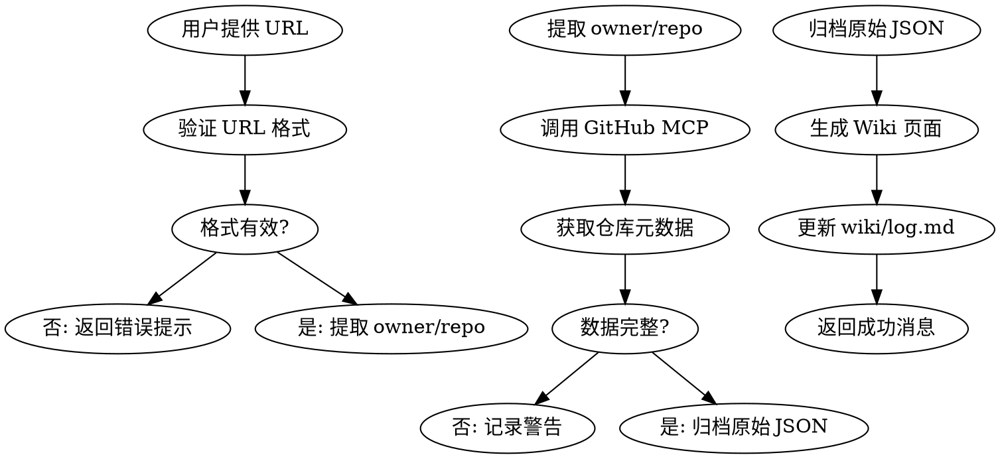

# GitHub Collect Skill

## Overview
从 GitHub 收集优秀仓库资源，自动生成符合 Wiki 规范的页面并归档原始数据。

## When to Use

**触发条件：**
- 用户提供 GitHub 仓库 URL
- 需要记录和跟踪优秀的 GitHub 仓库
- 想要自动化收集仓库元数据（Stars、语言、许可证等）

**使用场景：**
- 被动收集：浏览 GitHub 时遇到好仓库快速记录
- 学习资源：收集技术栈相关的优秀项目
- 最佳实践：归档值得参考的代码仓库

## Core Workflow



## Layered Architecture

```
子技能调用链：
GitHub MCP 获取元数据 ──→ defuddle 提取 README ──→ obsidian-markdown 格式化 ──→ obsidian-cli 写入
      │                          │                        │                       │
      ▼                          ▼                        ▼                       ▼
  repo/search_repo         网页内容净化            wikilinks/callouts      create/property:set
```

## 子技能能力映射

| 任务 | 调用技能 | 命令/技术 |
|------|----------|-----------|
| GitHub 元数据 | GitHub MCP | `mcp__plugin_github_github__get_repo` |
| 目录结构 | GitHub MCP | `mcp__plugin_github_github__list_commits` |
| README 提取 | **defuddle** | `defuddle parse <url> --md -o content.md` |
| 搜索重复 | **obsidian-cli** | `obsidian search query="owner/repo" limit=5` |
| 创建页面 | **obsidian-cli** | `obsidian create name="..." content="..." silent` |
| 设置属性 | **obsidian-cli** | `obsidian property:set name=<prop> value=<value> file=<note>` |
| 追加内容 | **obsidian-cli** | `obsidian append file=<note> content=<content>` |
| Frontmatter 规范 | **obsidian-markdown** | 引用 `references/PROPERTIES.md` |
| Callout 语法 | **obsidian-markdown** | 引用 `references/CALLOUTS.md` |
| 内部链接 | **obsidian-markdown** | `[[Note Name]]` |

## Data Schema

### 获取的元数据字段
```yaml
通过 GitHub MCP 获取：
  - name: 仓库名称
  - description: 描述
  - stars: Star 数量
  - language: 主要语言
  - license: 许可证
  - url: 仓库链接
  - created_at: 创建时间
  - updated_at: 更新时间
  - topics: 仓库标签（可选）
```

### Frontmatter 标准
```yaml
---
name: {owner}-{repo}
description: {description}
type: source
version: 1.0
tags: [github, {language}]
created: YYYY-MM-DD
updated: YYYY-MM-DD
source: ../../../archive/resources/github/{owner}-{repo}-{YYYY-MM-DD}.json
stars: {star_count}
language: {language}
license: {license}
github_url: https://github.com/{owner}/{repo}
---
```

## File Structure

```
Wiki 页面: wiki/resources/github-repos/{owner}-{repo}.md
归档文件: archive/resources/github/{owner}-{repo}-{YYYY-MM-DD}.json
模板文件: .claude/skills/github-collect/github-repo-template.md
```

## Implementation Steps

1. **验证 URL**: 检查 GitHub URL 格式 `^https?://github\.com/[^/]+/[^/]+$`
2. **去重检查**: `obsidian search query="github {owner} {repo}"` 确认无重复
3. **获取数据**: 使用 GitHub MCP 获取元数据
4. **获取 README**: `defuddle parse <url> --md` 提取（省 token）
5. **归档数据**: 保存原始 JSON 到 `archive/resources/github/`
6. **生成页面**: 使用 `obsidian create` 创建页面
7. **设置属性**: 使用 `obsidian property:set` 添加 frontmatter 属性
8. **追加内容**: 使用 `obsidian append` 添加详细信息和 callout
9. **更新日志**: `obsidian append file="log" content="..."` 追加到 `wiki/log.md`

## Content Enhancement Rules

### 基础内容（必须）
- [ ] 获取仓库元数据（stars, forks, language, license, topics）
- [ ] 生成基本信息表
- [ ] 生成链接列表（使用 callout 格式）

### 增强内容（根据仓库类型）

#### Skills 仓库（检测到 skills/, SKILL.md, AGENTS.md）
- [ ] 获取 skills/ 目录结构
- [ ] 列出核心技能模块
- [ ] 使用 defuddle 提取 README

#### 框架/库仓库
- [ ] defuddle 提取 README.md 核心特性描述
- [ ] 获取 package.json 的主要依赖
- [ ] 说明安装方式

#### 文档类仓库
- [ ] 获取 docs/ 目录结构
- [ ] 列出主要文档文件
- [ ] 说明文档语言支持

### 仓库类型检测规则
```
skills/ 或 AGENTS.md 存在 → Skills 仓库
package.json 或 Cargo.toml 存在 → 框架/库
docs/ 或 README*.md > 10KB → 文档类
src/ 或 lib/ 存在 → 应用/工具
```

## Error Handling

| 场景 | 处理方式 | 用户反馈 |
|------|----------|----------|
| URL 格式错误 | 立即返回，不创建文件 | ❌ "无效的 GitHub URL 格式" |
| 仓库不存在 | 立即返回，不创建文件 | ❌ "仓库 {owner}/{repo} 不存在" |
| API 速率限制 | 建议稍后重试 | ⚠️ "GitHub API 速率限制，请稍后重试" |
| 数据不完整 | 记录日志，继续处理 | ⚠️ "数据不完整，部分字段缺失" |
| 仓库已存在 | 更新模式：替换旧页面 | ℹ️ "更新现有仓库页面" |

## Real Commands

### 1. defuddle 提取 README（首选，省 token）

```bash
# 提取仓库 README 为 markdown（比 raw fetch 省 50%+ token）
defuddle parse https://github.com/{owner}/{repo} --md -o raw/temp/readme.md

# 提取特定元数据
defuddle parse https://github.com/{owner}/{repo} -p title  # 仓库标题
defuddle parse https://github.com/{owner}/{repo} -p description  # 描述
```

### 2. obsidian search 去重检查

```bash
# 搜索是否已有该仓库页面（重要！必须先做）
obsidian search query="github {owner} {repo}" limit=5

# 如果已有，更新模式而非创建
```

### 3. obsidian create 创建页面

```bash
# 创建 GitHub 仓库页面
obsidian create name="resources/github-repos/{owner}-{repo}" content="# {repo}\n\n..." silent
```

### 4. obsidian property:set 添加属性（替代手工 YAML）

```bash
# 使用 CLI 设置属性，与 Obsidian 属性系统同步
obsidian property:set name="description" value="{description}" file="resources/github-repos/{owner}-{repo}"
obsidian property:set name="type" value="source" file="resources/github-repos/{owner}-{repo}"
obsidian property:set name="tags" value='["github", "{language}"]' file="resources/github-repos/{owner}-{repo}"
obsidian property:set name="stars" value="{star_count}" file="resources/github-repos/{owner}-{repo}"
obsidian property:set name="license" value="{license}" file="resources/github-repos/{owner}-{repo}"
obsidian property:set name="github_url" value="https://github.com/{owner}/{repo}" file="resources/github-repos/{owner}-{repo}"
obsidian property:set name="source" value="../../../archive/resources/github/{owner}-{repo}-{date}.json" file="resources/github-repos/{owner}-{repo}"
```

### 5. obsidian append 追加内容

```bash
# 追加特性描述
obsidian append file="resources/github-repos/{owner}-{repo}" content="\n\n## 核心特性\n\n- 特性1\n- 特性2"

# 追加 Callout 格式的链接列表
obsidian append file="resources/github-repos/{owner}-{repo}" content="\n\n> [!links]+ 相关链接\n> - [GitHub](https://github.com/{owner}/{repo})\n> - [文档](https://{owner}.github.io/{repo})"
```

## Quick Reference

| 操作 | 命令/工具 | 说明 |
|------|-----------|------|
| README 提取 | defuddle | `defuddle parse <url> --md` |
| 验证 URL | 正则表达式 | `^https?://github\.com/[^/]+/[^/]+$` |
| 去重搜索 | obsidian-cli | `obsidian search query="..."` |
| 获取数据 | GitHub MCP | `mcp__plugin_github_github__get_repo` |
| 归档数据 | JSON 文件 | `archive/resources/github/{name}-{date}.json` |
| 生成页面 | 模板替换 | 引用 obsidian-markdown 格式化 |
| 设置属性 | obsidian-cli | `obsidian property:set ...` |
| 更新日志 | obsidian append | 追加到 `wiki/log.md` |

## Common Mistakes

| 错误 | 正确做法 |
|------|----------|
| 不验证 URL 格式 | 先验证，后处理 |
| 跳过归档步骤 | 必须归档原始 JSON |
| 忘记更新日志 | 每次操作都要记录 |
| Wiki 页面路径错误 | 使用 `wiki/resources/github-repos/` |
| source 字段路径错误 | 相对路径：`../../../archive/resources/github/...` |

## Integration with Existing Workflow

**零影响承诺：**
- ✅ 不修改现有 Wiki 页面
- ✅ Dataview 自动索引新页面
- ✅ wiki-lint.sh 自动包含新目录
- ✅ 遵循现有 frontmatter 规范

**新增内容：**
- ✅ `wiki/resources/github-repos/` - 新分类
- ✅ `archive/resources/github/` - 新归档目录
- ✅ `wiki/log.md` - 新日志条目

## Example Usage

```
用户: 请收集 https://github.com/vercel/next.js

AI: 收集仓库 vercel/next.js

[获取数据]
- Stars: 125000
- Language: TypeScript
- License: MIT
- Description: The React Framework

[项目分析]
- 检测到: docs/, package.json
- 类型: 框架/库
- 核心文件: README.md (详细), package.json, tsconfig.json

[生成内容]
- 基本信息表
- 核心特性（服务端渲染、静态生成、API Routes 等）
- 项目结构（app/, pages/, components/）
- 安装与使用示例
- 相关链接

[生成文件]
✅ Wiki 页面: wiki/resources/github-repos/vercel-nextjs.md
✅ 归档文件: archive/resources/github/vercel-nextjs-2026-04-28.json
✅ 日志更新: wiki/log.md

完成！已成功收集仓库资源。
```

## Related Documentation

- [设计文档](../../../docs/superpowers/specs/2026-04-28-github-resource-collector-design.md)
- [实现计划](../../../docs/superpowers/plans/2026-04-28-github-resource-collector.md)
- [Wiki Schema 规范](../../../wiki/WIKI.md)
- [使用文档](../../../wiki/resources/github-repos/README.md)
