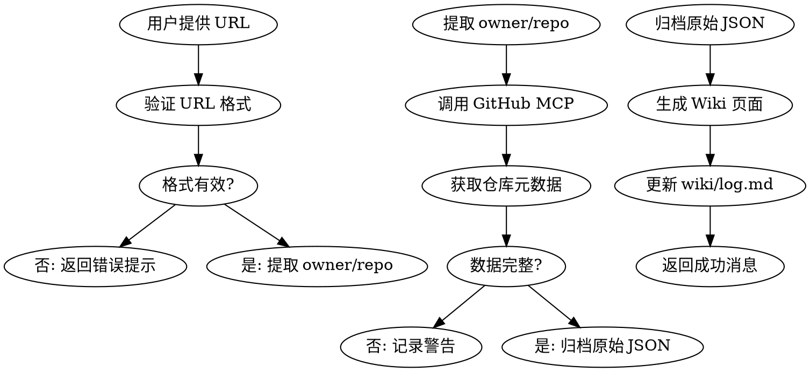

# GitHub Collect Skill

## Overview
从 GitHub 收集优秀仓库资源，自动生成符合 Wiki 规范的页面并归档原始数据。

## When to Use

**触发条件：**
- 用户提供 GitHub 仓库 URL
- 需要记录和跟踪优秀的 GitHub 仓库
- 想要自动化收集仓库元数据（Stars、语言、许可证等）

**使用场景：**
- 被动收集：浏览 GitHub 时遇到好仓库快速记录
- 学习资源：收集技术栈相关的优秀项目
- 最佳实践：归档值得参考的代码仓库

## Core Workflow



## Data Schema

### 获取的元数据字段
```yaml
通过 GitHub MCP 获取：
  - name: 仓库名称
  - description: 描述
  - stars: Star 数量
  - language: 主要语言
  - license: 许可证
  - url: 仓库链接
  - created_at: 创建时间
  - updated_at: 更新时间
  - topics: 仓库标签（可选）
```

### Frontmatter 标准
```yaml
---
name: {owner}-{repo}
description: {description}
type: source
version: 1.0
tags: [github, {language}]
created: YYYY-MM-DD
updated: YYYY-MM-DD
source: ../../../archive/resources/github/{owner}-{repo}-{YYYY-MM-DD}.json
stars: {star_count}
language: {language}
license: {license}
github_url: https://github.com/{owner}/{repo}
---
```

## File Structure

```
Wiki 页面: wiki/resources/github-repos/{owner}-{repo}.md
归档文件: archive/resources/github/{owner}-{repo}-{YYYY-MM-DD}.json
模板文件: scripts/templates/github-repo-template.md
```

## Implementation Steps

1. **验证 URL**: 检查 GitHub URL 格式 `^https?://github\.com/[^/]+/[^/]+$`
2. **提取信息**: 从 URL 解析 owner 和 repo 名称
3. **获取数据**: 使用 `mcp__plugin_github_github__get_repo` 或相关工具
4. **归档数据**: 保存原始 JSON 到 `archive/resources/github/`
5. **生成页面**: 基于模板生成 Wiki 页面
6. **更新日志**: 追加操作记录到 `wiki/log.md`

## Error Handling

| 场景 | 处理方式 | 用户反馈 |
|------|----------|----------|
| URL 格式错误 | 立即返回，不创建文件 | ❌ "无效的 GitHub URL 格式" |
| 仓库不存在 | 立即返回，不创建文件 | ❌ "仓库 {owner}/{repo} 不存在" |
| API 速率限制 | 建议稍后重试 | ⚠️ "GitHub API 速率限制，请稍后重试" |
| 数据不完整 | 记录日志，继续处理 | ⚠️ "数据不完整，部分字段缺失" |
| 仓库已存在 | 更新模式：替换旧页面 | ℹ️ "更新现有仓库页面" |

## Real Commands

```bash
# 使用辅助脚本准备请求
bash scripts/github-collector.sh https://github.com/vercel/next.js

# AI 助手使用 GitHub MCP 获取数据
# mcp__plugin_github_github__get_repo
# owner: vercel
# repo: next.js

# 验证生成的页面
cat wiki/resources/github-repos/vercel-nextjs.md

# 运行 Wiki lint
cd wiki && ../scripts/wiki-lint.sh
```

## Quick Reference

| 操作 | 命令/工具 | 说明 |
|------|-----------|------|
| 验证 URL | 正则表达式 | `^https?://github\.com/[^/]+/[^/]+$` |
| 获取数据 | GitHub MCP | `mcp__plugin_github_github__get_repo` |
| 归档数据 | JSON 文件 | `archive/resources/github/{name}-{date}.json` |
| 生成页面 | 模板替换 | `scripts/templates/github-repo-template.md` |
| 更新日志 | 追加 | `wiki/log.md` |

## Common Mistakes

| 错误 | 正确做法 |
|------|----------|
| 不验证 URL 格式 | 先验证，后处理 |
| 跳过归档步骤 | 必须归档原始 JSON |
| 忘记更新日志 | 每次操作都要记录 |
| Wiki 页面路径错误 | 使用 `wiki/resources/github-repos/` |
| source 字段路径错误 | 相对路径：`../../../archive/resources/github/...` |

## Integration with Existing Workflow

**零影响承诺：**
- ✅ 不修改现有 Wiki 页面
- ✅ Dataview 自动索引新页面
- ✅ wiki-lint.sh 自动包含新目录
- ✅ 遵循现有 frontmatter 规范

**新增内容：**
- ✅ `wiki/resources/github-repos/` - 新分类
- ✅ `archive/resources/github/` - 新归档目录
- ✅ `wiki/log.md` - 新日志条目

## Example Usage

```
用户: 请收集 https://github.com/vercel/next.js

AI: 收集仓库 vercel/next.js

[获取数据]
- Stars: 125000
- Language: TypeScript
- License: MIT
- Description: The React Framework

[生成文件]
✅ Wiki 页面: wiki/resources/github-repos/vercel-nextjs.md
✅ 归档文件: archive/resources/github/vercel-nextjs-2026-04-28.json
✅ 日志更新: wiki/log.md

完成！已成功收集仓库资源。
```

## Related Documentation

- [设计文档](../../../docs/superpowers/specs/2026-04-28-github-resource-collector-design.md)
- [实现计划](../../../docs/superpowers/plans/2026-04-28-github-resource-collector.md)
- [Wiki Schema 规范](../../../wiki/WIKI.md)
- [使用文档](../../../wiki/resources/github-repos/README.md)
