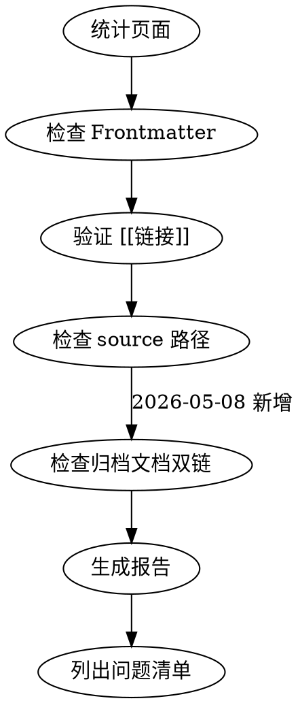

# Wiki Lint Skill

## Overview
Wiki 健康检查技能：验证 frontmatter 完整性、交叉引用有效性、source 路径正确性、归档文档双向链接（2026-05-08 新增）

## Layered Architecture

```
子技能调用链：
Wiki 页面检查 ──→ obsidian-cli 读取 ──→ Bash 工具 检查 ──→ 生成报告
      │                │                   │
      ▼                ▼                   ▼
  grep/find         read/backlinks     frontmatter/cross-ref
```

## 子技能能力映射

| 任务 | 调用技能 | 命令/技术 |
|------|----------|-----------|
| 统计页面 | **obsidian-cli** | `obsidian search query="" limit=100` |
| 读取页面 | **obsidian-cli** | `obsidian read file=<note>` |
| 查看标签 | **obsidian-cli** | `obsidian tags sort=count counts` |
| 查看链接 | **obsidian-cli** | `obsidian backlinks file=<note>` |
| 搜索内容 | **obsidian-cli** | `obsidian search query="..."` |
| Frontmatter 规范 | **obsidian-markdown** | 引用 `references/PROPERTIES.md` |
| Callout 报告 | **obsidian-markdown** | 使用 callout 格式生成报告 |

## When to Use

**触发条件：**
- 定期 Wiki 维护
- 添加新页面后验证
- 发现链接失效问题
- 报告 Wiki 健康状况

**症状：**
- 链接失效未被检测
- Frontmatter 字段缺失
- Source 指向不存在的文件

## Core Pattern



## Quick Reference

| 检查项 | 方法 | 命令/工具 |
|--------|------|----------|
| Frontmatter | Grep 文件头 | `grep "^---" wiki/**/*.md` |
| 交叉引用 | Grep `[[` | `grep -r '\[\[' wiki/` |
| Source 路径 | 验证文件存在 | Bash `[ -f "$file" ]` |
| 归档文档双链 | 检查内容中的双链 | `grep '\[\[.*\.md\]\]' wiki/**/*.md` |
| 页面列表 | 统计数量 | `obsidian search query="" limit=100` |

### 可选：使用 obsidian-cli

```bash
# 获取所有笔记列表（用于统计）
obsidian search query="" limit=100

# 检查标签使用情况
obsidian tags sort=count counts

# 查看特定页面的链接
obsidian backlinks file="some-note"
```

## Required Frontmatter Fields

> 完整 schema 定义请见统一的 **docs-ingest 的 [references/PROPERTIES.md](../docs-ingest/references/PROPERTIES.md)**。
> docs-ingest、wiki-lint、wiki-query 所有 Wiki skills 共享此规范。

```yaml
---
name: page-slug          # 必需
description: 描述         # 必需
type: category           # 必需
tags: [tag1, tag2]       # 必需
created: YYYY-MM-DD      # 必需
updated: YYYY-MM-DD      # 必需
source: ../../archive/.. # 建议添加
---
```

| 字段 | 必需 | 说明 |
|------|------|------|
| `name` | ✅ | 页面 slug |
| `description` | ✅ | 一句话描述 |
| `type` | ✅ | 见统一的 [PROPERTIES.md](../docs-ingest/references/PROPERTIES.md) |
| `tags` | ✅ | 标签数组 |
| `created` | ✅ | 创建日期 |
| `updated` | ✅ | 更新日期 |
| `source` | 建议 | 原始文件路径 |

## Lint 检查标准

### 1. Frontmatter 检查
- `name` 字段存在且非空
- `description` 字段存在
- `type` 字段在允许值内
- `created`/`updated` 格式正确

### 2. 交叉引用检查
```bash
# 查找所有 [[链接]]
grep -r '\[\[' wiki/ --include="*.md"
# 验证每个链接目标存在
```

### 3. Source 路径检查
```bash
# 验证 source 指向存在文件
grep "^source:" wiki/**/*.md | while read line; do
  file=$(echo $line | sed 's|.*source: ||')
  [ -f "$file" ] || echo "Missing: $file"
done
```

### 4. 归档文档双链检查（2026-05-08 新增）

**检查目标**：验证 Wiki 页面内容中是否包含指向归档文档的可点击双链

**为什么需要**：
- `source` 属性提供机器可读的元数据
- 内容双链提供人类可读的可点击链接
- 双向链接确保用户可以方便地追溯到原始文档

**检查逻辑**：

```bash
# 对每个有 source 属性的页面，检查内容中是否包含对应的双链
grep "^source:" wiki/**/*.md | while read line; do
  file=$(echo "$line" | sed 's|.*source: ||')
  # 提取文件名（去除路径和扩展名）
  filename=$(basename "$file" .md)
  
  # 检查页面内容中是否包含 [[...archive/...filename.md]] 或 [[...archive/...filename.md|显示名]]
  # 允许的格式：
  # - [[../../../archive/category/file.md]]
  # - [[../../../archive/category/file.md|显示名称]]
  # - [[../../../../archive/category/file.md]] （多层子目录）
done
```

**检查规则**：
1. **有 source 属性的页面**，内容中必须包含对应的归档文档双链
2. **双链路径必须与 source 路径一致**（相对路径计算正确）
3. **允许使用显示名称**：`[[路径|显示名]]` 格式
4. **双链位置灵活**：可以在页面开头、末尾或"原始文档"章节中

**常见失败模式**：
- ❌ 有 source 属性但内容中完全没有双链
- ❌ 双链路径不正确（如缺少 `../` 层级）
- ❌ 双链指向错误的文件
- ❌ 使用外部链接而非双链（如 `[文本](路径)`）

**示例对比**：

✅ **正确**：
```markdown
---
source: ../../../archive/guides/obsidian-workflow.md
---

## 原始文档

本页面基于 [[../../../archive/guides/obsidian-workflow.md|原始文档]] 创建
```

❌ **错误 1：缺少双链**：
```markdown
---
source: ../../../archive/guides/obsidian-workflow.md
---

# 页面内容

（没有任何指向归档文档的双链）
```

❌ **错误 2：路径错误**：
```markdown
---
source: ../../../archive/guides/obsidian-workflow.md
---

本页面基于 [[archive/guides/obsidian-workflow.md]] 创建
# 缺少 ../ 前缀，路径错误
```

## Common Mistakes

| 错误 | 正确做法 | 优先级 |
|------|----------|--------|
| 跳过 source 检查 | source 必须指向 archive/ 中文件 | 🔴 High |
| 忽略交叉引用问题 | [[链接]] 必须对应存在页面 | 🔴 High |
| **有 source 但无内容双链** | **在内容中添加 `[[路径\|显示名]]`** | **🟡 Medium** |
| **双链路径计算错误** | **使用正确的相对路径 `../`** | **🟡 Medium** |
| 不记录问题清单 | 生成报告便于追踪修复 | 🟢 Low |

## Output Format

```markdown
## Wiki Lint Report

### 统计
- 总页面数: N
- 问题数: N

### 问题清单
| 级别 | 文件 | 问题 |
|------|------|------|
| 🔴 | file.md | 缺少必需字段 |
| 🟡 | file.md | [[链接]] 目标不存在 |
| 🟡 | file.md | 有 source 属性但缺少归档文档双链 | [2026-05-08 新增]
| 🟡 | file.md | 双链路径与 source 不一致 | [2026-05-08 新增]
```

## Real-World Impact

- Wiki 质量持续监控
- 问题早发现早修复
- 维护成本降低
- **归档文档双链检查**（2026-05-08 新增）：
  - 确保用户可以一键追溯到原始文档
  - 维护 Wiki 与归档文档的双向链接完整性
  - 提升文档溯源体验和可靠性