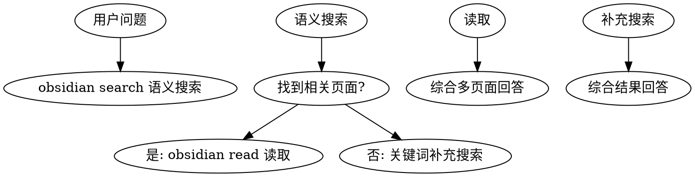

# Wiki Query Skill

## Overview
基于 Wiki 回答问题的技能，遵循 Wiki-First 原则，避免重复生成摘要。

## Layered Architecture

```
子技能调用链：
问题分析 ──→ obsidian-cli 搜索 ──→ obsidian-cli 读取 ──→ obsidian-markdown 格式化输出
      │              │                    │                    │
      ▼              ▼                    ▼                    ▼
  语义理解      search/query           read                 wikilinks/callouts
```

## 子技能能力映射

| 任务 | 调用技能 | 命令/技术 |
|------|----------|-----------|
| 语义搜索 | **obsidian-cli** | `obsidian search query="语义关键词"` |
| 补充搜索 | **obsidian-cli** | `obsidian search query="补充关键词"` |
| 读取页面 | **obsidian-cli** | `obsidian read file=<note>` |
| 标签统计 | **obsidian-cli** | `obsidian tags sort=count counts` |
| 反向链接 | **obsidian-cli** | `obsidian backlinks file=<note>` |
| Frontmatter 规范 | **obsidian-markdown** | 引用 `references/PROPERTIES.md` |
| Callout 语法 | **obsidian-markdown** | 引用 `references/CALLOUTS.md` |
| 内部链接 | **obsidian-markdown** | `[[Note Name]]` |
| Embed 语法 | **obsidian-markdown** | `![[Note]]` |

## When to Use

**触发条件：**
- 用户询问 Claude Code 功能、概念，最佳实践
- 需要查找命令用法、配置选项、技巧
- 任何需要准确信息的问题

**症状：**
- 倾向直接回答而非查询 Wiki
- 生成一次性摘要而非引用现有页面

## Core Pattern



## Real Commands

使用 `obsidian` CLI (需 Obsidian 运行中):

```bash
# 语义搜索 Wiki 页面
obsidian search query="Claude Code 配置"

# 读取具体页面内容
obsidian read file="claude-code-best-practice"

# 查看标签统计
obsidian tags sort=count counts

# 查看页面反向链接
obsidian backlinks file="some-note"
```

## Learning Tracker 集成

### mentor-ai-programming 协同（自动触发）

当检测到用户正在学习以下模块时，增强搜索和推荐：

| 模块 | Wiki 标签 | 推荐策略 |
|------|-----------|----------|
| commands | `commands` | 优先推荐 [[claude-commands]] |
| hooks | `hooks` | 优先推荐 [[hooks]] 进阶内容 |
| subagents | `subagents` | 优先推荐 [[subagents]] 编排模式 |
| workflows | `workflows` | 优先推荐 [[workflows]] 完整流程 |
| teams | `agent-teams` | 优先推荐 [[agent-teams]] 协作模式 |

**协同流程：**
```
mentor-ai-programming 开始学习模块
    ↓
wiki-query 搜索该模块 Wiki 资源
    ↓
自动追踪: tracker.sh record <module> <difficulty>
    ↓
返回答案 + 来源引用 [[page-slug]]
    ↓
mentor-ai-programming 记录进度
```

### 学习统计（自动展示）

当回答问题时，读取 `.claude/skills/learning-tracker/config/user-activity.json`，在回答末尾自动展示简短学习统计：

```markdown
> [!info] 学习统计
> 📊 连续学习: 7 天 | 总查询: 156 次 | 🔥 TOP: commands(45), hooks(32)
```

### 遗忘提醒（自动触发）

当检查 `.claude/skills/learning-tracker/config/user-activity.json` 中的 `recent_topics`，若某主题 7+ 天未复习，在回答末尾添加：

```markdown
> [!tip] 复习提醒
> [[topic-name]] 已 8 天未复习，建议回顾：
> - [[topic-name]]
```

### 主动推荐（按需触发）

当用户完成一个主题讨论后，检查 `recommendations.md` 获取推荐：

```bash
# 获取推荐（由 analyzer.sh 生成）
cat wiki/synthesis/user-learning/recommendations.md
```

如有相关推荐，添加到回答末尾：

```markdown
> [!tip] 推荐继续学习
> 基于你的学习轨迹：
> - [[recommended-topic-1]]
> - [[recommended-topic-2]]
```

## Quick Reference

| 操作 | 命令 | 说明 |
|------|------|------|
| 语义搜索 | `obsidian search query="关键词"` | 搜索 Wiki 页面 |
| 读取页面 | `obsidian read file="NoteName"` | 获取页面内容 |
| 标签搜索 | `obsidian tags sort=count counts` | 按频率查看标签 |

## Implementation

1. **查询**: `obsidian search query="语义关键词"`
2. **补充**: 关键词搜索 `obsidian search query="补充词"`
3. **读取**: `obsidian read file="PageName"` 获取关键页面
4. **追踪**: 调用 `tracker.sh record` 记录主题（后台执行，用户无感知）
5. **综合**: 整合多个页面答案回答问题
6. **引用**: 标注来源页面链接 `[[page-slug]]`
7. **遗忘检查**: 查询 recent_topics，若有 7+ 天未复习的主题，添加复习提醒
8. **推荐**: 根据 learning-tracker 数据判断是否需要推荐下一步学习

## Common Mistakes

| 错误 | 正确做法 |
|------|----------|
| 直接生成摘要 | 先 `obsidian search` 搜索 |
| 只用一个关键词 | 语义+关键词双重搜索 |
| 不引用来源 | 标注 `[[page-slug]]` 链接 |

## Real-World Impact

- Token 节省 30-50%
- 答案一致性提升
- Wiki 页面持续更新