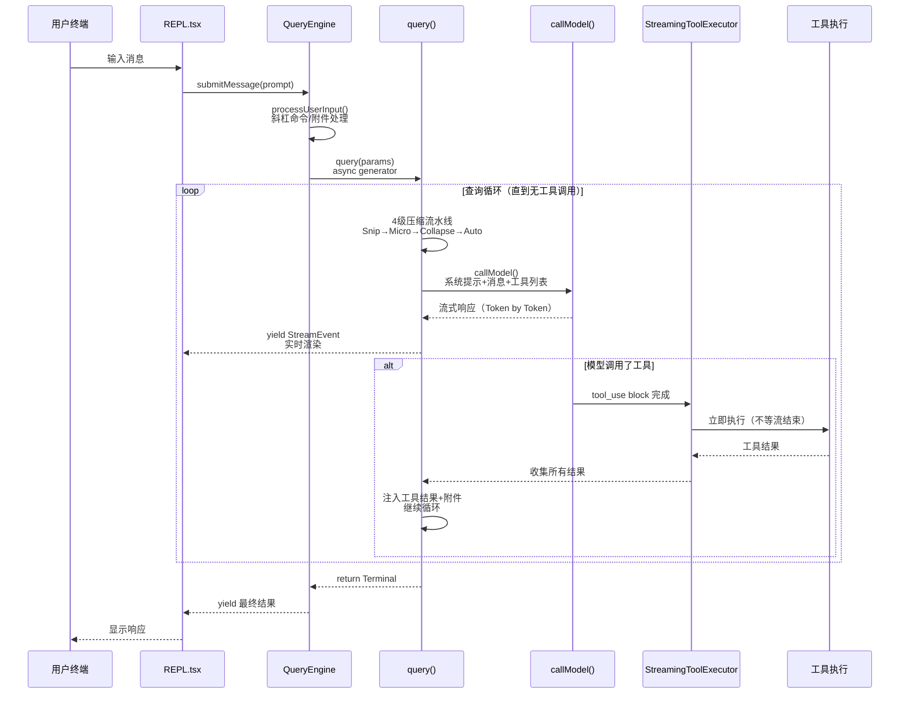
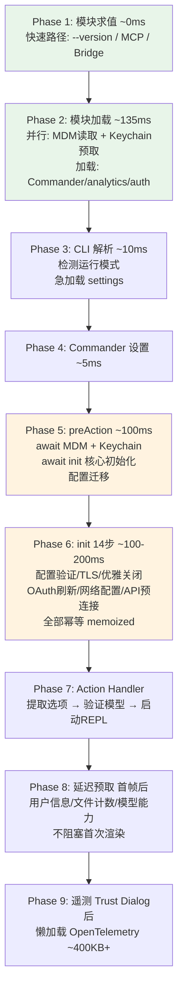
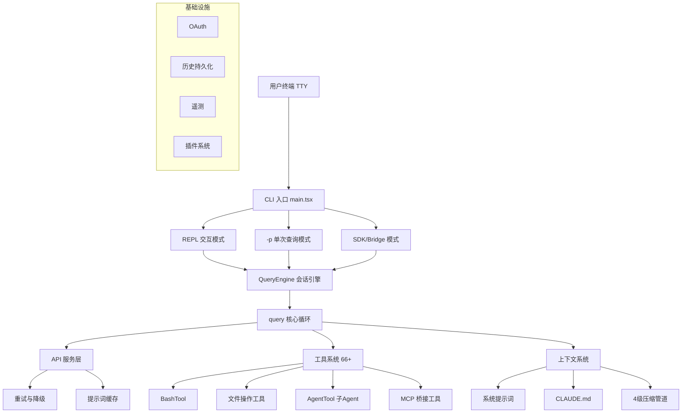

# 第 1 章：Claude Code 概述

> **本章导读**：本章从宏观视角介绍 Claude Code 的定位、技术栈和架构全貌。我们会先理解它作为 Agent 与传统编程辅助工具的本质区别（1.1），然后介绍技术选型（1.2）、6 条核心设计原则（1.3）、关键术语（1.3+）、源码目录结构（1.4），最后通过数据流全景（1.5）、启动流程（1.6）和架构总览（1.7）将所有概念串联起来。如果你只想快速了解全貌，可以直接跳到 1.5 数据流全景。

## 1.1 Claude Code 解决什么问题

Claude Code 不是一个简单的"CLI 调用大模型"工具。它是 Anthropic 官方推出的 **受控工具循环 Agent（Controlled Tool-Loop Agent）**，专为真实软件工程任务设计。

### 从工具到 Agent：三级范式

要理解 Claude Code 的定位，我们需要先理解 AI 辅助编程的三级范式：

**第一级：代码补全**（如 Copilot）。模型的工作是"预测下一行代码"。它看到你的光标位置和上下文，生成一个补全建议。这本质上是一个**单次预测问题**——模型不需要理解整个项目，不需要执行任何操作，只需要根据局部上下文生成合理的代码片段。用户始终是驾驶员，模型只是副驾。

**第二级：IDE 聊天助手**（如 Cursor Chat、Copilot Chat）。用户可以用自然语言描述需求，模型生成代码片段或修改建议。这比补全强大——模型可以看到更多上下文，可以生成多个文件的修改。但关键限制是：**模型不能执行操作**。它生成一个 diff，由用户决定是否 apply。如果 diff 有问题（比如依赖了一个不存在的函数），用户需要手动发现并反馈，模型无法自行验证。

**第三级：自主 Agent**（Claude Code）。模型不仅生成代码，还能**自主执行多步操作**。考虑一个真实场景：你想给项目添加一个新的 REST endpoint。Copilot 会给你一个函数体。IDE 聊天可能会建议一个修改方案。而 Claude Code 的做法是：先用 Grep 搜索现有路由定义理解项目的路由模式，用 FileRead 读取中间件配置，然后创建 handler 文件、注册路由、编写测试，接着运行 `npm test` 发现测试失败，读取错误信息，修复代码，再次运行测试直到通过，最后提交 git commit。整个过程是一个**自主决策循环**——模型决定下一步做什么，执行后观察结果，再决定下一步。

这种范式跃迁带来了根本性的架构差异。一个 Agent 需要：
- **循环**（Loop）：不是单次调用，而是反复 "思考→执行→观察" 直到任务完成
- **工具**（Tools）：不是只生成文本，而是能读文件、写文件、执行命令
- **记忆**（Memory）：不是每次从零开始，而是记住用户偏好和项目上下文
- **安全控制**（Safety）：因为它在用户机器上执行真实操作，所以需要严格的权限管理

Claude Code 的每一个架构决策都围绕这四个需求展开。

### 与其他 Agent 的区别

市面上不乏其他编程 Agent（如 AutoGPT、OpenDevin、Aider 等），但 Claude Code 有一个独特优势：它由构建 Claude 模型的同一个团队开发。这意味着**系统提示词、工具描述、错误处理策略都与模型的行为特性共同设计和调优**。例如，Claude Code 的 system prompt 不是一个通用的 "你是一个编程助手"——它包含了针对 Claude 模型特性优化的详细行为指令，工具的 `description` 字段也经过反复调优以匹配模型的理解模式。

此外，Claude Code 在生产级工程质量上远超大多数开源 Agent 项目：5 层纵深防御的安全系统、4 级渐进式上下文压缩、7 种错误恢复策略、流式工具预执行——这些不是学术 demo，而是服务真实用户的工业级实现。

### "Agent-first" 的架构含义

"Agent-first" 不是营销口号——它有具体的架构含义：**模型是循环中的决策者，而非人类**。人类设定目标（"给这个项目添加用户认证"）并审批危险操作（"确认执行 `npm install`？"），但在两次人类交互之间，模型自主决定读什么文件、改什么代码、执行什么命令。

这体现在源码中最核心的一行——`src/query.ts:307` 的 `while (true)`：

```typescript
// src/query.ts:307
while (true) {
    // ... 压缩 → API 调用 → 工具执行 → 继续/退出
}
```

这个循环**只有当模型的响应不包含任何工具调用时才会退出**。换句话说，是模型——而不是代码逻辑——决定任务是否完成。代码只是提供了执行环境，真正的"大脑"是模型本身。

## 1.2 技术栈

| 层次 | 技术选型 | 说明 |
|------|---------|------|
| 运行时 | Bun | 高性能 JS/TS 运行时，支持编译时 Feature Flag 消除 |
| 语言 | TypeScript | 全量 TypeScript，严格类型检查 |
| UI 框架 | React + Ink（自研） | 基于 React 的终端 UI 框架，自研 Ink 渲染器（`src/ink/`，~1.0MB） |
| 布局引擎 | Yoga | Facebook 的 Flexbox 布局引擎，适配终端 |
| Schema 验证 | Zod | 运行时类型校验，用于工具输入、Hook 输出、配置验证 |
| CLI 框架 | Commander.js | 命令行参数解析，分发到 REPL/headless/SDK 模式 |
| API 协议 | Anthropic SDK | 官方 TypeScript SDK，支持流式响应 |

技术选型本身不是本文重点，但有两个选择值得一提，因为它们深刻影响了架构设计：

- **Bun 的 `feature()` 宏**：Claude Code 内部有大量功能（协调器模式、Swarm 团队等）在外部发布版本中需要完全移除。Bun 提供的编译时 Feature Flag 让这些代码在构建时被物理删除，而非运行时隐藏。这在后续"编译时 Feature Gate"设计原则中会详细展开。
- **自研 React 终端渲染器**：Claude Code 的终端 UI 复杂度远超普通 CLI——权限确认对话框、流式代码高亮、嵌套工具进度指示器都需要组件化的状态管理。团队维护了一个 ~1.0MB 的定制 Ink 渲染器（而非使用上游库），详见 [第 14 章：用户体验设计](./12-user-experience.md)。

## 1.3 核心设计原则

Claude Code 的架构遵循 6 条核心设计原则：

### 1. Generator-based 流式架构

从 API 调用到 UI 渲染，全链路使用 `async function*` 异步生成器。这不是简单的 callback 或 Promise 链——而是真正的流式处理管道，每个 Token、每个工具结果都能实时流向用户界面。

核心查询循环的签名是：

```typescript
// src/query.ts
export async function* query(
  params: QueryParams,
): AsyncGenerator<StreamEvent | Message | ToolUseSummaryMessage, Terminal>
```

这是一个异步生成器——它不是一次性返回结果，而是**边执行边 yield 事件**。调用方（QueryEngine）通过 `for await (const msg of query(params))` 实时消费每一个事件：模型输出的每个 Token、每个工具调用的结果、压缩事件、错误恢复——所有这些都通过同一个 generator 管道流向 UI 层。

这种设计的好处是**零缓冲延迟**：用户在模型开始生成的瞬间就能看到输出，而不需要等待整个响应完成。

**为什么是 Generator 而不是 Callback 或 Promise？** 这个选择不是随意的——三种异步模式各有根本性的局限：

- **Callback 模式**：经典 Node.js 风格，容易陷入 "callback hell"，更重要的是无法优雅地传递 backpressure（当 UI 渲染跟不上数据产生速度时，没有自然的暂停机制）。当用户按 Ctrl+C 中断时，需要手动在每一层 callback 中接线取消逻辑。
- **Promise/async-await 模式**：解决了 callback hell，但 `await` 是阻塞式的——一个 `await apiCall()` 必须等到整个响应完成才能返回。要实现流式，你需要手动缓冲部分结果并轮询，这本质上是在 Promise 之上重新发明 generator。
- **Generator 模式**：`yield` 天然就是流式语义——生产者（API 层）产出一个 token 就 yield 一次，消费者（UI 层）按自己的节奏拉取。更关键的是，`generator.return()` 可以**级联清理整个调用链**：用户按 Ctrl+C → REPL 调用 generator.return() → QueryEngine 的 generator 终止 → query() 的 generator 终止 → API 请求被 abort。不需要手动接线，cleanup 沿着 generator 链自动传播。

注意 `query()` 的返回类型 `AsyncGenerator<..., Terminal>`——`Terminal` 是 generator 的 **return type**，代表查询的最终状态，与 yield 出的中间事件流是分离的。这种"双通道"（yield 流式事件 + return 最终结果）只有 generator 能干净地表达。

整个数据流形成了一个嵌套的 generator 管道：`REPL.tsx` → `QueryEngine.submitMessage()` → `query()` → `queryModelWithStreaming()`（`services/api/claude.ts`）。每一层 generator 在管道上叠加自己的处理逻辑（压缩、错误恢复、权限检查），但对上层来说，它只是一个统一的 `AsyncGenerator` 事件流。

### 2. 防御性分层安全

权限系统采用多层防御：

```
权限规则匹配 (src/hooks/toolPermission/)
    ↓ 通过
Bash AST 分析 (src/utils/bash/, tree-sitter 解析)
    ↓ 通过
23 项静态安全验证器
    ↓ 通过
ML 分类器 (yoloClassifier)
    ↓ 通过
用户确认对话框
```

**为什么需要这么多层？** 理解威胁模型是关键：Claude Code 在用户的真实机器上执行任意代码。模型不是完美的——它可能因为上下文混淆而生成错误命令，可能被恶意 README 中的 prompt injection 误导，或者只是单纯犯了一个逻辑错误。一条 `rm -rf ~` 就足以造成不可挽回的损失。

这是经典的**纵深防御**：即使某一层有 bug 或被绕过，其他层仍然可以阻止危险操作。每一层使用不同的技术手段，覆盖不同类别的风险：

1. **权限规则匹配**（`src/hooks/toolPermission/`）：这是**策略层**——用户通过 CLAUDE.md 的 `allowedTools` 或 `--allowedTools` 标志声明哪些操作是被允许的。这一层表达的是用户意图："在这个项目中，运行 `npm test` 总是安全的"。
2. **Bash AST 分析**（`src/utils/bash/`, tree-sitter）：不是用正则匹配命令字符串，而是用 tree-sitter 将 Bash 命令解析为抽象语法树。为什么不用正则？因为 Bash 语法极其灵活——`r"m" -rf /`、`$(echo rm) -rf /`、`eval "rm -rf /"` 这些变形都能绕过简单的字符串匹配，但 AST 分析能识别出实际执行的命令。
3. **23 项静态安全验证器**：硬编码的已知危险模式检查。这是"白名单/黑名单"层——某些操作（如写入 `/etc/passwd`、修改 SSH 配置）无论上下文如何都应该被拦截。
4. **ML 分类器**（yoloClassifier）：一个经过训练的分类模型，能根据命令的语义上下文判断安全性。它捕获的是静态规则覆盖不到的"新型"危险模式——比如一条看起来无害但在当前上下文中可能造成问题的命令。
5. **用户确认对话框**：最终的人类审核。即使所有自动化层都放行了，用户仍然可以看到即将执行的操作并选择拒绝。

关键设计洞察：**各层使用完全不同的技术**（规则匹配、语法解析、机器学习、人类判断），这意味着单一类别的 bug 无法同时绕过所有层。即使权限规则配置错误地放行了一条命令，tree-sitter AST 分析仍然会检测到 `rm -rf /` 这样的结构性危险模式。

### 3. 编译时 Feature Gate

通过 Bun bundler 的 `feature()` 宏实现编译时死代码消除。内部功能（如协调器模式）在外部构建中完全移除——不是运行时隐藏，而是编译时物理删除。

这个模式在整个代码库中反复出现：

```typescript
// src/query.ts 开头 — 6 个 Feature Gate 条件加载
const reactiveCompact = feature('REACTIVE_COMPACT')
  ? (require('./services/compact/reactiveCompact.js') as typeof import('./services/compact/reactiveCompact.js'))
  : null
const contextCollapse = feature('CONTEXT_COLLAPSE')
  ? (require('./services/contextCollapse/index.js') as typeof import('./services/contextCollapse/index.js'))
  : null
const skillPrefetch = feature('EXPERIMENTAL_SKILL_SEARCH')
  ? (require('./services/skillSearch/prefetch.js') as typeof import('./services/skillSearch/prefetch.js'))
  : null
const jobClassifier = feature('TEMPLATES')
  ? (require('./jobs/classifier.js') as typeof import('./jobs/classifier.js'))
  : null
const snipModule = feature('HISTORY_SNIP')
  ? (require('./services/compact/snipCompact.js') as typeof import('./services/compact/snipCompact.js'))
  : null
const taskSummaryModule = feature('BG_SESSIONS')
  ? (require('./utils/taskSummary.js') as typeof import('./utils/taskSummary.js'))
  : null
```

`as typeof import(...)` 类型断言让 TypeScript 在编译期获得正确的类型信息，而 `feature()` 在 Bun bundler 构建时被求值——如果结果为 `false`，整个 `require()` 分支和相关代码都被 tree-shaken 移除。使用这些模块的代码总是先检查 `if (contextCollapse) { ... }`，这个条件判断本身也在编译时被消除。

### 4. 状态集中 + 不可变更新

全局状态集中于 `bootstrap/state.ts`（1,758 行，150+ 访问器）。为什么不直接用全局变量？

在一个拥有 66+ 工具、多个子 Agent、压缩管道和 React UI 的系统中，共享状态是不可避免的——当前使用的模型名、会话 ID、Feature Flag 缓存、累计成本、文件修改状态等，这些信息需要被多个子系统同时访问和修改。朴素的全局变量方案会带来三个实际问题：

1. **import 循环**：模块 A 导入 B 的状态，B 导入 C 的工具，C 又导入 A 的状态——在一个 1,900 文件的项目中，这种循环几乎不可避免
2. **不可追踪的修改**：当某个 bug 导致模型名被意外改变，你无法设断点查看"是谁在什么时候改了这个值"
3. **React 渲染问题**：直接修改全局对象的属性不会触发 React 组件的重新渲染

`bootstrap/state.ts` 的解决方案是通过显式的 getter/setter 函数暴露状态（如 `getSessionId()`、`getTotalCost()`、`setCurrentModel()`），而不是导出可变对象。每个模块只导入自己需要的 getter/setter 函数，从而打破 import 循环；每次修改都经过函数调用，可以轻松添加日志或断点追踪。

UI 状态使用 Zustand 模式的不可变更新——`setAppState(prev => ({ ...prev, newField: value }))`——保证 React 组件能正确感知状态变化。

值得注意的是，这不是一个"理想"的架构——团队自己也在控制全局状态的增长。但在 Claude Code 这样的复杂系统中，集中管理的 getter/setter 是一个务实的平衡：比全局变量安全，比完整的状态管理框架（如 Redux）轻量。

### 5. 渐进式压缩

Snip → Microcompact → Context Collapse → Autocompact 四级压缩流水线，确保对话永不因上下文溢出而中断。四级压缩按成本从低到高排列，每级解决不同粒度的问题：

1. **Snip**（零 API 成本）：移除对话历史中已经不再被引用的旧工具结果。例如，10 轮前的一次 `grep` 搜索结果可能有 50KB，但模型早已不再关注它。Snip 用一个占位符替换这些内容，纯本地操作，不需要调用 API。（`query.ts:401-410`）
2. **Microcompact**（近零成本）：压缩单个工具结果的体积。比如一个 Grep 工具返回了 200 行匹配结果，Microcompact 可以将其截断为最相关的前 20 行。同样是本地启发式操作。（`query.ts:414-426`）
3. **Context Collapse**（中等成本）：将相关的消息序列分组折叠为摘要。关键设计：这是一个**读时投影**——原始完整历史保留在内存中，发送给 API 的是折叠后的视图。这意味着折叠是可逆的，不会丢失原始信息。（`query.ts:440-447`）
4. **Autocompact**（全量成本）：fork 一个子 Agent 生成整个对话的摘要，用摘要替换原始历史。这是"核选项"——释放最多空间，但不可逆地丢失对话细节。（`query.ts:454-467`）

**为什么四级而非只用 Autocompact？** 如果只有 Autocompact，每次上下文接近满就必须调用 API 生成摘要——既有延迟成本（用户等待），又有质量成本（细节丢失）。通过先执行零成本的 Snip 和 Microcompact，系统往往能释放足够的空间避免触发昂贵的 Autocompact。实践中，很多对话自始至终都不需要走到 Autocompact 这一步。

详见 [第 3 章：上下文工程](./03-context-engineering.md)。

### 6. 工具即扩展点

所有能力——文件操作、搜索、Agent 派生、MCP 桥接——统一为 `Tool` 接口（`src/Tool.ts`）。无论是内置的 `BashTool`、通过 MCP 协议接入的外部工具，还是插件系统注册的第三方工具，它们共享完全相同的执行管道：权限检查 → 输入校验 → 执行 → 结果格式化 → UI 渲染。

`Tool` 接口（`src/Tool.ts`）拥有约 20 个字段和方法，每一个都在统一管道中扮演角色：
- `isReadOnly()`：告诉权限系统这个工具是否只读——只读工具（如 Grep、Glob）可以跳过用户确认
- `isConcurrencySafe()`：告诉 `StreamingToolExecutor` 这个工具能否与其他工具并行执行——Grep 可以，但 FileEdit 不行（可能产生写冲突）
- `shouldDefer`：告诉 API 层是否延迟发送完整 schema——66+ 个工具的 schema 加起来占用大量 token，不常用的工具可以按需加载
- `inputSchema`（Zod）：模型生成的参数在执行前必须通过 Schema 验证，防止畸形输入触达工具执行层
- `interruptBehavior()`：定义用户中断时工具的行为——有些工具可以立即中断，有些需要清理

`findToolByName()` 函数不区分工具来源——对 query 循环来说，所有工具都是平等的 `Tool` 对象。这意味着一个通过 MCP 协议接入的外部 Kubernetes 工具，和内置的 BashTool 经历完全相同的权限检查、输入验证、结果格式化流程。扩展 Claude Code 的能力就是实现一个符合 `Tool` 接口的对象，而不需要修改核心循环——这是经典的开闭原则（Open-Closed Principle）在 Agent 架构中的体现。

### 核心术语速查

在深入后续章节之前，以下是贯穿整个代码库的几个核心概念：

| 术语 | 定义 | 对应源码 |
|------|------|----------|
| **State** | 单次 query 循环的可变状态对象，包含消息历史、压缩追踪、output token 恢复计数等 | `query.ts:204` `type State` |
| **Tool** | 统一的工具接口，所有能力（内置/MCP/插件）都实现此接口，共享同一执行管道 | `Tool.ts` |
| **Message** | 对话中的一条消息，包含 `UserMessage`、`AssistantMessage`、`ToolUseSummaryMessage` 等子类型 | `types/message.ts` |
| **StreamEvent** | generator 管道中 yield 的事件单元，代表一个 token、工具结果或状态变更 | `types/message.ts` |
| **Terminal / Continue** | query 循环的两种转移状态——`Terminal` 表示循环结束，`Continue` 表示需要继续下一轮迭代 | `query/transitions.ts` |
| **QueryEngine** | 会话级引擎，管理对话生命周期（持久化、预算、结果组装），是 UI 层与核心循环之间的边界 | `QueryEngine.ts` |

## 1.4 源码目录结构

Claude Code 源码约 1,900 文件、512K+ 行 TypeScript，目录结构如下：

```
src/
├── main.tsx                 # CLI 主入口（4,683 行）
│                            # Commander.js 解析参数，分发到 REPL/headless/SDK 模式
├── QueryEngine.ts           # 会话引擎（1,295 行）
│                            # 管理对话全生命周期：消息持久化、预算追踪、结果组装
├── query.ts                 # 核心查询循环（1,729 行）
│                            # 单次查询的状态机：压缩→API调用→工具执行→恢复/继续
├── Tool.ts                  # 工具接口定义
│                            # 所有工具（内置/MCP/插件）的统一类型约束
├── tools.ts                 # 工具注册与组装
├── context.ts               # 上下文构建（189 行）
│                            # getSystemContext/getUserContext：Git状态、CLAUDE.md、日期
│
├── bootstrap/               # 全局状态管理
│   └── state.ts             # 集中式状态存储（1,758 行，150+ getter/setter）
│                            # 所有子系统通过访问器读写共享状态，避免 import 循环
│
├── entrypoints/             # 入口点
│   ├── init.ts              # 核心初始化（340 行）：14 步幂等初始化
│   ├── cli.tsx              # 快速路径（--version, MCP server, bridge）
│   └── sdk/                 # SDK 入口与类型
│
├── screens/                 # 主要界面
│   ├── REPL.tsx             # 主对话 UI（875KB）：消息渲染、输入处理、状态管理
│   ├── Doctor.tsx           # 诊断界面
│   └── ResumeConversation.tsx
│
├── tools/                   # 66+ 内置工具
│   ├── BashTool/            # Shell 命令执行（含 AST 安全分析）
│   ├── AgentTool/           # 子 Agent 派生（支持 worktree 隔离）
│   ├── FileReadTool/        # 文件读取（支持图片、PDF、Notebook）
│   ├── FileEditTool/        # 文件编辑（search-and-replace 策略）
│   ├── GrepTool/            # 内容搜索（基于 ripgrep）
│   ├── GlobTool/            # 文件匹配
│   ├── WebFetchTool/        # 网页获取
│   ├── SkillTool/           # 技能调用
│   └── ...                  # 更多工具
│
├── services/
│   ├── api/                 # API 客户端层
│   │   ├── claude.ts        # 核心查询逻辑（3,419 行）
│   │   │                    # HTTP→Claude API 的桥梁：prompt 构建、缓存控制、
│   │   │                    # thinking 配置、task budget 注入、流式响应解析
│   │   ├── withRetry.ts     # 重试策略（指数退避 + 模型降级）
│   │   └── promptCacheBreakDetection.ts  # 缓存断裂检测与自动归因
│   ├── compact/             # 压缩系统
│   │   ├── autoCompact.ts   # 自动压缩触发（阈值计算、条件判断）
│   │   └── compact.ts       # 摘要生成引擎（1,705 行）
│   │                        # fork 子 Agent 生成对话摘要，压缩后恢复最近文件和技能
│   ├── mcp/                 # MCP 协议集成（7 种传输）
│   ├── oauth/               # OAuth 2.0 + PKCE
│   ├── plugins/             # 插件系统
│   └── lsp/                 # 语言服务器协议
│
├── hooks/                   # 权限与 Hook 处理
│   └── toolPermission/      # 工具权限判定
│       └── handlers/        # 3 种权限处理器：规则匹配、Hook、用户确认
│
├── coordinator/             # 多 Agent 协调器（内部功能，Feature-gated）
├── memdir/                  # 记忆系统（~/.claude/memory/ 管理）
├── skills/                  # 技能系统（18+ 内置技能）
├── ink/                     # 自定义终端渲染器（~1.0MB 核心，React→终端输出）
├── vim/                     # Vim 模式
├── schemas/                 # Zod Schema 定义
└── utils/                   # 通用工具库
    ├── hooks.ts             # Hook 执行引擎
    ├── bash/                # Bash AST 解析（tree-sitter）
    ├── messages.ts          # 消息处理（5,512 行）：规范化、压缩边界、格式转换
    └── tokens.ts            # Token 估算与追踪
```

## 1.5 数据流全景

理解 Claude Code 的关键是理解**数据如何在各层之间流动**。下面是一次完整的用户交互的数据流：



让我们沿着数据流逐步展开，理解每个阶段发生了什么：

**Step 1：用户输入进入 REPL**。React 组件 `REPL.tsx` 捕获用户的文本输入。如果是斜杠命令（如 `/clear`、`/compact`），在本地直接处理，永远不会发送到 API。普通消息则传递给 `QueryEngine.submitMessage()`。

**Step 2：QueryEngine 准备查询**。`processUserInput()` 处理消息中的附件（图片缩放、文件引用解析），构建包含消息历史、系统提示词、工具列表和权限上下文的 `QueryParams` 对象，然后调用 `query()` 启动核心循环。

**Step 3：4 级压缩管道运行**。注意——压缩不是只在对话开始时运行一次，而是**在每次 API 调用之前都会运行**。循环的每一轮迭代都会依次检查 Snip → Microcompact → Context Collapse → Autocompact，按需触发。大多数迭代中没有任何压缩触发（上下文还没满），但当历史消息累积到接近上下文窗口上限时，压缩管道会自动介入。

**Step 4：API 调用**。系统提示词、压缩后的消息历史和工具 schema 被发送到 Claude API（通过 `services/api/claude.ts` 的 `queryModelWithStreaming()`）。响应以 token-by-token 的方式流式返回，每个 token 被 yield 为 `StreamEvent` 沿着 generator 链向上传递到 UI，用户立即看到文字出现。

**Step 5：工具在流式过程中即开始执行**。这是 Claude Code 的一个重要性能优化：`StreamingToolExecutor` **不等待模型的完整响应**。当流式解析器检测到一个 `tool_use` JSON block 已经完整，工具执行立即开始——此时模型可能还在继续生成后面的文字或其他工具调用。只读且并发安全的工具（如 Grep、Glob）甚至可以**并行执行**，进一步缩短多工具调用的总耗时。

**Step 6：结果注入，循环继续**。工具的执行结果被封装为 `tool_result` 消息追加到对话历史中。循环回到 Step 3——再次检查是否需要压缩，再次调用 API。模型看到工具结果后决定下一步：继续调用更多工具，或者生成最终的文字回复。

**Step 7：循环退出，结果组装**。当模型的响应中不包含任何 `tool_use` block 时，`query()` 返回一个 `Terminal` 值。`QueryEngine` 组装最终结果，持久化对话历史，更新 usage/cost 追踪。

### 关于性能：流式工具预执行

Step 5 中的"流式工具预执行"值得单独强调。在朴素的实现中，流程是串行的：等待模型完整响应 → 解析工具调用 → 顺序执行工具 → 发送结果。Claude Code 的流程是重叠的：模型还在生成文字的同时，已解析完成的工具调用已经在执行。对于一次包含 3-4 个工具调用的响应，这种重叠可以显著减少端到端延迟。

### 关于错误恢复

数据流中隐藏着多层错误恢复机制：
- **API 错误**（429 限速、529 服务过载）：`withRetry` 层自动进行指数退避重试，严重情况下可以降级到备选模型
- **上下文过长**（`prompt_too_long`）：触发 reactive compact——紧急执行一轮压缩然后重试 API 调用
- **工具执行失败**：错误信息被包装为 `tool_result`（标记 `is_error: true`）返回给模型，模型可以自行决定是重试还是换一种方法。`yieldMissingToolResultBlocks()`（`query.ts:123`）确保每个 `tool_use` 都有对应的 `tool_result`，即使在中断场景下也不会出现消息配对缺失

关键洞察：**数据通过嵌套的 async generator 流动**。每一层都在 generator 管道上添加自己的处理逻辑（权限检查、压缩、错误恢复），但对上层来说，它只是一个统一的事件流。这使得关注点完全分离——QueryEngine 不需要知道压缩细节，REPL 不需要知道错误恢复逻辑。

## 1.6 启动流程

Claude Code 的启动经过精心优化，将大量工作并行化和延迟化。整个流程分为 9 个阶段，关键路径仅约 **235ms**：



### 为什么分 9 个阶段？

这个设计的核心目标是**最小化用户感知的启动时间**。用户关心的是"输入 `claude` 后多快看到输入提示符"，而不是所有初始化都完成了。所以：

- **Phase 1-2 并行预取**：MDM（移动设备管理）策略读取和 Keychain 凭证预取在模块加载的同时就并行启动，而不是等加载完成后串行执行
- **Phase 6 幂等初始化**：`init()` 函数是 memoized 的，重复调用无副作用。这让多个代码路径都可以安全地调用 `await init()` 而不用担心重复初始化
- **Phase 8 延迟非关键任务**：用户信息查询、文件计数统计、模型能力检测——这些对首次交互不重要的操作被推迟到首帧渲染之后
- **Phase 9 懒加载重依赖**：OpenTelemetry（~400KB+）在用户完成 Trust Dialog 之后才加载，避免拖慢启动速度

## 1.7 架构总览



这张图看起来像一个普通的分层架构，但每一层的设计决策都值得理解：

**入口层（main.tsx）**：CLI 入口处理三种截然不同的运行模式——REPL（交互式终端）、Print 模式（`-p` 标志，单次查询后退出）和 SDK/Bridge 模式（供第三方程序调用）。关键设计是：**三种模式全部汇聚到同一个 QueryEngine**。这意味着核心 Agent 循环是模式无关的——无论 Claude Code 是被人类交互使用、被 CI 脚本以 `-p` 调用、还是被 IDE 插件通过 SDK 集成，底层执行的都是同一个 `query()` 函数。这对测试也很有价值：Print 模式本质上就是一个无头测试工具。

**会话层（QueryEngine）**：管理一次对话的完整生命周期——消息持久化（每次交互自动保存）、成本追踪（累计 token 和美元开销）、预算执行（task budget 限额）、结构化输出重试。它是"用户交互"和"Agent 执行"之间的边界。当一条新消息到达时，QueryEngine 判断它是斜杠命令、文件附件还是普通 prompt，做相应的预处理后才转交给核心循环。

**核心循环（query）**：这是 Claude Code 的心脏。一个 `while(true)` 循环反复执行：压缩上下文 → 调用 API → 执行工具 → 判断是否继续。循环携带可变的 `State` 对象（`query.ts:204`），包括消息历史、压缩追踪状态、输出 token 恢复计数、turn 计数等。循环有 7 个不同的"继续点"（Continue Sites），分别处理正常工具循环、上下文过长恢复、压缩触发重试等场景。

**服务层（API + 工具 + 上下文）**：三个独立的子系统，由核心循环编排协调。API 服务处理模型通信（流式传输、重试策略、提示词缓存）。工具系统提供 66+ 种能力（文件操作、搜索、Agent 派生、MCP 桥接）。上下文系统负责构建系统提示词、注入 CLAUDE.md 内容、管理 git 状态信息。三者之间互不依赖。

**基础设施层（OAuth、History、Telemetry、Plugins）**：横切关注点，支撑所有其他层但不参与主循环。OAuth 处理认证，History 提供对话持久化和恢复（`claude --resume`），Telemetry（懒加载，~400KB+）追踪使用数据，Plugins 扩展工具和 Hook。

### 模块依赖规则

这个分层有一条关键的依赖规则：**核心循环（query.ts）依赖服务层，但永远不依赖 UI 层；UI 层（REPL.tsx）依赖 QueryEngine，但永远不直接依赖 query.ts**。这意味着你可以把整个终端 UI 替换为 Web UI，只需要重写 REPL 层——QueryEngine 及其以下的所有模块完全不用改动。SDK 模式就是这个设计的直接体现：它绕过了整个 UI 层，直接与 QueryEngine 交互。

## 1.8 代码规模参考

| 指标 | 数值 |
|------|------|
| TypeScript 文件 | ~1,332 |
| TSX (React) 文件 | ~552 |
| 总行数 | 512,000+ |
| 内置工具数 | 66+ |
| Hook 事件类型 | 23+ |
| 安全验证器 | 23 项 |
| MCP 传输类型 | 7 种 |
| 权限模式 | 5+2 种 |
| 内置技能 | 18+ |

---

下一章：[系统主循环](./02-agent-loop.md)
