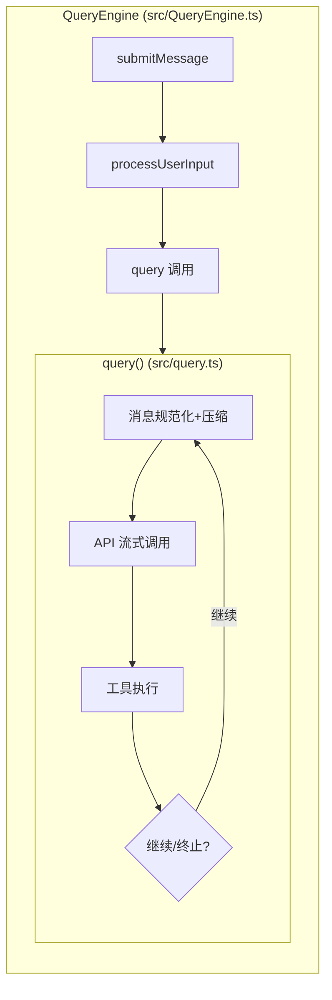
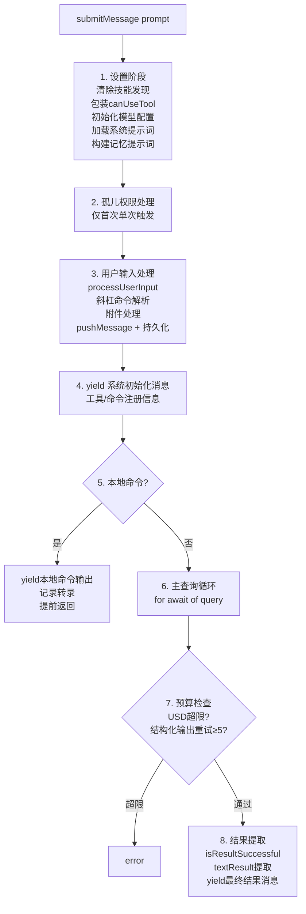
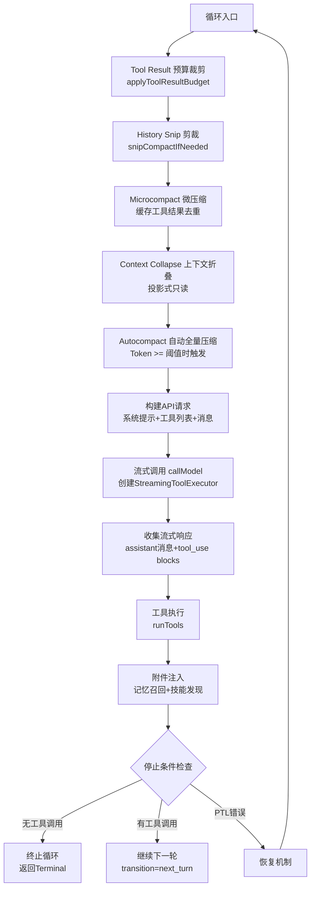
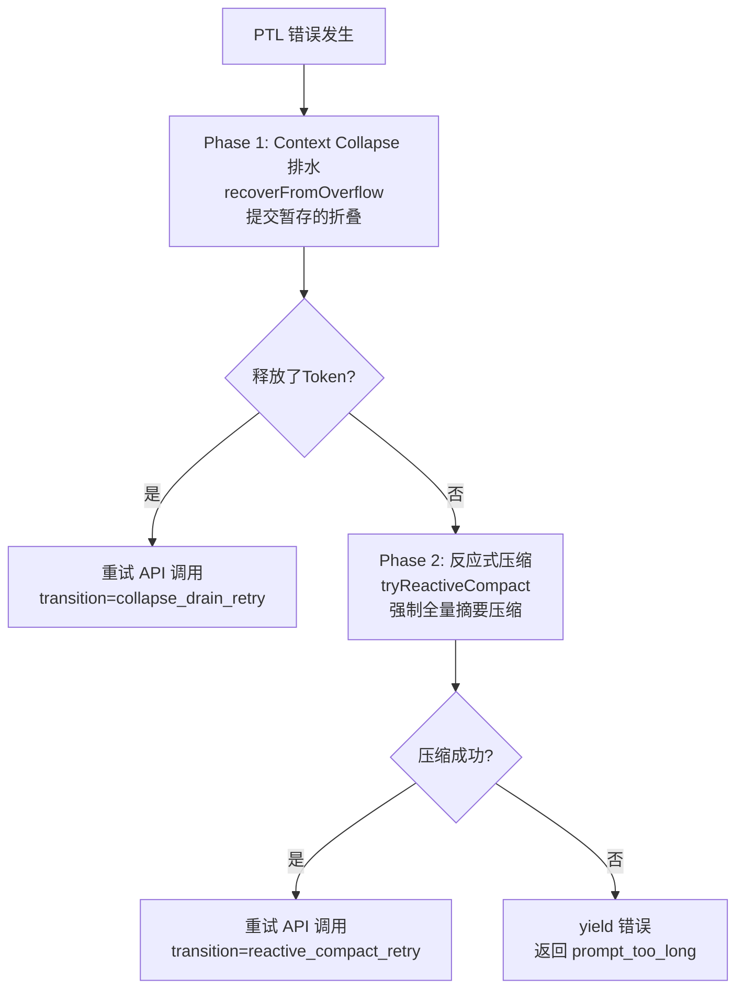
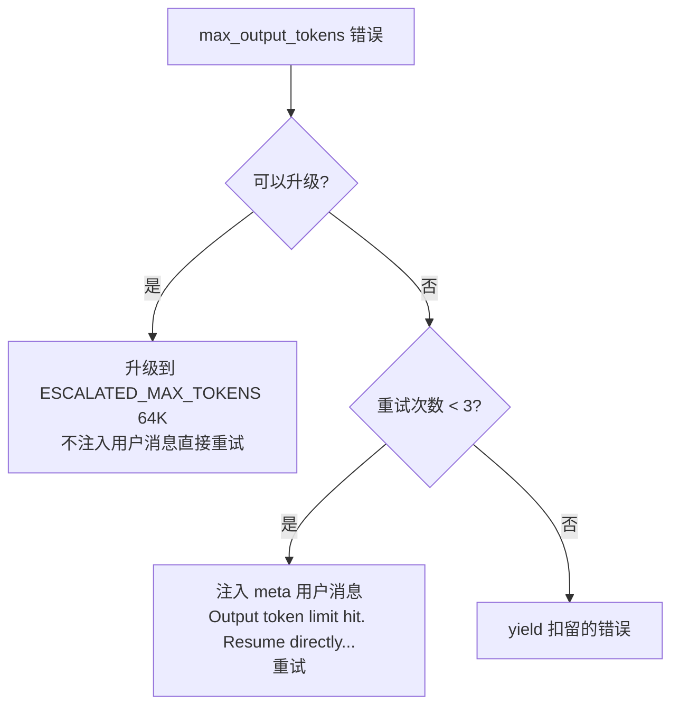

# 第 2 章：系统主循环

> 这是整个 Claude Code 最核心的章节。理解了主循环，就理解了 Claude Code 的灵魂。

## 2.1 全景：一次完整的交互

当用户输入一条消息时，Claude Code 执行以下流程：

```
用户输入 → 上下文组装 → 模型决策 → 工具执行 → 结果注入 → 继续/停止
```

这个循环不断重复，直到模型决定不再调用工具——返回纯文本响应为止。这就是 Agent Loop（代理循环）的本质。

## 2.2 双层生成器架构

Claude Code 的查询系统采用**双层生成器架构**，清晰分离会话管理与查询执行：



| 维度 | QueryEngine | query() |
|------|-------------|---------|
| 作用域 | 对话全生命周期 | 单次查询循环 |
| 状态 | 持久化（mutableMessages, usage） | 循环内（State 对象每次迭代重新赋值） |
| 预算追踪 | USD/轮次检查，结构化输出重试 | Task Budget 跨压缩结转，Token 预算续写 |
| 恢复策略 | 权限拒绝、孤儿权限 | PTL 排水/压缩、max_output_tokens 升级/重试 |

为什么要分两层？因为**会话管理和查询执行的关注点完全不同**。QueryEngine 关心的是"用户说了什么、花了多少钱、这轮结果是否成功"；query() 关心的是"消息是否需要压缩、API 返回了什么、工具执行是否成功、是否需要恢复"。双层分离使得每层的代码都更聚焦、更容易测试。

## 2.3 QueryEngine：会话生命周期管理

`src/QueryEngine.ts`（1,295 行）是对话的外壳。它的核心方法 `submitMessage()` 驱动一次完整的用户交互。

### 完整配置参数

QueryEngine 通过 `QueryEngineConfig` 接收所有配置：

```typescript
// src/QueryEngine.ts
export type QueryEngineConfig = {
  cwd: string                          // 工具执行的工作目录
  tools: Tools                         // 可用工具集（66+ 内置工具）
  commands: Command[]                  // 斜杠命令（/compact, /memory, /clear 等）
  mcpClients: MCPServerConnection[]    // 活跃的 MCP 服务端连接
  agents: AgentDefinition[]            // 自定义 Agent 定义（来自 .claude/agents/）
  canUseTool: CanUseToolFn             // 权限判定函数（多层防御）
  getAppState: () => AppState          // 读取 UI 状态
  setAppState: (f: (prev: AppState) => AppState) => void  // Zustand 式不可变更新

  // 可选配置
  initialMessages?: Message[]          // 会话恢复时的初始消息
  readFileCache: FileStateCache        // 文件状态缓存（去重读取）
  customSystemPrompt?: string          // 完全覆盖系统提示词
  appendSystemPrompt?: string          // 追加到系统提示词末尾
  userSpecifiedModel?: string          // 模型覆盖（如 claude-sonnet）
  fallbackModel?: string               // 错误时降级模型
  thinkingConfig?: ThinkingConfig      // 扩展思考配置
  maxTurns?: number                    // 最大工具调用轮次（安全限制）
  maxBudgetUsd?: number                // USD 成本上限
  taskBudget?: { total: number }       // API 侧 Token 预算
  jsonSchema?: Record<string, unknown> // 结构化输出 JSON Schema
  verbose?: boolean                    // 详细调试日志
  abortController?: AbortController    // 取消控制器
  orphanedPermission?: OrphanedPermission  // 孤儿权限处理
}
```

几个值得注意的设计细节：

- **`canUseTool` 包装**：`submitMessage()` 内部会包装这个函数，在原有权限检查基础上追踪所有权限拒绝事件。这些拒绝记录最终会在结果消息中返回给 SDK 消费者（如桌面应用），让它们知道用户拒绝了哪些操作
- **`readFileCache`**：防止模型重复读取同一个文件。如果模型在第 3 轮调用 `FileReadTool` 读了 `src/query.ts`，第 5 轮再次请求时，缓存会返回已有内容而不是重新读取磁盘
- **`orphanedPermission`**：处理一种边缘情况——上一次会话在用户授权"始终允许 BashTool"后崩溃，权限没有持久化。下次启动时，这个"孤儿权限"会被重放一次

### submitMessage() 八阶段生命周期

`submitMessage()` 驱动一次完整的用户交互，分为 8 个阶段：



**各阶段详解**：

**阶段 1 — 设置**：为什么每轮都要清除技能发现（`clearSkillDiscovery()`）？因为技能是在工具执行过程中动态发现的（通过 `SkillSearchTool`），上一轮发现的技能可能引用了已经不存在的工具或配置。每轮重新发现确保技能始终是最新的。

**阶段 2 — 孤儿权限**：只在会话的第一次 `submitMessage()` 调用时触发，且只触发一次（`orphanedPermission` 使用后被清空）。这处理的是上一个会话崩溃后遗留的权限授权。

**阶段 3 — 用户输入处理**：`processUserInput()` 是一个复杂的函数，它需要：
- 解析斜杠命令（`/compact` 触发手动压缩、`/memory` 管理记忆等）
- 处理附件（图片、PDF、文件引用）
- 将处理后的消息推入 `mutableMessages` 并持久化到磁盘

**阶段 5 — 本地命令检查**：像 `/clear` 这样的命令不需要调用 API——它们只是清理本地状态。如果 `processUserInput()` 设置了 `shouldQuery = false`，直接 yield 命令输出并提前返回，跳过整个查询循环。

**阶段 6 — 主查询循环**：这是最复杂的阶段。`for await (const msg of query(params))` 迭代查询生成器，处理 7 种不同的消息类型：
- `message_start` / `message_delta`：更新 Token 使用统计
- `assistant` 消息：推入消息列表并 yield 给上层
- `progress` 消息：行内进度记录
- `user` 消息：工具结果注入
- `compact_boundary`：触发 snip/splice/GC 清理
- `api_error`：yield 重试信号
- `tool_use_summary`：工具使用摘要

**阶段 7 — 预算检查**：两种预算限制——USD 成本（`getTotalCost() > maxBudgetUsd`）和结构化输出重试次数（最多 5 次）。

**阶段 8 — 结果提取**：`isResultSuccessful()` 检查最后一条 assistant 消息是否有效。最终 yield 的结果消息包含丰富的元数据：usage（Token 使用量）、cost（USD 成本）、turns（工具调用轮次）、stop_reason、permission_denials（被拒绝的权限列表）等。

## 2.4 query()：核心循环的实现

`src/query.ts`（1,729 行）是 Claude Code 最复杂的单个模块，实现了一个**基于状态机的异步生成器循环**。

### 核心签名

```typescript
export async function* query(
  params: QueryParams,
): AsyncGenerator<StreamEvent | Message | ToolUseSummaryMessage, Terminal>
```

关键点：这是一个 `async function*`——异步生成器。它不是一次性返回结果，而是**边执行边 yield 事件**，使调用方可以实时渲染流式输出。

### 循环状态

每次循环迭代共享一个可变的 `State` 对象：

```typescript
type State = {
  messages: Message[]           // 当前消息列表
  toolUseContext: ToolUseContext // 工具执行上下文
  autoCompactTracking: AutoCompactTrackingState | undefined
  maxOutputTokensRecoveryCount: number   // 输出Token恢复计数
  hasAttemptedReactiveCompact: boolean   // 是否已尝试反应式压缩
  maxOutputTokensOverride: number | undefined
  pendingToolUseSummary: Promise<ToolUseSummaryMessage | null> | undefined
  stopHookActive: boolean | undefined
  turnCount: number             // 当前轮次
  transition: Continue | undefined  // 上一次循环继续的原因
}
```

### 不可变参数 vs 可变状态

`query()` 内部有一个重要的设计区分：

```typescript
async function* queryLoop(params: QueryParams, consumedCommandUuids: string[]) {
  // 不可变参数 — 循环期间永不重新赋值
  const { systemPrompt, userContext, systemContext, canUseTool,
          fallbackModel, querySource, maxTurns, skipCacheWrite } = params

  // 可变跨迭代状态 — 7 个 continue site 通过 state = { ... } 更新
  let state: State = {
    messages: params.messages,
    toolUseContext: params.toolUseContext,
    maxOutputTokensOverride: params.maxOutputTokensOverride,
    autoCompactTracking: undefined,
    // ...
  }
}
```

`params` 中的字段在循环期间是常量；`state` 在每个 continue site 通过整体赋值更新（而不是逐字段修改），这让状态变更更加明确和可追踪。

### 单次循环迭代流程



### 循环体代码走读

让我们跟着代码走一遍循环体的关键步骤：

**第一步：4 级压缩流水线**（详见[第 3 章](./03-context-engineering.md)）

每次循环迭代的入口处，消息列表依次经过 Tool Result Budget → Snip → Microcompact → Context Collapse → Autocompact。这是防御性设计——即使上一轮工具返回了 100K Token 的输出，压缩流水线会在 API 调用前将其控制在预算内。

```typescript
// 1. Tool Result 预算裁剪
messagesForQuery = await applyToolResultBudget(messagesForQuery, ...)

// 2. History Snip（Feature-gated）
if (feature('HISTORY_SNIP')) {
  const snipResult = snipModule!.snipCompactIfNeeded(messagesForQuery)
  messagesForQuery = snipResult.messages
  snipTokensFreed = snipResult.tokensFreed
}

// 3. Microcompact
const microcompactResult = await deps.microcompact(messagesForQuery, ...)
messagesForQuery = microcompactResult.messages

// 4. Context Collapse（Feature-gated）
if (feature('CONTEXT_COLLAPSE') && contextCollapse) {
  const collapseResult = await contextCollapse.applyCollapsesIfNeeded(
    messagesForQuery, toolUseContext, querySource
  )
  messagesForQuery = collapseResult.messages
}
```

**第二步：构建 API 请求**

```typescript
const fullSystemPrompt = asSystemPrompt(
  appendSystemContext(systemPrompt, systemContext)  // 系统上下文后置
)
// userContext 通过 prependUserContext() 前置于消息
```

上下文的注入顺序对提示词缓存有影响：系统提示词（较稳定）后置追加系统上下文（Git 状态等），用户上下文（CLAUDE.md、日期）前置于消息。这种安排让系统提示词部分能更高效地被缓存。

**第三步：流式调用 + 工具并行执行**

`callModel()` 返回一个 async generator，`StreamingToolExecutor` 在流式接收响应的同时就开始执行已完成的工具调用（详见 2.4.1 节）。

**第四步：记忆预取消费**

```typescript
// 在循环入口创建，使用 `using` 关键字确保在所有退出路径上 dispose
using pendingMemoryPrefetch = startRelevantMemoryPrefetch(
  state.messages, state.toolUseContext,
)
```

`using` 是 TypeScript 的 Explicit Resource Management 语法——当 generator 退出时（无论正常返回还是异常），`pendingMemoryPrefetch` 的 `[Symbol.dispose]()` 会自动调用，用于发送遥测和清理资源。记忆预取在模型流式生成期间并行运行，通过 `settledAt` 守卫确保每轮只消费一次。

### 2.4.1 流式处理与并行工具执行

Claude Code 的流式处理不是简单的"等 API 返回再显示"。它利用 `StreamingToolExecutor` 实现了**流式工具并行执行**——在模型还在生成后续 token 时，已经完成解析的工具调用就被立即分发执行。这是 query() 循环内部的关键优化环节。

```
                    API 流式输出
                    ▼▼▼▼▼▼▼▼▼▼
    ┌──────────────────────────────────┐
    │ StreamingToolExecutor            │
    │                                  │
    │ tool_use_1 完成 → 立即执行 ────→ │ 结果就绪
    │ ...模型继续生成...                │
    │ tool_use_2 完成 → 立即执行 ────→ │ 结果就绪
    │ ...模型继续生成...                │
    │ tool_use_3 完成 → 立即执行 ────→ │ 结果就绪
    └──────────────────────────────────┘

    时间线对比：
    串行执行：  [===API===][tool1][tool2][tool3]
    流式并行：  [===API===]
                   [tool1]     ← 利用流式窗口 (5-30s)
                      [tool2]  ← 覆盖 ~1s 工具延迟
                         [tool3]
                [==结果即时可用==]
```

#### StreamingToolExecutor 实现原理

`StreamingToolExecutor`（`src/services/tools/StreamingToolExecutor.ts`，531 行）的核心是一个带并发控制的工具执行队列。每个工具被追踪为 `queued → executing → completed → yielded` 四个状态：

```typescript
// src/services/tools/StreamingToolExecutor.ts — 核心调度逻辑

type ToolStatus = 'queued' | 'executing' | 'completed' | 'yielded'

// 1. 流式响应中每解析完一个 tool_use block，立即入队并尝试执行
addTool(block: ToolUseBlock, assistantMessage: AssistantMessage): void {
  const isConcurrencySafe = toolDefinition.isConcurrencySafe(parsedInput.data)
  this.tools.push({ id: block.id, block, status: 'queued', isConcurrencySafe, ... })
  void this.processQueue()  // 立即尝试调度
}

// 2. 并发控制：concurrent-safe 工具可并行，非 concurrent 工具独占执行
private canExecuteTool(isConcurrencySafe: boolean): boolean {
  const executingTools = this.tools.filter(t => t.status === 'executing')
  return executingTools.length === 0 ||
    (isConcurrencySafe && executingTools.every(t => t.isConcurrencySafe))
}

// 3. 流式结束后，收割所有已完成结果（大部分此时已就绪）
*getCompletedResults(): Generator<MessageUpdate, void> {
  for (const tool of this.tools) {
    if (tool.status === 'completed' && tool.results) {
      tool.status = 'yielded'
      for (const message of tool.results) yield { message, newContext: ... }
    }
  }
}
```

关键设计细节：

1. **`addTool(block)`**：API 流式响应在解析到完整的 `tool_use` JSON block 时调用此方法。注意是"完整的 block"——不需要等整个 API 响应结束，一个 tool_use block 的 JSON 完成解析就可以分发执行
2. **并发安全分类**：每个工具通过 `isConcurrencySafe` 声明是否可以并行。读文件、搜索等只读操作标记为 concurrent-safe，可以同时执行；写文件、Bash 命令等标记为非 concurrent，必须独占执行
3. **Bash 错误级联**：当一个 Bash 工具出错时，`siblingAbortController` 会取消所有正在并行执行的兄弟工具——因为 Bash 命令之间经常有隐式依赖（如 `mkdir` 失败后续命令就没意义了），但读文件/搜索等独立操作的失败不会触发级联
4. **`getCompletedResults()` + `getRemainingResults()`**：前者非阻塞地收割已完成结果，后者异步等待剩余执行中的工具。两者配合实现了"流式期间即时收割 + 流式结束后等待尾部"的模式

这种设计的效果是：在一个典型的 API 响应（5-30 秒的流式窗口）中，多个工具可以被分发和完成。到流式结束时，工具结果已经可用——消除了串行执行的瓶颈。

## 2.6 Feature Flag 条件加载

`query.ts` 使用了 **6 个** Feature Flag 条件加载模块，分散在文件头部的三个 `eslint-disable` 块中。其中前 4 个与上下文压缩和工具系统密切相关，是理解主循环的核心；后 2 个（`jobClassifier`、`taskSummaryModule`）分别服务于模板分类和后台会话摘要，属于辅助功能。

```typescript
// —— 第一组：上下文压缩相关 ——
const reactiveCompact = feature('REACTIVE_COMPACT')
  ? (require('./services/compact/reactiveCompact.js') as typeof import('./services/compact/reactiveCompact.js'))
  : null
const contextCollapse = feature('CONTEXT_COLLAPSE')
  ? (require('./services/contextCollapse/index.js') as typeof import('./services/contextCollapse/index.js'))
  : null

// —— 第二组：技能搜索 & 模板分类 ——
const skillPrefetch = feature('EXPERIMENTAL_SKILL_SEARCH')
  ? (require('./services/skillSearch/prefetch.js') as typeof import('./services/skillSearch/prefetch.js'))
  : null
const jobClassifier = feature('TEMPLATES')
  ? (require('./jobs/classifier.js') as typeof import('./jobs/classifier.js'))
  : null

// —— 第三组：历史剪裁 & 后台会话摘要 ——
const snipModule = feature('HISTORY_SNIP')
  ? (require('./services/compact/snipCompact.js') as typeof import('./services/compact/snipCompact.js'))
  : null
const taskSummaryModule = feature('BG_SESSIONS')
  ? (require('./utils/taskSummary.js') as typeof import('./utils/taskSummary.js'))
  : null
```

| Feature Flag | 变量名 | 功能 |
|---|---|---|
| `REACTIVE_COMPACT` | `reactiveCompact` | PTL 错误时的反应式全量压缩 |
| `CONTEXT_COLLAPSE` | `contextCollapse` | 投影式上下文折叠 |
| `EXPERIMENTAL_SKILL_SEARCH` | `skillPrefetch` | 技能搜索预取 |
| `TEMPLATES` | `jobClassifier` | 任务模板分类器 |
| `HISTORY_SNIP` | `snipModule` | 历史消息 snip 剪裁 |
| `BG_SESSIONS` | `taskSummaryModule` | 后台会话任务摘要生成 |

这个模式有三个层次：
1. **编译时消除**：`feature()` 在 Bun bundler 构建时被求值。外部构建中 `feature('REACTIVE_COMPACT')` 返回 `false`，整个 `require()` 分支被 tree-shaking
2. **类型安全**：`as typeof import(...)` 让 TypeScript 知道模块的完整类型，IDE 补全和类型检查不受影响
3. **运行时守卫**：代码中使用 `if (contextCollapse) { contextCollapse.applyCollapsesIfNeeded(...) }`，这个 null 检查在编译时也被消除

## 2.7 七个继续点（Continue Sites）

`query()` 循环有 7 个导致循环继续的位置，每个对应一种恢复策略：

| 继续原因 | 触发条件 | 处理方式 |
|---------|---------|---------|
| `next_turn` | 模型调用了工具 | 正常继续，带上工具结果 |
| `collapse_drain_retry` | PTL 错误 + Context Collapse 有暂存 | 提交折叠，释放 Token，重试 |
| `reactive_compact_retry` | PTL 错误 + Collapse 不够 | 强制全量摘要压缩，重试 |
| `max_output_tokens_escalate` | 输出 Token 不够 | 升级到 64K Token 限制 |
| `max_output_tokens_recovery` | 升级不可用/已用 | 注入续写提示，最多重试 3 次 |
| `stop_hook_blocking` | Stop Hook 阻止终止 | 继续执行 |
| `token_budget_continuation` | Token 预算续写 | 继续生成 |

### PTL（Prompt-Too-Long）恢复流程



### Max-Output-Tokens 恢复



## 2.8 错误扣留策略（Withholding）

这是 Claude Code 最巧妙的设计之一：**可恢复的错误不立即 yield 给上层**。

### 工作原理

当出现 `prompt_too_long` 或 `max_output_tokens` 错误时，query() 不会立即通知调用方。它将错误推入 `assistantMessages` 但保留引用，然后运行恢复检查。如果恢复成功，错误**永远不会暴露给调用者**（包括 SDK 消费者和桌面应用），用户完全感知不到中间的错误。

```typescript
// src/query.ts — 错误扣留检测函数
function isWithheldMaxOutputTokens(
  msg: Message | StreamEvent | undefined,
): msg is AssistantMessage {
  return msg?.type === 'assistant' && msg.apiError === 'max_output_tokens'
}
```

### 一个实际场景

假设模型正在编辑一个大文件，生成了 16,000 Token 的输出后被 `max_output_tokens` 截断：

1. **错误发生**：API 返回 `stop_reason: 'max_output_tokens'`
2. **扣留而非暴露**：错误被包装为 `AssistantMessage`（带 `apiError: 'max_output_tokens'`），推入消息列表但**不 yield** 给调用方
3. **恢复策略 1 — 升级**：检查是否可以升级到 `ESCALATED_MAX_TOKENS`（64K）。如果可以，直接用更大的 Token 限制重试，不注入任何用户消息
4. **恢复策略 2 — 续写**：如果升级不可用或已经用过，注入一条 meta 用户消息 `"Output token limit hit. Resume directly from where you left off..."` 让模型从断点继续，最多重试 3 次
5. **成功恢复**：如果恢复成功，那条被扣留的错误消息永远不会 yield——SDK 消费者（如桌面应用）看不到任何错误，用户感知到的是一次流畅的响应

只有当所有恢复尝试都失败时（升级不可用 + 3 次续写都失败），错误才会被 yield 给上层。

### 为什么这么设计？

如果不做扣留，SDK 消费者（桌面应用、Bridge 模式）收到 `error` 类型的消息后会终止会话——即使后端的恢复循环还在运行，前端已经不再监听了。扣留机制确保前端只看到"干净"的结果流。

## 2.9 Token 使用追踪

QueryEngine 维护完整的 Token 使用统计：

```typescript
totalUsage: {
  input_tokens: 0,
  output_tokens: 0,
  cache_read_input_tokens: 0,
  cache_creation_input_tokens: 0,
  server_tool_use_input_tokens: 0,
}
```

追踪机制：
- 每条 API 响应的 `message_delta` 事件中，`currentMessageUsage` 被更新
- `message_stop` 时，`currentMessageUsage` 通过 `accumulateUsage()` 累加到 `totalUsage`
- `getTotalCost()` 基于 `totalUsage` 和模型定价计算 USD 总成本
- 一旦 `getTotalCost() > maxBudgetUsd`，整个查询终止——这是防止意外高成本的安全机制

`cache_read_input_tokens` 和 `cache_creation_input_tokens` 的追踪对提示词缓存策略至关重要——它们告诉系统缓存是否在有效工作。缓存断裂检测（`promptCacheBreakDetection.ts`）就依赖这些数据来判断是否发生了缓存失效。

## 2.10 停止条件

循环在以下条件下终止：

1. **模型未调用工具**：返回纯文本响应，正常结束
2. **达到最大轮次**：`maxTurns` 限制
3. **USD 预算超限**：`getTotalCost() > maxBudgetUsd`
4. **用户中断**：`abortController.signal` 被触发
5. **不可恢复的错误**：PTL/MOT 恢复全部失败
6. **连续压缩失败**：3 次 autocompact 连续失败（熔断器）

> **设计决策：为什么熔断阈值是 3 次？**
>
> `MAX_CONSECUTIVE_AUTOCOMPACT_FAILURES = 3`（`src/services/compact/autoCompact.ts`）。源码注释引用了生产数据：*"BQ 2026-03-10: 1,279 sessions had 50+ consecutive failures (up to 3,272) in a single session, wasting ~250K API calls/day globally."* 没有这个熔断器之前，压缩一旦进入失败循环，会无限重试——每次消耗一个完整的 API 调用（约 20K output tokens）。3 次阈值在"给压缩服务恢复机会"和"避免资源浪费"之间取得平衡。

> **设计决策：为什么用异步生成器而不是回调/事件？**
>
> `query()` 是一个 `async function*`，通过 `yield` 逐步输出事件。相比回调模式（如 EventEmitter），生成器有两个关键优势：（1）**背压控制**——消费端不处理完上一个事件，生产端不会继续执行，天然防止事件堆积；（2）**线性控制流**——循环的 7 个 continue site 可以用普通的 `state = { ... }; continue` 表达，不需要状态机的显式转换表。代价是调用方必须用 `for await...of` 消费，但在 Claude Code 中只有 QueryEngine 是消费者，这个约束完全可接受。

## 2.11 设计亮点总结

1. **双层生成器分离关注点**：QueryEngine 管会话生命周期，query() 管单次循环
2. **流式工具并行执行**：利用 API 流式窗口覆盖工具延迟
3. **错误扣留保证用户无感知恢复**：可恢复错误不暴露给上层
4. **7 个精确的继续点**：每种恢复策略都有明确的 transition 标记，可测试、可追踪
5. **编译时 Feature Gate**：内部功能在外部构建中被物理移除
6. **Task Budget 跨压缩结转**：压缩前后的 Token 预算无缝衔接

---

> **动手实践**：在 [claude-code-from-scratch](https://github.com/Windy3f3f3f3f/claude-code-from-scratch) 的 `src/agent.ts` 中，你可以看到一个 ~574 行的 Agent 主循环实现。对比本章描述的双层生成器架构，思考：为什么最小实现不需要分两层？什么规模下才值得引入 QueryEngine 这样的会话管理层？参见教程 [第 1 章：Agent Loop](https://github.com/Windy3f3f3f3f/claude-code-from-scratch/blob/main/docs/01-agent-loop.md)。

上一章：[概述](./01-overview.md) | 下一章：[上下文工程](./03-context-engineering.md)
