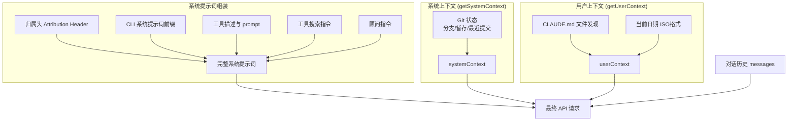
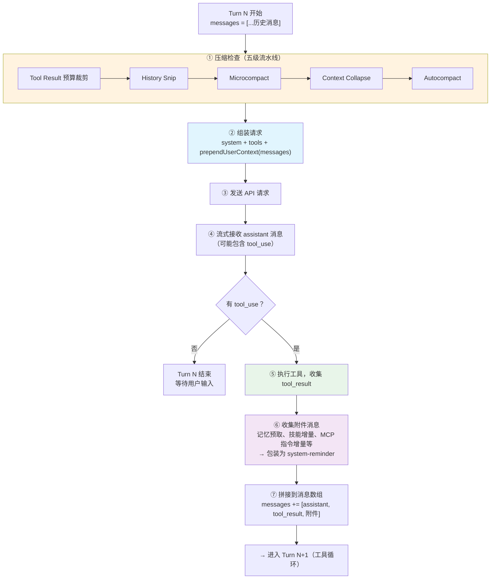
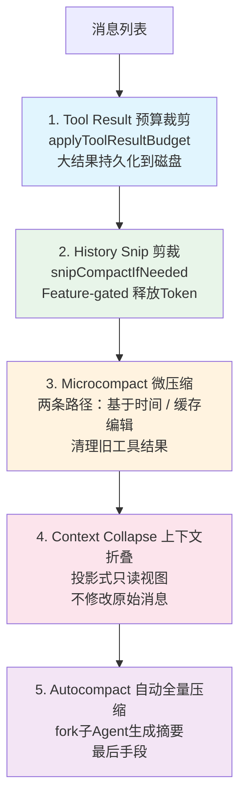
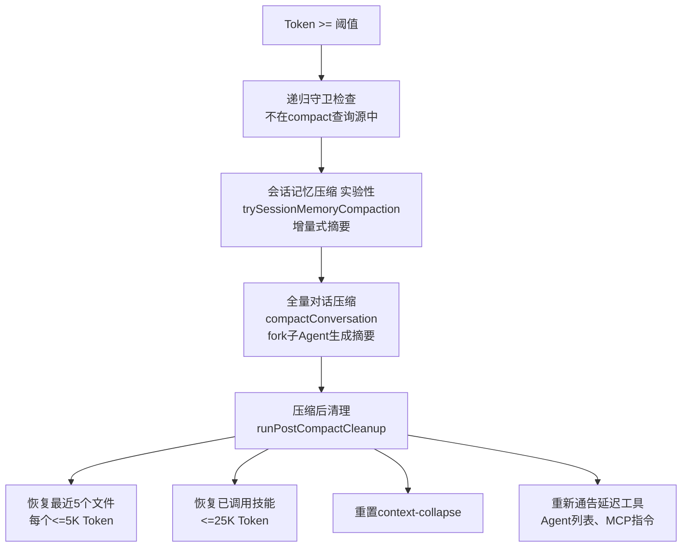

# 第 3 章：上下文工程

> 上下文工程是 Claude Code 能力的隐形支柱。模型的决策质量完全取决于它看到了什么上下文。

## 为什么上下文工程如此重要？

LLM 有一个固定大小的上下文窗口（Claude 当前最大 1M token）。而一次真实的编码会话，可能涉及几十次文件读取、数百次工具调用，产生的原始文本量轻松超过百万 token——很容易逼近甚至超出上下文窗口的容量。

这意味着系统必须做出艰难的取舍：**哪些信息留在上下文中，哪些被压缩或丢弃**。如果取舍不当，模型会忘记刚才编辑了哪个文件、重复读取已经看过的内容、或者产生与之前决策矛盾的输出。

可以把上下文窗口想象成一张办公桌：桌面有限，你必须把最重要的文档放在手边，其他的归档到抽屉里。上下文工程就是这套"文档管理系统"——决定桌上放什么（上下文构建）、什么时候把旧文档收进抽屉（压缩）、以及如何让归档的文档在需要时快速取回（持久化与恢复）。

但上下文工程面临的挑战不止于此。Claude Code 的每次 API 请求，光系统提示词和工具定义就可能有 **50-100K token**。为了避免每次都从零处理这些内容，Claude Code 依赖服务端的**前缀缓存**（Prefix Caching / KV Cache）——服务端记住之前处理过的前缀，后续请求只需处理新增部分，大幅降低延迟和成本。

但前缀缓存有一个残酷的约束：**前缀必须字节级完全一致才能命中缓存**。不是"差不多就行"，而是任何一个字节的变化——哪怕只是换了一个请求头、改了一个工具的顺序——都会导致整个前缀的缓存失效，50-100K token 全部需要重新处理。

这给上下文工程带来了一种**"带着镣铐跳舞"**的感觉：你不能随意调整提示词顺序，不能随意增删工具定义，不能中途改变请求元数据……每一个设计决策都必须同时满足两个目标——**给模型最好的上下文**，同时**不打破缓存**。本章中你会反复看到这种张力：很多看起来"过度设计"的机制，背后的驱动力都是缓存稳定性。

Claude Code 在这方面的工程量远超大多数人的预期。本章将深入分析它的完整上下文管理体系。

关键文件：`src/context.ts`（190 行）、`src/utils/api.ts`、`src/services/compact/`

## 3.1 上下文构建全景

每次调用 Claude API，模型都是从零开始的——它没有跨请求的持久记忆，只能看到当前请求中携带的内容。因此，Claude Code 必须在每次 API 调用前，将模型需要的所有信息组装成一个完整的请求。

这个组装过程涉及三大支柱：

1. **系统提示词**（System Prompt）：定义模型的身份、能力边界和行为规则。这是最稳定的部分，跨请求基本不变。
2. **系统/用户上下文**（System & User Context）：环境信息（git 状态、平台）和项目知识（CLAUDE.md 指令文件）。每会话计算一次。
3. **消息历史**（Message History）：用户的提问、模型的回答、工具调用和结果——记录了对话中发生的一切。这是变化最快、占用空间最大的部分。



### 一次 API 请求的完整解剖

上面的三大支柱比较抽象，下面让我们看看一次真实的 API 请求到底长什么样。Claude API 的请求体有三个顶级字段：`system`（系统提示词数组）、`tools`（工具 schema 数组）、`messages`（消息数组）。以下是它们的完整结构：

```
┌─────────────────────────────────────────────────────────────┐
│  system — 系统提示词数组（多个 TextBlock 拼接）               │
│  ┌────────────────────────────────────────────────────────┐  │
│  │ [0] 归属头 (Attribution Header)              不缓存    │  │
│  │ [1] CLI 前缀 (交互模式 / -p 模式指令)         不缓存    │  │
│  │ ─── 静态内容 ─────────────────────────── 🔒 global ── │  │
│  │ [2] 核心指令 + 工具描述 + 安全规则 + 行为准则           │  │
│  │     （所有用户完全相同）                                 │  │
│  │ ─── __SYSTEM_PROMPT_DYNAMIC_BOUNDARY__ ────────────── │  │
│  │ ─── 动态内容 ─────────────────────────── 不缓存 ───── │  │
│  │ [3] 输出风格、语言偏好、MCP 指令等                      │  │
│  │     （因用户/会话而异）                                  │  │
│  └────────────────────────────────────────────────────────┘  │
│                                                               │
│  tools — 工具 schema 数组                                     │
│  ┌────────────────────────────────────────────────────────┐  │
│  │ 内置工具 (Read, Edit, Bash, Grep, Write, Glob...)      │  │
│  │ MCP 工具 (用户安装的，可能标记 defer_loading 延迟加载)   │  │
│  │ 最后一个工具 ← 标记 cache_control 作为缓存断点          │  │
│  │ ── 断点之后 ──                                          │  │
│  │ 服务端工具 (advisor 等，开关不影响缓存)                  │  │
│  └────────────────────────────────────────────────────────┘  │
│                                                               │
│  messages — 消息数组                                          │
│  ┌────────────────────────────────────────────────────────┐  │
│  │ [User]  <system-reminder>                               │  │
│  │           CLAUDE.md 内容 + 当前日期 (会话开始时计算一次)  │  │
│  │         </system-reminder>                   (isMeta)   │  │
│  │                                                          │  │
│  │ [User]  用户第 1 条消息                                   │  │
│  │ [Asst]  模型回复（可能包含 tool_use 块）                  │  │
│  │ [User]  tool_result 结果                                  │  │
│  │ [User]  附件消息（每条都是独立的 isMeta 用户消息）：       │  │
│  │          ├ <system-reminder> 记忆文件内容 </...>          │  │
│  │          ├ <system-reminder> 可用技能列表 </...>          │  │
│  │          ├ <system-reminder> 延迟工具发现结果 </...>      │  │
│  │          └ <system-reminder> MCP 指令增量 </...>          │  │
│  │ [Asst]  模型第 2 轮回复                                   │  │
│  │ ...（消息不断增长，直到压缩机制介入）                      │  │
│  └────────────────────────────────────────────────────────┘  │
└─────────────────────────────────────────────────────────────┘
```

注意几个关键设计：

- **记忆、技能、MCP 指令**不在系统提示词中，而是作为 `<system-reminder>` 附件消息注入到消息数组中。这样做的好处是：它们可以按需、增量地注入（只在内容变化时添加新的附件），而不会破坏系统提示词的缓存
- **CLAUDE.md 和日期**虽然是"元信息"，但被放在消息数组的第一条（而非系统提示词中），因为 CLAUDE.md 内容因项目而异，放在系统提示词中会降低缓存共享率
- **工具 schema 数组**中最后一个工具标记了 `cache_control`，服务端缓存到这个断点为止。Advisor 等可选工具放在断点之后，这样开关 advisor 不会影响之前的缓存

下表总结了各组件在一个会话中的变化特征：

| 组件 | 在请求中的位置 | 会话内变化频率 | 说明 |
|------|--------------|--------------|------|
| 核心系统指令 | `system`（边界前） | **从不**——所有用户所有会话完全相同 | 全局缓存，全球共享 |
| 动态系统指令 | `system`（边界后） | **从不**——因用户而异但 session 内固定 | 会话开始时确定 |
| 工具 schema | `tools[]` | **极少**——MCP 重连或 Tool Search 发现新工具时 | 延迟加载减少变动 |
| CLAUDE.md + 日期 | `messages[0]` | **从不**——会话开始时 memoize 计算一次 | 包裹在 system-reminder 中 |
| 用户消息 + 模型回复 | `messages` | **每轮增长** | 压缩机制控制增速 |
| 工具调用 / 结果 | `messages` | **每次工具执行后增长** | 旧结果可被 Microcompact 清理 |
| 记忆文件 | `messages`（附件） | **按需**——相关记忆被发现时注入，去重 | 每会话最多 60KB |
| 技能 / MCP 指令 | `messages`（附件） | **增量**——只在列表变化时注入 delta | 不重复发送已知内容 |

### 一轮对话如何改变上下文

理解上面的静态结构之后，来看看动态过程——一轮对话（Turn N）中上下文经历了哪些变化：



**核心要点**：上下文是"活的"——每一轮对话，消息数组都在增长（新的 assistant 回复 + tool_result + 附件），而压缩机制在每轮开始时检查并控制增长速度。系统提示词和工具列表在整个会话中基本不变，这正是它们能被高效缓存的原因。

## 3.2 系统提示词的构建

系统提示词是上下文中最稳定的部分——它定义了模型"是谁"以及"该怎么做"。正因为稳定，它也是提示词缓存的最佳候选。Claude Code 的系统提示词构建在稳定性和灵活性之间做了精心平衡。

### 归属头（Attribution Header）
基于指纹的身份标识，用于追踪请求来源。

### CLI 系统提示词前缀
根据运行模式变化：交互式模式（REPL）和 `-p` 单次查询模式有不同的前缀指令。

### 系统提示词优先级

系统提示词的构建有严格的优先级，由 `buildEffectiveSystemPrompt()`（`src/utils/systemPrompt.ts`）实现：

```typescript
// 优先级从高到低：
// 0. overrideSystemPrompt — 完全覆盖（如 loop 模式）
// 1. coordinatorSystemPrompt — 协调器模式（Feature-gated）
// 2. agentSystemPrompt — Agent 定义的提示词
//    - Proactive 模式：追加到默认提示词后面
//    - 普通模式：替换默认提示词
// 3. customSystemPrompt — --system-prompt 参数指定
// 4. defaultSystemPrompt — 标准 Claude Code 提示词
// + appendSystemPrompt 始终追加到末尾（除 override 模式）
```

这个优先级链确保了不同运行模式（交互、Agent、协调器、SDK）都能获得正确的系统提示词，同时保留用户自定义的能力。

### 静态/动态边界标记

系统提示词中有一个关键的设计元素——`SYSTEM_PROMPT_DYNAMIC_BOUNDARY`（`src/constants/prompts.ts:114`）。这是一个哨兵字符串 `__SYSTEM_PROMPT_DYNAMIC_BOUNDARY__`，它将系统提示词数组分成两半：

- **边界之前**：核心指令、工具描述、安全规则等——对**所有用户的所有会话**都完全相同的内容
- **边界之后**：MCP 工具指令、输出风格、语言偏好等——因用户/会话而异的内容

为什么需要这个边界？因为它直接影响提示词缓存的效率。边界之前的静态部分可以使用 `scope: 'global'` 缓存，**跨所有用户共享**——这意味着全球数百万 Claude Code 用户可以共享同一份缓存的核心系统提示词。边界之后的动态部分则只能用 `scope: 'org'` 或不缓存。没有这个边界，整个系统提示词都只能做 org 级别缓存，浪费大量缓存存储在完全相同的内容上。

### Section-Level 缓存

系统提示词的各个组成部分通过 `systemPromptSections.ts` 实现了 section 级别的缓存。这里有两种类型：

```typescript
// 计算一次，缓存到 /clear 或 /compact
systemPromptSection('toolInstructions', () => buildToolPrompt(...))

// 每轮重新计算，会破坏提示词缓存
DANGEROUS_uncachedSystemPromptSection(
  'modelOverride',
  () => getModelOverrideConfig(),
  'Live feature flags may change mid-session'  // 必须提供理由
)
```

`DANGEROUS_` 前缀是刻意为之的代码级警示——它提醒开发者：**这个 section 每轮都会重新计算，如果值发生变化会破坏提示词缓存**。开发者必须提供一个 `_reason` 参数解释为什么缓存破坏是必要的。大多数 section 都是稳定的（工具描述、安全规则），只有少数依赖实时 feature flag 的 section 需要使用 `DANGEROUS_` 变体。

`clearSystemPromptSections()` 在 `/clear` 和 `/compact` 时调用，同时重置 beta header 锁存（详见 3.6 第二层防御），让下一次对话获得完全新鲜的状态。

### 系统上下文（`getSystemContext`）

来自 `src/context.ts` 的 `getSystemContext()` 函数，**被 memoize 缓存**（每会话只计算一次）。

完整的实现展示了一个精心设计的上下文收集过程：

```typescript
// src/context.ts — getGitStatus()
export const getGitStatus = memoize(async (): Promise<string | null> => {
  const isGit = await getIsGit()
  if (!isGit) return null

  try {
    // 5 个 git 命令并行执行
    const [branch, mainBranch, status, log, userName] = await Promise.all([
      getBranch(),
      getDefaultBranch(),
      execFileNoThrow(gitExe(), ['--no-optional-locks', 'status', '--short'], ...)
        .then(({ stdout }) => stdout.trim()),
      execFileNoThrow(gitExe(), ['--no-optional-locks', 'log', '--oneline', '-n', '5'], ...)
        .then(({ stdout }) => stdout.trim()),
      execFileNoThrow(gitExe(), ['config', 'user.name'], ...)
        .then(({ stdout }) => stdout.trim()),
    ])

    // 状态截断至 2000 字符，防止大量未提交文件撑爆上下文
    const truncatedStatus = status.length > MAX_STATUS_CHARS
      ? status.substring(0, MAX_STATUS_CHARS) +
        '\n... (truncated because it exceeds 2k characters...)'
      : status

    return [
      // 这条 disclaimer 至关重要——它告诉模型 git 状态是会话开始时的快照，
      // 防止模型在后续轮次中"幻觉"出实时的 git 状态更新
      `This is the git status at the start of the conversation. Note that this status is a snapshot in time, and will not update during the conversation.`,
      `Current branch: ${branch}`,
      `Main branch (you will usually use this for PRs): ${mainBranch}`,
      ...(userName ? [`Git user: ${userName}`] : []),
      `Status:\n${truncatedStatus || '(clean)'}`,
      `Recent commits:\n${log}`,
    ].join('\n\n')
  } catch (error) {
    logError(error)
    return null
  }
})
```

值得注意的设计细节：
- **`Promise.all` 并行**：5 个 git 命令同时执行，而不是串行等待——这在大型仓库中可以节省数百毫秒
- **`--no-optional-locks`**：避免 git 命令获取锁导致与其他 git 操作冲突
- **`MAX_STATUS_CHARS = 2000`**：限制状态输出长度。想象一个有 500 个未提交文件的 monorepo——不截断的话，git status 本身就会消耗大量上下文预算
- **Disclaimer 文本**：明确告诉模型这是快照，不会实时更新——这是防止模型幻觉的重要手段

`getSystemContext()` 本身还有条件跳过逻辑：

```typescript
export const getSystemContext = memoize(async () => {
  // CCR（Cloud Code Remote）模式或禁用 git-instructions 时跳过
  const gitStatus =
    isEnvTruthy(process.env.CLAUDE_CODE_REMOTE) ||
    !shouldIncludeGitInstructions()
      ? null
      : await getGitStatus()

  // 缓存断裂注入（内部调试功能，Feature-gated）
  const injection = feature('BREAK_CACHE_COMMAND')
    ? getSystemPromptInjection()
    : null

  return {
    ...(gitStatus && { gitStatus }),
    ...(injection ? { cacheBreaker: `[CACHE_BREAKER: ${injection}]` } : {}),
  }
})
```

### 用户上下文（`getUserContext`）

```typescript
export const getUserContext = memoize(async () => {
  // --bare 模式的微妙语义：
  // - CLAUDE_CODE_DISABLE_CLAUDE_MDS: 硬关闭，始终生效
  // - --bare: 跳过自动发现（CWD 遍历），但尊重显式 --add-dir
  // 注释原文："bare means skip what I didn't ask for, not ignore what I asked for"
  const shouldDisableClaudeMd =
    isEnvTruthy(process.env.CLAUDE_CODE_DISABLE_CLAUDE_MDS) ||
    (isBareMode() && getAdditionalDirectoriesForClaudeMd().length === 0)

  const claudeMd = shouldDisableClaudeMd
    ? null
    : getClaudeMds(filterInjectedMemoryFiles(await getMemoryFiles()))

  // 缓存给 yoloClassifier 使用，避免创建 import 循环
  setCachedClaudeMdContent(claudeMd || null)

  return {
    ...(claudeMd && { claudeMd }),
    currentDate: `Today's date is ${getLocalISODate()}.`,
  }
})
```

### CLAUDE.md 发现机制

CLAUDE.md 是 Claude Code 的 **项目级指令文件**，类似于 `.editorconfig` 或 `.eslintrc`，但面向 AI Agent。它的发现过程比看起来要复杂得多。

**发现顺序**（`getMemoryFiles()`）：
1. **管理策略文件**：从 MDM（移动设备管理）策略中读取的指令（如 `/etc/claude-code/CLAUDE.md`）
2. **用户主目录**：`~/.claude/CLAUDE.md` 下的全局配置
3. **项目文件**：从 CWD 向上遍历目录树，查找每一层的指令文件
4. **本地文件**：`CLAUDE.local.md`（不提交到 git 的个人指令）
5. **显式附加目录**：`--add-dir` 参数指定的额外目录

**文件名模式**：每个目录下检查 `CLAUDE.md`、`.claude/CLAUDE.md`，以及 `.claude/rules/` 目录下的**所有 `.md` 文件**。这意味着你可以将不同领域的指令拆分成独立文件（如 `.claude/rules/testing.md`、`.claude/rules/style.md`），系统会自动加载它们。

**优先级排序**：文件按从远到近的顺序加载——**靠近 CWD 的文件后加载**，因此优先级更高。这符合"就近原则"：项目根目录的全局规则可以被子目录的局部规则覆盖。由于 LLM 对上下文末尾的内容关注度更高（[近因效应](https://en.wikipedia.org/wiki/Recency_bias)），后加载的指令在模型的"注意力"中权重更大。

**`@include` 指令**（`src/utils/claudemd.ts`）：

CLAUDE.md 文件可以通过 `@` 语法引用其他文件：

```markdown
# 项目指令
@./docs/coding-standards.md
@~/global-rules.md
@/etc/company-policy.md
```

- `@path`（无前缀）等同于 `@./path`，按相对路径解析
- `@~/path` 从用户主目录解析
- `@/path` 按绝对路径解析
- 只在叶子文本节点中生效（代码块内的 `@` 不会被解析）
- 被引用的文件作为独立条目插入到引用文件**之前**
- 通过跟踪已处理文件防止循环引用
- 只允许文本文件扩展名（.md、.txt 等），防止加载二进制文件

**过滤**：`filterInjectedMemoryFiles()` 排除匹配 `.claude-injected-*` 模式的文件——这些是由 Hook 或系统程序化注入的，不是用户手动编写的

**缓存失效**：`clearMemoryFileCaches()` 在工作目录变更时清除缓存；`resetGetMemoryFilesCache()` 在 `InstructionsLoaded` Hook 触发时完全重新加载

### 上下文注入顺序

```typescript
// src/utils/api.ts
const fullSystemPrompt = asSystemPrompt(
  appendSystemContext(systemPrompt, systemContext)  // 系统上下文后置
)
// userContext 在消息前置（prependUserContext）
```

系统上下文**后置**于系统提示词，用户上下文**前置**于消息——这个顺序影响提示词缓存的效率。系统提示词是最稳定的部分（跨请求不变），放在最前面有利于缓存命中；而用户上下文（CLAUDE.md、日期）可能随会话变化，放在消息前面不会破坏系统提示词的缓存。

## 3.3 消息历史管理

Claude Code 不是简单地将所有历史消息发送给 API。它通过一系列机制管理消息列表，确保发送给 API 的消息格式合法、内容精简。

### 压缩边界（Compact Boundary）

当 autocompact 发生后，消息列表中会插入一个 `compact_boundary` 标记。之后的 API 调用只发送边界之后的消息：

```typescript
let messagesForQuery = [...getMessagesAfterCompactBoundary(messages)]
```

当 `HISTORY_SNIP` Feature 启用时，还会在此基础上投影一个"剪裁视图"——将被标记为 snipped 的消息从 API 请求中隐藏。

### 消息规范化（`normalizeMessagesForAPI`）

`normalizeMessagesForAPI()`（`src/utils/messages.ts`，约 200 行）是消息发送前的关键处理步骤。它解决了一个核心问题：**Claude Code 内部的消息格式和 API 要求的消息格式不完全一致**。

```typescript
// src/utils/messages.ts
export function normalizeMessagesForAPI(
  messages: Message[],
  tools: Tools = [],
): (UserMessage | AssistantMessage)[] {
  const availableToolNames = new Set(tools.map(t => t.name))

  // 1. 附件重排序 + 过滤虚拟消息
  const reorderedMessages = reorderAttachmentsForAPI(messages)
    .filter(m => !((m.type === 'user' || m.type === 'assistant') && m.isVirtual))

  // 2. 构建错误→块类型映射（PDF太大、图片太大等）
  const errorToBlockTypes: Record<string, Set<string>> = { ... }
  const stripTargets = new Map<string, Set<string>>()  // userUUID → 需剥离的块类型

  // 3-7. 遍历消息，逐条处理：
  //   - 剥离 tool_reference、advisor blocks、错误媒体项
  //   - 处理 thinking/signature 块
  //   - 合并同 ID 的分裂 AssistantMessage
  //   - 验证和修复 tool_use/tool_result 配对
  ...
}
```

下面是每个处理步骤及其解决的问题：

**1. 附件重排序**（`reorderAttachmentsForAPI`）：附件消息在内部可能出现在任意位置，但 API 要求它们在语义上关联的消息之前。此步骤将附件消息向上冒泡，直到遇到 `tool_result` 或 `assistant` 消息为止。**如果不做这一步**，API 可能看到一个孤立的图片块，却不知道它与哪条消息相关。

**2. 过滤虚拟消息**：标记为 `isVirtual` 的消息（如 REPL 内部工具调用的临时消息）被移除。**这些消息的存在仅为了 UI 展示**——例如自动触发的内部操作在界面上需要显示进度，但它们不应进入 API 请求。

**3. 构建错误→块类型映射**：某些 API 错误（如"PDF 太大"、"图片太大"）需要从后续消息中剥离对应的媒体块。系统构建一个映射表 `errorToBlockTypes`，将错误文本映射到需要剥离的块类型（`document`、`image`）。**如果不做这一步**，同一个过大的 PDF 会在每次请求中被发送，每次都触发同样的错误。

**4. 剥离内部元素**：从消息中移除 `tool_reference`（工具引用标记）、advisor blocks（顾问指令）、因 API 错误而需要剥离的媒体项。`tool_reference` 是延迟工具加载系统（Tool Search）的内部跟踪标记，API 对此毫无概念——**它们的存在会导致 API 返回格式错误**。

**5. thinking/signature 块处理**：根据模型要求处理思考块。某些模型不支持 `thinking` 或 `redacted_thinking` 块——**发送它们会直接导致 API 返回 400 错误**。Signature 块用于验证思考块的完整性，也需要在不支持的模型上剥离。

**6. 合并分裂消息**：流式解析器可能将一个 API 响应拆分为多条具有相同 `message.id` 的 `AssistantMessage`（当并行工具调用产生多个 content block 时）。**API 期望一个响应对应一条消息**，多条同 ID 消息会违反消息交替规则。

**7. 验证和修复配对**：API 要求每个 `tool_use` block 都有对应的 `tool_result`，反之亦然。会话崩溃、压缩、中途中断都可能破坏这种配对关系。此步骤检测并修复孤儿 block——**为缺失结果的 `tool_use` 生成错误类型的 `tool_result`**，为缺失请求的 `tool_result` 注入合成的 `tool_use`。没有这一步，恢复一个崩溃的会话几乎必然会因为配对不完整而报错。

**为什么这么复杂？** 因为 Claude API 对消息格式有严格要求：用户/助手消息必须交替出现、`tool_use`/`tool_result` 必须配对、thinking 块不能出现在不支持的位置。而 Claude Code 的内部消息列表可能因为会话崩溃恢复、压缩操作、用户中断等原因违反这些约束。`normalizeMessagesForAPI` 是防御层——确保无论内部状态多混乱，API 始终收到合法的消息序列。

## 3.4 五级压缩流水线

这是 Claude Code 上下文管理的核心机制。当对话越来越长，Token 使用量不断增长，五级压缩流水线逐级启动。设计哲学是**渐进式压缩**——先用成本最低的手段尝试释放空间，只在必要时才动用更重的武器。



### 为什么按此顺序执行？

每一级都比前一级"更重"——消耗更多计算资源，或丢失更多上下文细节：

1. **Tool Result Budget 最先**：纯本地操作，不调用 API。大结果写入磁盘，上下文只保留预览。零延迟、零成本。
2. **Snip 释放最多**：直接从消息列表中移除冗余部分，释放大量 Token，可能使后续压缩不必要。
3. **Microcompact 成本极低**：清理旧工具结果，不调用 API，适合频繁执行。
4. **Context Collapse 在 Autocompact 之前**：Context Collapse（上下文折叠）是一种投影式压缩——创建消息的只读折叠视图，不修改原始数据（详见 Level 4）。折叠可能使 Token 使用量降到 Autocompact 阈值以下，从而阻止不必要的全量压缩——保留了更细粒度的上下文。
5. **Autocompact 作为最后手段**：需要 fork 一个子 Agent 调用 API 生成摘要，成本最高，且不可逆（原始消息被摘要替换）。

### 各级压缩详解

#### Level 1: Tool Result 预算裁剪

`applyToolResultBudget()` 是最轻量的处理——纯本地操作，不调用 API。它解决的核心问题是：**单次工具调用可能返回巨大的结果**。例如，用 `FileReadTool` 读取一个万行文件，或用 `BashTool` 执行 `find` 命令获取数千个文件路径。

处理机制（`src/utils/toolResultStorage.ts`）：

1. 每个工具声明一个 `maxResultSizeChars`，默认值为 `DEFAULT_MAX_RESULT_SIZE_CHARS = 50,000` 字符
2. 可通过 GrowthBook Feature Flag（`tengu_satin_quoll`）按工具名覆盖阈值
3. 当工具结果超过阈值时，**不是简单截断，而是持久化到磁盘**

```
持久化路径: {projectDir}/{sessionId}/tool-results/{tool_use_id}.{txt|json}
```

上下文中只保留一个紧凑的引用消息：

```xml
<persisted-output>
Output too large (2.3 MB). Full output saved to: /tmp/.claude/session-xxx/tool-results/toolu_abc123.txt

Preview (first 2.0 KB):
[前 2000 字节的内容预览]
...
</persisted-output>
```

**为什么选择持久化而非截断？** 截断意味着数据永久丢失——如果模型后来需要查看完整输出（比如在第 500 行发现了 bug），它无法恢复。持久化则保留了完整数据，模型可以随时使用 `Read` 工具读取磁盘文件来获取完整内容。2KB 的预览给了模型足够的信息来判断是否需要查看完整结果。

此外，`applyToolResultBudget` 还会追踪已替换的工具结果（`ContentReplacementState`），确保会话恢复（resume）时做出与原始会话完全相同的替换决策，维持提示词缓存的稳定性。

#### Level 2: History Snip

`snipCompactIfNeeded()` 是 Feature-gated 功能（`HISTORY_SNIP`），通过剪裁历史消息中的冗余部分释放 Token。释放量通过 `snipTokensFreed` 传递给后续的 autocompact 阈值检查——这很重要，因为 snip 移除了消息但最后一条 assistant 消息的 `usage` 仍然反映 snip 前的上下文大小，不做修正会导致 autocompact 过早触发。

#### Level 3: Microcompact

Microcompact 是 Claude Code 压缩体系中最精巧的机制之一。它的目标是**清理历史中不再需要的旧工具结果**——如果你 30 分钟前读取了一个文件，那个工具结果大概率已经不再有用，但它可能还占着数千 Token。

关键设计：Microcompact 有**两条完全不同的路径**，根据缓存状态选择：

**路径 A：基于时间的 Microcompact（缓存已冷）**

当用户离开一段时间后回来（距上次 assistant 消息超过配置的分钟数），服务端的提示词缓存已经过期（默认 5 分钟 TTL）。此时缓存已经"冷了"，无论怎么做都需要重新上传完整前缀。

在这种情况下，Microcompact **直接修改消息内容**：

```typescript
// 将旧工具结果替换为占位符
return { ...block, content: '[Old tool result content cleared]' }
```

只保留最近 N 个可压缩工具的结果（`keepRecent`，最少保留 1 个），其他全部替换为占位符。因为缓存已经冷了，修改消息内容不会造成额外的缓存失效——缓存本来就需要重建。

可压缩的工具类型：`FileRead`、`Shell/Bash`、`Grep`、`Glob`、`WebSearch`、`WebFetch`、`FileEdit`、`FileWrite`。

**路径 B：缓存编辑 Microcompact（缓存仍热）**

当缓存还没过期时（用户一直在活跃对话），情况完全不同。如果直接修改消息内容，会导致缓存键（cache key）变化，**使 100K+ token 的缓存前缀全部失效**，需要重新上传和计费。

因此，缓存编辑路径**完全不修改本地消息**。它使用一种巧妙的 API 级机制：

1. 在工具结果块上添加 `cache_reference` 字段（等于 `tool_use_id`），让服务端能够定位缓存中的具体位置
2. 构造 `cache_edits` 块，告诉服务端"删除这些 `cache_reference` 指向的内容"
3. 服务端在缓存中就地删除，不需要客户端重新上传前缀

```typescript
// 消息本身不变，编辑在 API 层发生
// cache_edits 块通过 consumePendingCacheEdits() 传递给 API 层
return { messages } // 原样返回！
```

已发出的 `cache_edits` 通过 `pinCacheEdits()` 保存，在后续请求中按原始位置重新发送（服务端需要看到它们才能维持缓存一致性）。

| | 基于时间的 MC | 缓存编辑 MC |
|---|---|---|
| **触发条件** | 时间间隔超过阈值（缓存冷） | 工具数量超过阈值（缓存热） |
| **操作方式** | 直接修改消息内容 | `cache_edits` API 块 |
| **对缓存的影响** | 缓存本来就要重建，无额外影响 | 保持缓存热度，避免重新上传 |
| **API 调用** | 零 | 零（编辑在下次正常请求中捎带） |
| **适用场景** | 用户回来后的首次请求 | 活跃对话中的持续清理 |

两条路径互斥：时间触发优先级更高，如果时间触发生效，会跳过缓存编辑路径（因为缓存已冷，使用 `cache_edits` 没有意义）。

#### Level 4: Context Collapse

**投影式**上下文折叠——关键特性是它**不修改原始消息**。它创建消息的折叠视图，将不重要的早期消息替换为摘要。这使得折叠可以跨轮次持久化，且可以在需要时回退。

```typescript
// src/query.ts — Context Collapse 是读时投影，不写原始消息
if (feature('CONTEXT_COLLAPSE') && contextCollapse) {
  const collapseResult = await contextCollapse.applyCollapsesIfNeeded(
    messagesForQuery, toolUseContext, querySource
  )
  messagesForQuery = collapseResult.messages
}
```

可以用数据库的 View 来类比：底层表（消息数组）的数据不变，但查询时（发送 API 请求时）看到的是一个过滤/转换后的视图。摘要存储在独立的 collapse store 中，`projectView()` 在每次循环入口将折叠视图叠加到原始消息之上。

Context Collapse 在约 **90%** 上下文利用率时提交折叠，而 Autocompact 的触发阈值略低于此（具体取决于 `reservedTokensForSummary`，约 83%~90%，详见 Level 5 阈值计算）。两者同时运行会竞争——源码注释明确指出 *"Autocompact firing at effective-13k (~93% of effective) sits right between collapse's commit-start (90%) and blocking (95%), so it would race collapse and usually win, nuking granular context that collapse was about to save"*。因此，**当 Context Collapse 启用且活跃时，Autocompact 被抑制**。

#### Level 5: Autocompact

这是最后的手段——当所有轻量级压缩都无法将 Token 使用量控制在安全范围内时，系统 fork 一个子 Agent 来生成整个对话的摘要。

**触发条件**（`shouldAutoCompact()`）——必须同时满足 5 个条件：

```typescript
// 1. 递归守卫：防止压缩 Agent 自己触发压缩（死循环）
querySource !== 'session_memory' && querySource !== 'compact'

// 2. 三重开关检查：任一禁用则不触发
isAutoCompactEnabled()
  // 检查 DISABLE_COMPACT 环境变量
  // 检查 DISABLE_AUTO_COMPACT 环境变量
  // 检查 userConfig.autoCompactEnabled 设置

// 3. 非 Reactive-only 模式
// 当 REACTIVE_COMPACT 启用且特定标志活跃时，
// 让 API 自己的 PTL 错误触发反应式压缩，而非主动压缩

// 4. 非 Context-collapse 模式
// 当 CONTEXT_COLLAPSE 启用且活跃时，autocompact 被抑制
// 原因：collapse 在 ~90% 提交，autocompact 在 ~93%（相对 effectiveWindow）触发——
// 两者阈值接近会竞争，autocompact 可能销毁 collapse 正要保存的细粒度上下文

// 5. Token 阈值（含 snipTokensFreed 修正）
tokenCountWithEstimation(messages) - snipTokensFreed >= getAutoCompactThreshold(model)
```

**阈值计算**：

```
// 源码：getEffectiveContextWindowSize()
reservedTokensForSummary = Math.min(getMaxOutputTokensForModel(model), MAX_OUTPUT_TOKENS_FOR_SUMMARY)
                         // MAX_OUTPUT_TOKENS_FOR_SUMMARY = 20,000（基于 p99.99 摘要输出 17,387 tokens）
                         // getMaxOutputTokensForModel 受 slot-cap feature flag 影响（开启时为 8K）
effectiveWindow = contextWindow - reservedTokensForSummary

// 源码：getAutoCompactThreshold()
autoCompactThreshold = effectiveWindow - AUTOCOMPACT_BUFFER_TOKENS  // AUTOCOMPACT_BUFFER_TOKENS = 13,000
```

以 200K 上下文窗口为例，实际阈值取决于 `reservedTokensForSummary`：

| 场景 | reservedTokensForSummary | effectiveWindow | autoCompactThreshold | 相对总窗口 |
|------|-------------------------|-----------------|---------------------|-----------|
| slot-cap 开启（max_output=8K） | min(8K, 20K) = **8K** | 192,000 | **179,000** | ~89.5% |
| slot-cap 关闭（max_output≥20K） | min(≥20K, 20K) = **20K** | 180,000 | **167,000** | ~83.5% |

可通过 `CLAUDE_AUTOCOMPACT_PCT_OVERRIDE` 环境变量按百分比覆盖。

**压缩提示词的设计**（`src/services/compact/prompt.ts`）：

压缩的质量取决于给子 Agent 的提示词。Claude Code 在这里使用了一个精巧的"分析-摘要"两阶段模式：

首先，一个激进的 `NO_TOOLS_PREAMBLE` 确保摘要模型不会尝试调用工具（在 Sonnet 4.6+ 的自适应思考模型上，模型有时会无视较弱的限制而尝试工具调用，导致无文本输出）：

```
CRITICAL: Respond with TEXT ONLY. Do NOT call any tools.
- Tool calls will be REJECTED and will waste your only turn — you will fail the task.
```

然后，模型被要求生成两个部分：

1. **`<analysis>` 块**——思考草稿，按时间顺序分析对话中的每条消息：用户的意图、采取的方法、关键决策、文件名、代码片段、错误及修复、用户反馈
2. **`<summary>` 块**——正式摘要，包含 9 个标准化部分：

| # | 部分 | 内容 |
|---|------|------|
| 1 | Primary Request | 用户的所有显式请求和意图 |
| 2 | Key Technical Concepts | 讨论的技术概念、框架 |
| 3 | Files and Code | 检查/修改/创建的文件及关键代码片段 |
| 4 | Errors and Fixes | 遇到的错误及修复方式，特别是用户反馈 |
| 5 | Problem Solving | 已解决的问题和进行中的排查 |
| 6 | All User Messages | 所有非工具结果的用户消息（原文） |
| 7 | Pending Tasks | 待完成的任务 |
| 8 | Current Work | 压缩前正在进行的工作（最详细） |
| 9 | Optional Next Step | 下一步计划（包含原始对话的直接引用） |

关键的设计巧思：**`formatCompactSummary()` 会剥离 `<analysis>` 块**，只保留 `<summary>` 进入上下文。这是经典的"链式思考草稿"（Chain-of-Thought Scratchpad）技术——让模型先推理再总结，质量远超直接生成摘要，但推理过程本身如果保留在上下文中会浪费大量 Token。丢弃分析、保留结论，两全其美。

**压缩后恢复机制**：

Autocompact 的风险是让模型"忘记"刚编辑的文件。系统会在压缩后自动执行 `runPostCompactCleanup()`：



1. **恢复最近 5 个文件**：从压缩前的 `readFileState` 缓存中取出最近读取的 5 个文件，每个限 5K Token，作为附件消息注入
2. **恢复所有已激活的技能**：预算 25K Token（每个技能限 5K Token），确保已加载的 [技能](./09-skills-system.md) 不丢失
3. **重新通告上下文增量**：压缩吃掉了之前的延迟工具、Agent 列表、MCP 指令等增量通告，重新从当前状态生成
4. **重置 Context Collapse**：清除折叠状态，为下一轮压缩准备
5. **恢复 Plan 状态**：如果当前在 Plan 模式或有活跃计划，注入相关指令

这个恢复机制是 Claude Code 能在超长对话中保持连贯性的关键。没有它，模型在压缩后会忘记自己刚才编辑了哪些文件，导致后续操作可能重复读取或产生不一致的修改。

**压缩请求本身可能超限**：当对话已经极长时，发送完整消息让子 Agent 摘要的请求本身也可能触发 Prompt-Too-Long 错误。`truncateHeadForPTLRetry()` 通过按 API 轮次分组、从头部丢弃最旧的轮次来缩小压缩请求，最多重试 3 次。

**熔断器机制**：连续 3 次 autocompact 失败（`MAX_CONSECUTIVE_AUTOCOMPACT_FAILURES`），停止重试——上下文不可恢复地超限。这个熔断器来自真实数据：曾有 1,279 个会话连续失败超过 50 次（最高 3,272 次），浪费了约 250K 次 API 调用/天。

### 关键常量

| 常量 | 值 | 用途 |
|------|-----|------|
| AUTOCOMPACT_BUFFER_TOKENS | 13,000 | 触发阈值缓冲 |
| WARNING_THRESHOLD_BUFFER_TOKENS | 20,000 | UI 警告阈值 |
| ERROR_THRESHOLD_BUFFER_TOKENS | 20,000 | 阻塞限制阈值 |
| MANUAL_COMPACT_BUFFER_TOKENS | 3,000 | 手动压缩缓冲 |
| MAX_CONSECUTIVE_AUTOCOMPACT_FAILURES | 3 | 熔断器阈值 |
| DEFAULT_MAX_RESULT_SIZE_CHARS | 50,000 | 工具结果持久化阈值 |
| PREVIEW_SIZE_BYTES | 2,000 | 持久化结果的预览大小 |
| POST_COMPACT_MAX_FILES_TO_RESTORE | 5 | 压缩后恢复文件数 |
| POST_COMPACT_MAX_TOKENS_PER_FILE | 5,000 | 每个恢复文件的 Token 上限 |
| POST_COMPACT_SKILLS_TOKEN_BUDGET | 25,000 | 技能恢复总预算 |

## 3.5 Token 预算管理

Claude Code 维护精细的 Token 预算追踪：

### 输出 Token 预留（按模型）

| 模型 | 默认 max_output_tokens | 思考 Token 预算 |
|------|----------------------|----------------|
| Sonnet | 16,000 | 20,000 |
| Haiku | 4,096 | 10,000 |
| Opus | 4,096 | 20,000 |

可通过 `CLAUDE_CODE_MAX_OUTPUT_TOKENS` 环境变量覆盖。新模型使用自适应思考，不需要固定的思考预算。

### Token 估算算法

`tokenCountWithEstimation()`（`src/utils/tokens.ts`）是上下文大小估算的核心函数。它的设计原则是**从不调用 API**——避免网络延迟对压缩决策的影响。

核心思路可以用一个类比来理解：**假设你今早称了体重是 75 公斤，此后吃了一顿午饭。你不需要再次上称——估计 75.5 公斤就足够好了。** `tokenCountWithEstimation()` 的"体重秤"是 API 返回的 `usage` 数据（服务端精确计算的 Token 数），"午饭"是此后新增的少量消息。

算法逻辑：

```typescript
export function tokenCountWithEstimation(messages: readonly Message[]): number {
  // 1. 从消息末尾向前查找，找到最近一条有 API usage 数据的消息
  let i = messages.length - 1
  while (i >= 0) {
    const usage = getTokenUsage(messages[i])
    if (usage) {
      // 2. 向前跳过同一 API 响应的分裂记录（相同 message.id）
      //    并行工具调用可能将一个响应拆成多条消息
      const responseId = getAssistantMessageId(messages[i])
      if (responseId) {
        let j = i - 1
        while (j >= 0) {
          if (getAssistantMessageId(messages[j]) === responseId) {
            i = j  // 锚定到同一响应的最早记录
          } else if (getAssistantMessageId(messages[j]) !== undefined) {
            break   // 遇到不同的 API 响应，停止
          }
          j--
        }
      }
      // 3. 用 server 报告的 token 数作为锚点，加上后续消息的粗略估算
      return getTokenCountFromUsage(usage) +
             roughTokenCountEstimationForMessages(messages.slice(i + 1))
    }
    i--
  }
  // 4. 如果没有任何 usage 数据（如会话刚开始），完全靠字符串长度估算
  return roughTokenCountEstimationForMessages(messages)
}
```

关键洞察：每次 API 响应都自带 `usage` 数据（包含 input_tokens、output_tokens、cache tokens），这是 server 端精确计算的结果。`tokenCountWithEstimation()` 把这个精确值作为锚点，只对锚点之后的新消息（通常只有几条工具结果）做粗略估算（字符数 × 4/3 的保守系数）。

这比完全靠客户端估算精确得多（误差从可能的 30%+ 降到通常 <5%），同时又不需要额外的 API 调用。

### Task Budget 跨压缩结转

每次压缩前捕获 `finalContextTokensFromLastResponse()`，压缩后从剩余量中扣除。这确保跨压缩的 Token 预算连续性——压缩会"替换"消息，但 server 看到的只是压缩后的摘要，不知道压缩前的上下文有多大。`taskBudgetRemaining` 告诉 server：这些 Token 已经被"花掉"了。

```typescript
// query.ts — 循环级别的 remaining 追踪
let taskBudgetRemaining: number | undefined = undefined
// 每次 compact 时：
//   taskBudgetRemaining -= finalContextTokensFromLastResponse(messages)
```

## 3.6 前缀缓存策略

前面我们提到，上下文工程是"带着镣铐跳舞"——镣铐就是前缀缓存。现在来详细看看这条镣铐的形状，以及 Claude Code 如何在它的约束下翩翩起舞。

### 为什么需要前缀缓存？

每次 API 请求，服务端都需要对输入做一遍 KV Cache 计算（transformer 注意力机制的底层操作）。一次请求的完整输入可能有 100K-200K token——如果每次都从头算，延迟和成本都不可接受。

前缀缓存的原理：服务端记住上一次请求的 KV Cache 结果，下一次请求时，如果前缀完全一致，就直接复用之前的计算结果，只需要处理新增的部分。但这里有一个 transformer 架构层面的硬约束：**前缀必须字节级完全一致才能复用 KV Cache**。不是"差不多就行"，而是任何一个字节的变化都会导致该位置之后的所有 KV Cache 失效。

### 三层缓存链：从系统提示词到对话内容

Claude Code 并不只是缓存系统提示词——它对请求的**三个层次**都设置了缓存断点，形成一条完整的缓存链：

```
┌──────────────────────────────────────────────────────────────────────┐
│  请求 N：                                                            │
│                                                                      │
│  [system 块 ← cache_control] [tools ← cache_control] [历史消息...    │
│   ~~~~~~缓存命中~~~~~~    ~~~~~~缓存命中~~~~~~         msg1 msg2 msg3│
│                                                         ← cache_control│
│                                                                      │
│  请求 N+1：                                                          │
│                                                                      │
│  [system 块 ← cache_control] [tools ← cache_control] [历史消息...    │
│   ~~~~~~缓存命中~~~~~~    ~~~~~~缓存命中~~~~~~         msg1 msg2 msg3│
│                                                    ~~~~~~缓存命中~~~~~~│
│                                                         msg4 msg5    │
│                                                         ← cache_control│
│                                                         ↑ 只有这部分  │
│                                                           需要计算    │
└──────────────────────────────────────────────────────────────────────┘
```

**第一个断点：系统提示词**。`splitSysPromptPrefix()` 在系统提示词的静态/动态边界处标记 `cache_control`，使得核心指令部分可以跨用户共享缓存（详见下文的"分割策略"）。

**第二个断点：工具数组**。最后一个常规工具被标记 `cache_control`。服务端缓存到此为止的全部内容（系统提示词 + 工具定义）。可选的服务端工具（如 advisor）放在断点之后，开关不影响缓存。

**第三个断点：消息数组**。`addCacheBreakpoints()` 在**最后一条消息**上标记 `cache_control`。这意味着所有历史消息（上一轮及之前的）都在缓存前缀内，每轮只需处理新增的消息。

三个断点串联起来，实现了**全链路缓存**：一个持续 20 轮的对话，第 21 轮只需要处理最新的用户消息和工具结果，前面积累的 system + tools + 20 轮历史消息全部命中缓存。这是 Claude Code 能保持低延迟响应的核心原因之一。

> **细节：fire-and-forget 请求的缓存保护**。某些次要请求（如后台的辅助查询）会把 `cache_control` 标记在倒数第二条消息上，而不是最后一条。这样临时请求不会把自己的内容写入主缓存链，避免污染后续正常对话的缓存前缀。

> **细节：Assistant 消息的特殊处理**。`cache_control` 只标记在消息的最后一个内容块上，但会跳过 `thinking` 和 `redacted_thinking` 块——这些块的内容不稳定，标记在它们上面会降低缓存命中率。

### 缓存稳定性：四层防御

全链路缓存的收益巨大，但也意味着**缓存失效的代价极高**——一次意外的缓存断裂可能让 100K+ token 的前缀全部需要重新计算。Claude Code 建立了四层防御来维护缓存稳定性。

#### 第一层：系统提示词分割——最大化缓存共享

核心问题：系统提示词既包含**全用户通用**的内容（核心指令、安全规则、工具描述），也包含**因用户而异**的内容（CLAUDE.md 引用、MCP 工具指令、输出风格偏好）。如果整个系统提示词只能作为一个整体缓存，那么每个用户的缓存都不同——数百万用户就需要数百万份缓存，其中大部分内容是完全重复的。

解决方案：`splitSysPromptPrefix()`（`src/utils/api.ts`）通过 `SYSTEM_PROMPT_DYNAMIC_BOUNDARY` 标记，将系统提示词在**通用/专属**的边界处切开，对两部分使用不同的缓存策略。

但这里有一个决策树，因为不是所有场景都能使用最优策略：

1. **用户安装了 MCP 工具吗？** 如果是，MCP 工具的 schema 因用户而异（不同用户安装了不同的 MCP server）。即使系统提示词文本相同，工具数组也不同——全局缓存无法生效。此时所有块降级为 `scope: 'org'`（组织内共享）。
2. **全局缓存功能可用且边界标记存在？** 如果是，这是最优路径：边界之前的静态内容使用 `scope: 'global'`（**全球所有用户共享同一份缓存**），边界之后的动态内容不缓存。
3. **以上都不满足？** 回退为所有内容使用 `scope: 'org'`。

| 场景 | 静态内容缓存 | 动态内容缓存 | 缓存共享范围 |
|------|------------|------------|------------|
| 有 MCP 工具 | org | org | 组织内 |
| 无 MCP + 支持全局缓存 | **global** | 不缓存 | **全球** |
| 回退 | org | org | 组织内 |

#### 第二层：会话级锁存——防止中途翻转

即使分割做对了，缓存仍然可能因为**元数据的中途变化**而失效。有两类特别隐蔽的风险：

**风险 1：缓存过期时间变化**

服务端缓存有过期时间（TTL）：普通用户是 5 分钟，内部用户和付费订阅用户可以享受 1 小时。但 TTL 本身也是缓存键的一部分——如果一个用户在对话到第 10 轮时用量超标，系统将其从"1 小时"降级为"5 分钟"，缓存键就变了，之前积累的缓存全部作废。

Claude Code 的解法：**在会话开始时锁定缓存资格，中途不变**。`setPromptCache1hEligible()` 在首次 API 调用时评估用户是否有资格使用 1 小时 TTL，结果缓存到会话结束。即使用户中途超标，TTL 也不会降级。

**风险 2：API 请求头变化**

Claude API 支持一些 beta 功能（如 fast-mode、cache-editing、thinking-clear 等），通过 HTTP 请求头启用。这些请求头也会影响服务端的缓存键——如果第 3 轮请求带了 `fast-mode` header，第 4 轮没带，缓存键就不同了。

而这些功能可能受 feature flag 控制，flag 随时可能在服务端切换。想象一下：用户正在编码，feature flag 突然关闭了 fast-mode，下一次请求就少了一个 header，50-70K token 的缓存立刻作废。

Claude Code 的解法：**一旦某个 beta header 被首次发送，它就会在该会话的所有后续请求中持续发送**——即使触发它的 feature flag 已经关闭。源码中管这叫"粘性锁存"（sticky-on latch），涉及四个 header：AFK 模式、快速模式、缓存编辑、思考清理。

两种锁存共享一个重置点：**`/clear` 和 `/compact` 命令**会同时重置所有锁存状态。这是合理的——这两个命令本身就会重建对话上下文，缓存必然要重新构建，锁存也就没有保护的必要了。

> **设计权衡**：锁存牺牲了灵活性（无法中途关闭某个 beta 功能、无法中途降级 TTL），换来了缓存稳定性。在 100K+ token 缓存失效的高成本面前，这是值得的取舍。

#### 第三层：工具数组与消息数组的排列策略

**工具排列**：可选的服务端工具（如 advisor）被放在 `cache_control` 断点**之后**，这样开启或关闭 `/advisor` 只改变断点之后的一小段内容，不影响之前已缓存的系统提示词和工具定义。MCP 工具通过**延迟加载**（`defer_loading`）机制，在 Tool Search 被调用之前不出现在工具数组中——与第一层的分割策略配合，减少因用户特有工具导致的缓存差异。

**Cached Microcompact 的缓存感知**：前面 3.4 提到 Microcompact 有两条路径。当缓存是"热的"（未过期）时，它**不直接修改消息内容**（那会破坏整个消息前缀的缓存），而是通过 `cache_edits` 指令告诉服务端"在缓存中把某些 tool_result 块删掉"。这样既清理了旧内容释放了空间，又不需要客户端重新上传和服务端重新处理整个前缀——这是消息层缓存和压缩机制之间的精妙配合。

#### 第四层：缓存断裂检测——诊断安全网

有了前三层防御，缓存*应该*是稳定的。但"应该"和"实际"之间总有差距——Claude Code 建立了一个诊断系统来验证这些防御是否真正生效。

`promptCacheBreakDetection.ts` 实现了**两阶段快照对比**：

1. **API 调用前**：记录当前所有影响缓存键的状态——系统提示词 hash、工具 schema hash（精确到每个工具）、beta header 列表、TTL 设置等
2. **API 调用后**：检查响应中的 `cache_read_input_tokens`。如果比上次下降超过 **5% 且 2000 token**，判定为缓存断裂

检测到断裂后，系统自动归因到三种原因之一：
- **TTL 过期**：距上次请求超过了缓存时间窗口（用户离开太久）
- **客户端变更**：通过对比前后的 hash diff，精确定位是哪个字段变了（甚至能定位到具体是哪个工具的 schema 变了）
- **服务端驱逐**：客户端一切不变，但缓存仍然失效——说明是服务端主动驱逐了缓存

这个检测系统形成了一个**改进闭环**：源码注释中可以看到，第二层的锁存机制正是在检测系统发现了特定 header 翻转导致的缓存断裂后才开发的。先有检测，发现问题，再建防御——这是工程上的正循环。

> **小结**：Claude Code 的前缀缓存是一个全链路方案——system、tools、messages 三层都有缓存断点，串联成一条完整的缓存链。四层防御机制（分割、锁存、排列策略、断裂检测）共同确保这条缓存链的稳定性。最终效果：无论对话进行到第几轮，每次请求只需处理最新的增量内容，前面积累的所有上下文都由 KV Cache 免费提供。

## 3.7 `<system-reminder>` 注入机制

Claude Code 需要在对话的各个位置注入系统级信息——当前可用的延迟工具列表、记忆文件内容、安全提醒等。但直接插入这些内容会产生一个问题：**模型可能误认为这是用户说的话**，从而做出不恰当的响应。

`<system-reminder>` 是解决这个问题的统一机制。系统提示词中有明确说明：

> Tool results and user messages may include `<system-reminder>` tags. They contain useful information and reminders added by the system, unrelated to the specific tool results or user messages in which they appear.

### 注入位置

**1. 用户上下文前置**（`prependUserContext()` in `src/utils/api.ts`）：

CLAUDE.md 内容、当前日期等被包装在 `<system-reminder>` 标签中，作为第一条 `isMeta` 用户消息插入：

```typescript
createUserMessage({
  content: `<system-reminder>
As you answer the user's questions, you can use the following context:
# claudeMd
${claudeMdContent}
# currentDate
Today's date is 2026-04-01.

IMPORTANT: this context may or may not be relevant to your tasks.
</system-reminder>`,
  isMeta: true,
})
```

**2. 附件消息**：记忆预取结果（详见 [3.8 记忆预取](#38-记忆预取)）、延迟工具列表（Tool Search 的发现结果）、技能列表、Agent 定义列表等，都作为附件消息注入，内容包裹在 `<system-reminder>` 中。

**3. 工具结果中的提醒**：某些工具在返回结果时附带系统提醒。例如：
- 文件读取发现文件为空时：`Warning: file exists but is empty`
- 文件读取偏移超过文件长度时的提醒
- MCP 资源访问后的安全边界提醒

### 为什么用 XML 标签？

XML 标签创建了一个清晰的语义边界。模型通过训练知道 `<system-reminder>` 内的内容是系统自动注入的元数据，而不是用户的直接输入。这使得系统可以在对话的**任意位置**注入上下文——工具结果之后、用户消息之间——而不会混淆消息的"发言者"身份。

同时，消息规范化中的 `smooshSystemReminderSiblings` 步骤会将相邻的 system-reminder 文本块合并到邻近的 `tool_result` 中，避免产生多余的 Human/Assistant 轮次边界。

## 3.8 记忆预取

记忆预取是 Claude Code 在模型生成响应的同时，并行搜索相关记忆文件的优化机制。它的核心价值是**隐藏延迟**——搜索记忆文件需要磁盘 I/O，与其等模型响应完再搜索（串行），不如在模型思考的同时就开始搜索（并行）。

`startRelevantMemoryPrefetch()`（`src/utils/attachments.ts`）在每次 query 循环迭代入口启动：

```typescript
// src/query.ts — 使用 using 关键字确保 dispose
using pendingMemoryPrefetch = startRelevantMemoryPrefetch(
  state.messages, state.toolUseContext,
)
```

工作流程：
1. **启动条件**：`isAutoMemoryEnabled()` 为 true 且相关 feature flag 活跃
2. **并行执行**：在 `callModel()` 流式调用期间并行运行，搜索 `~/.claude/memory/` 目录中与当前对话相关的记忆文件
3. **单次消费**：通过 `settledAt` 守卫确保每轮只消费一次。如果 query 循环因 PTL 恢复而重试，预取结果不会被重复注入
4. **去重**：`readFileState` 追踪已读文件，防止同一个记忆文件在同一会话中被多次注入
5. **注入时机**：预取结果作为附件消息（`AttachmentMessage`）在工具执行之后注入，出现在下一轮 API 调用的上下文中
6. **资源清理**：`using` 语法确保在 generator 退出（正常/异常/中断）时自动调用 `[Symbol.dispose]()`，发送遥测数据并清理资源

## 3.9 反应式压缩

当 Prompt-Too-Long（PTL）错误发生时，反应式压缩作为**最后手段**触发：

```typescript
// src/query.ts — PTL 恢复的第二阶段
tryReactiveCompact() {
  // 调用 compactConversation() 时设置 urgent=true
  // urgent 模式下：
  //   - 使用更激进的压缩策略
  //   - 可能使用更快（更小）的模型生成摘要
  //   - 不执行会话记忆压缩（太慢）
  compactConversation({ urgent: true })

  // 构建压缩后消息
  buildPostCompactMessages(...)

  // 继续循环
  state.transition = 'reactive_compact_retry'
}
```

在正常运行中，autocompact 应该在上下文利用率达到阈值时主动触发（约 83%~90% 总窗口，取决于模型的 `reservedTokensForSummary`），防止 PTL 错误发生。反应式压缩只在以下情况下需要：
- Autocompact 被禁用或跳过
- 单次工具结果异常大，一步跳过了 autocompact 阈值
- [Context Collapse](#level-4-context-collapse) 排水释放的 Token 不够

> **设计决策：压缩阈值是怎么确定的？**
>
> 自动压缩的触发公式是 `tokens >= effectiveContextWindow - AUTOCOMPACT_BUFFER_TOKENS`，其中 `AUTOCOMPACT_BUFFER_TOKENS = 13,000`（`src/services/compact/autoCompact.ts`）。`effectiveContextWindow` 本身 = `contextWindow - Math.min(getMaxOutputTokensForModel(model), 20_000)`，即扣除了压缩摘要的输出预留（`MAX_OUTPUT_TOKENS_FOR_SUMMARY = 20,000`，基于 p99.99 的压缩摘要输出为 17,387 tokens）。对于 200K 上下文窗口，阈值相对 effectiveWindow 约 **92.8%**（167K/180K），相对总窗口约 **83.5%~89.5%**（取决于 `reservedTokensForSummary` 是 20K 还是 8K）。13K buffer 确保触发压缩时还有足够空间完成当前工具执行和生成摘要。与此相关的还有 `WARNING_THRESHOLD_BUFFER_TOKENS = 20,000`——在压缩阈值前 7K tokens 就开始向用户显示警告。

> **设计决策：为什么 max_output_tokens 默认只用 8K 而不是 32K？**
>
> `CAPPED_DEFAULT_MAX_TOKENS = 8,000`（`src/utils/context.ts`）。源码注释解释了原因：*"BQ p99 output = 4,911 tokens, so 32k/64k defaults over-reserve 8-16× slot capacity."* API 服务端会根据 `max_output_tokens` 预留计算资源（slot），如果每个请求都声明 32K 但实际只用 5K，服务端的资源利用率极低。8K 作为默认值覆盖了 99% 的实际需求。当模型确实因为 `max_tokens` 截断时，系统自动升级到 `ESCALATED_MAX_TOKENS = 64,000` 并清洁重试——这就是 MOT（Max Output Tokens）恢复机制。

## 3.10 实践指南：如何高效利用 KV Cache

理解了 Claude Code 的前缀缓存架构之后，我们可以反过来思考：作为用户，哪些使用习惯能最大化缓存命中率（更快的响应、更低的成本），哪些操作会无意中"打碎"缓存？

### 缓存友好的使用习惯

**1. 保持对话连续性，避免长时间中断**

普通用户的缓存 TTL 是 **5 分钟**（付费订阅用户是 1 小时）。这意味着如果你离开超过 5 分钟再回来发消息，服务端的 KV Cache 已经过期——整个前缀（system + tools + 所有历史消息）需要从头计算。你会明显感觉到第一次回复变慢。

> 实践建议：如果需要短暂离开思考，尽量控制在 5 分钟内回来继续对话。如果预计要离开较久，接受回来后第一轮会稍慢——这是 TTL 过期的正常现象，后续轮次会立即恢复正常速度。

**2. 如果是具有相关性的任务下，长对话优于频繁新建会话**

每次新建会话都是一次**完全的冷启动**——50-100K token 的系统提示词和工具定义需要从头处理。而在同一个会话中继续对话，这些前缀都已经在缓存中了，每轮只需处理新增的消息。

> 实践建议：尽量在同一个会话中完成相关工作，而不是为每个小任务都新开一个会话。如果你同时有多个 Claude Code 会话，会话之间的缓存也是独立的——它们不能共享消息历史的 KV Cache（系统提示词部分的缓存可以跨会话共享）。

**3. 让自动压缩替你管理上下文**

Claude Code 内置了五级压缩流水线，会在上下文接近窗口限制时自动触发。你不需要手动干预——系统知道最佳的压缩时机和策略。

> 实践建议：看到上下文使用率警告时不必紧张，让系统自动处理即可。只在你明确想"重新开始一段相关的对话逻辑"时才手动使用 `/compact`，如果相关的逻辑可以直接 `/clear`。

**4. 精简 MCP 工具安装**

这是很多用户不知道的：**只要你安装了任何一个 MCP 工具**，整个系统提示词的缓存就会从 `global`（全球共享）降级为 `org`（组织内共享）。这意味着你无法享受全球数百万用户共享的系统提示词缓存——每次冷启动都需要独立计算。

> 实践建议：只安装你真正在用的 MCP server。如果某个 MCP server 只是偶尔用一次，考虑用完后移除。MCP 工具越少，缓存效率越高。

**频繁切换模型**

不同模型在服务端使用不同的 KV Cache 空间。如果你在同一个会话中频繁切换模型（比如从 Opus 切到 Sonnet 再切回来），每次切换都无法命中之前模型的缓存。

> 实践建议：在一个会话中尽量使用同一个模型。如果需要切换，可以考虑开一个新会话。

### 缓存效率的心智模型

最后，用一个简单的心智模型来总结：

```
你的每次请求 = [已缓存的前缀] + [新增的内容]
                ~~~~~~~~~~~~     ~~~~~~~~~~~~
                免费（已有 KV Cache）   需要计算（消耗时间和成本）
```

你的目标是最大化"已缓存的前缀"部分。做到这一点的核心原则就是**保持稳定性**——保持会话连续、避免不必要的重置、减少会改变前缀的操作。前缀越稳定，缓存命中率越高，响应越快，成本越低。

## 3.11 设计洞察

1. **Memoize 保证幂等性**：`getSystemContext` 和 `getUserContext` 都是 memoized 的，每会话只计算一次。`setSystemPromptInjection()` 变更时会手动清除两个函数的缓存
2. **压缩流水线的渐进性**：从零成本裁剪到全量摘要，按需逐级升级。大部分对话永远不会触发 Autocompact
3. **投影式折叠的可逆性**：Context Collapse 不修改原始消息，可以安全回退——这是它优于 Autocompact 的地方
4. **缓存感知的上下文组装**：上下文的注入顺序（系统提示词在前、用户上下文在消息前）考虑了提示词缓存的命中率
5. **Token 估算的锚点策略**：用 server 报告的精确 usage 作为锚点，只估算增量，在精度和延迟之间取得平衡
6. **system-reminder 作为统一注入通道**：通过 XML 标签包装，在消息流的任意位置注入系统信息，而不混淆角色边界
7. **会话级锁存的务实取舍**：TTL 资格和 beta header 一旦确定就锁定到会话结束，牺牲灵活性换取缓存稳定性——50-100K token 缓存失效的代价远高于中途无法切换某个功能

---

> **动手实践**：在 [claude-code-from-scratch](https://github.com/Windy3f3f3f3f/claude-code-from-scratch) 中，`src/prompt.ts` 和 `src/system-prompt.md` 展示了最小实现的上下文构建方式。对比本章的多层上下文组装，思考：一个最小 Agent 需要哪些上下文就够用了？参见教程 [第 3 章：System Prompt 工程](https://github.com/Windy3f3f3f3f/claude-code-from-scratch/blob/main/docs/03-system-prompt.md)。

上一章：[系统主循环](./02-agent-loop.md) | 下一章：[工具系统](./04-tool-system.md)
