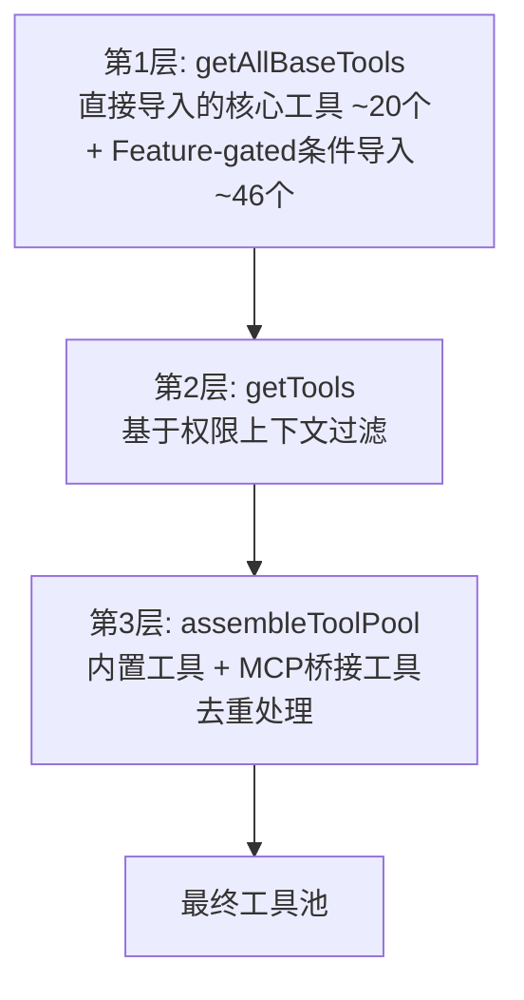
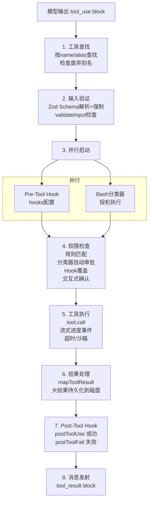
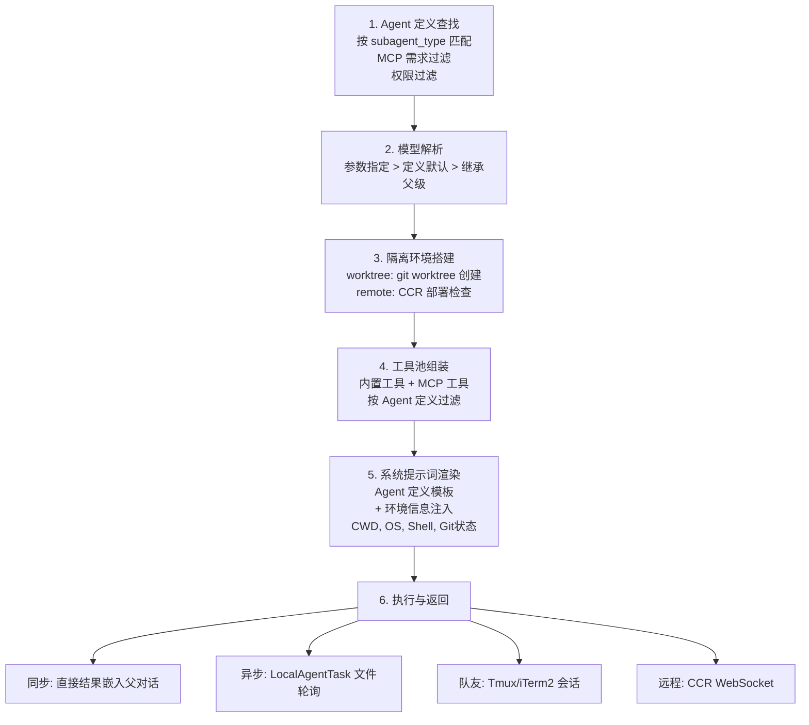
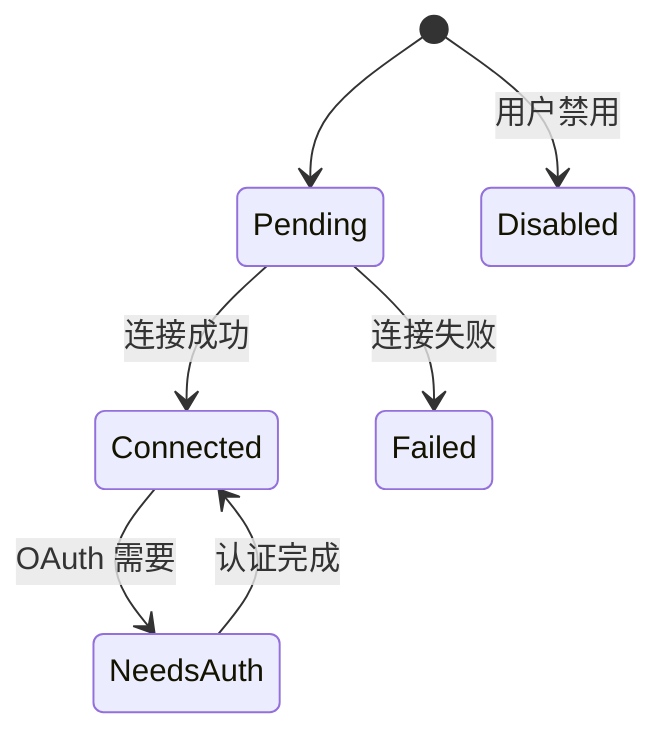

# 第 4 章：工具系统

> 工具系统是 Claude Code 能力的载体。66+ 内置工具 + MCP 扩展 = 无限可能。

Claude Code 的所有能力——文件读写、Shell 命令、代码搜索、子 Agent 派生、MCP 外部服务调用——都通过统一的工具系统暴露给模型。模型不直接操作文件系统或网络，而是通过调用工具来完成一切副作用操作。工具系统是连接"模型智能"与"真实世界"的唯一桥梁。

这套系统的核心架构分为三层：

- **设计层**：`Tool` 泛型接口（`src/Tool.ts`）——定义每个工具必须实现的契约：执行逻辑、输入 Schema、安全语义标记（只读/破坏性/并发安全）、权限检查、UI 渲染
- **组装层**：`getAllBaseTools()` → `getTools()` → `assembleToolPool()`（`src/tools.ts`）——从编译时裁剪到运行时过滤，最终将内置工具和 MCP 工具合并为统一的工具池
- **执行层**：`StreamingToolExecutor`（`src/services/tools/`）——在模型流式输出的同时并发执行工具，处理权限检查、Hook 回调和结果格式化

这种设计带来两个关键优势：新增工具只需实现 `Tool` 接口，无需修改执行流水线或权限系统；安全语义（`isReadOnly`、`isDestructive`）编码为接口方法而非外部配置，确保安全属性与工具实现始终同步。

**本章路线图**：4.1-4.2 介绍接口定义与组装流水线；4.3 列出内置工具全景；4.4-4.5 讲解执行生命周期与并发控制；4.6-4.7 深入分析最复杂的两个工具（BashTool 和 AgentTool）；4.8-4.10 覆盖大结果处理、MCP 集成和延迟加载；4.11-4.12 总结设计洞察与 UI 渲染模式。

## 4.1 Tool 接口定义

上述三层架构的起点是 `Tool` 接口（`src/Tool.ts`）——所有工具（内置、MCP、REPL）的统一契约。这是整个系统最核心的类型之一：

```typescript
export type Tool<Input, Output, P extends ToolProgressData> = {
  // ===== 元数据 =====
  name: string                    // 工具唯一标识
  aliases?: string[]              // 别名（兼容旧名称）
  maxResultSizeChars: number      // 结果最大字符数
  shouldDefer?: boolean           // 是否延迟加载（ToolSearch 动态发现）

  // ===== 核心执行 =====
  call(args, context, canUseTool, parentMessage, onProgress?): Promise<ToolResult<Output>>

  // ===== 提示词与描述 =====
  description(input, options): Promise<string>
  prompt(options): Promise<string>

  // ===== Schema 定义 =====
  inputSchema: Input              // Zod 输入 Schema
  inputJSONSchema?: ToolInputJSONSchema  // JSON Schema（API 兼容）

  // ===== 安全与权限 =====
  isConcurrencySafe(input): boolean   // 是否可并发执行
  isReadOnly(input): boolean          // 是否只读操作
  isDestructive?(input): boolean      // 是否破坏性操作
  validateInput?(input, context): Promise<ValidationResult>
  checkPermissions(input, context): Promise<PermissionResult>

  // ===== UI 渲染（React 组件）=====
  renderToolUseMessage(input, options): React.ReactNode
  renderToolResultMessage?(content, progress, options): React.ReactNode
}
```

每个工具返回的 `ToolResult` 不仅包含数据，还可以注入额外消息或修改上下文：

```typescript
export type ToolResult<T> = {
  data: T                    // 工具输出数据
  newMessages?: Message[]    // 额外注入的消息
  contextModifier?: (ctx) => ToolUseContext  // 上下文修改器
}
```

### buildTool 工厂模式

所有工具的创建都通过 `buildTool()` 工厂函数完成。这个函数将 `TOOL_DEFAULTS` 与工具的自定义定义合并，确保每个工具都有完整的方法集：

```typescript
const TOOL_DEFAULTS = {
  isEnabled: () => true,
  isConcurrencySafe: () => false,    // 默认假定不安全，防止并发问题
  isReadOnly: () => false,           // 默认假定有写入，需要权限检查
  isDestructive: () => false,
  checkPermissions: () => ({ behavior: 'allow', updatedInput }),  // 默认允许
  toAutoClassifierInput: () => '',   // 默认跳过分类器
}

function buildTool<D extends AnyToolDef>(def: D): BuiltTool<D> {
  return {
    ...TOOL_DEFAULTS,
    userFacingName: () => def.name,
    ...def,
  } as BuiltTool<D>
}
```

这是一个经典的 **fail-closed**（默认关闭）安全设计：

- **`isConcurrencySafe: () => false`**：新工具默认不可并发执行。只有经过验证确实安全的工具（如纯读取操作）才显式 opt-in 为 `true`。这避免了新增工具因遗漏并发安全标记而导致竞态条件。
- **`isReadOnly: () => false`**：默认假设工具有写入副作用，因此必须经过权限检查。只读工具（如 GrepTool、GlobTool）显式声明自己为只读以跳过权限弹窗。
- **`toAutoClassifierInput: () => ''`**：默认跳过 ML 分类器的自动审批。这意味着安全相关的工具不会被意外自动批准——必须由工具作者显式提供分类器输入格式。

这种设计确保了：任何新工具在缺少显式配置的情况下，都会走最保守的路径——需要权限、不可并发、不自动批准。

### 工具目录结构

每个工具独立存放在 `src/tools/` 下的同名目录中，遵循统一的文件组织约定：

```
src/tools/FileEditTool/
├── FileEditTool.ts    // 主实现：call(), validateInput(), checkPermissions()
├── UI.tsx             // React 渲染：renderToolUseMessage, renderToolResultMessage
├── types.ts           // Zod inputSchema + TypeScript 类型
├── prompt.ts          // 工具特定的 system prompt 注入内容
├── constants.ts       // 常量定义
└── utils.ts           // 辅助函数（如 diff 生成、引号标准化）
```

这种分离的好处是：
- **关注点分离**：执行逻辑（`.ts`）和渲染逻辑（`UI.tsx`）完全解耦，修改 UI 不影响工具行为
- **Schema 可复用**：`types.ts` 中定义的 Zod Schema 既用于运行时验证，也自动转换为 JSON Schema 发送给 API
- **Prompt 注入**：每个工具可以通过 `prompt.ts` 向系统提示词注入工具特定的使用指南，例如 FileEditTool 注入关于精确匹配的规则

## 4.2 工具注册与组装

`src/tools.ts` 定义了工具从定义到可用的三层组装流水线。这不是一个简单的"注册 + 使用"模式，而是一个带有**编译时裁剪**、**运行时过滤**和**缓存感知排序**的精密管道：



### Layer 1：getAllBaseTools() — 编译时工具裁剪

`getAllBaseTools()`（`src/tools.ts:193-251`）是所有工具的**单一事实来源**。它返回当前构建环境下所有可能可用的工具。

核心工具（约 20 个）通过标准 `import` 直接导入，始终存在：

```typescript
import { BashTool } from './tools/BashTool/BashTool.js'
import { FileReadTool } from './tools/FileReadTool/FileReadTool.js'
import { FileEditTool } from './tools/FileEditTool/FileEditTool.js'
// ... 其他核心工具
```

Feature-gated 工具（约 46 个）通过条件 `require()` 加载：

```typescript
const SleepTool = feature('PROACTIVE') || feature('KAIROS')
  ? require('./tools/SleepTool/SleepTool.js').SleepTool
  : null

const SnipTool = feature('HISTORY_SNIP')
  ? require('./tools/SnipTool/SnipTool.js').SnipTool
  : null
```

这里的 `feature()` 不是运行时函数——它是 **Bun 打包器的编译时宏**。当构建面向外部用户的版本时，`feature('PROACTIVE')` 在编译阶段被求值为 `false`，整个三元表达式被简化为 `const SleepTool = null`，而 `require()` 调用被**死代码消除**（Dead Code Elimination）物理删除。这意味着内部工具不只是"隐藏"——它们在外部构建的二进制文件中根本不存在，从根本上杜绝了通过运行时手段绕过 Feature Gate 的可能。

还有一个有趣的优化：当 `hasEmbeddedSearchTools()` 返回 `true` 时（Anthropic 内部构建将 bfs/ugrep 编译进了 Bun 二进制文件），GlobTool 和 GrepTool 会被排除——因为 shell 别名已经指向了更快的嵌入式实现，专用工具就没有必要了。

### Layer 2：getTools() — 运行时上下文过滤

`getTools()`（`src/tools.ts:271-327`）在运行时根据当前环境和权限上下文过滤工具。它包含四层递进过滤：

**1. SIMPLE 模式**（`CLAUDE_CODE_SIMPLE` 环境变量 / `--bare` 标志）：将工具集削减到最小核心——仅保留 BashTool、FileReadTool、FileEditTool。这是最轻量的工具配置，适用于资源受限或嵌入式场景。当 REPL 模式同时启用时，这三个工具会被替换为 REPLTool（因为 REPL 的 VM 内部已经封装了它们）。

**2. REPL 模式过滤**：当 `isReplModeEnabled()` 为 true 且 REPLTool 可用时，`REPL_ONLY_TOOLS` 集合中的工具（Bash、FileRead、FileEdit 等）从直接工具列表中隐藏。这些工具仍然存在于 REPL VM 的执行上下文中，但模型不能直接调用它们——必须通过 REPL 工具间接使用。

**3. Deny 规则过滤**：`filterToolsByDenyRules()` 检查每个工具是否匹配全局 deny 规则。一个没有 `ruleContent` 的 deny 规则（blanket deny）会完全移除对应工具，使模型在 system prompt 中根本看不到它。对于 MCP 工具，前缀匹配规则如 `mcp__server` 会一次性移除该服务器的所有工具——这是在模型看到工具列表**之前**就完成的，而不是在调用时才检查。

**4. `isEnabled()` 运行时检查**：每个工具的 `isEnabled()` 方法被调用，返回 `false` 的工具被过滤掉。这允许工具根据运行时条件（如依赖是否可用）自行决定是否启用。

### Layer 3：assembleToolPool() — 合并与缓存感知排序

`assembleToolPool()`（`src/tools.ts:345-367`）是最终的组装点，将内置工具和 MCP 工具合并为统一的工具池：

```typescript
export function assembleToolPool(
  permissionContext: ToolPermissionContext,
  mcpTools: Tools,
): Tools {
  const builtInTools = getTools(permissionContext)
  const allowedMcpTools = filterToolsByDenyRules(mcpTools, permissionContext)

  // 分区排序：内置工具作为连续前缀，MCP 工具作为后缀
  const byName = (a: Tool, b: Tool) => a.name.localeCompare(b.name)
  return uniqBy(
    [...builtInTools].sort(byName).concat(allowedMcpTools.sort(byName)),
    'name',
  )
}
```

这段代码有两个关键设计决策：

**分区排序而非全局排序**：内置工具按字母排序形成一个连续的前缀块，MCP 工具按字母排序后追加为后缀块。为什么不直接对所有工具做一次全局排序？因为 API 服务器的缓存策略（`claude_code_system_cache_policy`）在最后一个内置工具之后设置了缓存断点。如果做全局排序，一个名为 `mcp__github__create_issue` 的 MCP 工具会插入到 `GlobTool` 和 `GrepTool` 之间，导致所有下游缓存键失效。分区排序确保添加/移除 MCP 工具只影响后缀部分，内置工具的（更大的）前缀块的缓存始终命中。

**`uniqBy('name')` 内置优先**：当内置工具和 MCP 工具同名时，`uniqBy` 保留首次出现的（即内置工具），因为内置工具在拼接数组中排在前面。这确保了内置工具不会被 MCP 工具意外覆盖。

## 4.3 内置工具清单

Claude Code 包含 **66+ 内置工具**，按功能域分为 6 类。这些分类反映了 coding agent 的核心能力模型：**文件操作**是基础（读写搜索是最高频操作），**Agent 管理与团队协作**支撑多 Agent 执行，**用户交互**和**系统控制**保证人在回路中的控制力，**工具扩展**则把技能、延迟工具加载和 MCP/LSP 外部能力统一纳入扩展出口。工具集的选择原则是"覆盖开发者日常工作流的 95% 场景"——剩下的 5% 通过 BashTool（万能后备）、技能和 MCP 扩展兜底。

| 类别 | 工具 | 说明 |
|------|------|------|
| **文件操作** | BashTool | Shell 命令执行（最复杂的工具） |
| | FileReadTool | 读取文件内容（支持图片、PDF、Jupyter） |
| | FileEditTool | 精确字符串替换编辑（核心编辑工具） |
| | FileWriteTool | 创建/覆盖文件 |
| | GlobTool | 按模式匹配文件 |
| | GrepTool | 正则搜索文件内容（基于 ripgrep） |
| | NotebookEditTool | Jupyter Notebook 编辑 |
| **网络** | WebFetchTool | 获取网页内容 |
| | WebSearchTool | API 驱动的网络搜索 |
| **Agent 管理与团队协作** | AgentTool | 派生子 Agent（多 Agent 架构核心） |
| | TaskOutputTool | 输出任务结果 |
| | TaskStopTool | 停止后台任务 |
| | TaskCreate/Get/Update/ListTool | 任务管理 v2（详见 [第 11 章](15-task-system.md)） |
| | SendMessageTool | Agent 间通信 |
| | TeamCreateTool | 创建 Agent 团队 |
| | TeamDeleteTool | 删除 Agent 团队 |
| | ListPeersTool | 列出同级 Agent |
| **用户交互** | AskUserQuestionTool | 向用户提问 |
| | TodoWriteTool | 管理待办列表 |
| **系统** | EnterPlanModeTool | 进入规划模式 |
| | ExitPlanModeTool | 退出规划模式 |
| | EnterWorktreeTool | 进入 Git Worktree 隔离 |
| | ExitWorktreeTool | 退出 Worktree |
| | BriefTool | 生成简要摘要 |
| | ConfigTool | 配置管理 |
| **工具扩展** | SkillTool | 加载并执行技能 |
| | ToolSearchTool | 搜索并加载延迟工具 |
| | ListMcpResourcesTool | 列出 MCP 资源 |
| | ReadMcpResourceTool | 读取 MCP 资源 |
| | MCPTool | MCP 工具代理 |
| | LSPTool | 语言服务器操作 |

## 4.4 工具执行生命周期

当模型在流式输出中产生一个 `tool_use` block 时，这个调用请求并不会直接执行——它需要经历一条完整的处理流水线。从工具查找、输入验证、权限检查（可能涉及用户交互），到实际执行、结果格式化、再到 Hook 回调，共 8 个阶段。这条流水线对所有工具（内置、MCP、REPL）完全相同，是 4.1 节统一 `Tool` 接口的直接体现。理解这条流水线是理解 Claude Code 安全模型和执行语义的关键。



### 各阶段详解

**Stage 1 - 工具查找**

系统按 `name` 和 `aliases` 匹配工具定义。如果工具是通过已废弃的别名调用的，系统会在 tool_result 中附加一条废弃警告，引导模型在后续调用中使用新名称。如果未找到匹配工具，直接返回错误消息——这在模型幻觉出不存在的工具时会发生。

**Stage 2 - 输入验证**

输入验证分为两个阶段：

```typescript
// Phase 1: Zod Schema 强制转换
// Zod 的 safeParse 不仅验证，还会做类型强制（如字符串数字 → 数字）
const parsed = tool.inputSchema.safeParse(rawInput)
// 如果 Schema 验证失败，格式化错误信息返回给模型

// Phase 2: 业务逻辑验证
// 仅在 Schema 验证通过后执行
const validation = await tool.validateInput(parsed.data, context)
// 返回类型：
// { result: true }                              — 验证通过
// { result: false, message, errorCode }         — 直接拒绝
// { result: false, message, behavior: 'ask' }   — 显示 UI 提示让用户决定
```

两阶段分离的设计确保了：Schema 层做结构验证（字段存在性、类型），业务层做语义验证（如 FileEditTool 检查文件是否存在、FileWriteTool 检查是否已读过文件再写入）。`behavior: 'ask'` 模式允许工具在不确定的情况下把决策权交给用户，而非直接拒绝。

**Stage 3 - 并行启动**

Pre-Tool Hook 和 Bash 分类器**同时启动**，而不是串行等待。这两个操作可能各需要数十到数百毫秒，并行化可以显著降低权限检查的总延迟。

- **Pre-Tool Hook**：执行用户在 `hooks.preToolUse` 中配置的外部脚本，可以返回 `allow`、`deny` 或不干预
- **Bash 分类器**：对 BashTool 调用进行投机性安全分类（判断命令是否只读），结果缓存以供权限检查使用

**Stage 4 - 权限检查**

权限检查是整个流水线中最复杂的阶段，实现在 `checkPermissionsAndCallTool()`（`src/services/tools/toolExecution.ts`）。它涉及多个决策源，按优先级链式求值——一旦某个环节做出明确决定，后续检查即被跳过：

**4a. Hook 权限覆盖（最高优先级）**

如果 Stage 3 的 Pre-Tool Hook 返回了权限决定（`hookPermissionResult`），它直接覆盖所有后续检查。Hook 可以返回三种结果：
- `allow`：跳过所有权限检查，直接执行（例如，企业内部 Hook 自动批准特定命令）
- `deny`：立即拒绝，附带拒绝原因
- 无决策：穿透到下一层检查

**4b. 工具自身的 `checkPermissions()`**

每个工具可以实现自己的权限逻辑。大部分工具使用默认实现（直接返回 `allow`），但 BashTool 的 `bashToolHasPermission()` 是一个 200+ 行的复杂实现（详见 4.6 节）。文件工具会检查路径是否在允许的工作目录范围内。

**4c. 规则匹配**

系统从 **7 个来源**收集权限规则，按优先级排列：

| 来源 | 说明 | 示例 |
|------|------|------|
| `session` | 当前会话中用户的临时授权 | 用户点击"允许一次"时生成 |
| `cliArg` | 命令行参数指定的规则 | `--allowedTools 'Bash(git *)'` |
| `localSettings` | `.claude/settings.local.json` | 不提交到 git 的个人设置 |
| `userSettings` | `~/.claude/settings.json` | 用户级全局设置 |
| `projectSettings` | `.claude/settings.json` | 项目级共享设置 |
| `policySettings` | 组织策略配置 | 企业管理员下发的强制规则 |
| `flagSettings` | 功能标志动态配置 | 服务端远程配置 |

每条规则有三种行为：`allow`（自动批准）、`deny`（自动拒绝）、`ask`（要求交互确认）。规则的 `ruleContent` 支持三种匹配模式：
- **精确匹配**：`Bash(npm install)` 仅匹配完全相同的命令
- **前缀匹配**：`Bash(git commit:*)` 匹配所有以 `git commit` 开头的命令
- **通配符匹配**：`Bash(git *)` 匹配所有以 `git ` 开头的命令

**4d. 投机分类器结果（Bash 专用）**

在 Stage 3 中并行启动的 Bash 分类器此时返回结果。分类器是一个基于语义描述的 LLM 侧查询，用于判断命令是否匹配用户定义的 allow/deny 描述。如果分类器以高置信度判定命令安全（匹配 allow 描述），权限弹窗可以被自动跳过。分类器的结果通过 `pendingClassifierCheck` Promise 异步传递，UI 层可以在展示弹窗前等待它。

**4e. 交互式确认弹窗**

如果以上所有检查都没有做出明确决定（既不是自动允许也不是自动拒绝），用户会看到一个权限确认弹窗。弹窗包含：
- 工具名称和完整输入（如 Bash 命令文本）
- 破坏性命令警告（如果适用，来自 `getDestructiveCommandWarning()`）
- 建议的权限规则（如 `Bash(git commit:*)`），用户可以选择保存以避免未来重复确认
- 三个操作选项：**允许一次**（仅本次）、**始终允许**（保存为规则）、**拒绝**

**4f. 拒绝追踪**

`DenialTrackingState` 跟踪连续权限拒绝。当同一工具或命令模式被多次拒绝后，系统会向对话中注入引导提示，帮助模型理解它应该尝试不同的方法，而不是反复请求被拒绝的操作。这防止了模型陷入"请求权限 → 被拒绝 → 再次请求"的死循环。

**Stage 5 - 工具执行**

`tool.call()` 执行实际操作。关键机制是 `onProgress` 回调——它允许工具在执行过程中实时发射进度消息。例如，BashTool 通过此回调流式传输 stdout/stderr 输出，用户可以实时看到命令的输出而不必等待命令完成。后台任务（`run_in_background: true`）在超时阈值后自动转为异步执行。

**Stage 6 - 结果处理**

`mapToolResultToToolResultBlockParam()` 将工具的内部 `ToolResult` 转换为 API 兼容的 `ToolResultBlockParam` 格式。核心逻辑之一是**大结果处理**：如果结果超过 `maxResultSizeChars`，完整内容保存到磁盘，模型接收到的是文件路径 + 截断指示符（详见 4.8 节）。这避免了一次 grep 搜索结果炸掉整个上下文窗口。

**Stage 7 - Post-Tool Hook**

Post-Tool Hook 分为两个独立事件：

| Hook 事件 | 触发时机 | 脚本接收内容 |
|-----------|----------|--------------|
| `postToolUse` | 工具执行成功时触发 | 工具名称、输入和输出 |
| `postToolFail` | 工具执行失败时触发 | 工具名称、输入和错误详情 |

两者是独立的 Hook 事件，用户可以分别配置不同的处理逻辑。例如，可以在 `postToolUse` 中对 BashTool 的 `git push` 命令发送通知，在 `postToolFail` 中记录失败日志。

### 错误处理与传播

工具执行流水线的错误处理遵循一个核心哲学：**错误是数据，不是异常**。在任何阶段发生的错误都不会导致进程崩溃或对话中断——它们被转换为 `tool_result` 消息（带有 `is_error: true` 标记）返回给模型，让模型可以自我纠正。

各阶段的错误形式：

| 阶段 | 错误类型 | 处理方式 |
|------|---------|---------|
| Schema 验证 | Zod parse 失败（类型错误、缺失字段） | `formatZodValidationError()` 格式化后包裹在 `<tool_use_error>` XML 标签中 |
| 业务验证 | `validateInput()` 返回 `{result: false}` | 返回验证错误消息，附带 `errorCode` |
| 权限拒绝 | 用户点击"拒绝"或规则匹配 deny | 返回 `CANCEL_MESSAGE` 或具体的拒绝原因 |
| 工具执行 | 运行时异常（文件不存在、命令失败等） | try-catch 捕获，`classifyToolError()` 分类后记录遥测 |
| MCP 工具 | `McpToolCallError` 或 `McpAuthError` | Auth 错误触发 OAuth 流程，其他错误返回给模型 |

`classifyToolError()`（`src/services/tools/toolExecution.ts`）的设计值得关注。在 minified 构建中，JavaScript 的 `error.constructor.name` 会被混淆为 `"nJT"` 之类的短标识符，无法用于遥测分析。因此该函数采用了一个鲁棒的分类优先级链：

1. `TelemetrySafeError` 实例 → 使用其 `telemetryMessage`（开发者显式标记为遥测安全的消息）
2. 标准 Error + errno 码 → 返回 `"Error:ENOENT"`、`"Error:EACCES"` 等（Node.js 文件系统错误的稳定标识）
3. Error 实例且 `.name` 长度 > 3（未被 minify） → 使用原始错误名
4. 其他 Error → 返回 `"Error"`
5. 非 Error 值 → 返回 `"UnknownError"`

这种设计确保了遥测数据在任何构建模式下都是可分析的，同时避免泄漏文件路径或代码片段到遥测系统中。

## 4.5 并发控制

工具的并发执行遵循严格的规则：

- **只读工具可并行**：`isReadOnly(input) === true` 的工具（如 FileReadTool、GrepTool、GlobTool）可以同时执行
- **写入工具串行**：`isReadOnly(input) === false` 的工具（如 FileEditTool、BashTool 写命令）必须串行执行
- **并发安全标记**：`isConcurrencySafe(input)` 提供更细粒度的控制

工具编排由 `src/services/tools/toolOrchestration.ts` 的 `runTools()` 函数管理：

```typescript
// 简化的并发逻辑
const readOnlyTools = toolUses.filter(t => findTool(t).isReadOnly(t.input))
const statefulTools = toolUses.filter(t => !findTool(t).isReadOnly(t.input))

// 只读工具并行执行
await Promise.all(readOnlyTools.map(t => executeTool(t)))

// 有状态工具串行执行
for (const tool of statefulTools) {
  await executeTool(tool)
}
```

### StreamingToolExecutor：流式并行执行

上述静态编排策略有一个局限：它必须等待模型**完整输出所有 tool_use blocks** 后才开始执行。而实际上，模型的流式输出需要 5-30 秒，一个 tool_use block 可能在流式输出的前几秒就已完整——何必等到最后？

`StreamingToolExecutor`（`src/services/tools/StreamingToolExecutor.ts`，约 530 行）正是为此设计。它在模型流式输出的同时，一旦检测到完整的 tool_use block，就立即启动执行：

```typescript
// 工具在 StreamingToolExecutor 中经历 4 种状态
type ToolStatus = 'queued' | 'executing' | 'completed' | 'yielded'

// 每个工具的跟踪信息
type TrackedTool = {
  id: string
  block: ToolUseBlock
  assistantMessage: AssistantMessage
  isConcurrencySafe: boolean
  results?: Message[]
  pendingProgress: Message[]    // 进度消息即时发射，不等待最终结果
}
```

并发控制规则直接嵌入执行器内部：

```typescript
// 能否执行一个工具？
private canExecuteTool(isConcurrencySafe: boolean): boolean {
  const executingTools = this.tools.filter(t => t.status === 'executing')
  return (
    executingTools.length === 0 ||
    (isConcurrencySafe && executingTools.every(t => t.isConcurrencySafe))
  )
}
```

规则很简单：如果当前没有工具在执行，任何工具都可以启动；如果有工具在执行，新工具只能在**自身和所有正在执行的工具都标记为并发安全**时才能启动。非并发安全的工具必须独占执行。

时间线对比展示了这种优化的效果：

```
串行执行（等待所有 tool_use 完成后）：
[==========API 流式输出==========][tool1][tool2][tool3]

流式并行执行（StreamingToolExecutor）：
[==========API 流式输出==========]
   [tool1]              ← tool_use_1 完成后立即启动
      [tool2]           ← 利用流式窗口（5-30s）覆盖工具延迟
         [tool3]
[======结果在 API 输出完成时已就绪======]
```

典型场景下，工具执行延迟约 1 秒，而模型流式输出持续 5-30 秒。这意味着大部分工具执行可以完全隐藏在流式窗口内，用户感知的总延迟接近于纯 API 调用时间。

另一个关键设计是 `progressAvailableResolve` 唤醒信号。结果消费者（`getRemainingResults()`）以事件驱动方式工作——当新结果或进度就绪时，执行器通过 resolve Promise 唤醒消费者，避免轮询开销。`pendingProgress` 消息（如 BashTool 的 stdout 流）会被立即发射给 UI，不必等待工具最终完成。

### 分区算法与并发上限

在 StreamingToolExecutor 内部，工具被分为两类执行：

1. **并发安全工具**（`isConcurrencySafe: true`）：可以与其他并发安全工具同时执行。典型例子是 FileReadTool、GrepTool、GlobTool——它们只读取数据，不会互相干扰。
2. **非并发安全工具**：必须独占执行，在它运行期间不能有其他工具同时执行。FileEditTool、BashTool 的写操作属于此类。

执行器的调度逻辑基于一个简单规则：**当前没有工具在执行时，任何工具都可以启动；当有工具在执行时，新工具只能在"自身和所有正在执行的工具都是并发安全"的条件下启动**。一旦遇到非并发安全工具，队列处理暂停，等待当前所有执行中的工具完成后，非并发安全工具独占运行。

即使在并行执行场景下，并发数也有硬性上限：`MAX_TOOL_USE_CONCURRENCY = 10`（可通过 `CLAUDE_CODE_MAX_TOOL_USE_CONCURRENCY` 环境变量配置）。这防止了模型一次发出 20 个 FileReadTool 调用时导致的文件句柄耗尽或 I/O 竞争。

此外，StreamingToolExecutor 还实现了**兄弟取消机制**（`siblingAbortController`）：当一个 Bash 工具执行出错时，它会取消同批次中其他正在执行的工具。这避免了"第一个命令失败但后续命令继续执行"的问题。非 Bash 工具（如 FileReadTool、WebFetchTool）的错误则不会级联——它们的失败通常是独立的，不影响兄弟工具。

结果的发射顺序始终与工具在模型输出中的出现顺序一致（FIFO），即使后面的工具先完成。这确保了消息流的确定性和可预测性。

## 4.6 BashTool 深度解析

BashTool 是整个工具系统中最复杂的工具——它的实现分布在 18 个源文件中（`src/tools/BashTool/` 目录），涵盖安全验证、权限管理、沙箱隔离、命令语义解析等多个子系统。这种复杂性源于一个根本矛盾：**Shell 是最强大的工具**（几乎可以做任何事），但也是**最危险的工具**（一条恶意命令可以删除整个文件系统）。

BashTool 的输入 Schema：

```typescript
{
  command: string              // Shell 命令
  timeout?: number             // 超时（毫秒）
  description?: string         // 活动描述（UI 展示）
  run_in_background?: boolean  // 异步执行
  dangerouslyDisableSandbox?: boolean  // 禁用沙箱
}
```

### 4.6.1 安全验证（bashSecurity.ts）

安全验证是 BashTool 的第一道防线，在权限检查之前执行。`bashSecurity.ts` 约 800 行代码，实现了 **23 个命名安全检查**（通过 `BASH_SECURITY_CHECK_IDS` 常量映射为数字 ID，避免在遥测日志中记录可变字符串）：

```typescript
const BASH_SECURITY_CHECK_IDS = {
  INCOMPLETE_COMMANDS: 1,        // 不完整的命令片段
  JQ_SYSTEM_FUNCTION: 2,        // jq 的 system() 函数调用
  JQ_FILE_ARGUMENTS: 3,         // jq 文件参数限制
  OBFUSCATED_FLAGS: 4,          // 混淆的命令标志
  SHELL_METACHARACTERS: 5,      // Shell 元字符
  DANGEROUS_VARIABLES: 6,       // 管道/重定向中的危险变量
  NEWLINES: 7,                  // 未引用内容中的换行符
  DANGEROUS_PATTERNS_COMMAND_SUBSTITUTION: 8,  // 命令替换
  DANGEROUS_PATTERNS_INPUT_REDIRECTION: 9,     // 输入重定向
  DANGEROUS_PATTERNS_OUTPUT_REDIRECTION: 10,   // 输出重定向
  IFS_INJECTION: 11,            // IFS 变量注入
  GIT_COMMIT_SUBSTITUTION: 12,  // git commit 中的替换
  PROC_ENVIRON_ACCESS: 13,      // /proc/self/environ 访问
  MALFORMED_TOKEN_INJECTION: 14, // 畸形 token 注入
  BACKSLASH_ESCAPED_WHITESPACE: 15, // 反斜杠转义空白
  BRACE_EXPANSION: 16,          // 花括号展开
  CONTROL_CHARACTERS: 17,       // 控制字符
  UNICODE_WHITESPACE: 18,       // Unicode 空白同形字
  MID_WORD_HASH: 19,            // 词中 # 注释攻击
  ZSH_DANGEROUS_COMMANDS: 20,   // Zsh 危险命令
  BACKSLASH_ESCAPED_OPERATORS: 21, // 反斜杠转义运算符
  COMMENT_QUOTE_DESYNC: 22,     // 注释-引号脱同步攻击
  QUOTED_NEWLINE: 23,           // 引号内换行符
}
```

**命令替换阻断**是最关键的防御。`COMMAND_SUBSTITUTION_PATTERNS` 数组包含 11 种模式，覆盖了所有已知的命令替换形式：

```typescript
const COMMAND_SUBSTITUTION_PATTERNS = [
  { pattern: /<\(/, message: 'process substitution <()' },
  { pattern: />\(/, message: 'process substitution >()' },
  { pattern: /=\(/, message: 'Zsh process substitution =()' },
  // Zsh EQUALS 展开：=curl evil.com → /usr/bin/curl evil.com
  // 绕过 Bash(curl:*) deny 规则，因为解析器看到的基命令是 =curl 而非 curl
  { pattern: /(?:^|[\s;&|])=[a-zA-Z_]/, message: 'Zsh equals expansion (=cmd)' },
  { pattern: /\$\(/, message: '$() command substitution' },
  { pattern: /\$\{/, message: '${} parameter substitution' },
  { pattern: /\$\[/, message: '$[] legacy arithmetic expansion' },
  { pattern: /~\[/, message: 'Zsh-style parameter expansion' },
  { pattern: /\(e:/, message: 'Zsh-style glob qualifiers' },
  { pattern: /\(\+/, message: 'Zsh glob qualifier with command execution' },
  { pattern: /\}\s*always\s*\{/, message: 'Zsh always block (try/always construct)' },
  { pattern: /<#/, message: 'PowerShell comment syntax' },  // 纵深防御
]
```

这些模式中有几个特别值得注意：

- **Zsh equals 展开**（`=curl`）：在 Zsh 中，`=cmd` 会展开为 `cmd` 的完整路径（等同于 `$(which cmd)`）。攻击者可以用 `=curl evil.com` 绕过 `Bash(curl:*)` 的 deny 规则，因为权限系统解析到的基命令是 `=curl` 而不是 `curl`。
- **Zsh glob qualifiers**（`(e:` 和 `(+`）：Zsh 的 glob 限定符可以在文件名匹配过程中执行任意代码——这是一个常被忽略的代码执行向量。
- **PowerShell 注释语法**（`<#`）：虽然 Claude Code 不在 PowerShell 中执行命令，但作为纵深防御，以防未来引入 PowerShell 执行路径。

为了避免误报（例如在字符串字面量 `echo '$(...)'` 中错误地检测到命令替换），安全验证器使用 `extractQuotedContent()` 函数先剥离引号内的内容。这个函数逐字符迭代，跟踪单引号/双引号状态，产出三种变体：`withDoubleQuotes`（仅剥离单引号内容）、`fullyUnquoted`（剥离所有引号内容）、`unquotedKeepQuoteChars`（内容剥离但保留引号字符本身，用于检测引号邻接）。

**Zsh 危险命令**同样有专门的防御。`ZSH_DANGEROUS_COMMANDS` 集合包含 18 个命令：

- **`zmodload`**：Zsh 模块加载器，是多种攻击的入口——`zsh/mapfile`（通过数组赋值进行不可见的文件 I/O）、`zsh/zpty`（伪终端命令执行）、`zsh/net/tcp`（`ztcp` 网络数据外泄）、`zsh/files`（内置 `rm/mv/ln/chmod` 绕过二进制检查）
- **`emulate -c`**：一个等效于 `eval` 的结构，可以执行任意代码
- **`sysopen`/`sysread`/`syswrite`/`sysseek`**：细粒度文件描述符操作（来自 `zsh/system` 模块）
- **`zf_*` 内置命令**（`zf_rm`、`zf_mv`、`zf_ln`、`zf_chmod` 等）：`zsh/files` 模块提供的内置文件操作，绕过了对外部二进制的权限检查

**Tree-sitter AST 解析**提供了结构化的命令分析能力。当 tree-sitter-bash 可用时，`parseCommandRaw()` 将命令解析为 AST，`parseForSecurityFromAst()` 从中提取 `SimpleCommand[]`（已解析引号的简单命令列表）。如果 AST 分析发现命令结构过于复杂（包含命令替换、展开、复杂控制流），它返回 `'too-complex'`，触发 `ask` 行为——即要求用户确认。当 tree-sitter 不可用时（如某些平台），系统回退到基于正则的遗留解析路径。`checkSemantics()` 函数在 AST 级别进行语义验证，检查即使语法合法但语义危险的命令。

### 4.6.2 多层权限系统（bashPermissions.ts）

`bashToolHasPermission()`（`src/tools/BashTool/bashPermissions.ts`）是整个代码库中最复杂的权限函数，实现了以下分层处理：

**第 1 步：AST 解析与复杂度判断**

首先尝试使用 tree-sitter 解析命令。解析结果分为三种：
- `'simple'`：命令结构简单，可以按子命令逐一检查
- `'too-complex'`：包含复杂结构（嵌套替换、管道链等），无法保证安全——跳过详细分析，直接进入 `ask` 路径
- `'parse-unavailable'`：tree-sitter 不可用，回退到遗留的 `splitCommand_DEPRECATED()` 正则拆分

**第 2 步：子命令拆分与上限保护**

复合命令（`cmd1 && cmd2 || cmd3`）被拆分为子命令数组，每个子命令独立检查。为防止 CPU 耗尽（恶意构造的复合命令可能导致正则拆分产生指数级增长的子命令），拆分数量设有硬性上限：

```typescript
export const MAX_SUBCOMMANDS_FOR_SECURITY_CHECK = 50
```

超过 50 个子命令时，系统放弃逐一分析，直接返回 `ask`——这是一个安全的回退：无法证明安全的就让用户决定。

**第 3 步：安全环境变量剥离**

在匹配权限规则之前，命令前面的安全环境变量赋值会被剥离。例如 `NODE_ENV=prod npm run build` 中的 `NODE_ENV=prod` 被移除，剩下 `npm run build` 用于规则匹配。`SAFE_ENV_VARS` 集合包含 26 个已知安全的变量（Go 系列如 `GOEXPERIMENT`/`GOOS`/`GOARCH`，Rust 系列如 `RUST_BACKTRACE`/`RUST_LOG`，Node 的 `NODE_ENV`，locale 变量如 `LANG`/`LC_ALL` 等）。

为什么要区分安全和不安全的环境变量？因为 `MY_VAR=val command` 中的 `MY_VAR` 可能影响命令行为（如 `LD_PRELOAD=evil.so curl`），不能无条件剥离。但 `NODE_ENV=prod` 是无害的，如果不剥离，用户设置的 `Bash(npm run:*)` 规则就无法匹配到 `NODE_ENV=prod npm run build`。

**第 4 步：前缀提取与规则建议**

`getSimpleCommandPrefix()` 从命令中提取稳定的 2 词前缀用于可复用的权限规则。例如：

| 命令 | 提取的前缀 | 建议的规则 |
|------|-----------|-----------|
| `git commit -m "fix typo"` | `git commit` | `Bash(git commit:*)` |
| `npm run build` | `npm run` | `Bash(npm run:*)` |
| `NODE_ENV=prod npm run build` | `npm run`（剥离安全环境变量后） | `Bash(npm run:*)` |
| `ls -la` | `null`（`-la` 是标志不是子命令） | 仅提供精确匹配规则 |
| `bash -c "rm -rf /"` | `null`（`bash` 被阻止生成前缀规则） | 不建议前缀规则 |

注意最后一行：`bash`、`sh`、`sudo`、`env` 等裸 shell 前缀被显式阻止生成前缀规则，因为 `Bash(bash:*)` 等同于 `Bash(*)`——这会意外允许所有命令。

**第 5 步：复合命令权限聚合**

对于复合命令，所有子命令必须独立通过权限检查。任一子命令被 deny 则整体 deny，任一子命令需要 ask 则整体 ask。建议规则的数量有上限：

```typescript
export const MAX_SUGGESTED_RULES_FOR_COMPOUND = 5
```

超过 5 条时，权限弹窗退化为"similar commands"描述，而非列出每一条。这避免了用户在一条 `&&` 链中保存 10+ 条规则的混乱体验。

### 4.6.3 沙箱模式（shouldUseSandbox.ts）

BashTool 支持在沙箱中执行命令，限制文件系统访问、网络和进程能力。沙箱决策逻辑（`shouldUseSandbox()`）在以下条件下返回 `false`（不使用沙箱）：

1. `SandboxManager.isSandboxingEnabled()` 返回 `false`（全局禁用）
2. 命令设置了 `dangerouslyDisableSandbox: true` 且策略允许绕过
3. 命令匹配用户配置的 `excludedCommands` 排除列表

平台支持：macOS 使用 `sandbox-exec` 配置文件，Linux 使用 bubblewrap（bwrap）提供类 landlock 的限制。排除命令的处理涉及复合命令拆分、环境变量剥离和通配符匹配——与权限系统共享相同的命令解析基础设施。

### 4.6.4 sed 验证（sedValidation.ts）

`sed` 命令有专门的验证层，防止它被用作绕过 FileEditTool 权限的后门。验证采用**白名单策略**——只有已知安全的模式被自动批准：

**安全模式 1：纯行打印**（必须有 `-n` 标志）
- `sed -n '5p'`（打印第 5 行）
- `sed -n '1,10p'`（打印 1-10 行）
- `sed -n '1p;5p;10p'`（打印多个指定行）

**安全模式 2：替换表达式**
- `sed 's/foo/bar/g'`（替换操作，但 flags 仅允许 `g`/`p`/`i`/`I`/`m`/`M`/`1-9`）

**被阻断的危险操作**：
- `w`/`W` 标志（文件写入）
- `e`/`E` 标志（命令执行——`sed` 可以通过 `e` 标志执行 shell 命令！）
- `!`（地址取反）
- `{}` 块（sed 脚本块）
- 非 ASCII 字符（Unicode 同形字检测）
- 反斜杠分隔符 `s\`（潜在的解析混淆）

当 sed 命令包含文件参数（如 `sed -i 's/foo/bar/' file.txt`）时，`-i`（in-place 编辑）标志必须明确存在，且需要文件写入权限。纯读模式下的 sed 不允许操作文件参数。

### 4.6.5 路径验证与破坏性命令警告

**路径验证**（`pathValidation.ts`）对涉及文件路径的命令（`cd`、`rm`、`mv`、`cp`、`cat`、`grep` 等约 24 类命令）提取路径参数并验证其是否在允许的工作目录范围内。不同命令有不同的路径提取规则——`cd` 将所有参数拼接为一个路径，`find` 收集第一个非全局标志之前的路径，`grep`/`rg` 在解析完 pattern 参数后收集文件路径。所有命令都尊重 POSIX 的 `--` 分隔符（之后的所有参数都是位置参数而非标志）。

对于危险的删除路径（`rm -rf /`、`rm -rf ~`），无论用户有什么已保存的规则，都始终需要显式批准——这是一个不可覆盖的安全硬限制。

**破坏性命令警告**（`destructiveCommandWarning.ts`）是一个纯信息层——它不影响权限决策，只在权限弹窗中显示额外警告。检测的模式包括：

| 类别 | 模式 | 警告消息 |
|------|------|---------|
| Git 数据丢失 | `git reset --hard` | "may discard uncommitted changes" |
| Git 历史覆写 | `git push --force` / `-f` | "may overwrite remote history" |
| Git 安全旁路 | `--no-verify` | "may skip safety hooks" |
| Git 提交覆写 | `git commit --amend` | "may rewrite the last commit" |
| 递归强制删除 | `rm -rf` | "may recursively force-remove files" |
| 数据库 | `DROP TABLE` / `TRUNCATE` | "may drop or truncate database objects" |
| 数据库 | `DELETE FROM table;`（无 WHERE） | "may delete all rows" |
| 基础设施 | `kubectl delete` | "may delete Kubernetes resources" |
| 基础设施 | `terraform destroy` | "may destroy Terraform infrastructure" |

### 4.6.6 后台任务管理

BashTool 支持两种后台执行模式：

**显式后台化**：模型在参数中设置 `run_in_background: true`，命令从一开始就作为 `LocalShellTask` 异步执行。输出流式写入任务输出文件，模型可通过 `TaskGetTool` 轮询结果。

**自动后台化**：在助手模式（长时间运行的对话）下，阻塞命令在 **15 秒**（`ASSISTANT_BLOCKING_BUDGET_MS = 15_000`）后自动转为后台执行。系统调用 `backgroundExistingForegroundTask()` 将前台任务移至后台，释放主循环继续处理。这防止了一个长时间运行的 `npm install` 或 `make build` 阻塞整个对话。

### 4.6.7 命令语义（commandSemantics.ts）

BashTool 不只是机械地检查退出码——它理解不同命令的**语义约定**。标准 Unix 约定中，退出码 0 = 成功，非 0 = 失败，但这并不普适：

| 命令 | 退出码 0 | 退出码 1 | 退出码 2+ |
|------|---------|---------|----------|
| `grep` | 找到匹配 | **无匹配**（不是错误） | 真正的错误 |
| `rg` | 找到匹配 | **无匹配**（不是错误） | 真正的错误 |
| `diff` | 无差异 | **有差异**（不是错误） | 真正的错误 |
| `test` / `[` | 条件为真 | **条件为假**（不是错误） | 语法错误 |
| `find` | 成功 | 部分成功（某些目录不可访问） | 真正的错误 |

`interpretCommandResult()` 根据命令名查表解读退出码，避免模型将 `grep` 的"无匹配"误判为执行失败而发起不必要的重试。

### 4.6.8 命令分类（UI 展示）

BashTool 还维护了一个命令分类系统，用于 UI 中的折叠显示。`isSearchOrReadBashCommand()` 函数分析管道中的每个部分，只有当**所有部分**都是搜索/读取命令时才标记为可折叠：

| 类别 | 命令 | UI 行为 |
|------|------|---------|
| 搜索 | find, grep, rg, ag, ack, locate, which, whereis | 折叠为"Searched..." |
| 读取 | cat, head, tail, less, more, wc, stat, file, jq, awk, cut, sort, uniq, tr | 折叠为"Read..." |
| 列表 | ls, tree, du | 折叠为"Listed..." |
| 语义中性 | echo, printf, true, false, `:` | 跳过（不影响管道分类） |

语义中性命令在管道分类中被跳过——例如 `ls dir && echo "---" && ls dir2` 仍然被视为读取操作（而非因为 `echo` 而变成不可折叠）。

## 4.7 AgentTool 深度解析

AgentTool 负责派生子 Agent，是多 Agent 架构的核心：

```typescript
{
  description: string          // 3-5 词任务描述
  prompt: string               // 子 Agent 任务指令
  subagent_type?: string       // 专用 Agent 类型
  model?: 'sonnet' | 'opus' | 'haiku'
  run_in_background?: boolean  // 异步执行
  name?: string                // 可寻址的队友名称
  isolation?: 'worktree' | 'remote'  // 隔离模式
}
```

### 子 Agent 生命周期

子 Agent 从创建到执行经历 6 个阶段，每个阶段都有精确的决策逻辑：



**Stage 1 - Agent 定义查找**：如果提供了 `subagent_type`，系统按类型名匹配预定义的 Agent 定义（如 `coder`、`researcher`）。匹配时还会检查 Agent 定义所需的 MCP 服务是否可用、当前权限模式是否允许。未匹配到定义时使用通用默认配置。

**Stage 2 - 模型解析**：模型选择遵循三级优先级链。调用参数中的 `model` 字段优先级最高；其次是 Agent 定义中的默认模型；最后继承父 Agent 当前使用的模型。这种设计允许开销敏感的任务使用 `haiku`，复杂任务升级到 `opus`。

**Stage 3 - 隔离环境搭建**：`worktree` 模式通过 `git worktree add` 创建独立工作树，子 Agent 在隔离的文件系统视图中工作，避免与父 Agent 的文件编辑冲突。`remote` 模式检查 CCR（Claude Code Remote）环境可用性，准备远程部署。

**Stage 4 - 工具池组装**：子 Agent 的工具池不一定与父 Agent 相同。Agent 定义可以指定工具白名单/黑名单，例如 `researcher` 类型可能只获得只读工具。MCP 工具根据 Agent 定义的需求进行过滤。

**Stage 5 - 系统提示词渲染**：将 Agent 定义中的提示词模板与环境信息合并。注入内容包括：当前工作目录、操作系统类型、Shell 类型、Git 仓库状态等。这确保子 Agent 对执行环境有准确的认知。

**Stage 6 - 执行与返回**：根据调用方式分为四种模式：
- **同步**：子 Agent 在当前进程内直接执行，结果嵌入父对话的 tool_result 中
- **异步**：创建 `LocalAgentTask`，子 Agent 将结果写入临时文件，父 Agent 通过 `TaskGetTool` 轮询获取
- **队友**：通过 Tmux 或 iTerm2 创建新的终端会话，子 Agent 作为独立进程并行工作，可通过 `SendMessageTool` 通信
- **远程**：通过 CCR 创建远程执行环境，返回 WebSocket URL，结果异步回传

## 4.8 大结果处理机制

当工具输出超过 `maxResultSizeChars`，Claude Code 不会将全部内容注入对话上下文：

1. 将完整结果保存到 `~/claude-code/tool-results/` 目录
2. 模型接收：文件路径预览 + 截断指示符
3. 模型可通过 FileReadTool 按需读取完整内容

这避免了上下文膨胀，同时保持完整数据的可达性。

### 各工具的典型阈值

不同工具的 `maxResultSizeChars` 根据其输出特征设定：

| 工具类型 | 典型阈值范围 | 说明 |
|---------|------------|------|
| BashTool | ~100K 字符 | Shell 命令输出可能非常大（如 `find /`） |
| GrepTool | ~100K 字符 | 大范围搜索可能匹配数千行 |
| FileReadTool | ~200K 字符 | 大文件按需分页读取 |
| WebFetchTool | ~100K 字符 | 网页内容长度不可控 |

### MCP 工具的大结果处理

MCP 工具的输出有额外处理：二进制 blob（如图片、PDF）超过 **25KB** 时，自动保存到 `.claude/mcp-outputs/` 目录。模型接收到文件路径引用而非内联的 base64 编码数据。这对于处理 MCP 服务端返回的截图、文档等二进制内容尤为重要。

整体设计遵循"按需读取"模式（on-demand read pattern）：模型先看到结果的摘要和位置信息，只在需要详细数据时才通过 FileReadTool 主动拉取。这将一次性的上下文爆炸转化为可控的增量读取。

> **设计决策：工具结果的三级大小限制**
>
> 源码中定义了三个递进的限制层（`src/constants/toolLimits.ts`）：
> - **`DEFAULT_MAX_RESULT_SIZE_CHARS = 50,000`**：单个工具结果的默认上限，超过则持久化到磁盘
> - **`MAX_TOOL_RESULT_TOKENS = 100,000`**（约 400KB）：绝对上限，任何工具都不能超过
> - **`MAX_TOOL_RESULTS_PER_MESSAGE_CHARS = 200,000`**：单条消息中所有工具结果的聚合上限
>
> 为什么需要三级？因为并发工具执行时，5 个工具各返回 50K 字符的结果就是 250K——超过单消息限制。聚合上限确保即使多个工具并发返回大结果，注入到对话中的总数据量也不会让上下文窗口失控。

## 4.9 MCP 工具集成

MCP（Model Context Protocol）工具通过桥接层无缝集成到 Claude Code 的工具系统中。

### 桥接工具

| Claude Code 工具 | MCP 功能 |
|-----------------|---------|
| MCPTool | 调用单个 MCP 工具 |
| ListMcpResourcesTool | 列出 MCP 资源 |
| ReadMcpResourceTool | 读取 MCP 资源内容 |
| createMcpAuthTool() | OAuth 认证处理 |

### 7 种传输机制

```typescript
type McpTransport =
  | 'stdio'          // 标准输入/输出（子进程 MCP 服务端）
  | 'sse'            // Server-Sent Events（HTTP 流式）
  | 'sse-ide'        // SSE 变体（IDE 扩展）
  | 'http'           // HTTP 传输（StreamableHTTPClientTransport）
  | 'ws'             // WebSocket（双向实时）
  | 'sdk'            // SDK 原生传输（进程内，SdkControlTransport）
  | 'claudeai-proxy' // Claude.ai 代理服务端
```

### 连接状态机



客户端实例被 memoized，避免重复初始化。HTTP 404 + JSON-RPC -32001 检测会话过期。

### OAuth 支持

MCP 集成支持三阶段 OAuth：
1. **标准 OAuth 2.0 + PKCE**：自动 Token 轮换，30 秒超时
2. **跨应用访问（XAA）via OIDC**：企业 IdP 集成，一次登录多个 MCP 服务端
3. **Token 验证**：主动刷新接近过期的 Token，macOS Keychain 缓存

### 配置与作用域

```json
{
  "mcpServers": {
    "my-server": {
      "command": "node",
      "args": ["my-mcp-server.js"]
    },
    "remote-server": {
      "url": "https://api.example.com/mcp"
    }
  }
}
```

MCP 服务端配置支持 7 种作用域：local / user / project / dynamic / enterprise / claudeai / managed。

MCP 工具在 `assembleToolPool()` 阶段与内置工具合并，经过去重处理后统一注册。大输出（二进制 blob > 25KB）自动保存到 `.claude/mcp-outputs/`。

> **设计决策：为什么 MCP 适合 Agent 生态？**
>
> MCP 的核心设计思想是**协议而非 SDK**——任何语言、任何进程都可以实现 MCP 服务端，只要遵循 JSON-RPC 协议。这与 Claude Code 的工具系统形成了天然互补：内置工具是"深度集成"（直接访问进程内状态），MCP 工具是"广度扩展"（连接外部能力）。7 种传输机制的存在反映了现实世界的多样性——本地工具用 stdio（零网络开销），远程服务用 HTTP/WebSocket（支持认证和断线重连），IDE 插件用 SSE-IDE（适配 VS Code 的进程模型）。配置的 7 层作用域（从本地到企业）则确保了不同组织规模下的管理需求都能被满足。

## 4.10 工具搜索与延迟加载

并非所有 66+ 工具都会在每次 API 调用时发送给模型。`ToolSearchTool` 支持**延迟加载**：

- `shouldDefer: true` 的工具不会在初始工具列表中出现
- 模型可以调用 `ToolSearch` 搜索并动态加载需要的工具
- 工具的 `searchHint` 字段提供搜索提示

这减少了系统提示词的大小，提高了提示词缓存命中率。

### searchHint 字段

每个可延迟加载的工具都可以定义 `searchHint` 字符串，用于提高工具被发现的概率。例如，一个 Jupyter Notebook 编辑工具可能设置 `searchHint: "notebook jupyter ipynb cell"`。当模型调用 `ToolSearch` 时，搜索算法同时匹配工具名称、描述和 `searchHint`。

### ToolSearchTool 查询语法

ToolSearchTool 支持三种查询模式：

| 语法 | 说明 | 示例 |
|------|------|------|
| `"select:Name1,Name2"` | 精确选择——按名称直接加载指定工具 | `"select:Read,Edit,Grep"` |
| `"关键词1 关键词2"` | 关键词搜索——返回最匹配的 N 个工具 | `"notebook jupyter"` |
| `"+前缀 关键词"` | 名称前缀约束——要求工具名包含前缀，再按关键词排序 | `"+slack send"` |

`select:` 模式最常用，当模型已经知道需要哪个工具时直接按名称加载，零搜索开销。关键词模式适用于探索性场景，如"我需要一个处理数据库的工具"。

### 对提示词缓存的影响

延迟加载的核心价值不仅是减小提示词体积，更重要的是**稳定缓存键（cache key）**。API 请求中的 `tools` 数组是缓存键的一部分——如果每次请求发送的工具集不同，缓存就会失效。通过将不常用的工具延迟加载，初始工具列表在大部分对话轮次中保持不变，从而获得更高的 prompt cache 命中率，节省 Token 开销并降低延迟。

## 4.11 设计洞察

**1. 统一接口的力量**

所有工具——无论是直接访问进程内状态的内置工具、通过 JSON-RPC 连接的 MCP 工具、还是运行在独立 VM 中的 REPL 工具——都共享同一个 `Tool<Input, Output, P>` 泛型接口。这意味着执行流水线（输入验证 → 权限检查 → Hook → 执行 → 结果处理）对所有工具完全相同。新增一个 MCP 服务端不需要修改任何执行逻辑，只需要实现 `call()` 并提供 `inputSchema`。这种统一性是 Claude Code 能够在不增加系统复杂度的前提下从 20 个工具扩展到 66+ 个工具的关键。

**2. 安全语义编码为类型**

`isReadOnly`、`isDestructive`、`isConcurrencySafe` 不只是布尔标记——它们是参与运行时决策的**活跃方法**。`isReadOnly(input)` 接收工具输入作为参数，这意味着同一工具对不同输入可以有不同的安全语义。例如，BashTool 对 `ls` 返回 `isReadOnly: true`，对 `rm` 返回 `false`。这种细粒度的输入感知安全标记让并发调度器和权限系统能做出更精确的决策，而非对整个工具一刀切。

**3. 渲染即工具**

每个工具自带 React 渲染方法（`renderToolUseMessage`、`renderToolResultMessage` 等），而非由统一的渲染器根据工具类型分发。这种"自描述渲染"设计意味着工具最了解自己的输入输出应该如何展示——FileEditTool 渲染带颜色的 diff，BashTool 渲染带退出码的终端输出，GrepTool 渲染带行号的搜索结果。新增工具时只需实现自己的 `UI.tsx`，不需要修改任何全局渲染逻辑。

**4. Feature Gate 的编译时裁剪**

通过 Bun 的 `feature()` 编译时宏和死代码消除，外部构建从物理上不包含内部工具的代码。这不是运行时的 `if (isInternal)` 检查（可以被绕过），而是编译产物中完全不存在相关代码——逆向工程也无法恢复。

**5. Fail-closed 安全默认值**

`TOOL_DEFAULTS` 中 `isConcurrencySafe: () => false` 和 `isReadOnly: () => false` 的选择源于**失败模式的不对称性**。如果一个工具实际上是只读的但被标记为非只读（忘记 opt-in），后果是用户收到不必要的权限弹窗——烦人但安全。反过来，如果一个有写入副作用的工具被错误标记为只读（忘记 opt-out），后果是它可能在没有权限检查的情况下与其他写入工具并发执行，导致数据损坏——危险且隐蔽。这种不对称性决定了默认值必须选择"安全但可能过度限制"的方向。

**6. 纵深防御的分层验证**

BashTool 的安全不依赖任何单一防线。它有 7+ 层重叠的安全机制：Tree-sitter AST 解析、正则模式匹配、引用内容提取、路径约束验证、sed 白名单验证、沙箱隔离、权限规则系统。每一层都有已知的局限性（正则可以被精心构造的输入绕过、tree-sitter 可能不可用、沙箱可能不被平台支持），但设计哲学是：**任何单层都可以失败，但攻击者需要同时绕过所有层才能成功**。这使得利用难度呈指数级增长。

**7. Prompt Cache 稳定性作为架构约束**

多个看似无关的设计决策实际上都被同一个"隐形"约束驱动——prompt cache 命中率：
- `assembleToolPool()` 的分区排序（防止 MCP 工具变动污染内置工具的缓存键）
- `backfillObservableInput()` 只修改 UI 层的浅拷贝而非 API 输入（防止修改消息内容导致缓存失效）
- `ToolSearch` 延迟加载（稳定初始工具列表，避免每次请求发送不同的工具集）

缓存未命中意味着 API 需要重新处理数千个 token 的系统提示词，增加延迟和成本。这个经济学约束深刻地塑造了架构，但不阅读多个组件很难察觉到。

## 4.12 工具 UI 渲染模式

每个工具不仅定义执行逻辑，还自带完整的 UI 渲染能力。这是"渲染即工具"设计理念的体现——工具最了解自己的输入输出应该如何展示。

### 渲染方法一览

每个工具可以定义 4-6 个 React 渲染方法：

| 方法 | 用途 | 触发时机 |
|------|------|---------|
| `renderToolUseMessage()` | 渲染工具调用过程 | 模型发出 tool_use 时 |
| `renderToolResultMessage()` | 渲染工具执行结果 | 工具完成执行后 |
| `renderToolUseRejectedMessage()` | 渲染权限拒绝信息 | 用户拒绝权限请求时 |
| `renderToolUseErrorMessage()` | 渲染错误信息 | 工具执行出错时 |
| `renderGroupedToolUse()` | 合并渲染多个同类调用 | 同类型工具连续调用时 |

### renderGroupedToolUse：批量合并渲染

当模型连续调用多个相同类型的工具（如连续 5 个 `FileReadTool`），逐个渲染会占据大量终端空间。`renderGroupedToolUse()` 方法将这些调用合并为一个紧凑的视图：

```
📖 Read 5 files: src/agent.ts, src/tools.ts, src/cli.ts, ...
```

而非：

```
📖 Read src/agent.ts
📖 Read src/tools.ts
📖 Read src/cli.ts
📖 Read src/prompt.ts
📖 Read src/session.ts
```

这不仅节省屏幕空间，也让用户更容易理解模型的意图——"它在批量阅读文件"而非"它在一个一个读文件"。

### backfillObservableInput：输入回填

工具输入在到达 UI 之前会经过 `backfillObservableInput()` 处理。这个方法在**不修改发送给 API 的实际输入**的前提下，为 UI 观察者扩展输入信息。

典型例子：模型调用 FileEditTool 时只传入相对路径 `src/agent.ts`，但 UI 展示时需要完整路径 `/home/user/project/src/agent.ts`。`backfillObservableInput()` 将 CWD 补全到路径中供 UI 使用，但 API 侧的 `tool_use` block 保持原样。

为什么不直接修改 API 输入？因为 **prompt cache 稳定性**。API 请求中的消息内容是缓存键的一部分，任何修改都会导致缓存失效。`backfillObservableInput()` 只影响 UI 展示层，API 层的消息原封不动。

### 具体示例：FileEditTool 的 UI 渲染

FileEditTool 的 `UI.tsx` 根据操作类型渲染不同的视觉效果：

- **创建文件**：标题显示"Create"，渲染完整文件内容并附带语法高亮
- **编辑文件**：标题显示"Update"，渲染结构化的 diff 补丁，用颜色区分新增行（绿色）和删除行（红色）
- **错误状态**：显示匹配失败的上下文，帮助用户理解为什么 `old_string` 未能在文件中找到匹配

每个工具的 `UI.tsx` 都遵循同样的模式：导入工具的类型定义，实现相应的 `render*` 方法，返回 React 节点。这种规范化的结构让新工具的 UI 开发有清晰的模板可循。

---

> **动手实践**：在 [claude-code-from-scratch](https://github.com/Windy3f3f3f3f/claude-code-from-scratch) 的 `src/tools.ts` 中，~325 行代码实现了 7 个核心工具。对比本章的 66+ 工具体系，这是理解"最小可用工具集"的最佳起点。参见教程 [第 2 章：工具系统](https://github.com/Windy3f3f3f3f/claude-code-from-scratch/blob/main/docs/02-tools.md)。

上一章：[上下文工程](./03-context-engineering.md) | 下一章：[技能系统](./09-skills-system.md)
