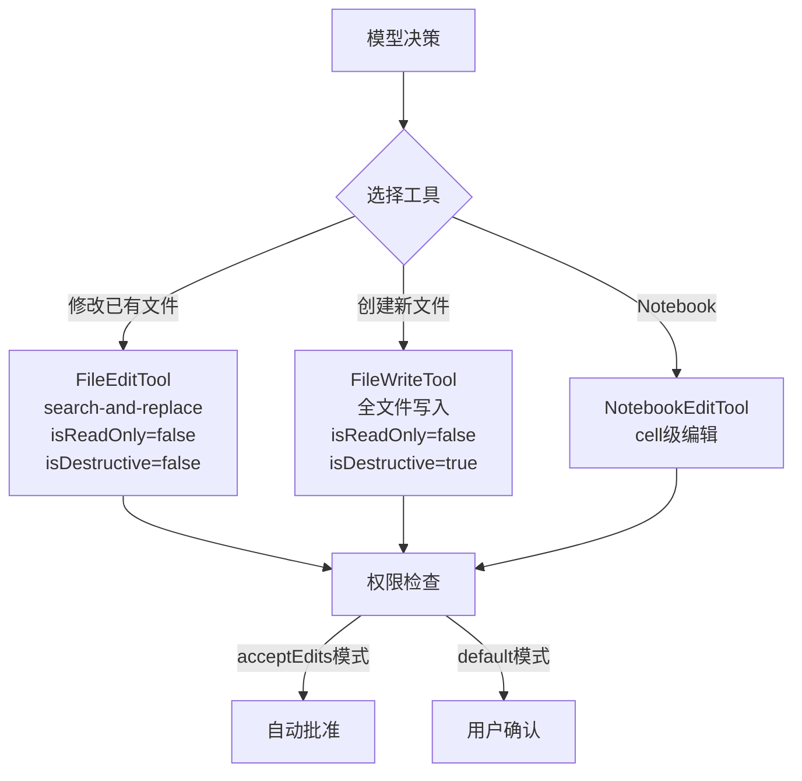

# 第 10 章：代码编辑策略

> 好用的 coding agent 不只是会写代码，而是会用低破坏性的方式改代码。

代码编辑是 coding agent 最核心也最危险的能力——一个错误的编辑可能破坏整个代码库，而一个好的编辑策略能让 agent 像经验丰富的开发者一样精准修改代码。Claude Code 的编辑策略围绕三个核心原则设计：**最小化破坏性**（只改需要改的部分）、**可验证性**（每次编辑都有明确的 before/after）、**抗幻觉**（模型无法静默写入不存在的代码）。基于这些原则，Claude Code 优先使用 FileEditTool（search-and-replace）而非 FileWriteTool（全文件覆盖）——前者天然满足这三个约束，而后者只适用于创建新文件或需要完整重写的场景。

## 10.1 两种编辑工具

Claude Code 提供两种文件编辑工具，各有其适用场景：

| 工具 | 策略 | 适用场景 | 破坏性 |
|------|------|---------|--------|
| **FileEditTool** | search-and-replace | 修改已有文件中的特定部分 | 低 |
| **FileWriteTool** | 全文件覆盖写入 | 创建新文件或完整重写 | 高 |

系统提示词明确指引模型：**优先使用 FileEditTool**。只有在创建全新文件或需要完整重写时，才使用 FileWriteTool。

FileEditTool 之所以成为默认选择，是因为它在工程上解决了 LLM 编辑代码最棘手的问题：如何让一个可能产生幻觉的模型安全地修改真实代码？接下来我们深入剖析 FileEditTool 的设计，理解每一个工程决策背后的 why。

## 10.2 FileEditTool：Search-and-Replace 方法

FileEditTool 是 Claude Code 代码编辑的核心工具，采用精确字符串替换策略。本节按照从外到内的顺序展开：先看接口设计（10.2.1），再理解方案选型的工程考量（10.2.2），然后深入输入预处理（10.2.3）、验证管线（10.2.4）和实现细节（10.2.5）。

### 10.2.1 接口设计与工作原理

#### 输入 Schema

```typescript
{
  file_path: string    // 要编辑的文件绝对路径
  old_string: string   // 要替换的精确字符串
  new_string: string   // 替换后的新字符串
  replace_all?: boolean // 是否替换所有出现位置（默认 false）
}
```

#### 工作原理

FileEditTool 不需要行号、不需要正则表达式。它的工作方式极其简单：

1. 在文件中精确查找 `old_string`
2. 确保 `old_string` 在文件中**唯一出现**（除非 `replace_all=true`）
3. 将其替换为 `new_string`
4. 如果 `old_string` 不唯一，返回错误，要求提供更多上下文

### 10.2.2 为什么 Search-and-Replace 优于其他方案

这个设计选择背后有深刻的工程考量：

#### 1. 低破坏性

Search-and-replace 只修改目标文本，文件的其余部分完全不变。相比之下，全文件写入可能：
- 意外丢失未预期的内容
- 引入格式变化（缩进、空行）
- 在大文件上因 Token 限制截断内容

#### 2. 可验证性

每次编辑都有明确的"before"和"after"。用户可以精确看到什么被改了——这比看一个完整的新文件要容易得多。

#### 3. 抗幻觉

模型需要提供文件中**实际存在**的精确字符串。如果模型"幻觉"了不存在的代码，编辑会直接失败并返回错误，而不是静默地写入错误内容。

#### 4. Token 效率

对大文件的小修改，search-and-replace 只需要发送修改点附近的上下文，而不是整个文件内容。

#### 10. Git 友好

Search-and-replace 产生的 diff 最小化、最精确。自动化 PR 创建时，reviewer 看到的是干净的、有针对性的变更。

#### 与备选方案的对比

在确定 search-and-replace 方案之前，有必要理解为什么其他看似合理的方案被排除了：

**基于行号的编辑**（如 `edit line 42-45`）：这是最直觉的方案，但也是最脆弱的。问题在于行号是**位置相关**的——当模型在一个对话 turn 中需要对同一文件做多处修改时，第一个编辑（比如在第 10 行插入 3 行代码）会导致后续所有行号偏移。模型要么需要一个复杂的行号重算逻辑，要么只能保证每次只编辑一处。而 search-and-replace 是**位置无关**的：不管文件上方插入了多少行，目标字符串的内容不会变，匹配始终有效。

**基于 AST 的编辑**（如 `rename function foo to bar`）：这个方案在理论上很优雅，但实际不可行。Claude Code 需要支持几十种编程语言，为每种语言维护一个完整的 AST 解析器成本极高。更关键的问题是：**语法错误的文件恰恰是最需要编辑的文件**，但 AST 解析器在遇到语法错误时会直接报错拒绝解析。这意味着在最需要编辑工具的场景下（修 bug、修语法错误），工具反而不可用。

**Unified diff/patch 格式**（如让模型直接输出 `@@ -1,3 +1,4 @@` 格式的 diff）：LLM 在生成这种严格格式时表现很差。Unified diff 要求精确的 hunk header（起始行号和行数），要求每一行都正确使用 `+`/`-`/空格 前缀，上下文行数必须与 header 声明一致。任何一个字符的偏差都会导致整个 patch 无法应用。相比之下，search-and-replace 只需要模型提供两段自然语言级别的字符串——这正是 LLM 最擅长的任务形式。

**全文件重写**（即 FileWriteTool 的方式）：对于小文件可行，但对于大文件问题严重。一个 500 行的文件，哪怕只改一行，模型也需要输出完整的 500 行内容。这不仅浪费 Token，更危险的是模型可能在输出过程中**遗漏未修改的代码**——特别是文件中间重复性较强的部分（如一系列相似的 case 语句）。而且用户无法快速 review 变更：面对一个 500 行的新文件，找到实际修改的那一行如同大海捞针。

**幻觉安全是 search-and-replace 最被低估的优势**。考虑这个场景：模型"记得"文件中有一个 `handleError()` 函数，但实际上这个函数在上一次重构中已经被重命名为 `processError()`。如果使用 search-and-replace，模型提供 `old_string: "function handleError()"` 会直接失败（error code 8: "String to replace not found in file"），模型看到错误后会重新读取文件，发现正确的函数名。如果使用全文件重写，模型可能会写出包含 `handleError()` 的完整文件，覆盖掉正确的 `processError()`——而且这个错误完全是静默的，不会有任何报错。

### 10.2.3 输入预处理管线

在进入核心的验证和执行流程之前，模型的输入会先经过一个预处理阶段。`normalizeFileEditInput()` 在 `validateInput` 之前被调用，负责清洗模型输出中常见的瑕疵：

**1. 尾部空白裁剪**

模型生成代码时经常在行尾添加多余的空格或 tab。`stripTrailingWhitespace()` 会对 `new_string` 的每一行去除尾部空白字符。但这个规则有一个重要的例外：**`.md` 和 `.mdx` 文件不做尾部空白裁剪**。这是因为在 Markdown 语法中，行尾的两个空格表示硬换行（`<br>`），裁剪掉会改变文档的语义。

```typescript
// Markdown 使用两个尾部空格作为硬换行——裁剪会改变语义
const isMarkdown = /\.(md|mdx)$/i.test(file_path)
const normalizedNewString = isMarkdown
  ? new_string
  : stripTrailingWhitespace(new_string)
```

**2. API 反消毒（Desanitization）**

Claude API 出于安全考虑，会将某些 XML 标签"消毒"（sanitize）为短形式，防止模型输出被误解析为 API 控制标签。例如：

| 消毒后（模型看到的） | 原始形式（文件中的） |
|---|---|
| `<fnr>` | `<function_results>` |
| `<n>` / `</n>` | `<name>` / `</name>` |
| `<s>` / `</s>` | `<system>` / `</system>` |
| `\n\nH:` | `\n\nHuman:` |
| `\n\nA:` | `\n\nAssistant:` |

当模型输出的 `old_string` 无法精确匹配文件内容时，`desanitizeMatchString()` 会尝试将这些消毒后的短形式还原为原始标签。如果还原后能匹配成功，同样的替换也会应用到 `new_string`，确保编辑的一致性。

这个预处理阶段对用户完全透明——大多数情况下用户不会意识到它的存在。但对于编辑包含 XML 标签或 `Human:`/`Assistant:` 等特殊字符串的文件（例如 prompt 模板文件），它是编辑能否成功的关键。

### 10.2.4 完整验证管线

FileEditTool 的 `validateInput()` 方法实现了一个多层验证管线，在真正执行编辑之前拦截各种问题。验证的顺序是刻意设计的：**低成本的检查在前，需要文件 I/O 的检查在中，依赖文件内容的检查在后**。这样在早期阶段就能拦截的问题不会浪费后续的磁盘读取开销。

完整的验证步骤和对应的错误码：

| 步骤 | 错误码 | 检查内容 | 目的 |
|------|--------|---------|------|
| 1 | 0 | `checkTeamMemSecrets()` | 防止将密钥写入团队记忆文件 |
| 2 | 1 | `old_string === new_string` | 拒绝无意义的空操作 |
| 3 | 2 | 权限 deny 规则匹配 | 尊重用户配置的路径排除规则 |
| 4 | — | UNC 路径检测 | 安全：防止 Windows NTLM 凭据泄露 |
| 5 | 10 | 文件大小 > 1 GiB | 防止 V8 字符串长度限制导致 OOM |
| 6 | — | 文件编码检测 | 通过 BOM 判断 UTF-16LE 还是 UTF-8 |
| 7 | 4 | 文件不存在 + `old_string` 非空 | 找不到目标文件，尝试给出相似文件建议 |
| 8 | 3 | `old_string` 为空 + 文件已有内容 | 阻止用"创建新文件"的方式覆盖已有文件 |
| 9 | 5 | `.ipynb` 扩展名检测 | 重定向到 NotebookEditTool |
| 10 | 6 | `readFileState` 缺失或 `isPartialView` | 文件未被读取——必须先读 |
| 11 | 7 | `mtime > readTimestamp.timestamp` | 文件被外部修改——需要重新读取 |
| 12 | 8 | `findActualString()` 返回 null | `old_string` 在文件中不存在 |
| 13 | 9 | 匹配数 > 1 且 `replace_all=false` | 多个匹配但未指定全局替换 |
| 14 | 10 | `validateInputForSettingsFileEdit()` | Claude 配置文件的 JSON Schema 校验 |

几个值得展开讨论的步骤：

**步骤 7-8：文件创建的双重门控**。`old_string` 为空有特殊语义——它表示"创建新文件"。当 `old_string` 为空且文件不存在时，验证直接通过；当 `old_string` 为空但文件已存在且有内容时（error code 3），会阻止操作，防止模型误用创建语义覆盖已有文件。但如果文件存在且内容为空（`fileContent.trim() === ''`），则允许通过——这处理了"空文件等同于不存在"的边界情况。

**步骤 12：字符串查找**。这一步调用前面介绍的 `findActualString()`，先尝试精确匹配，再尝试引号标准化后匹配。如果两种方式都找不到，返回 error code 8 并附上 `old_string` 的内容，帮助模型理解匹配失败的原因。同时，错误返回中还会附带 `isFilePathAbsolute` 元信息——因为一个常见的失败原因是模型使用了相对路径，导致在错误的目录下查找文件。

**步骤 14：配置文件保护**。对 `.claude/settings.json` 等配置文件，验证不仅检查 `old_string` 是否存在，还会**模拟执行编辑**并验证结果是否符合 JSON Schema。这防止了一个危险场景：一次看似合理的编辑可能导致配置文件格式损坏，使 Claude Code 无法正常启动。

### 10.2.5 唯一性约束

在上面的验证管线中，步骤 13 的唯一性约束值得单独讨论。FileEditTool 要求 `old_string` 在文件中唯一出现。如果不唯一，编辑失败并提示：

```
Found N matches of the string to replace, but replace_all is false.
To replace all occurrences, set replace_all to true.
To replace only one occurrence, please provide more context to uniquely identify the instance.
```

这个约束的设计哲学是"宁可失败也不猜测"：

- **防止歧义**：如果 `old_string` 是 `return null`，文件中可能有 5 处 `return null`。没有唯一性约束，工具只会替换第一个匹配——但模型想替换的可能是第三个。失败并要求模型提供更多上下文（比如包含周围的函数签名），远比猜测性地替换第一个更安全
- **要求理解上下文**：这迫使模型在编辑前真正理解代码结构。模型不能偷懒只提供一个关键词，而是需要提供足够的上下文片段来唯一标识修改点
- **`replace_all` 作为显式逃逸阀**：当需要重命名变量等批量操作时，模型必须显式设置 `replace_all: true`。这个设计让批量替换成为一个"明确的选择"而非"意外的后果"

### 10.2.6 实现细节：从匹配到写入

#### 引号标准化

文件中可能包含弯引号（curly quotes），这种情况在从 Word、Google Docs 或网页复制过来的代码中很常见。但模型输出的始终是直引号（straight quotes）。如果不做处理，`old_string` 会因为引号不匹配而查找失败。

Claude Code 在 `utils.ts` 中实现了一套引号标准化机制：

```typescript
// normalizeQuotes() 将所有弯引号转为直引号进行匹配
function normalizeQuotes(str: string): string {
  return str
    .replaceAll('\u201C', '"')   // "left double curly → straight
    .replaceAll('\u201D', '"')   // "right double curly → straight
    .replaceAll('\u2018', "'")   // 'left single curly → straight
    .replaceAll('\u2019', "'")   // 'right single curly → straight
}
```

`findActualString()` 实现了两阶段匹配策略：

```typescript
function findActualString(fileContent: string, searchString: string): string | null {
  // 第一阶段：精确匹配
  if (fileContent.includes(searchString)) {
    return searchString
  }

  // 第二阶段：标准化引号后重试
  const normalizedSearch = normalizeQuotes(searchString)
  const normalizedFile = normalizeQuotes(fileContent)

  const searchIndex = normalizedFile.indexOf(normalizedSearch)
  if (searchIndex !== -1) {
    // 返回文件中的原始字符串（保留弯引号）
    return fileContent.substring(searchIndex, searchIndex + searchString.length)
  }

  return null
}
```

需要注意的是，当通过引号标准化匹配成功后，Claude Code 还会通过 `preserveQuoteStyle()` 将 `new_string` 中的直引号转换回弯引号，以保持文件的排版一致性。这个函数使用启发式规则判断引号的开闭位置——前面是空白或开括号的是左引号，否则是右引号——并且正确处理缩略语中的撇号（如 `don't`）。

除了引号标准化，还有一套**反消毒**（desanitization）机制：Claude API 会将某些 XML 标签（如 `<function_results>`、`<name>` 等）消毒为短形式（`<fnr>`、`<n>`），模型输出编辑时用的是消毒后的形式。`desanitizeMatchString()` 在匹配失败时自动还原这些标签。

#### Diff 生成

`getPatchForEdit()` 负责将编辑操作转化为结构化的 diff patch：

```typescript
function getPatchForEdits({ filePath, fileContents, edits }): {
  patch: StructuredPatchHunk[]
  updatedFile: string
} {
  let updatedFile = fileContents

  for (const edit of edits) {
    const previousContent = updatedFile
    updatedFile = applyEditToFile(updatedFile, edit.old_string, edit.new_string, edit.replace_all)

    // 如果编辑没有改变任何内容，抛出错误
    if (updatedFile === previousContent) {
      throw new Error('String not found in file. Failed to apply edit.')
    }
  }

  // 使用 diff 库的 structuredPatch 生成 hunk
  // 注意：先将 tab 转为空格用于显示目的
  const patch = getPatchFromContents({
    filePath,
    oldContent: convertLeadingTabsToSpaces(fileContents),
    newContent: convertLeadingTabsToSpaces(updatedFile),
  })

  return { patch, updatedFile }
}
```

在调用 `structuredPatch` 之前，会对内容中的 `&` 和 `$` 字符进行转义（替换为特殊 token），因为 diff 库在处理这些字符时存在 bug。diff 计算后再反转义回来。

#### 删除操作的特殊处理

当 `new_string` 为空时（即删除操作），`applyEditToFile()` 有一个贴心的细节：它会检查文件中是否存在 `old_string + '\n'`——如果存在，会连同尾部的换行符一起删除。这防止了删除一行代码后留下一个空行的常见问题。

```typescript
if (newString !== '') {
  return f(originalContent, oldString, newString)  // 正常替换，精确执行
}

// 删除场景：如果 old_string 后面紧跟换行符，连同换行一起删除
const stripTrailingNewline =
  !oldString.endsWith('\n') && originalContent.includes(oldString + '\n')

return stripTrailingNewline
  ? f(originalContent, oldString + '\n', newString)  // 删除 old_string + 换行
  : f(originalContent, oldString, newString)          // 仅删除 old_string
```

举个例子：假设文件内容是 `line1\nline2\nline3\n`，模型想删除 `line2`。如果直接替换 `"line2"` 为 `""`，结果是 `line1\n\nline3\n`——多出一个空行。有了这个处理，实际删除的是 `"line2\n"`，结果是 `line1\nline3\n`，符合用户预期。

注意这个行为只在 `new_string` 为空时触发，正常的替换操作不受影响。这是一个很好的"做正确的事"设计——用户不需要知道这个机制的存在，但它让删除操作的结果始终符合直觉。

#### 编辑去重

在实际使用中，模型偶尔会因为重试逻辑等原因发送重复的编辑请求。Claude Code 通过 `areFileEditsInputsEquivalent()` 进行**语义去重**——它不只是比较两组编辑的字面值是否相同，而是将两组编辑分别应用到当前文件内容，比较最终结果是否一致：

```typescript
function areFileEditsEquivalent(edits1, edits2, originalContent): boolean {
  // 快速路径：字面值完全相同
  if (edits1.length === edits2.length &&
      edits1.every((e1, i) => e1.old_string === edits2[i].old_string && ...)) {
    return true
  }

  // 慢速路径：分别应用两组编辑，比较结果
  const result1 = getPatchForEdits({ fileContents: originalContent, edits: edits1 })
  const result2 = getPatchForEdits({ fileContents: originalContent, edits: edits2 })
  return result1.updatedFile === result2.updatedFile
}
```

这种语义比较能识别出"输入不同但效果相同"的编辑。例如，两组编辑可能使用了不同长度的 `old_string` 上下文，但最终修改的内容完全一致——它们会被正确判定为等价，避免重复执行。

## 10.3 FileWriteTool：全文件写入

FileWriteTool 的定位是创建新文件或完整重写：

```typescript
{
  file_path: string    // 文件绝对路径
  content: string      // 完整文件内容
}
```

系统提示词中的使用指引：
- 对已有文件，**必须先用 Read 工具读取内容**，然后编辑
- 优先使用 Edit 工具修改现有文件——它只发送 diff
- 只在创建新文件或完整重写时使用 Write
- **永远不要创建文档文件**（.md/README），除非用户明确要求
- 避免使用 emoji，除非用户要求

### 换行符策略：为什么 Write 始终使用 LF

FileWriteTool 在写入磁盘时**始终使用 LF 换行符**，不保留原文件的换行风格：

```typescript
// Write 是全内容替换——模型发送的显式换行符就是它的意图。不要改写它们。
writeTextContent(fullFilePath, content, enc, 'LF')
```

这个决策来自一个真实的 bug 教训。源码注释记录了历史：

> *Previously we preserved the old file's line endings (or sampled the repo via ripgrep for new files), which silently corrupted e.g. bash scripts with `\r` on Linux when overwriting a CRLF file or when binaries in cwd poisoned the repo sample.*

旧版本会保留原文件的换行风格（如果是新文件，会通过 ripgrep 采样仓库中其他文件的换行风格来决定）。但这导致了两个问题：
1. 在 Linux 上覆盖一个 CRLF 文件时，Write 会给新内容也加上 `\r`，导致 bash 脚本因为行尾的 `\r` 无法执行
2. 当工作目录中有二进制文件时，ripgrep 采样可能将二进制内容误判为 CRLF，污染新文件的换行符

**这与 FileEditTool 形成了刻意的不对称**：

| | FileEditTool | FileWriteTool |
|---|---|---|
| **换行符** | 保留原文件的换行风格 | 始终 LF |
| **编码** | 保留原文件编码 | 保留原文件编码 |
| **设计原则** | 最小变更——只改目标文本 | 模型意图——内容即真相 |

为什么两者不同？FileEditTool 只修改文件的一小部分，保留换行风格是"最小变更"原则的自然延伸。FileWriteTool 替换整个文件，模型发送的内容（包括换行符）代表了完整的意图，不应被工具层面覆写。

### 编码检测

FileEditTool 的验证管线中包含一个 BOM（Byte Order Mark）检测步骤，用于正确读取非 UTF-8 编码的文件：

```typescript
const fileBuffer = await fs.readFileBytes(fullFilePath)
const encoding: BufferEncoding =
  fileBuffer.length >= 2 &&
  fileBuffer[0] === 0xff &&
  fileBuffer[1] === 0xfe
    ? 'utf16le'
    : 'utf8'
```

如果文件前两个字节是 `0xFF 0xFE`（UTF-16LE 的 BOM），使用 UTF-16LE 解码；否则默认 UTF-8。完整的 `detectEncodingForResolvedPath()` 还能识别 UTF-8 BOM（`0xEF 0xBB 0xBF`），空文件默认 UTF-8（而非 ASCII），避免在后续写入 emoji 或中文时出现编码损坏。

### 安全验证

FileWriteTool 在执行写入前会进行多层安全检查，与 FileEditTool 共享核心验证逻辑：

```typescript
// 1. 团队记忆密钥检查
const secretError = checkTeamMemSecrets(fullFilePath, content)

// 2. 权限 deny 规则匹配
const denyRule = matchingRuleForInput(fullFilePath, ..., 'edit', 'deny')

// 3. Windows UNC 路径检查：防止 NTLM 凭据泄露
if (fullFilePath.startsWith('\\\\') || fullFilePath.startsWith('//')) {
  return { result: true }  // 跳过文件系统操作，交由权限系统处理
}

// 4. 文件存在性检查 + mtime 验证
const fileStat = await fs.stat(fullFilePath)
const lastWriteTime = Math.floor(fileStat.mtimeMs)

// 5. 读取前置检查
const readTimestamp = toolUseContext.readFileState.get(fullFilePath)
if (!readTimestamp || readTimestamp.isPartialView) {
  return { result: false, message: 'File has not been read yet.' }
}

// 6. 外部修改检测
if (lastWriteTime > readTimestamp.timestamp) {
  return { result: false, message: 'File has been modified since read.' }
}
```

FileWriteTool 与 FileEditTool 共享同一套 `readFileState` 缓存机制——对已有文件，**必须先读取才能写入**。这个约束在代码层面强制执行，而不仅仅是提示词层面的建议。值得注意的是，如果文件不存在（ENOENT），验证直接通过——因为这是"创建新文件"的正常场景。

FileEditTool 还额外检查文件大小（1 GiB 上限），防止 V8/Bun 字符串长度限制（约 2^30 字符）导致的 OOM：

```typescript
const MAX_EDIT_FILE_SIZE = 1024 * 1024 * 1024 // 1 GiB
const { size } = await fs.stat(fullFilePath)
if (size > MAX_EDIT_FILE_SIZE) {
  return { result: false, message: `File is too large to edit (${formatFileSize(size)}).` }
}
```

## 10.4 编辑前的读取要求

系统提示词强制要求：**编辑文件前必须先读取**。

```
You MUST use your Read tool at least once in the conversation
before editing. This tool will error if you attempt an edit
without reading the file.
```

这不仅是提示词层面的约束——FileEditTool 的实现中实际检查 `readFileState` 缓存，如果文件未被读取过，会返回错误（error code 6）。

这个设计确保模型：
1. 了解文件的当前状态
2. 不会基于过时的记忆进行编辑
3. 能提供正确的 `old_string`

### 没有这个约束会怎样？

考虑一个真实的使用场景来理解读取前置的必要性：

**场景 1：过期记忆**。用户在对话的第 3 轮让 Claude 修改 `utils.ts` 中的 `formatDate()` 函数。Claude 在第 1 轮读取过这个文件，知道函数签名是 `function formatDate(date: Date)`。但在第 2 轮中，用户在 IDE 中手动将签名改为 `function formatDate(date: Date, locale?: string)`。如果没有读取前置约束，Claude 会基于对话历史中的旧版本生成 `old_string: "function formatDate(date: Date)"`——这个字符串在当前文件中已经不存在了（因为多了 `locale` 参数），编辑会失败。更糟糕的情况是，如果 Claude 使用 FileWriteTool 全文件重写，旧版本的内容会直接覆盖用户刚做的手动修改。

**场景 2：`isPartialView` 的陷阱**。某些文件在 Read 时会被注入额外内容（如 HTML 文件的注释会被剥离，`MEMORY.md` 会被截断）。这些文件的 `readFileState` 会被标记为 `isPartialView: true`。如果允许基于部分视图进行编辑，模型看到的内容与文件真实内容不一致，`old_string` 极有可能匹配失败或匹配到错误的位置。

读取前置约束的实现也很值得注意——它区分了"完全没读"和"读了但是部分视图"两种情况，对两者都拒绝编辑：

```typescript
const readTimestamp = toolUseContext.readFileState.get(fullFilePath)
if (!readTimestamp || readTimestamp.isPartialView) {
  return {
    result: false,
    message: 'File has not been read yet. Read it first before writing to it.',
    errorCode: 6,
  }
}
```

### 并发安全：文件状态缓存

`readFileState` 是工具上下文中的一个缓存，记录每个文件的读取状态：

```typescript
// readFileState 中每个文件的缓存条目
interface FileStateEntry {
  content: string       // 文件内容（用于匹配验证和内容比较）
  timestamp: number     // 读取时的 mtime（用于外部修改检测）
  offset?: number       // 读取起始行（部分读取时记录）
  limit?: number        // 读取行数（部分读取时记录）
  isPartialView?: boolean // 是否为部分视图
}
```

编辑前的并发检测流程：

```
1. 读取文件当前 mtime（通过 fs.stat 或 getFileModificationTime）
2. 对比 readFileState 中缓存的 timestamp
3. 如果 mtime > timestamp → 文件被外部修改 → 返回警告
4. Windows 回退：mtime 不可靠时（云同步、杀毒软件等可能触发 mtime 变化），
   使用内容哈希/全文比较作为二次确认
```

这解决了一个常见的竞争条件：用户在 IDE 中编辑文件的同时，Claude Code 也在编辑同一个文件。mtime 检查能捕获这种并发修改，避免覆盖用户的手动改动。

具体实现中，Windows 平台的 mtime 检查有特殊处理。因为 Windows 上的云同步（OneDrive）、杀毒软件等可能在不修改文件内容的情况下更新 mtime，所以当检测到 mtime 变化时，如果是完整读取（非 offset/limit 的部分读取），会额外比较文件内容——内容相同则认为安全，可以继续编辑：

```typescript
const isFullRead = lastRead.offset === undefined && lastRead.limit === undefined
const contentUnchanged = isFullRead && currentContent === lastRead.content
if (!contentUnchanged) {
  throw new Error('File unexpectedly modified')
}
```

编辑成功后，`readFileState` 会立即更新为新的内容和时间戳，防止后续编辑触发误报。这个更新至关重要——如果不更新，模型在同一个 turn 中对同一文件做第二次编辑时，新的 mtime（刚才写入导致的）会大于旧的 readTimestamp，触发"文件被外部修改"的误报。更新后，后续编辑可以正常进行而不需要重新读取文件。

## 10.5 多文件编辑协调

当需要跨多个文件进行协调修改时（如重命名一个被广泛引用的函数），Claude Code 的策略是：

### 串行编辑

由于 FileEditTool 的 `isReadOnly()` 返回 `false`，多个文件编辑操作会**串行执行**。这确保：
- 不会出现竞争条件
- 每个编辑基于文件的最新状态
- 如果中间某个编辑失败，后续编辑不会在错误基础上继续

### 原子性考量

单个 FileEditTool 调用是原子的——要么成功替换，要么完全不修改。但跨多个文件的编辑序列不是原子的。如果中间失败，已完成的编辑不会回滚。

这是一个有意的设计权衡：
- 回滚机制会增加极大的复杂度
- Git 提供了天然的回滚能力（`git checkout`）
- 模型可以在失败后自主修复

### 级联编辑保护

当多个编辑操作在同一文件上依次执行时，有一个微妙的风险：前一个编辑插入的文本可能被后一个编辑意外匹配到。`getPatchForEdits()` 通过子串检查来防止这种级联错误：

```typescript
const appliedNewStrings: string[] = []

for (const edit of edits) {
  const oldStringToCheck = edit.old_string.replace(/\n+$/, '')

  // 检查当前 old_string 是否是之前任何 new_string 的子串
  for (const previousNewString of appliedNewStrings) {
    if (oldStringToCheck !== '' && previousNewString.includes(oldStringToCheck)) {
      throw new Error(
        'Cannot edit file: old_string is a substring of a new_string from a previous edit.'
      )
    }
  }

  // ... 执行编辑 ...
  appliedNewStrings.push(edit.new_string)
}
```

举个例子：假设编辑 A 将 `foo()` 替换为 `foo() // calls bar()`，编辑 B 想将 `bar()` 替换为 `baz()`。如果没有级联保护，编辑 B 的 `old_string: "bar()"` 会匹配到编辑 A 刚插入的注释中的 `bar()`，导致注释变成 `// calls baz()`——这不是模型的意图。有了子串检查，系统会检测到 `"bar()"` 是前一个 `new_string` 的子串，直接报错让模型重新思考编辑策略。

注意检查前会对 `old_string` 去除尾部换行（`replace(/\n+$/, '')`），避免因为换行符差异导致的误判。

### Worktree 隔离

对于大规模重构，AgentTool 支持 Git Worktree 隔离模式。子 Agent 在独立的 Worktree 中工作，完成后由用户决定是否合并：

```typescript
{
  prompt: "重构所有 API 处理函数...",
  isolation: 'worktree'  // 在独立 Worktree 中工作
}
```

## 10.6 缩进保持

系统提示词中有关于缩进的明确指引：

```
When editing text from Read tool output, ensure you preserve
the exact indentation (tabs/spaces) as it appears AFTER the
line number prefix.
```

这特别重要，因为 Read 工具的输出带有行号前缀（`cat -n` 格式），模型需要正确区分行号前缀和实际文件内容中的缩进。

## 10.7 NotebookEditTool：Jupyter 编辑

对于 Jupyter Notebook（`.ipynb` 文件），Claude Code 提供专门的 NotebookEditTool，它理解 Notebook 的 cell 结构，在 cell 级别进行精确编辑。

### 输入 Schema

```typescript
{
  notebook_path: string     // .ipynb 文件的绝对路径
  cell_id?: string          // 目标 cell 的 ID（或 cell-N 格式的索引）
  new_source: string        // 新的 cell 内容
  cell_type?: 'code' | 'markdown'  // cell 类型（insert 时必须指定）
  edit_mode?: 'replace' | 'insert' | 'delete'  // 编辑模式（默认 replace）
}
```

### 工作原理

Jupyter Notebook 本质上是一个 JSON 文件，核心结构是 `cells` 数组。每个 cell 包含 `cell_type`、`source`、`metadata`，以及 code cell 特有的 `outputs` 和 `execution_count`。

NotebookEditTool 的三种编辑模式：

- **replace**：替换指定 cell 的 `source` 内容。对 code cell，会同时重置 `execution_count` 为 `null` 并清空 `outputs`——因为源代码已变，旧的输出不再有效
- **insert**：在指定 cell 之后插入新 cell。如果不指定 `cell_id`，则在开头插入。对于 nbformat >= 4.5 的 notebook，会自动生成随机 cell ID
- **delete**：删除指定 cell，通过 `cells.splice(cellIndex, 1)` 实现

### Cell 定位

Cell 的定位支持两种方式：
1. **原生 cell ID**：直接使用 notebook 中每个 cell 的 `id` 字段
2. **索引格式**：`cell-N` 格式（如 `cell-0`、`cell-3`），由 `parseCellId()` 解析为数字索引

### 边界情况处理

NotebookEditTool 的实现中有几个值得注意的边界情况处理：

**Replace 自动转 Insert**：当 `edit_mode` 为 `replace` 但 `cellIndex` 等于 `cells.length`（即指向末尾之后）时，自动降级为 `insert` 模式。这容错了模型在计算 cell 索引时的常见 off-by-one 错误。

**Cell ID 版本兼容**：只有 nbformat >= 4.5 的 notebook 才支持 cell ID。对于旧版格式，插入新 cell 时不会生成 `id` 字段，避免写入不被识别的字段导致兼容性问题。新 cell ID 使用 `Math.random().toString(36).substring(2, 15)` 生成随机字符串。

**非缓存 JSON 解析**：`call()` 方法中使用非缓存的 `jsonParse()` 而非 `safeParseJSON()` 来解析 notebook 内容。这是因为后续会直接修改解析出的对象（`cells.splice`、`targetCell.source = ...`），如果使用缓存版本，修改会污染缓存，导致 `validateInput()` 和后续调用拿到已被篡改的对象。

### 与 FileEditTool 的验证差异

虽然 NotebookEditTool 共享了部分安全机制，但验证管线与 FileEditTool 有显著差异：

| 特性 | FileEditTool | NotebookEditTool |
|------|-------------|-----------------|
| **读取前置** | 要求完整读取（拒绝 `isPartialView`） | 只要求读取过（不检查 `isPartialView`） |
| **字符串匹配** | 精确匹配 + 引号标准化 + 反消毒 | 无——按 cell 定位，不做字符串匹配 |
| **唯一性约束** | `old_string` 必须唯一 | 不适用——cell ID/索引天然唯一 |
| **文件大小限制** | 1 GiB 上限 | 无限制 |
| **编辑前密钥检查** | 检查 `new_string` 是否包含密钥 | 不检查 |
| **配置文件保护** | 对 settings.json 做 Schema 校验 | 不适用 |

这种差异是合理的：Notebook 的 cell 结构提供了天然的定位机制（cell ID 或索引），不需要 FileEditTool 那套基于字符串匹配的复杂验证。但这也意味着 NotebookEditTool 的安全防护层次更少——它更依赖于 notebook 的结构化格式本身来保证编辑的正确性。

### 权限与安全

NotebookEditTool 共享与 FileEditTool 相同的核心安全机制：
- **读取前置检查**：必须先读取 notebook 文件才能编辑（与 FileEditTool/FileWriteTool 一致）
- **外部修改检测**：通过 mtime 对比检测文件是否被外部修改
- **UNC 路径防护**：同样拦截 Windows UNC 路径
- **权限分组**：在 `acceptEdits` 权限模式下，NotebookEditTool 与 FileEditTool 一样自动批准，无需用户确认

写入后同样更新 `readFileState` 缓存，保持与其他编辑工具的一致性。

## 10.8 原子写入与 LSP 集成

FileEditTool 的 `call()` 方法实现了一个完整的编辑执行管线，从文件读取到写入后的各种副作用：

```typescript
async call(input, context) {
  // === 写入前准备（可异步）===

  // 1. 发现技能目录（fire-and-forget）
  const newSkillDirs = await discoverSkillDirsForPaths([absoluteFilePath], cwd)
  addSkillDirectories(newSkillDirs).catch(() => {})  // 不等待

  // 2. 确保父目录存在
  await fs.mkdir(dirname(absoluteFilePath))

  // 3. 文件历史备份（按内容哈希去重，v1 备份格式）
  await fileHistoryTrackEdit(updateFileHistoryState, absoluteFilePath, messageId)

  // === 临界区：避免异步操作以保持原子性 ===

  // 4. 同步读取文件（带编码和换行符元数据）
  const { content, encoding, lineEndings } = readFileSyncWithMetadata(filePath)

  // 5. 过时检测（mtime + 内容比较）
  const lastWriteTime = getFileModificationTime(absoluteFilePath)
  if (lastWriteTime > lastRead.timestamp) { /* ... 抛出错误 */ }

  // 6. 引号标准化 + 查找匹配
  const actualOldString = findActualString(content, old_string)
  const actualNewString = preserveQuoteStyle(old_string, actualOldString, new_string)

  // 7. 生成 patch
  const { patch, updatedFile } = getPatchForEdit(/* ... */)

  // 8. 写入磁盘（保持原始编码和换行符）
  writeTextContent(absoluteFilePath, updatedFile, encoding, lineEndings)

  // === 写入后副作用 ===

  // 9. 通知 LSP 服务器
  lspManager.changeFile(absoluteFilePath, updatedFile)  // didChange
  lspManager.saveFile(absoluteFilePath)                  // didSave

  // 10. 通知 VSCode（用于 diff 视图）
  notifyVscodeFileUpdated(absoluteFilePath, originalContent, updatedFile)

  // 11. 更新 readFileState 缓存
  readFileState.set(absoluteFilePath, {
    content: updatedFile,
    timestamp: getFileModificationTime(absoluteFilePath),
  })

  // 12. 统计与遥测
  countLinesChanged(patch)
  logFileOperation({ operation: 'edit', tool: 'FileEditTool', filePath })
}
```

几个关键设计点：

**临界区最小化**：步骤 4-8 之间刻意避免任何 `await` 异步操作。注释中明确写道 *"Please avoid async operations between here and writing to disk to preserve atomicity"*。为什么这么重要？JavaScript/TypeScript 是单线程但基于事件循环的——每个 `await` 都是一个让出控制权的点。如果在过时检测（步骤 5）和写入磁盘（步骤 8）之间有 `await`，另一个异步操作（如 linter 自动修复、IDE 保存）可能在这个间隙修改文件，导致写入覆盖外部修改。将文件历史备份和目录创建等可异步的操作提前到临界区之外，确保检测和写入之间没有断点。

**编码与换行符的完整往返管线**。FileEditTool 对文件编码和换行符的处理遵循"读什么写什么"原则，整个管线分为三个阶段：

1. **读取阶段**（`readFileSyncWithMetadata()`）：
   - 检测编码：通过 BOM 判断（`0xFF 0xFE` → UTF-16LE，`0xEF 0xBB 0xBF` → UTF-8 with BOM，默认 UTF-8）
   - 检测换行符：扫描原始内容前 4096 码元，统计 CRLF 和独立 LF 的数量，多数投票决定换行风格
   - 规范化内容：将所有 `\r\n` 统一为 `\n`，使内部处理全程基于 LF

2. **处理阶段**：所有字符串匹配、替换、diff 生成都基于 LF 规范化后的内容。这简化了 `old_string` 的匹配逻辑——模型不需要关心目标文件是 LF 还是 CRLF

3. **写入阶段**（`writeTextContent()`）：
   - 如果检测到的原始换行符是 CRLF：先将内容中的 `\n` 全部替换为 `\r\n`
   - 使用检测到的原始编码写入磁盘

这意味着编辑一个 UTF-16LE + CRLF 的文件（Windows 上的旧式文本文件），内部全程用 UTF-8 + LF 处理，写入时恢复为 UTF-16LE + CRLF——文件的编码和换行风格完全不变。

**LSP 通知**：编辑完成后立即通知 LSP 服务器，分为两步——`changeFile()`（对应 `textDocument/didChange`）告知内容已修改，`saveFile()`（对应 `textDocument/didSave`）触发 TypeScript server 等语言服务器的诊断更新。这些通知都是 fire-and-forget（`.catch()` 只做日志），不阻塞编辑返回。同时会清除该文件之前已交付的诊断信息（`clearDeliveredDiagnosticsForFile`），确保新诊断不会被去重过滤。

**文件历史备份**：`fileHistoryTrackEdit()` 在写入前捕获文件原始内容，使用内容哈希去重——如果连续多次编辑没有改变内容，不会产生重复备份。备份格式为 v1（基于硬链接或复制），存储在 `~/.claude/fileHistory/` 目录下。由于是幂等操作，即使后续的过时检测失败导致编辑中止，多出的备份也不会影响状态一致性。

**技能目录发现**：当编辑的文件位于某个技能目录中时，`discoverSkillDirsForPaths()` 会识别出该目录，并触发动态技能加载。此外 `activateConditionalSkillsForPaths()` 会激活路径匹配的条件技能。这使得编辑技能文件时，新技能可以立即被发现和使用。

## 10.9 Diff 渲染

编辑完成后，Claude Code 需要在终端中向用户展示变更内容。这由 `StructuredDiff` 组件（`src/components/StructuredDiff.tsx`）负责。

### 数据结构

Diff 渲染的核心数据来自 `diff` 库的 `StructuredPatchHunk`：

```typescript
// 来自 diff 库的 StructuredPatchHunk
interface StructuredPatchHunk {
  oldStart: number      // 原文件起始行号
  newStart: number      // 新文件起始行号
  oldLines: number      // 原文件涉及的行数
  newLines: number      // 新文件涉及的行数
  lines: string[]       // diff 行（前缀 +/-/空格 表示增/删/不变）
}
```

关键常量：

```typescript
const CONTEXT_LINES = 3          // diff 上下文行数（diff 库参数）
const DIFF_TIMEOUT_MS = 5_000    // diff 计算超时（5 秒）
```

### 行号调整

当 `getPatchForDisplay` 接收的是文件的一个片段（如 `readEditContext` 提供的局部内容）而非完整文件时，hunk 的行号是相对于片段起始位置的。`adjustHunkLineNumbers()` 将其转换为文件级别的绝对行号：

```typescript
function adjustHunkLineNumbers(hunks: StructuredPatchHunk[], offset: number) {
  return hunks.map(h => ({
    ...h,
    oldStart: h.oldStart + offset,
    newStart: h.newStart + offset,
  }))
}
```

### 语法高亮

StructuredDiff 组件使用 `color-diff` 原生模块（Rust NAPI）进行语法高亮渲染。整个渲染流程有多层缓存优化：

1. **WeakMap 缓存**：以 `StructuredPatchHunk` 对象引用为 key，缓存渲染结果。当 hunk 对象被 GC 回收时，缓存自动释放
2. **参数化缓存键**：缓存键包含 `theme`、`width`、`dim`、`gutterWidth`、`firstLine`（shebang 检测）和 `filePath`（语言检测），确保相同参数命中缓存
3. **缓存上限**：每个 hunk 最多保留 4 个缓存条目（覆盖正常使用场景中的宽度变化），超出后清空重建

```typescript
const RENDER_CACHE = new WeakMap<StructuredPatchHunk, Map<string, CachedRender>>()

// 缓存键编码所有影响渲染的参数
const key = `${theme}|${width}|${dim ? 1 : 0}|${gutterWidth}|${firstLine ?? ''}|${filePath}`
```

### 终端渲染布局

在全屏模式下，diff 使用双列布局——gutter 列（行号和 +/- 标记）与 content 列分离：

```typescript
// Gutter 宽度由最大行号的位数决定
function computeGutterWidth(patch: StructuredPatchHunk): number {
  const maxLineNumber = Math.max(
    patch.oldStart + patch.oldLines - 1,
    patch.newStart + patch.newLines - 1,
    1
  )
  return maxLineNumber.toString().length + 3  // 标记符(1) + 两个间隔空格
}
```

Gutter 列使用 `<NoSelect>` 包裹，这样用户在终端中选择复制 diff 内容时，不会包含行号——这是一个细节但重要的用户体验优化。`sliceAnsi` 函数在切割 ANSI 彩色文本时保持转义序列的完整性，确保颜色不会因为列分割而错乱。

当 gutter 宽度超过终端总宽度时（极窄终端场景），会自动回退到单列渲染，由 Rust 模块处理自动换行。如果原生模块不可用或语法高亮被禁用，则回退到 `StructuredDiffFallback` 组件进行纯文本渲染。

## 10.10 与工具系统的整合

编辑工具在工具系统中的位置：



在 `acceptEdits` 权限模式下，编辑类工具自动批准，无需用户确认——这对信任度高的项目是极大的效率提升。

## 10.11 关键设计洞察

1. **低破坏性是核心原则**：search-and-replace 不是因为简单才被选择，而是因为它对代码库的影响最小
2. **失败比静默错误更好**：唯一性约束确保模型不会在歧义场景下做出错误编辑
3. **读取前置是安全网**：强制读取确保模型基于最新状态做编辑
4. **`replace_all` 的克制使用**：默认 `false`，只在明确的批量操作场景下启用
5. **Git 是终极回滚机制**：不需要在编辑工具层面实现复杂的事务或回滚
6. **引号标准化是现实主义**：处理真实世界中从各种来源复制粘贴的代码，而不是假设所有文件都完美规范
7. **LSP 集成让 IDE 实时响应**：编辑后立即通知语言服务器，用户无需等待就能看到最新的诊断信息
8. **文件历史提供额外安全网**：基于内容哈希的幂等备份，在 Git 之外多一层保护
9. **输入预处理无声但关键**：尾部空白裁剪和 API 反消毒在验证前静默修正模型输出的常见瑕疵，用户和模型都不需要感知这个过程
10. **Edit 与 Write 的换行符不对称是刻意的**：Edit 保留原始换行风格（最小变更原则），Write 始终使用 LF（模型意图原则），两者在各自的场景下都是正确的选择
11. **级联保护防止自引用编辑**：多步编辑中的子串检查确保后续编辑不会意外修改前一步刚插入的文本，将一类难以调试的 bug 拦截在源头

这个编辑策略的精髓可以用一句话概括：**宁可编辑失败让模型重试，也不要静默地写入错误内容**。

---

> **动手实践**：在 [claude-code-from-scratch](https://github.com/Windy3f3f3f3f/claude-code-from-scratch) 的 `src/tools.ts` 中，`edit_file` 工具实现了简化版的 search-and-replace 策略。尝试运行 `npm start` 让 Agent 编辑一个文件，观察唯一性约束在实际中如何工作。

上一章：[Plan 模式](./10-plan-mode.md) | 下一章：[任务管理系统](./15-task-system.md)
