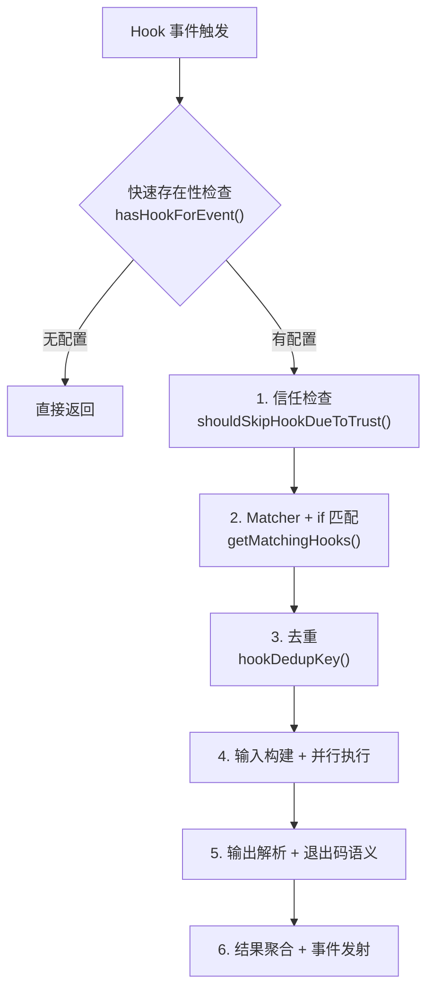
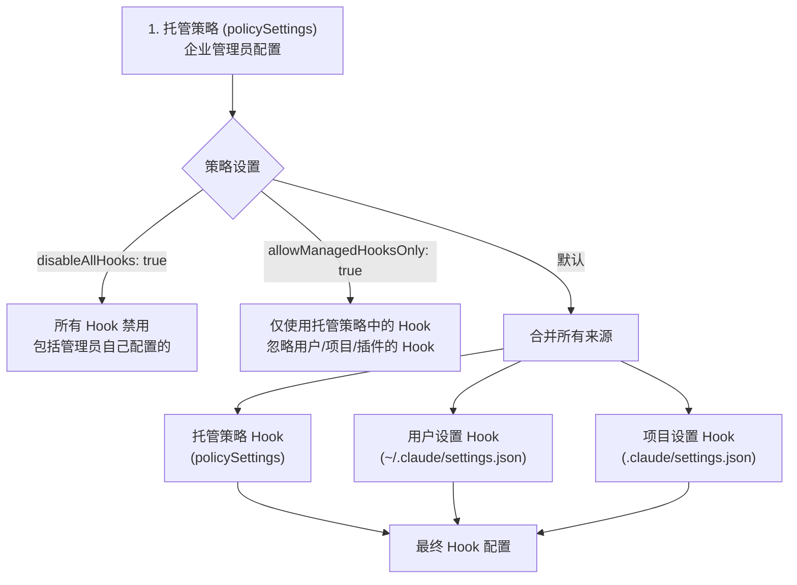
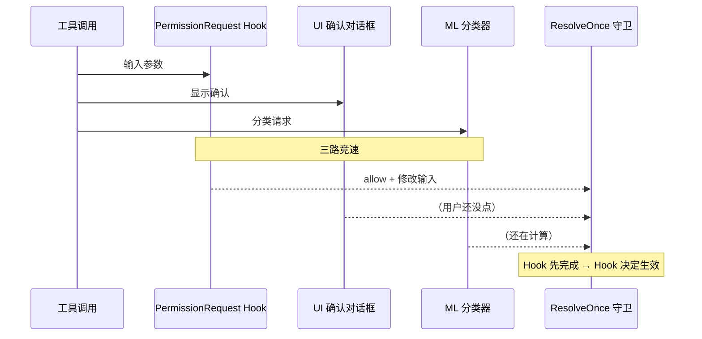

# 第 7 章：Hooks 与可扩展性

> Hooks 是 Claude Code 的事件驱动扩展机制——在不修改源码的前提下，注入自定义逻辑到关键生命周期节点。

想象一下这些场景：每次 Claude 执行 `git push` 之前自动运行 lint 检查；每次编辑文件后在后台跑测试，只在测试失败时中断 Claude；或者把所有工具调用发送到公司审计系统。这些都是 Hooks 的典型用法。

Hooks 的核心设计理念是：**Agent Loop 的每个关键节点都暴露一个事件，外部代码可以监听这些事件并注入行为**。这和 Git Hooks（pre-commit、post-merge）、Webpack Plugins 的设计理念一脉相承，但 Claude Code 面对的问题更复杂——它需要处理权限控制、异步长任务、多 Agent 协调等场景，因此 Hook 系统的设计远比传统的"前后拦截器"复杂得多。

**本章主要内容：**

- **7.1 事件全景**：27 种 Hook 事件的分类与触发时机
- **7.2 Hook 类型**：4 种可配置 Hook（Command/Prompt/Agent/HTTP）+ 2 种编程式 Hook（Callback/Function）
- **7.3 Matcher 匹配器**：三级匹配机制与 `if` 条件的配合
- **7.4 执行引擎**：6 阶段流水线——信任检查、匹配、去重、并行执行、输出解析、结果聚合
- **7.5-7.9 高级主题**：JSON 输出协议、信任模型与安全、PermissionRequest 深度解析、Stop Hook、实战模式

## 7.1 Hook 事件全景

### 为什么是这 27 种事件？

Claude Code 的 Hook 事件设计遵循一个原则：**覆盖 Agent Loop 完整生命周期的所有关键决策点**。回顾第 2 章的 Agent Loop，一次完整的交互涉及：用户输入 → 模型推理 → 工具调用（权限检查 → 执行 → 结果） → 模型决定是否继续 → 最终输出。每个环节都可能需要外部干预，因此每个环节都需要对应的 Hook 事件。

源码中定义了完整的事件列表（`src/entrypoints/sdk/coreTypes.ts`）：

```typescript
export const HOOK_EVENTS = [
  'PreToolUse', 'PostToolUse', 'PostToolUseFailure',
  'Notification', 'UserPromptSubmit', 'SessionStart', 'SessionEnd',
  'Stop', 'StopFailure', 'SubagentStart', 'SubagentStop',
  'PreCompact', 'PostCompact', 'PermissionRequest', 'PermissionDenied',
  'Setup', 'TeammateIdle', 'TaskCreated', 'TaskCompleted',
  'Elicitation', 'ElicitationResult', 'ConfigChange',
  'WorktreeCreate', 'WorktreeRemove', 'InstructionsLoaded',
  'CwdChanged', 'FileChanged'
] as const
```

按功能分类：

| 类别 | 事件 | 触发时机 | Matcher 匹配值 |
|------|------|---------|----------------|
| **工具生命周期** | PreToolUse | 工具执行前 | `tool_name`（如 `Write`、`Bash`） |
| | PostToolUse | 工具执行成功后 | `tool_name` |
| | PostToolUseFailure | 工具执行失败后 | `tool_name` |
| **权限系统** | PermissionRequest | 权限判定时 | `tool_name` |
| | PermissionDenied | 自动分类器拒绝时 | `tool_name` |
| **通知** | Notification | 系统通知触发 | `notification_type` |
| **会话生命周期** | SessionStart | 会话开始 | `source`（`startup`/`resume`/`clear`/`compact`） |
| | SessionEnd | 会话结束 | `reason` |
| | UserPromptSubmit | 用户提交输入时 | 无 |
| **模型响应** | Stop | 模型决定停止时 | 无 |
| | StopFailure | API 调用失败时 | `error` |
| **Agent 协调** | SubagentStart | 子 Agent 启动 | `agent_type` |
| | SubagentStop | 子 Agent 停止 | `agent_type` |
| | TeammateIdle | 协作 Agent 空闲 | 无 |
| **任务系统** | TaskCreated | 任务创建 | 无 |
| | TaskCompleted | 任务完成 | 无 |
| **压缩** | PreCompact | 上下文压缩前 | `trigger`（`manual`/`auto`） |
| | PostCompact | 上下文压缩后 | `trigger` |
| **MCP 交互** | Elicitation | MCP 用户询问 | `mcp_server_name` |
| | ElicitationResult | 询问结果 | `mcp_server_name` |
| **环境变化** | ConfigChange | 配置文件变更 | `source` |
| | CwdChanged | 工作目录变更 | 无 |
| | FileChanged | 被监听文件变更 | 文件名（`basename`） |
| | InstructionsLoaded | 指令文件加载 | `load_reason` |
| **工作区** | Setup | 仓库初始化/维护 | `trigger`（`init`/`maintenance`） |
| | WorktreeCreate | Worktree 创建 | 无 |
| | WorktreeRemove | Worktree 移除 | 无 |

**表格第四列"Matcher 匹配值"很重要**——它告诉你，当你在配置中写 `matcher: "Write"` 时，系统实际拿什么值来比较。对于工具相关事件，matcher 匹配的是工具名；对于 SessionStart，匹配的是触发源；对于 Notification，匹配的是通知类型。这个映射关系在 `getMatchingHooks()` 的一个 switch 语句中定义。

### 为什么需要这么多事件？

初看 27 种事件可能觉得过多，但每个事件都有明确的使用场景：

- **工具前后事件**（PreToolUse/PostToolUse）：最核心的扩展点。前置 Hook 可以阻止执行、修改输入；后置 Hook 可以执行检查、注入上下文。
- **会话事件**（SessionStart/SessionEnd）：初始化环境、清理资源、上报审计日志。
- **环境变化事件**（FileChanged/CwdChanged/ConfigChange）：响应外部变化，实现"文件保存后自动 lint"等工作流。
- **Agent 协调事件**（SubagentStart/SubagentStop/TeammateIdle）：在多 Agent 场景中注入协调逻辑。

## 7.2 Hook 类型

Claude Code 支持四种可配置的 Hook 类型和两种编程式 Hook 类型。前四种可以写在 `settings.json` 中，后两种仅在 SDK/插件内部使用。

| 类型 | 持久化方式 | 执行方式 | 适用场景 |
|------|-----------|---------|---------|
| **Command** | settings.json | spawn Shell 子进程，stdin/stdout 通信 | 日志、lint、CI 触发等绝大多数场景 |
| **Prompt** | settings.json | 单轮 LLM 调用，返回 ok/not-ok | 需要语义理解的安全检查或代码审查 |
| **Agent** | settings.json | 多轮 Agent Loop，可调用工具验证 | 复杂验证流程（运行测试、类型检查） |
| **HTTP** | settings.json | POST 请求到外部端点 | Webhook 通知、审计日志、企业合规 |
| **Callback** | 仅内存（SDK/插件注册） | 进程内直接调用异步函数 | 内部埋点、文件跟踪、commit 归因 |
| **Function** | 仅内存（会话级注册） | 进程内调用，按 sessionId 隔离 | Agent Hook 的结构化输出强制 |

在讲具体类型之前，先看一个最简单的 Hook 配置示例，对整体格式有个直观认识：

```json
// ~/.claude/settings.json
{
  "hooks": {
    "PreToolUse": [
      {
        "matcher": "Bash",
        "hooks": [
          {
            "type": "command",
            "command": "echo 'About to run a Bash command'"
          }
        ]
      }
    ]
  }
}
```

结构很清晰：`hooks` 对象的 key 是事件名（如 `PreToolUse`），value 是一个数组，每个元素包含 `matcher`（可选的匹配过滤）和 `hooks`（该匹配下要执行的 Hook 列表）。

### 1. 命令 Hook（Command）

**最常用的类型**。执行一条 Shell 命令，通过 stdin 接收 JSON 输入，通过 stdout 返回 JSON 结果，通过退出码表达成功/失败/阻塞。

```typescript
{
  type: 'command',
  command: string,           // Shell 命令
  if?: string,               // 权限规则语法的二次过滤
  shell?: 'bash' | 'powershell',  // Shell 类型，默认 bash
  timeout?: number,          // 超时（秒）
  statusMessage?: string,    // 执行时的 spinner 提示
  once?: boolean,            // 执行一次后自动移除
  async?: boolean,           // 异步执行，不阻塞
  asyncRewake?: boolean      // 异步执行 + 退出码 2 时唤醒模型
}
```

**工作原理（`execCommandHook`）**：

1. **进程创建**：调用 `spawn()` 创建子进程。Shell 的选择逻辑是：如果指定了 `shell: 'powershell'`，使用 `pwsh`；否则使用用户的 `$SHELL`（bash/zsh/sh）。
2. **输入传递**：将 Hook 的结构化输入（包含 session_id、tool_name、tool_input 等）序列化为 JSON，通过 **stdin** 传入子进程。这意味着 Hook 脚本可以通过读取 stdin 获取完整的上下文信息。
3. **环境变量**：子进程继承当前环境变量。如果是插件 Hook，额外注入 `CLAUDE_PLUGIN_ROOT`（插件根目录）和 `CLAUDE_PLUGIN_DATA`（插件数据目录），命令中的 `${CLAUDE_PLUGIN_ROOT}` 占位符也会被替换。
4. **输出收集**：等待进程退出，收集 stdout 和 stderr。
5. **结果解析**：根据退出码和 stdout 内容决定 Hook 结果（详见 7.4 节）。

**适用场景**：日志记录、文件同步、CI/CD 触发、shell 脚本集成、自定义 linter。

### 2. 提示词 Hook（Prompt）

调用 LLM 进行语义评估。适用于需要"理解"而非简单模式匹配的判断场景。

```typescript
{
  type: 'prompt',
  prompt: string,            // 提示词（$ARGUMENTS 占位符会被替换为 JSON 输入）
  if?: string,               // 权限规则语法过滤
  model?: string,            // 指定模型（默认使用小快模型，如 Haiku）
  timeout?: number,          // 超时（秒，默认 30）
  statusMessage?: string,
  once?: boolean
}
```

**工作原理（`execPromptHook`）**：

1. 将 `$ARGUMENTS` 占位符替换为 Hook 输入的 JSON 字符串
2. 构建消息数组（可选地包含对话历史），调用 `queryModelWithoutStreaming`（单轮、无流式）
3. 系统提示词要求模型返回 `{"ok": true}` 或 `{"ok": false, "reason": "..."}`
4. 解析模型返回，`ok: false` 映射为阻塞错误

**关键设计细节**：Prompt Hook 直接调用 `createUserMessage` 而不经过 `processUserInput`——因为后者会触发 `UserPromptSubmit` Hook，导致无限递归。

**适用场景**：语义安全检查（"这个 SQL 查询是否可能删除数据？"）、代码审查（"这个修改是否符合项目规范？"）。

### 3. Agent Hook

与 Prompt Hook 类似，但以 **多轮 Agent 模式**运行——它可以调用工具来验证条件，不仅仅是"想一想"。

```typescript
{
  type: 'agent',
  prompt: string,            // 验证指令（$ARGUMENTS 占位符）
  if?: string,
  model?: string,            // 默认使用 Haiku
  timeout?: number,          // 超时（秒，默认 60）
  statusMessage?: string,
  once?: boolean
}
```

**与 Prompt Hook 的关键区别**：

| | Prompt Hook | Agent Hook |
|--|-------------|------------|
| 调用方式 | `queryModelWithoutStreaming`（单轮） | `query`（多轮 Agent Loop） |
| 能否调用工具 | 不能（只有 LLM 推理） | 能（可以读文件、运行命令来验证） |
| 默认超时 | 30 秒 | 60 秒 |
| 输出格式 | 强制 `{ok, reason}` JSON | 通过注册结构化输出工具，返回 `{ok, reason}` |

Agent Hook 使用 `registerStructuredOutputEnforcement` 注册一个函数 Hook，确保 Agent 在结束时必须调用结构化输出工具返回结果。这是一个"Hook 嵌套 Hook"的设计——Agent Hook 本身在执行过程中注册临时的 Function Hook 来约束 Agent 行为。

**适用场景**：复杂验证流程——例如"运行测试并确认全部通过"、"检查编辑的文件是否能通过类型检查"。

### 4. HTTP Hook

向外部服务发送 POST 请求，适合与企业基础设施集成。

```typescript
{
  type: 'http',
  url: string,               // POST 端点
  if?: string,
  timeout?: number,          // 超时（秒，默认 10 分钟）
  headers?: Record<string, string>,  // 支持 $VAR 环境变量插值
  allowedEnvVars?: string[], // 允许插值的环境变量白名单
  statusMessage?: string,
  once?: boolean
}
```

**工作原理（`execHttpHook`）**：

1. **URL 白名单检查**：如果配置了 `allowedHttpHookUrls` 策略，先检查 URL 是否匹配允许的模式。不匹配直接拒绝，不发任何请求。
2. **Header 环境变量插值**：遍历 headers，匹配 `$VAR_NAME` 或 `${VAR_NAME}` 模式。**只有在 `allowedEnvVars` 中列出的变量才会被替换**，其他变量替换为空字符串。这防止了项目级 `.claude/settings.json` 中的恶意 Hook 窃取 `$HOME`、`$AWS_SECRET_ACCESS_KEY` 等敏感变量。
3. **CRLF 注入防护**：插值后的 header 值会被去除 `\r`、`\n`、`\x00` 字符，防止恶意环境变量注入额外的 HTTP 头。
4. **代理支持**：自动检测 sandbox 代理和环境变量代理（`HTTP_PROXY`/`HTTPS_PROXY`），通过代理发送请求。
5. **SSRF 防护**：不通过代理时，使用 `ssrfGuardedLookup` 防止请求发往内网地址。
6. **响应解析**：HTTP Hook **必须返回 JSON**（与 Command Hook 不同，Command Hook 可以返回纯文本）。空 body 被视为 `{}`（成功且无特殊指令）。

**重要限制**：**HTTP Hook 不支持 SessionStart 和 Setup 事件**。原因是在 headless 模式下，这两个事件触发时 sandbox 的 structuredInput 消费者尚未启动，HTTP 请求会死锁。

**适用场景**：Webhook 通知、审计日志上报、第三方审批系统、合规检查。

### 5. 回调 Hook（Callback）— 仅限 SDK/插件

编程式函数，在进程内直接执行，不经过 spawn/HTTP 等 I/O 操作。

```typescript
{
  type: 'callback',
  callback: async (input, toolUseID, signal, index, context) => HookJSONOutput,
  timeout?: number,
  internal?: boolean  // 标记为内部 Hook（启用快速路径优化）
}
```

**为什么 Callback Hook 极快？** Claude Code 在 `executeHooks` 中有一个重要的快速路径优化：

```typescript
// src/utils/hooks.ts
// 如果所有匹配的 Hook 都是 callback/function 类型（无需 spawn 外部进程）
if (matchedHooks.every(m => m.hook.type === 'callback' || m.hook.type === 'function')) {
  // 快速路径：跳过 JSON 序列化、AbortSignal 创建、进度事件、结果处理
  for (const [i, { hook }] of matchingHooks.entries()) {
    if (hook.type === 'callback') {
      await hook.callback(hookInput, toolUseID, signal, i, context)
    }
  }
  return  // 不经过常规 processHookJSONOutput 流程
}
```

这个优化将内部 Hook 的开销从 ~6µs 降低到 ~1.8µs（-70%）。内部 Hook（如文件访问跟踪、commit 归因）在每次工具调用时都触发，累积起来差距很大。

### 7. 函数 Hook（Function）— 仅限会话内

类似 Callback，但作用域限定在特定会话内，防止跨 Agent 泄漏。

```typescript
{
  type: 'function',
  id?: string,
  callback: (messages: Message[], signal?: AbortSignal) => boolean | Promise<boolean>,
  errorMessage: string,      // callback 返回 false 时显示的错误
  timeout?: number,
  statusMessage?: string
}
```

**主要用途**：Agent Hook 的结构化输出强制（确保 Agent 必须通过特定工具返回结果）。通过 `addFunctionHook()` 注册，`removeFunctionHook()` 移除，按 `sessionId` 隔离——这确保验证 Agent 的函数 Hook 不会泄漏到主 Agent。

### 通用字段说明

有几个字段在多种 Hook 类型中出现，值得单独解释：

**`if` 条件**：这是一个比 `matcher` 更精细的过滤器。Matcher 匹配工具名（如 "Bash"），而 `if` 使用权限规则语法匹配工具的具体输入（如 `"Bash(git *)"`——只在 Bash 工具执行 git 命令时触发）。`if` 条件在 `prepareIfConditionMatcher` 中解析：它调用工具的 `preparePermissionMatcher` 来对工具输入进行模式匹配，复用了权限系统的匹配引擎。**`if` 只适用于工具相关事件**（PreToolUse、PostToolUse、PostToolUseFailure、PermissionRequest），对其他事件无效。

**`once` 字段**：如果为 true，Hook 执行一次后自动从配置中移除。适用于一次性的初始化或验证。

**`statusMessage` 字段**：Hook 执行时在 spinner 中显示的自定义消息。默认显示命令内容，但对于复杂命令或包含敏感信息的命令，自定义消息更友好。

## 7.3 Matcher 匹配器

Matcher 是 Hook 系统的路由机制——决定一个 Hook 是否应该响应某个事件。

### 配置格式

```typescript
type HookMatcher = {
  matcher?: string,          // 匹配模式，不设置则匹配所有
  hooks: HookCommand[]       // 匹配时执行的 Hook 列表
}
```

配置示例：

```json
{
  "hooks": {
    "PreToolUse": [
      {
        "matcher": "Bash",
        "hooks": [{ "type": "command", "command": "echo 'Bash tool used'" }]
      },
      {
        "matcher": "Write|Edit",
        "hooks": [{ "type": "command", "command": "echo 'File modified'" }]
      }
    ]
  }
}
```

### 三种匹配模式

`matchesPattern()` 函数实现了三级匹配，按顺序尝试：

```typescript
// src/utils/hooks.ts
function matchesPattern(matchQuery: string, matcher: string): boolean {
  if (!matcher || matcher === '*') return true

  // 1. 精确匹配或管道分隔（只含字母数字和 | 的视为简单模式）
  if (/^[a-zA-Z0-9_|]+$/.test(matcher)) {
    if (matcher.includes('|')) {
      // "Write|Edit|Read" → 分割后逐个精确匹配
      return patterns.includes(matchQuery)
    }
    // "Write" → 直接精确匹配
    return matchQuery === matcher
  }

  // 2. 正则表达式（包含任何特殊字符时）
  const regex = new RegExp(matcher)
  return regex.test(matchQuery)
}
```

三种模式的设计体现了**渐进复杂度**：

| 模式 | 示例 | 使用场景 |
|------|------|---------|
| 精确匹配 | `"Write"` | 最常用，匹配单个工具 |
| 管道分隔 | `"Write\|Edit\|Read"` | 匹配多个工具（OR 语义） |
| 正则表达式 | `"^Bash.*"` / `"^(Write\|Edit)$"` | 复杂模式匹配 |

为什么不直接全部用正则？因为绝大多数用户只需要精确匹配。正则的字符串模式检测（`/^[a-zA-Z0-9_|]+$/`）确保简单的工具名不会被意外当成正则解析——比如 `"Bash"` 不会触发正则引擎。

### Matcher 与 `if` 条件的配合

Matcher 和 `if` 构成了两层过滤：

```
事件触发
  │
  ▼
Matcher 过滤：匹配工具名/事件类型（粗粒度）
  │ 不匹配 → 跳过，不 spawn 进程
  ▼
if 条件过滤：匹配工具的具体输入参数（细粒度）
  │ 不匹配 → 跳过，不 spawn 进程
  ▼
执行 Hook
```

举例：

```json
{
  "matcher": "Bash",
  "hooks": [{
    "type": "command",
    "command": "echo 'git command detected'",
    "if": "Bash(git push*)"
  }]
}
```

这个配置的匹配过程：
1. PreToolUse 事件触发，tool_name 是 "Bash" → matcher 匹配通过
2. 检查 `if` 条件：`"Bash(git push*)"` → 解析权限规则，检查工具输入的命令是否匹配 `git push*` 模式
3. 如果用户执行的是 `git push origin main` → 匹配通过，执行 Hook
4. 如果用户执行的是 `git status` → 匹配失败，跳过

**性能关键**：两层过滤都在 spawn 子进程之前完成。如果一个 PreToolUse 事件触发了 10 个 Hook 配置，但只有 2 个通过了 matcher + if 的双重过滤，系统只会 spawn 2 个进程。这是"零成本抽象"——不触发的 Hook 完全没有运行时开销。

## 7.4 Hook 执行引擎

关键文件：`src/utils/hooks.ts`（核心调度）

Hook 执行经过 6 个阶段。下面逐一展开每个阶段的实现细节。



### Stage 0：快速存在性检查

在进入完整的 Hook 流程之前，`hasHookForEvent()` 提供了一个轻量级的短路判断：

```typescript
// src/utils/hooks.ts
function hasHookForEvent(hookEvent, appState, sessionId): boolean {
  const snap = getHooksConfigFromSnapshot()?.[hookEvent]
  if (snap && snap.length > 0) return true
  const reg = getRegisteredHooks()?.[hookEvent]
  if (reg && reg.length > 0) return true
  if (appState?.sessionHooks.get(sessionId)?.hooks[hookEvent]) return true
  return false
}
```

这个检查故意**过度近似**（over-approximates）：它不检查 matcher 是否匹配，不检查 managedOnly 策略——只要有任何配置存在就返回 true。假阳性只是多走一步完整匹配路径；假阴性则会跳过应执行的 Hook，所以宁可多查不可漏查。

这个优化的价值在于：**绝大多数事件没有配置任何 Hook**。一个没有配置 FileChanged Hook 的项目，每次文件变化事件都能在几微秒内短路返回，避免了 `createBaseHookInput`（需要路径拼接）和 `getMatchingHooks`（需要遍历配置）的开销。

### Stage 1：信任检查

`shouldSkipHookDueToTrust()` 是安全底线——**所有 Hook 都需要工作区信任**：

```typescript
// src/utils/hooks.ts
export function shouldSkipHookDueToTrust(): boolean {
  const isInteractive = !getIsNonInteractiveSession()
  if (!isInteractive) return false  // SDK 模式下信任隐式成立
  const hasTrust = checkHasTrustDialogAccepted()
  return !hasTrust  // true = 跳过 Hook
}
```

**为什么如此严格？** Hooks 从 `.claude/settings.json` 读取配置并执行任意命令。如果不检查信任，恶意仓库可以通过在 `.claude/settings.json` 中注入 Hook 来执行代码——用户只要 clone 并打开仓库，Hook 就会自动运行。

**历史漏洞驱动了这个设计**：

1. **SessionEnd Hook 泄露**：用户 clone 恶意仓库 → 打开 Claude Code → 看到信任对话框 → 点击拒绝 → 退出。但 SessionEnd Hook 在退出时执行，不检查信任——恶意 Hook 仍然运行。
2. **SubagentStop Hook 提前执行**：子 Agent 在信任对话框弹出前就完成了 → SubagentStop 事件触发 → Hook 在未经信任的工作区中执行。

修复方案很简单但有效：在 `executeHooks` 的最开头统一检查信任，所有 Hook（无一例外）都必须在工作区信任建立后才能执行。源码注释说得很直白：

> *"This centralized check prevents RCE vulnerabilities for all current and future hooks"*

### Stage 2：Matcher 匹配与 Hook 收集

`getMatchingHooks()` 是整个引擎中逻辑最复杂的函数。它需要：

1. **收集所有来源的 Hook 配置**：快照配置 + 注册的 SDK/插件 Hook + 会话 Hook + 函数 Hook
2. **根据事件类型确定 matchQuery**：通过 switch 语句从 hookInput 中提取匹配值
3. **Matcher 匹配过滤**：对每个 HookMatcher，检查 matcher 是否匹配 matchQuery
4. **`if` 条件过滤**：使用 `prepareIfConditionMatcher` 生成匹配闭包，逐个检查
5. **特殊限制**：HTTP Hook 在 SessionStart/Setup 事件中被过滤掉

**matchQuery 的提取逻辑**（源码 `getMatchingHooks` 中的 switch）：

```typescript
switch (hookInput.hook_event_name) {
  case 'PreToolUse':
  case 'PostToolUse':
  case 'PostToolUseFailure':
  case 'PermissionRequest':
  case 'PermissionDenied':
    matchQuery = hookInput.tool_name        // 工具名
    break
  case 'SessionStart':
    matchQuery = hookInput.source           // "startup" | "resume" | "clear" | "compact"
    break
  case 'Setup':
    matchQuery = hookInput.trigger          // "init" | "maintenance"
    break
  case 'Notification':
    matchQuery = hookInput.notification_type // 通知类型
    break
  case 'SubagentStart':
  case 'SubagentStop':
    matchQuery = hookInput.agent_type       // Agent 类型
    break
  case 'FileChanged':
    matchQuery = basename(hookInput.file_path) // 文件名（不含路径）
    break
  // ...
}
```

注意 `FileChanged` 用的是 `basename`——只匹配文件名，不匹配路径。这意味着 `matcher: ".env"` 会匹配任何目录下的 `.env` 文件。

### Stage 3：Hook 去重

当 Hook 配置在多个来源中重复出现时（比如用户设置和项目设置都定义了同一条 Hook），去重机制确保不会重复执行。

```typescript
// src/utils/hooks.ts
function hookDedupKey(m: MatchedHook, payload: string): string {
  return `${m.pluginRoot ?? m.skillRoot ?? ''}\0${payload}`
}
```

去重的核心设计：

- **同源 Hook 去重**：来自 settings 的 Hook（无 pluginRoot/skillRoot）共享空字符串前缀，相同命令只保留最后合并的那个
- **跨源 Hook 不去重**：插件 A 和插件 B 可能都有 `${CLAUDE_PLUGIN_ROOT}/hook.sh`，展开后指向不同文件。去重 key 包含 pluginRoot，确保它们不会被错误地合并
- **不同 `if` 条件不去重**：即使命令相同，`if` 条件不同也是不同的 Hook

**Last-wins 语义**：`new Map(entries)` 在 key 冲突时保留最后一个 entry。对于 settings Hook，这意味着后合并的配置（如项目设置）覆盖先合并的（如用户设置）。

**Callback 和 Function Hook 跳过去重**——每个回调函数都是唯一的，去重没有意义。

### Stage 4：输入构建与并行执行

**输入构建**：`createBaseHookInput()` 构建所有 Hook 共用的基础输入：

```typescript
{
  session_id: string,       // 会话 ID
  transcript_path: string,  // 对话记录文件路径
  cwd: string,              // 当前工作目录
  permission_mode?: string, // 权限模式
  agent_id?: string,        // 子 Agent ID
  agent_type?: string       // Agent 类型
}
```

`agent_type` 有一个值得注意的优先级逻辑：子 Agent 的类型（来自 toolUseContext）优先于主线程的 `--agent` 标志。这样 Hook 可以通过 `agent_id` 是否存在来区分"主 Agent 的工具调用"和"子 Agent 的工具调用"。

**JSON 输入的惰性序列化**：Hook 输入只序列化一次，通过闭包共享给同一批次的所有 Hook：

```typescript
let jsonInputResult: { ok: true; value: string } | { ok: false; error: unknown } | undefined
function getJsonInput() {
  if (jsonInputResult !== undefined) return jsonInputResult
  try {
    return (jsonInputResult = { ok: true, value: jsonStringify(hookInput) })
  } catch (error) {
    return (jsonInputResult = { ok: false, error })
  }
}
```

如果一个事件触发了 5 个 Command Hook，hookInput 只被 `jsonStringify` 一次。

**并行执行**：所有匹配的 Hook 通过 `hookPromises.map(async function* ...)` 并行启动，用 `all()` 等待所有结果。这意味着 5 个 Hook 的执行时间取决于最慢的那个，而不是 5 个的总和。每个 Hook 有独立的超时控制（`createCombinedAbortSignal` 合并了父级 signal 和 Hook 自己的超时）。

**三种执行模式**：

**同步模式（默认）**：等待进程退出，收集 stdout/stderr，解析输出。虽然多个 Hook 之间是并行的，但每个 Hook 自身是同步等待结果的。

**异步模式（`async: true`）**：Hook 进程在后台运行，通过 `registerPendingAsyncHook()` 注册到全局的 `AsyncHookRegistry`，立即返回 success。Agent Loop 在每轮循环中调用 `checkForAsyncHookResponses()` 轮询已完成的异步 Hook，将结果注入对话。默认超时 15 秒（可通过 `asyncTimeout` 覆盖）。

**异步唤醒模式（`asyncRewake: true`）**：最特殊的模式，专为"后台检查 + 按需中断"场景设计：

```typescript
// src/utils/hooks.ts - executeInBackground()
if (asyncRewake) {
  // asyncRewake hooks 绕过 AsyncHookRegistry
  void shellCommand.result.then(async result => {
    if (result.code === 2) {
      // 退出码 2 = 阻塞错误 → 通过 notification 唤醒模型
      enqueuePendingNotification({
        value: wrapInSystemReminder(
          `Stop hook blocking error from command "${hookName}": ${stderr || stdout}`
        ),
        mode: 'task-notification',
      })
    }
  })
}
```

工作流程：
1. Hook 进程在后台运行，不阻塞当前操作
2. 退出码 0 → 静默成功，不打扰模型
3. 退出码 2 → 阻塞性错误，通过 `enqueuePendingNotification` 注入 `<system-reminder>` 唤醒模型
4. 模型在下一轮看到这个错误后可以做出响应（如修复失败的测试）

**为什么退出码 2 而不是 1？** 这是一个精心设计的约定：0 = 成功，1 = 一般错误（用户可见但不打扰模型），2 = 需要模型关注的阻塞性错误。这让长时间运行的检查（如 CI 构建、集成测试）只在真正发现问题时才中断模型的工作流。

**一个重要的实现细节**：asyncRewake Hook 故意不调用 `shellCommand.background()`——因为 `background()` 会触发 `taskOutput.spillToDisk()`，将输出写入磁盘文件。但后续需要通过 `getStdout()` 和 `getStderr()` 读取内存中的输出来构建通知消息，`spillToDisk()` 会导致 stderr 从内存中清除（返回空字符串）。

### Stage 5：输出解析与退出码语义

Hook 的输出协议由两部分组成：**退出码**和 **stdout 内容**。

#### 退出码语义

对于非 JSON 输出的 Command Hook，退出码是唯一的通信渠道：

| 退出码 | 含义 | 对用户的影响 | 对模型的影响 |
|--------|------|-------------|-------------|
| **0** | 成功 | stdout 显示在 transcript 中 | 不影响 |
| **1** | 一般错误 | stderr 显示给用户 | **不**传递给模型 |
| **2** | 阻塞性错误 | stderr 显示给用户 | stderr 传递给模型（阻止操作） |
| **其他** | 一般错误（同 1） | stderr 显示给用户 | 不传递给模型 |

**退出码 1 和 2 的关键区别**值得强调：退出码 1 只是"告诉用户出了点问题"（non-blocking），模型不知道也不关心；退出码 2 是"告诉模型这里有问题，必须处理"（blocking），会阻止当前工具的执行或模型的停止。

这个区分非常实用：
- Linter 警告用退出码 1 → 用户看到但不打断工作流
- 安全检查失败用退出码 2 → 模型必须知道并处理

#### stdout 解析

`parseHookOutput()` 对 stdout 进行智能解析：

```typescript
function parseHookOutput(stdout: string) {
  const trimmed = stdout.trim()
  // 不以 '{' 开头 → 纯文本，不尝试 JSON 解析
  if (!trimmed.startsWith('{')) {
    return { plainText: stdout }
  }
  // 以 '{' 开头 → 尝试 JSON 解析 + Zod schema 验证
  try {
    const result = validateHookJson(trimmed)
    if ('json' in result) return result
    // 验证失败 → 返回 plainText + validationError（包含期望的 schema）
    return { plainText: stdout, validationError: result.validationError }
  } catch {
    return { plainText: stdout }
  }
}
```

**设计要点**：
1. 以 `{` 开头才尝试 JSON 解析——简单的 `echo "done"` 不会被误解析
2. JSON 解析后还要经过 Zod schema 验证——确保字段名和类型都正确
3. **验证失败时的 schema 提示**：当 JSON 格式不对时，错误信息中直接展示期望的完整 schema。这是很好的 DX（开发者体验）——Hook 作者不需要查文档就能看到正确的格式应该是什么样的

HTTP Hook 的解析（`parseHttpHookOutput`）略有不同：空 body 被视为空对象 `{}`（成功），非空内容必须是有效 JSON。

### Stage 6：结果聚合与事件发射

多个并行 Hook 的结果通过 `AggregatedHookResult` 合并：

```typescript
type AggregatedHookResult = {
  blockingError?: HookBlockingError      // 阻塞错误
  preventContinuation?: boolean          // 是否阻止继续
  stopReason?: string                    // 停止原因
  permissionBehavior?: 'allow' | 'deny' | 'ask' | 'passthrough'
  additionalContexts?: string[]          // 额外上下文（可来自多个 Hook）
  updatedInput?: Record<string, unknown> // 修改后的工具输入
  updatedMCPToolOutput?: unknown         // 修改后的 MCP 输出
  // ...
}
```

聚合是通过 `for await ... of all(hookPromises)` 流式进行的——每个 Hook 完成就立即 yield 结果，不等所有 Hook 完成。这意味着一个 Hook 的阻塞错误可以立即传播，而不必等待其他更慢的 Hook。

**事件发射**用于 UI 更新和可观测性：
- `emitHookStarted()`：Hook 开始执行时（用于 spinner 显示）
- `emitHookResponse()`：Hook 完成时（包含 stdout/stderr/exitCode/outcome）
- `startHookProgressInterval()`：长时间运行的 Hook 定期发射进度更新（用于在远程模式下推送实时输出）

### 超时配置

| 场景 | 默认超时 | 来源 |
|------|---------|------|
| 一般 Hook | 10 分钟 | `TOOL_HOOK_EXECUTION_TIMEOUT_MS` |
| SessionEnd Hook | 1.5 秒 | `SESSION_END_HOOK_TIMEOUT_MS_DEFAULT` |
| Prompt Hook | 30 秒 | 硬编码 |
| Agent Hook | 60 秒 | 硬编码 |
| HTTP Hook | 10 分钟 | `DEFAULT_HTTP_HOOK_TIMEOUT_MS` |
| 异步 Hook 默认 | 15 秒 | `asyncTimeout` 或默认值 |
| 自定义 | 可配置 | Hook 定义的 `timeout` 字段（秒） |

SessionEnd 超时极短（1.5 秒），因为用户正在退出，不应被 Hook 阻塞。可通过环境变量 `CLAUDE_CODE_SESSIONEND_HOOKS_TIMEOUT_MS` 覆盖。

## 7.5 Hook JSON Output Schema

Hook 通过 stdout 输出 JSON 来控制 Claude Code 的行为。完整 schema 定义在 `src/types/hooks.ts` 中，使用 Zod 验证。

### 通用字段

```typescript
{
  // === 流程控制 ===
  continue?: boolean,          // false → 阻止 Claude 继续（preventContinuation）
  suppressOutput?: boolean,    // 隐藏 stdout 输出（不记入 transcript）
  stopReason?: string,         // continue=false 时的停止原因消息

  // === 决策字段（向后兼容） ===
  decision?: 'approve' | 'block',  // approve → 允许, block → 阻止 + 错误
  reason?: string,                  // 决策原因

  // === 反馈 ===
  systemMessage?: string,      // 警告消息（显示给用户）
}
```

### 事件特定输出（hookSpecificOutput）

`hookSpecificOutput` 是一个 discriminated union，通过 `hookEventName` 字段区分不同事件的输出格式：

**PreToolUse**——最丰富的输出，可以控制权限、修改输入、注入上下文：

```typescript
{
  hookEventName: 'PreToolUse',
  permissionDecision?: 'allow' | 'deny' | 'ask',  // 权限决策
  permissionDecisionReason?: string,               // 决策原因
  updatedInput?: Record<string, unknown>,           // 修改工具输入
  additionalContext?: string                        // 附加上下文
}
```

**PermissionRequest**——结构与 PreToolUse 不同，使用嵌套的 decision 对象：

```typescript
{
  hookEventName: 'PermissionRequest',
  decision: {
    behavior: 'allow',
    updatedInput?: Record<string, unknown>,          // 修改输入
    updatedPermissions?: PermissionUpdate[]          // 注入新权限规则
  } | {
    behavior: 'deny',
    message?: string,                                // 拒绝原因
    interrupt?: boolean                              // 中断操作
  }
}
```

**PostToolUse**——可以注入上下文或替换 MCP 工具输出：

```typescript
{
  hookEventName: 'PostToolUse',
  additionalContext?: string,
  updatedMCPToolOutput?: unknown   // 替换 MCP 工具的原始输出
}
```

**SessionStart**——可以设置初始消息和文件监听：

```typescript
{
  hookEventName: 'SessionStart',
  additionalContext?: string,
  initialUserMessage?: string,     // 自动注入的初始用户消息
  watchPaths?: string[]            // 注册 FileChanged 监听路径
}
```

**UserPromptSubmit / Setup / SubagentStart / PostToolUseFailure / Notification**——只有 additionalContext：

```typescript
{ hookEventName: '...', additionalContext?: string }
```

**PermissionDenied**——可以触发重试：

```typescript
{ hookEventName: 'PermissionDenied', retry?: boolean }
```

**Elicitation / ElicitationResult**——MCP 交互响应：

```typescript
{
  hookEventName: 'Elicitation',
  action?: 'accept' | 'decline' | 'cancel',
  content?: Record<string, unknown>
}
```

**CwdChanged**——工作目录变更时，可以注册新的文件监听路径：

```typescript
{
  hookEventName: 'CwdChanged',
  watchPaths?: string[]            // 注册 FileChanged 监听的绝对路径
}
```

**FileChanged**——被监听文件变更时，同样可以更新监听路径：

```typescript
{
  hookEventName: 'FileChanged',
  watchPaths?: string[]            // 更新 FileChanged 监听的绝对路径
}
```

**WorktreeCreate**——Worktree 创建时，可以指定工作树路径：

```typescript
{
  hookEventName: 'WorktreeCreate',
  worktreePath: string             // 新创建的 worktree 路径
}
```

**异步响应**——Hook 也可以返回异步声明，表示结果稍后到达：

```typescript
{ async: true, asyncTimeout?: number }
```

### 常用字段组合速查

| 目的 | JSON 输出 |
|------|----------|
| 批准工具执行 | `{"hookSpecificOutput": {"hookEventName": "PreToolUse", "permissionDecision": "allow"}}` |
| 拒绝工具执行 | `{"hookSpecificOutput": {"hookEventName": "PreToolUse", "permissionDecision": "deny", "permissionDecisionReason": "不安全"}}` |
| 修改工具输入 | `{"hookSpecificOutput": {"hookEventName": "PreToolUse", "permissionDecision": "allow", "updatedInput": {"command": "git push --dry-run"}}}` |
| 阻止继续 | `{"continue": false, "stopReason": "检测到安全问题"}` |
| 注入上下文 | `{"hookSpecificOutput": {"hookEventName": "UserPromptSubmit", "additionalContext": "当前 linter 有 3 个警告"}}` |

### 数据流跟踪示例

以一个 PreToolUse Hook 拒绝 `rm -rf` 命令为例，跟踪完整的数据流：

```
1. 模型调用 Bash 工具，command = "rm -rf /tmp/data"
   │
2. Agent Loop 触发 PreToolUse 事件
   │
3. executePreToolHooks() 构建 hookInput：
   {
     hook_event_name: "PreToolUse",
     tool_name: "Bash",
     tool_input: { command: "rm -rf /tmp/data" },
     session_id: "abc-123",
     cwd: "/home/user/project",
     ...
   }
   │
4. getMatchingHooks() 查找匹配的 Hook
   ├── matcher: "Bash" → 匹配 tool_name "Bash" ✓
   └── if: "Bash(rm *)" → preparePermissionMatcher("rm -rf /tmp/data") → 匹配 "rm *" ✓
   │
5. execCommandHook() 执行 Hook 命令
   ├── spawn("bash", ["-c", "echo '{...}'"])
   ├── stdin 写入 JSON 输入
   └── 等待退出
   │
6. Hook 脚本 stdout 返回：
   {"hookSpecificOutput": {"hookEventName": "PreToolUse", "permissionDecision": "deny",
    "permissionDecisionReason": "rm -rf 命令被安全策略禁止"}}
   │
7. parseHookOutput() → 以 '{' 开头 → JSON 解析 → Zod 验证通过
   │
8. processHookJSONOutput() 处理 JSON：
   ├── hookSpecificOutput.hookEventName === "PreToolUse" ✓
   ├── permissionDecision === "deny"
   ├── result.permissionBehavior = 'deny'
   └── result.blockingError = { blockingError: "rm -rf 命令被安全策略禁止", command: "..." }
   │
9. 工具执行被阻止，模型收到错误消息：
   "PreToolUse:Bash hook error: rm -rf 命令被安全策略禁止"
```

## 7.6 信任模型与安全

### Hook 配置快照

`captureHooksConfigSnapshot()` 在**启动时**冻结 Hook 配置。这意味着：

1. Hook 定义在整个会话期间不变
2. 即使 `.claude/settings.json` 在会话中被修改（比如被恶意代码修改），Hook 不会动态更新
3. 配置变更时 `updateHooksConfigSnapshot()` 会重新捕获，但只在受控的场景中触发

### 三层来源与策略控制

`getHooksFromAllowedSources()` 从三个来源合并 Hook 配置：



三种策略模式的设计对应不同的企业安全需求：

| 策略 | 效果 | 使用场景 |
|------|------|---------|
| `disableAllHooks` | 禁用一切 Hook，包括托管策略自己的 | 安全锁定环境，完全不信任 Hook 机制 |
| `allowManagedHooksOnly` | 只运行管理员在 policySettings 中定义的 Hook | 企业合规环境，防止用户/仓库注入不受控的 Hook |
| 默认 | 合并所有来源 | 灵活的开发环境 |

**`allowManagedHooksOnly` 的影响范围**很广——它不仅阻止用户设置和项目设置的 Hook，还阻止插件 Hook（`pluginRoot` 存在时跳过）和会话 Hook（包括 Agent/Skill frontmatter 中的 Hook）。但它**不阻止** SDK 注册的 callback Hook（这些是运行时内部机制，不是用户配置）。

## 7.7 PermissionRequest Hook 深度解析

这是最强大的 Hook 类型——可以**程序化地控制工具权限**，在权限系统章节中参与竞速机制。

### 输入

```typescript
{
  hook_event_name: 'PermissionRequest',
  tool_name: string,                    // 工具名称
  tool_input: Record<string, unknown>,  // 工具输入参数
  session_id: string,
  cwd: string,
  permission_mode: string
}
```

### 输出

PermissionRequest 的 hookSpecificOutput 使用嵌套的 `decision` 对象，与 PreToolUse 的 `permissionDecision` 字段不同：

```typescript
{
  hookSpecificOutput: {
    hookEventName: 'PermissionRequest',
    decision: {
      // 允许 → 可以同时修改输入和注入权限规则
      behavior: 'allow',
      updatedInput?: Record<string, unknown>,
      updatedPermissions?: PermissionUpdate[]
    } | {
      // 拒绝 → 可以附带消息和中断标志
      behavior: 'deny',
      message?: string,
      interrupt?: boolean
    }
  }
}
```

### 四种能力

PermissionRequest Hook 远不止简单的 allow/deny：

1. **审批决策**：`behavior: 'allow'` 或 `'deny'`
2. **输入修改**：通过 `updatedInput` 修改工具的输入参数（如强制添加 `--dry-run` 标志）
3. **规则注入**：通过 `updatedPermissions` 动态持久化新的权限规则——不只是本次生效，而是在整个会话中持续生效
4. **操作中断**：`interrupt: true` 立即中断当前操作

### 与权限系统的竞速

PermissionRequest Hook 参与[权限系统的竞速机制](./11-permission-security.md)——与 UI 确认对话框和 ML 分类器同时运行，先完成的获胜。



## 7.8 Stop Hook：采样后验证

Stop Hook 在模型决定停止循环时触发（即模型返回纯文本而非工具调用时），可以**阻止终止**并强制继续：

```
模型返回纯文本（无工具调用）
    │
    ▼
Stop Hook 触发
    │
    ├── 返回 allow / 无阻塞错误 → 正常终止
    └── 返回 deny / 退出码 2 →
        注入 blockingError.blockingError 到对话
        transition = stop_hook_blocking
        继续 Agent Loop
```

这使得自动化工作流可以实现"做完了才能停"的语义。例如：

```json
{
  "hooks": {
    "Stop": [{
      "hooks": [{
        "type": "command",
        "command": "if ! npm test --silent 2>/dev/null; then echo 'Tests failed' >&2; exit 2; fi"
      }]
    }]
  }
}
```

每次模型准备停止时，自动运行测试。测试通过 → 允许停止；测试失败 → 退出码 2 → 模型收到"Tests failed"消息 → 被迫继续修复。

## 7.9 实战模式

### 模式 1：CI 构建检查（asyncRewake）

**场景**：每次编辑文件后自动运行测试，但不阻塞编辑工作流，只在测试失败时提醒模型。

**为什么选择 asyncRewake？** 测试可能需要几十秒。如果用同步 Hook，模型每编辑一个文件就要等几十秒。asyncRewake 让测试在后台运行，模型继续编辑其他文件，只在测试失败时才被中断。

```json
{
  "hooks": {
    "PostToolUse": [{
      "matcher": "Edit",
      "hooks": [{
        "type": "command",
        "command": "npm test 2>&1; if [ $? -ne 0 ]; then exit 2; else exit 0; fi",
        "asyncRewake": true
      }]
    }]
  }
}
```

工作流程：每次文件编辑后，后台自动运行测试。测试通过（退出码 0）→ 静默。测试失败（退出码 2）→ 唤醒模型并注入错误信息，模型自动修复。

### 模式 2：上下文注入（additionalContext）

**场景**：每次用户提交输入时，自动运行 linter 并将结果注入为额外上下文。

**为什么选择 UserPromptSubmit + additionalContext？** 这让模型在开始工作前就知道现有的 lint 问题，可以在修改时顺手修复。

```json
{
  "hooks": {
    "UserPromptSubmit": [{
      "hooks": [{
        "type": "command",
        "command": "result=$(npx eslint --format=compact src/ 2>&1); if [ -n \"$result\" ]; then echo \"{\\\"hookSpecificOutput\\\": {\\\"hookEventName\\\": \\\"UserPromptSubmit\\\", \\\"additionalContext\\\": \\\"Current lint warnings:\\n$result\\\"}}\"; fi"
      }]
    }]
  }
}
```

### 模式 3：团队审计日志（HTTP Hook）

**场景**：将所有工具使用记录发送到公司审计系统。

**为什么选择 HTTP Hook？** 审计系统通常是 REST API。Command Hook 需要额外安装 curl 并处理认证，HTTP Hook 原生支持 header 和环境变量插值。

```json
{
  "hooks": {
    "PreToolUse": [{
      "hooks": [{
        "type": "http",
        "url": "https://audit.company.com/claude-code/tool-use",
        "headers": { "Authorization": "Bearer ${AUDIT_TOKEN}" },
        "allowedEnvVars": ["AUDIT_TOKEN"]
      }]
    }]
  }
}
```

**安全提示**：`allowedEnvVars` 明确声明允许插值的环境变量。未列出的变量引用（如 `$HOME`）会被替换为空字符串，防止意外暴露敏感信息。

### 模式 4：LLM 安全评估（Prompt Hook）

**场景**：在执行 Bash 命令前，用 LLM 评估命令是否安全。

**为什么选择 Prompt Hook？** 简单的模式匹配（如 `rm *`）无法覆盖所有危险命令。LLM 可以理解命令的语义，识别 `find / -delete`、`dd if=/dev/zero of=/dev/sda` 等非典型但危险的命令。

```json
{
  "hooks": {
    "PreToolUse": [{
      "matcher": "Bash",
      "hooks": [{
        "type": "prompt",
        "prompt": "Evaluate whether the following bash command is safe to execute in a development environment. The command details are: $ARGUMENTS. Consider: Does it modify system files? Does it delete data irreversibly? Does it access network resources unexpectedly?",
        "timeout": 15
      }]
    }]
  }
}
```

### 模式 5：PermissionRequest 自动审批

**场景**：自动批准已知安全的命令模式，减少用户确认弹窗。

```json
{
  "hooks": {
    "PermissionRequest": [{
      "matcher": "Bash",
      "hooks": [{
        "type": "command",
        "command": "echo '{\"hookSpecificOutput\": {\"hookEventName\": \"PermissionRequest\", \"decision\": {\"behavior\": \"allow\"}}}'",
        "if": "Bash(npm test*)"
      }]
    }]
  }
}
```

### 模式 6：输入改写（updatedInput）

**场景**：强制危险命令使用安全模式。

```json
{
  "hooks": {
    "PreToolUse": [{
      "matcher": "Bash",
      "hooks": [{
        "type": "command",
        "command": "input=$(cat); cmd=$(echo $input | jq -r '.tool_input.command'); echo \"{\\\"hookSpecificOutput\\\": {\\\"hookEventName\\\": \\\"PreToolUse\\\", \\\"permissionDecision\\\": \\\"allow\\\", \\\"updatedInput\\\": {\\\"command\\\": \\\"$cmd --dry-run\\\"}}}\"",
        "if": "Bash(rm *)"
      }]
    }]
  }
}
```

## 7.10 Hook 与技能/插件的协作

### 技能级 Hook

技能可以在 frontmatter 中定义自己的 Hook，在技能执行期间生效。这创建了层级扩展：

```
全局 Hook（settings.json）── 始终生效
  └── 技能级 Hook（技能 frontmatter）── 仅在该技能执行时生效
        └── 插件级 Hook（plugins/*/hooks/hooks.json）── 插件启用时生效
```

例如，一个部署技能可以定义 PreToolUse Hook 来限制可执行的命令：

```yaml
# .claude/skills/deploy.md
---
name: deploy
hooks:
  PreToolUse:
    - matcher: "Bash"
      hooks:
        - type: command
          command: "echo '{\"hookSpecificOutput\": {\"hookEventName\": \"PreToolUse\", \"permissionDecision\": \"deny\", \"permissionDecisionReason\": \"rm 命令在部署过程中被禁止\"}}'"
          if: "Bash(rm *)"
---
```

技能级 Hook 通过 `parseHooksFromFrontmatter()` 解析，使用与全局 Hook 完全相同的 `HooksSchema` 验证。会话 Hook 按 `sessionId` 隔离，确保一个 Agent 的 Hook 不会泄漏到另一个 Agent。

### 插件 Hook 的变量替换

插件 Hook 的命令中可以使用特殊占位符：

- `${CLAUDE_PLUGIN_ROOT}` → 插件安装目录
- `${CLAUDE_PLUGIN_DATA}` → 插件数据目录
- `${user_config.keyName}` → 用户在插件配置中设置的选项值

执行时，这些变量会被替换为实际路径，并作为环境变量注入子进程。

### Hook 去重机制

当同一个 Hook 命令出现在多个配置源中时（例如用户设置和项目设置都定义了 `echo 'hello'`），去重机制确保只执行一次。

去重的命名空间设计值得关注：

```typescript
function hookDedupKey(m: MatchedHook, payload: string): string {
  return `${m.pluginRoot ?? m.skillRoot ?? ''}\0${payload}`
}
```

- **Settings Hook**（无 pluginRoot/skillRoot）→ 前缀是空字符串 → 用户/项目/本地设置中的相同命令会合并
- **插件 Hook** → 前缀是 pluginRoot → 不同插件的相同模板命令（如 `${CLAUDE_PLUGIN_ROOT}/hook.sh`）不会合并（因为展开后是不同文件）
- **技能 Hook** → 前缀是 skillRoot → 同理

`new Map(entries)` 对于重复 key 保留最后一个 entry（last-wins），对于 settings Hook 这意味着后合并的配置覆盖先合并的。

## 7.11 设计洞察

### 1. 事件驱动 + 双层匹配 = 精确控制

27 种事件 × matcher（粗粒度） × if 条件（细粒度），覆盖几乎所有扩展需求。不匹配的 Hook 在 spawn 进程之前就被过滤——这是真正的零成本抽象。

### 2. 退出码是最核心的通信协议

0/1/2 三个退出码的区分看似简单，实则精妙。它将信息传递划分为三个级别：静默成功（0）、告知用户（1）、要求模型处理（2）。这让 Hook 作者不需要学习复杂的 JSON 协议就能控制基本行为——`exit 2` 比构建 JSON 对象简单得多。

### 3. 异步唤醒是创新设计

传统的 Hook 系统要么同步阻塞（慢），要么异步 fire-and-forget（无反馈）。asyncRewake 是第三种模式——后台运行 + 按需中断，退出码 2 的约定让长时间运行的检查只在失败时中断模型，完美平衡了性能和反馈。

### 4. 多层性能优化

Hook 系统在热路径上有三层优化：
- **hasHookForEvent**：大多数事件无 Hook 配置，快速短路返回
- **matcher/if 前置过滤**：不匹配的 Hook 不 spawn 进程
- **Callback 快速路径**：全 callback 时跳过 JSON 序列化和进度事件（-70% 开销），因为内部 Hook（文件访问跟踪、commit 归因）在每次工具调用时都触发

### 5. 安全设计遵循"全或无"原则

历史漏洞证明"大部分 Hook 需要信任"不够，必须是"所有 Hook 都需要信任"。配置快照、信任检查、环境变量白名单、CRLF 注入防护——每一层都假设攻击者可以控制前一层的输入。

### 7. Hook 是 Agent Loop 的横切关注点

Hook 系统本质上是 Agent Loop 的 AOP（面向切面编程）层。它不修改核心循环的任何逻辑，而是在关键节点注入横切逻辑。这使得核心循环保持简洁，扩展能力通过 Hook 系统实现。从架构上看，Hook 系统是连接 Claude Code 内部机制和外部生态（企业基础设施、CI/CD、安全策略）的桥梁。

---

上一章：[记忆系统](./08-memory-system.md) | 下一章：[多 Agent 架构](./07-multi-agent.md)
