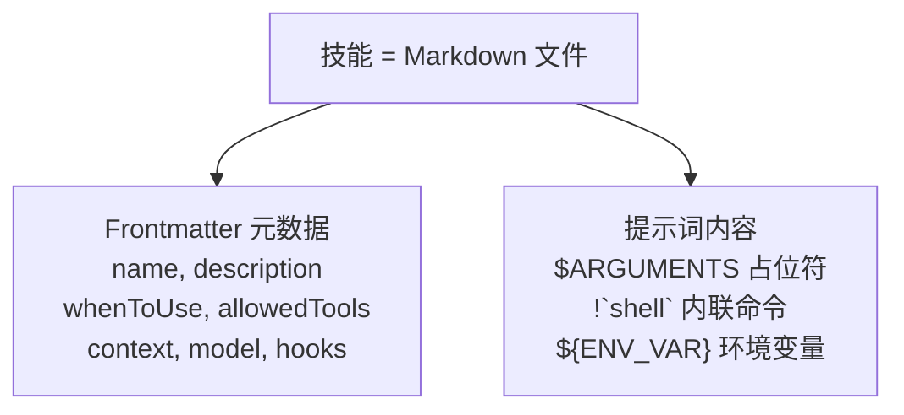
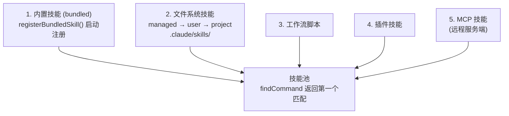
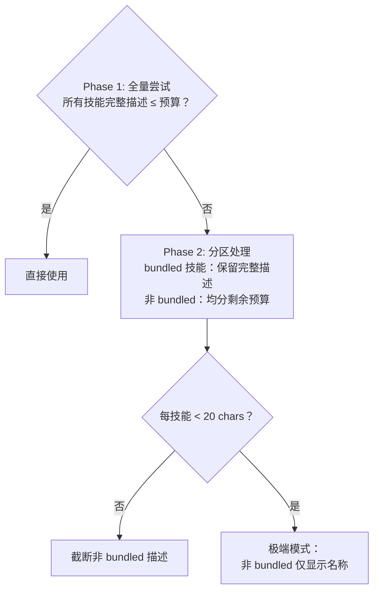
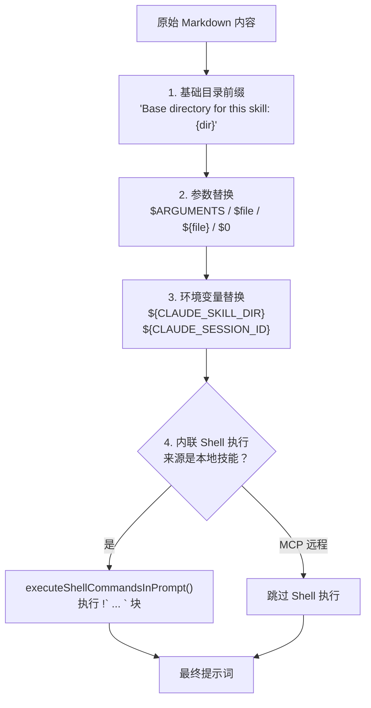
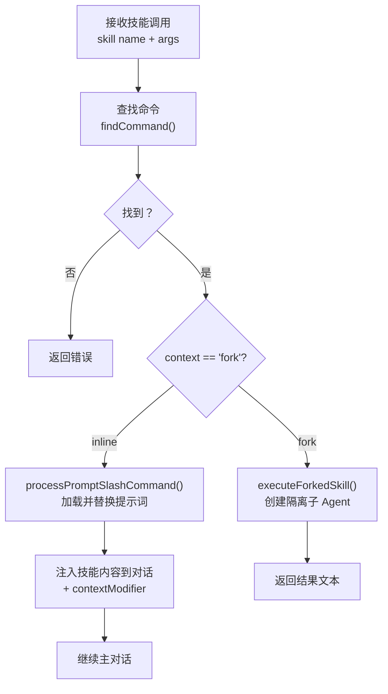
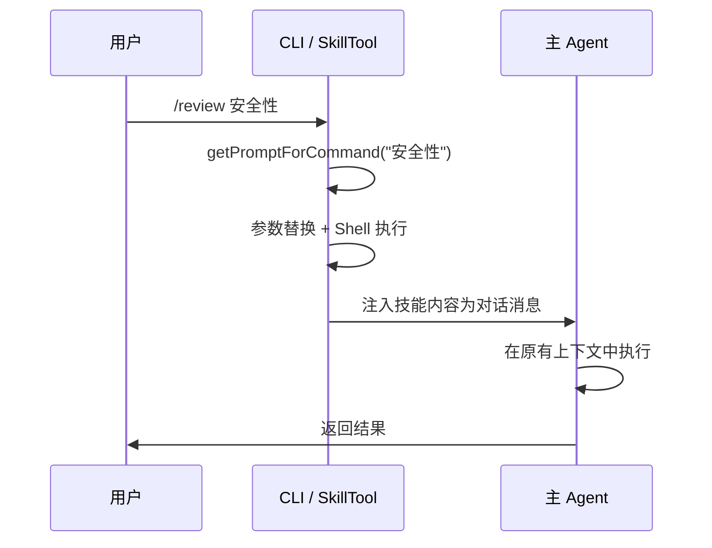
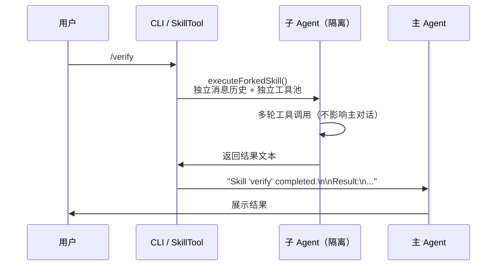

# 第 5 章：技能系统

> 技能是 Claude Code 的"AI Shell 脚本"——将验证有效的 prompt 模板化，让 Agent 不必每次从头编写相同的流程。

## 5.1 什么是技能？

Shell 脚本自动化终端任务，技能自动化 AI 任务。一个技能本质上是：**提示词模板 + 元数据 + 执行上下文**。



技能解决的核心问题：**重复的 AI 工作流**。你让 Claude 做代码审查，每次都要写一遍"检查安全漏洞、看边界情况、注意命名规范……"。技能把这些经过验证的提示词固化下来，一次编写，反复使用。

### 双重调用：技能的关键创新

与传统聊天机器人的 slash command 不同，Claude Code 的技能有两条调用路径：

| 调用方式 | 触发者 | 示例 |
|---------|--------|------|
| 用户手动 | 用户输入 `/commit` | 用户明确需要某个流程 |
| 模型自动 | 模型判断当前任务需要调用技能 | 用户说"帮我提交代码"，模型识别意图后通过 SkillTool 调用 |

**为什么双重调用是好设计？** 传统 slash command 只能手动触发——用户必须知道命令名、记住命令语法。这限制了技能的使用场景：如果用户不知道 `/review` 命令存在，就永远不会使用它。

双重调用让技能成为 Agent 行为的一部分。模型可以根据当前任务的上下文，判断"现在应该调用审查技能"并自动执行。用户不需要记住命令名，只需要表达意图——"帮我看看这段代码有没有问题"，模型就会选择合适的技能。

两条路径在代码层面最终汇合到相同的执行逻辑：`processPromptSlashCommand()`（inline 技能）或 `prepareForkedCommandContext()`（fork 技能）。

### 技能的文件格式

每个技能是一个目录，包含一个 `SKILL.md` 文件：

```
.claude/skills/
  └── review/
      └── SKILL.md        # frontmatter + 提示词
      └── templates/       # 可选：资源文件
          └── report.md
```

为什么是目录格式而非单文件？因为技能可能需要附带资源文件（模板、配置、参考文档），并通过 `${CLAUDE_SKILL_DIR}` 环境变量引用这些资源。目录格式让技能成为一个自包含的单元。

## 5.2 技能来源与加载

> 本节回答：技能从哪里来？Claude Code 启动时做了什么？

### 六个来源

技能从多个来源加载，`loadAllCommands()`（`src/commands.ts`）按以下顺序合并，`findCommand()` 返回**第一个匹配**，因此排在前面的来源优先级更高：



**Bundled 技能优先级最高**——这意味着你无法通过项目技能覆盖内置技能的名称。这是一个有意的设计：核心技能的行为必须可预测，不能被项目配置意外替换。

文件系统技能通过 `realpath()` 解析符号链接去重——相同规范路径的文件视为同一技能，确保在各种环境（容器、NFS、符号链接）下正确去重。

### 懒加载：只加载需要的

这里有一个容易被忽略但重要的设计：技能内容**不在启动时加载**。系统只预加载 frontmatter（name、description、whenToUse），完整的 Markdown 提示词内容在用户实际调用或模型触发时才读取。

```typescript
// src/tools/SkillTool/prompt.ts
export function estimateSkillFrontmatterTokens(skill: Command): number {
  const frontmatterText = [skill.name, skill.description, skill.whenToUse]
    .filter(Boolean)
    .join(' ')
  return roughTokenCountEstimation(frontmatterText)
}
```

**为什么懒加载？** 系统可能注册几十个技能。如果全部加载到上下文中：
- 一个技能可能有几百行提示词，几十个加起来严重挤占上下文空间
- 大部分技能在当前会话中不会被使用
- 全量加载增加启动延迟，影响首次响应速度

通过只加载 frontmatter 来让模型知道"有哪些技能可用"，将内容加载推迟到实际需要时，实现了**展示成本低、执行成本按需付**。

## 5.3 技能发现：模型如何知道技能存在？

> 本节回答：技能列表如何进入模型的视野？模型如何决定何时自动触发技能？

### System-reminder 注入

技能列表不是直接写在 system prompt 中的，而是作为 **attachment** 动态注入，最终包装成 `<system-reminder>` 消息。模型看到的效果是：

```xml
<system-reminder>
The following skills are available for use with the Skill tool:

- update-config: Use this skill to configure the Claude Code harness via settings.json...
- keybindings-help: Use when the user wants to customize keyboard shortcuts...
- simplify: Review changed code for reuse, quality, and efficiency...
- commit: Create a git commit with a descriptive message...
</system-reminder>
```

这个列表由 `getSkillListingAttachments()`（`src/utils/attachments.ts`）生成。它有一个巧妙的增量机制：**只发送新技能**。通过 `sentSkillNames` 按 agentId 追踪已发送的技能名称，避免重复注入。

**为什么用 attachment 而非直接写在 system prompt？** System prompt 是静态的，在会话开始时确定。但技能是动态的——MCP 服务端可能在会话中途上线新技能，插件可能被启用或禁用。Attachment 机制让技能列表可以随对话推进而更新。

### Token 预算：在有限空间中展示技能

技能列表需要占据上下文空间，但空间有限。`formatCommandsWithinBudget()`（`src/tools/SkillTool/prompt.ts`）实现了一个三阶段预算分配算法：

**预算计算**：`1% × 上下文窗口 token 数 × 4 chars/token`，对 200K context 约为 8KB。



**为什么 bundled 技能永不截断？** Bundled 技能代表 Claude Code 的核心能力（`/commit`、`/simplify`、`/debug` 等）。用户期望这些技能始终可被发现。即使安装了大量自定义技能导致预算压力，核心功能的可发现性也不能牺牲。这是一个"核心功能优先"的设计取舍。

每个技能描述还有一个硬上限：`MAX_LISTING_DESC_CHARS = 250` 字符，防止单个技能的长描述挤占其他技能的空间。

### whenToUse：引导模型自动触发

`whenToUse` 字段是技能被模型自动触发的关键。它出现在技能列表中，模型据此判断"当前场景是否需要调用这个技能"。

内置技能中有一个优秀的写法模式——**正面触发 + 反面排除**：

```
TRIGGER when: code imports `anthropic`/`@anthropic-ai/sdk`/`claude_agent_sdk`,
  or user asks to use Claude API, Anthropic SDKs, or Agent SDK.
DO NOT TRIGGER when: code imports `openai`/other AI SDK,
  general programming questions...
```

好的 `whenToUse` 应该：
- **描述用户意图，而非用户的措辞**："当用户需要审查代码质量时" 好于 "当用户说 review 时"
- **包含否定条件**：帮助模型区分相似场景，减少误触发
- **具体而非笼统**："当用户修改了多个文件并想在提交前检查" 好于 "当用户需要帮助时"

用反例来说明这些原则：

```
❌ 不好的写法：
- "当用户说 /review"（描述的是措辞，不是需求——用户可能说"帮我看看代码"）
- "任何时候用户需要帮助"（太笼统，几乎匹配所有场景，导致频繁误触发）
- "当用户想用这个技能时"（循环定义，模型无法从中判断何时触发）

✅ 好的写法：
- "当用户修改了多个文件并想在提交前检查代码质量"
```

需要注意的是，这些触发指令是**文档性的**——模型根据描述自行判断，不是自动化触发器。模型可能会忽略或误判，但这是一个实用的设计：相比构建复杂的规则引擎，让模型理解自然语言描述已经足够好了。

## 5.4 Frontmatter 与提示词处理

> 本节回答：技能文件里可以写什么？提示词在执行前经过了哪些处理？

### Frontmatter 字段

技能文件是 Markdown + YAML frontmatter。以下是所有支持的字段：

| 分类 | 字段 | 说明 |
|------|------|------|
| **基础** | `name` | 显示名称（默认使用目录名） |
| | `description` | 技能描述（影响模型自动触发判断） |
| | `when-to-use` | 自动触发条件描述 |
| | `argument-hint` | 参数提示（显示在帮助和 Tab 补全中） |
| | `arguments` | 命名参数列表（如 `[file, mode]`，映射到 `$file`, `$mode`） |
| **执行** | `context` | `inline`（默认）或 `fork`，决定执行隔离级别 |
| | `allowed-tools` | 工具白名单（限制技能可使用的工具） |
| | `model` | 模型覆盖（`"inherit"` = 继承父级） |
| | `effort` | 工作量级别：`quick` / `standard` / 整数 |
| | `agent` | fork 时使用的 Agent 类型 |
| | `shell` | 内联 Shell 块使用的 Shell 类型 |
| **可见性** | `paths` | gitignore 风格的路径模式（仅在匹配路径下显示） |
| | `user-invocable` | `false` 则用户不可通过 `/name` 直接调用 |
| | `disable-model-invocation` | `true` 则模型不可自动触发 |
| **扩展** | `hooks` | 技能级 Hook 定义（详见 [5.8](#58-扩展机制与设计洞察)） |

几个值得注意的字段设计：

**`paths` 字段**：条件可见性。`parseSkillPaths()` 解析 gitignore 风格的路径模式，技能只在匹配路径下工作时才对模型可见。例如一个 React 组件技能可以设置 `paths: ["src/components/**"]`，在编辑后端代码时不会出现在技能列表中。

**`model` 字段**：`"inherit"` 被解析为 undefined，表示使用当前会话模型。如果主会话模型有后缀（如 `[1m]` 表示思考预算），覆盖时会保留该后缀。

**`hooks` 解析**：通过 Zod schema 校验。无效的 hooks 定义**仅记录警告但不阻止加载**——一个格式错误的 hook 不应该让整个技能不可用。

### 提示词替换管道

技能的提示词在执行时并不直接使用原始 Markdown 内容，而是经历多阶段预处理管道：路径解析、参数绑定、环境变量注入、动态 Shell 命令执行。每一层解决一个具体问题，层层叠加后才生成最终发送给模型的提示词。这个设计让技能既能以静态 Markdown 文件的形式定义和版本管理，又能在运行时动态适应当前项目路径、用户参数和环境上下文。

完整的替换流程（`getPromptForCommand()`）如下：



**Step 1 — 基础目录前缀**：如果技能有关联目录（`skillRoot`），在提示词开头插入路径，让提示词可以引用相对路径资源。

**Step 2 — 参数替换**：`substituteArguments()` 处理多种参数格式：
- `$ARGUMENTS`：替换为全部参数字符串
- `$file` / `${file}`：替换为命名参数（从 frontmatter 的 `arguments` 字段映射）
- `$0` / `$1`：按位置索引替换
- `$ARGUMENTS[0]`：按索引访问
- 如果提示词中**没有任何占位符**，参数会自动追加到末尾（`ARGUMENTS: ...`）

**Step 3 — 环境变量替换**：`${CLAUDE_SKILL_DIR}` 替换为技能目录路径（Windows 下反斜杠自动转正斜杠），`${CLAUDE_SESSION_ID}` 替换为当前会话 ID。

**Step 4 — 内联 Shell 执行**：技能 Markdown 中可以嵌入 `` !`command` `` 格式的 Shell 命令，执行后输出替换回原位：

```markdown
当前分支：!`git branch --show-current`
最近提交：!`git log --oneline -5`
```

所有嵌入的 Shell 命令会**并行执行**（`Promise.all`），每个命令执行前都会进行权限检查。MCP 技能来自远程不受信任的服务端，因此跳过 Shell 执行和 `${CLAUDE_SKILL_DIR}` 替换——这是安全关键路径上的显式检查，在 [5.6 节](#56-安全与信任模型)详细分析。

## 5.5 执行模型：Inline vs Fork

> 本节回答：技能是如何执行的？两种执行模式有什么区别？

### 执行流程概览

无论用户手动输入 `/commit` 还是模型通过 SkillTool 调用，执行流程的核心路径是相同的：



**两条入口路径的汇合**是一个重要的设计细节。用户输入 `/commit -m "fix bug"` 时，CLI 解析 slash command 语法后调用 `processPromptSlashCommand()`。模型通过 SkillTool 调用时，`SkillTool.call()` 同样最终调用 `processPromptSlashCommand()`（inline）或 `prepareForkedCommandContext()`（fork）——**同一个技能无论如何触发，执行逻辑完全一致**。这避免了两条路径行为不一致的风险。

### Inline 模式（默认）

技能的提示词作为消息注入当前对话，模型在原有上下文中继续执行：



Inline 模式的关键机制是 **contextModifier**。`SkillTool.call()` 在处理完 `processPromptSlashCommand()` 的结果后，构建一个 `contextModifier` 函数，它在后续回合中修改执行上下文：

- 如果技能指定了 `allowedTools`，追加到 `alwaysAllowRules`（自动授权这些工具）
- 如果技能指定了 `model`，覆盖后续回合使用的模型
- 如果技能指定了 `effort`，覆盖思考深度

这意味着技能不只是注入一段提示词——它可以**改变 Agent 后续的行为模式**。

**优势**：共享对话上下文（可以引用之前的讨论）、无额外开销。
**劣势**：技能的工具调用会占据主对话上下文空间。

### Fork 模式

创建独立的子 Agent，有自己的消息历史和工具池，完成后将结果返回父对话：



Fork 模式通过 `runAgent()` 创建子 Agent，拥有完全隔离的上下文。子 Agent 完成后，`clearInvokedSkillsForAgent(agentId)` 清理其技能记录，防止状态泄漏。

**优势**：不污染主对话上下文；可限制工具集（安全隔离）；可使用不同模型。
**劣势**：不能引用主对话历史；有创建子 Agent 的额外开销。

### 对比与选择

| 维度 | Inline | Fork |
|------|--------|------|
| 对话历史 | 共享主对话 | 独立隔离 |
| 工具池 | 主 Agent 全部工具 | `allowedTools` 限制 |
| 上下文影响 | 占据主上下文空间 | 不影响主上下文 |
| 模型 | 默认当前模型（可覆盖） | 可指定不同模型 |
| 结果形式 | 直接在对话中输出 | 汇总为一段文本返回 |

**选择 Fork 的场景**：
- 需要大量工具调用（如运行完整测试套件）——避免污染主上下文
- 需要限制可用工具（如审查技能不应写文件）——权限隔离
- 需要使用更便宜的模型做快速检查——成本优化
- 需要失败隔离——fork 失败不影响主对话流

### 实战示例

**代码审查（Fork + 只读工具）**：

```markdown
---
description: 审查当前分支的所有改动
when-to-use: 当用户要求审查代码质量时
allowed-tools: [Bash, Read, Grep, Glob]
context: fork
---

审查当前分支相对于 main 的所有改动。
关注点：$ARGUMENTS
```

选择 fork 因为审查需要大量 `git diff`、`Read`、`Grep` 调用，会污染主上下文。`allowed-tools` 限制为只读——审查不应修改代码。

**代码风格修复（Inline）**：

```markdown
---
description: 检查并修复最近修改文件的代码风格
when-to-use: 当用户修改了代码后想检查风格一致性时
---

检查最近修改的文件是否符合项目代码风格，如果有问题直接修复。
```

选择 inline 因为需要 Edit 工具来修复代码，需要完整工具权限。工具调用量不大，不会严重污染上下文。

**快速扫描（Fork + 轻量模型）**：

```markdown
---
description: 快速检查代码的明显问题
context: fork
model: claude-sonnet
effort: quick
allowed-tools: [Read, Grep, Glob]
---

快速扫描以下文件的明显问题：$ARGUMENTS
重点：未处理的异常、硬编码密钥、明显逻辑错误。
```

用 Sonnet 更快更便宜，fork 隔离，`effort: quick` 进一步降低思考深度。三个维度的资源优化叠加。

## 5.6 安全与信任模型

> 本节回答：技能如何确保安全？不同来源的技能受到什么程度的限制？

### 信任层级

不同来源的技能有不同的信任级别，安全限制随信任度降低而增加：

| 来源 | 信任级别 | 安全策略 |
|------|---------|---------|
| managed（企业策略） | 最高 | 企业管理员审核过，完全信任 |
| bundled（内置） | 高 | Claude Code 团队维护 |
| project / user skills | 中 | 安全属性自动允许，其他需确认 |
| plugin | 中低 | 第三方代码，需要启用的显式同意 |
| MCP | 最低 | 远程不受信任，禁用 Shell 执行和路径暴露 |

### SAFE_SKILL_PROPERTIES：前向兼容的权限设计

SkillTool 在执行技能前检查权限。一个关键优化是：**只包含"安全属性"的技能自动允许，无需用户确认**。

"安全属性"由 `SAFE_SKILL_PROPERTIES` 白名单定义（`src/tools/SkillTool/SkillTool.ts`）。`skillHasOnlySafeProperties()` 遍历技能对象的所有键，检查是否全部在白名单中。

**为什么是白名单而非黑名单？这是一个深思熟虑的安全设计。**

假设未来 `PromptCommand` 类型增加了一个 `networkAccess` 属性：
- **白名单模式**：`networkAccess` 不在白名单中 → 默认需要权限审批 → 安全
- **黑名单模式**：`networkAccess` 未被加入黑名单 → 默认被允许 → **安全漏洞**

白名单的代价只是"遗漏时多一次用户确认"。黑名单的代价是"遗漏时出现安全漏洞"。在安全敏感场景中，**默认拒绝（白名单）** 比默认允许（黑名单）更安全，因为遗忘的后果是不对等的。

### MCP 技能的安全隔离

MCP 技能来自远程服务端，被视为不受信任的代码，施加了最严格的限制：

```typescript
// src/utils/processUserInput/processSlashCommand.tsx
// Security: MCP skills are remote and untrusted
if (loadedFrom !== 'mcp') {
  finalContent = await executeShellCommandsInPrompt(finalContent, ...)
}
```

1. **禁用内联 Shell 执行**：远程提示词中的 `` !`rm -rf /` `` 不会被执行
2. **不替换 `${CLAUDE_SKILL_DIR}`**：对远程技能无意义，且暴露本地路径是信息泄露

注意这个检查是**显式实现**的——直接在代码中 `if (loadedFrom !== 'mcp')`，而非依赖某个抽象层的过滤。安全关键路径上的显式检查比隐式依赖更可靠，因为你可以直接看到"什么被阻止了"。

### Fork 模式的安全意义

Fork 不只是"在另一个线程运行"——它提供了三重隔离：

- **权限隔离**：`allowedTools` 限制子 Agent 可用的工具。审查技能设置 `allowed-tools: [Bash, Read, Grep, Glob]`，即使提示词被注入恶意指令也无法写文件
- **上下文隔离**：子 Agent 看不到主对话历史，也不会向主对话泄露信息
- **模型隔离**：可以用不同模型，如用 Sonnet 做快速检查而非 Opus

### 内置技能的安全文件提取

部分 bundled 技能需要在运行时提取资源文件到磁盘。`safeWriteFile()` 使用了多重安全措施防止攻击：

- **`O_NOFOLLOW | O_EXCL` 标志**：防止符号链接攻击（攻击者预先在目标路径创建指向敏感文件的符号链接）
- **路径遍历检查**：`resolveSkillFilePath()` 拒绝包含 `..` 或绝对路径的文件名
- **owner-only 权限**（`0o700`/`0o600`）：只有当前用户可读写
- **懒提取 + memoize**：`extractionPromise` 确保多个并发调用等待同一个提取完成，而不是竞争写入

## 5.7 长会话中的技能持久性

> 本节回答：对话压缩后，技能指令会丢失吗？

### 问题

当对话过长触发 autocompact（上下文压缩）时，之前注入的技能提示词会被压缩摘要覆盖。模型失去对技能指令的访问——压缩前按技能指令行事，压缩后"忘记"了技能。

如果不解决这个问题，一个长时间的编码会话会逐渐"衰减"：第 50 轮使用 `/commit` 的行为可能与第 5 轮不一致。

### 解决方案

`addInvokedSkill()` 在每次技能调用时记录完整信息到全局状态（按 `agentId` 隔离）：

```typescript
// src/bootstrap/state.ts
addInvokedSkill(name, path, content, agentId)
// 记录：名称、路径、完整内容、时间戳、所属 Agent ID
```

压缩后，`createSkillAttachmentIfNeeded()` 从全局状态重建技能内容作为 attachment 重新注入。

### 预算管理

恢复不是无限制的——有明确的预算控制：

```
POST_COMPACT_SKILLS_TOKEN_BUDGET = 25,000  总预算
POST_COMPACT_MAX_TOKENS_PER_SKILL = 5,000  单技能上限
```

分配策略：
- 按 `invokedAt` 时间戳排序（最近调用优先，`b.invokedAt - a.invokedAt` 降序）——最近使用的技能最可能仍然相关
- 超出单技能上限时，**保留头部截断尾部**——因为技能的设置指令和使用说明通常在开头
- 超出总预算时，最不活跃的技能被丢弃

### Agent 作用域隔离

记录的技能按 `agentId` 隔离——子 Agent 调用的技能不会泄漏到父 Agent 的压缩恢复中，反之亦然。`clearInvokedSkillsForAgent(agentId)` 在 fork Agent 完成时清理其技能记录。这确保了压缩恢复的精确性：每个 Agent 只恢复自己实际使用过的技能。

## 5.8 扩展机制与设计洞察

> 本节回答：技能系统如何支持扩展？整体设计有哪些值得学习的地方？

### 技能级 Hook

技能可以在 frontmatter 中定义自己的 Hook，在技能执行期间生效：

```yaml
hooks:
  PreToolUse:
    - matcher: "Bash(*)"
      hooks:
        - type: command
          command: "validate-deploy-command.sh"
```

**层级叠加**：技能级 Hook 不覆盖全局 Hook（`settings.json`），而是叠加。两者同时生效，全局 Hook 先执行。这意味着企业管理员设置的安全 Hook 不会被技能绕过。

**注册时机**：技能的 Hook 在调用时才注册（`registerSkillHooks()`），与懒加载原则一致。校验通过 Zod schema 完成，格式错误的 Hook 记录警告但不阻止技能加载——容错优先。

### 内置技能架构

内置技能通过 `registerBundledSkill()`（`src/skills/bundledSkills.ts`）在启动时注册，内容编译在二进制中，不需要运行时文件读取：

```typescript
registerBundledSkill({
  name: 'simplify',
  description: 'Review changed code for reuse, quality, and efficiency...',
  userInvocable: true,
  async getPromptForCommand(args) {
    let prompt = SIMPLIFY_PROMPT
    if (args) prompt += `\n\n## Additional Focus\n\n${args}`
    return [{ type: 'text', text: prompt }]
  },
})
```

需要引用资源文件的技能通过 `files` 属性声明——首次调用时提取到 `~/.claude/bundled-skills/{name}/`，`extractionPromise` 被 memoize 化确保并发安全。技能提示词自动添加 `"Base directory for this skill: {dir}"` 前缀。

部分内置技能受 Feature Flag 控制（如 `claudeApi` 需要 `BUILDING_CLAUDE_APPS`），通过 `isEnabled` 回调动态判断可用性。

### 设计洞察

**1. 发现与执行分离**：Frontmatter 用于浏览和发现（低成本），完整内容用于执行（按需加载）。这是管理大型工具集的通用模式——展示目录不需要加载全部内容。对上下文空间宝贵的 AI 系统尤为重要。

**2. 白名单权限是前向兼容安全**：新增属性默认需要权限审批。遗漏的黑名单条目是安全漏洞，遗漏的白名单条目只是多一次用户确认。这种不对称性决定了白名单是更安全的选择。

**3. 双重调用扩展了技能的适用范围**：让技能从"用户必须记住的命令"变为"Agent 自动选择的能力"。用户表达意图，Agent 选择工具——这更接近人类协作的模式。

**4. Fork 模式 = 权限隔离 + 上下文隔离 + 模型隔离**：三重隔离让 fork 不只是性能优化工具，更是安全边界。设计安全敏感的技能时，fork 应该是默认选择。

**5. 压缩后恢复确保长会话一致性**：这个机制解决的是一个容易被忽略的问题——随着对话增长，技能指令会被压缩掉。按时间优先的预算分配是一个实用的启发式：最近使用的技能最可能仍然相关。

---

> **动手实践**：在 `.claude/skills/` 目录下创建一个自定义技能。从最简单的 inline 技能开始——只需要一个 `skill-name/SKILL.md` 文件。观察它如何出现在 `/` 补全列表中，以及模型如何根据 `when-to-use` 自动触发它。

上一章：[工具系统](./04-tool-system.md) | 下一章：[记忆系统](./08-memory-system.md)
