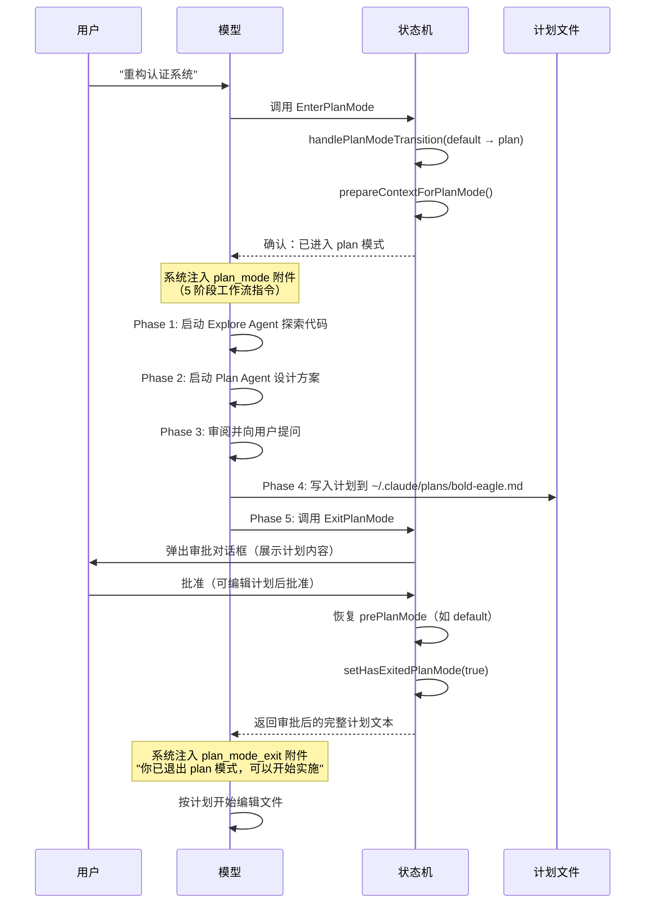
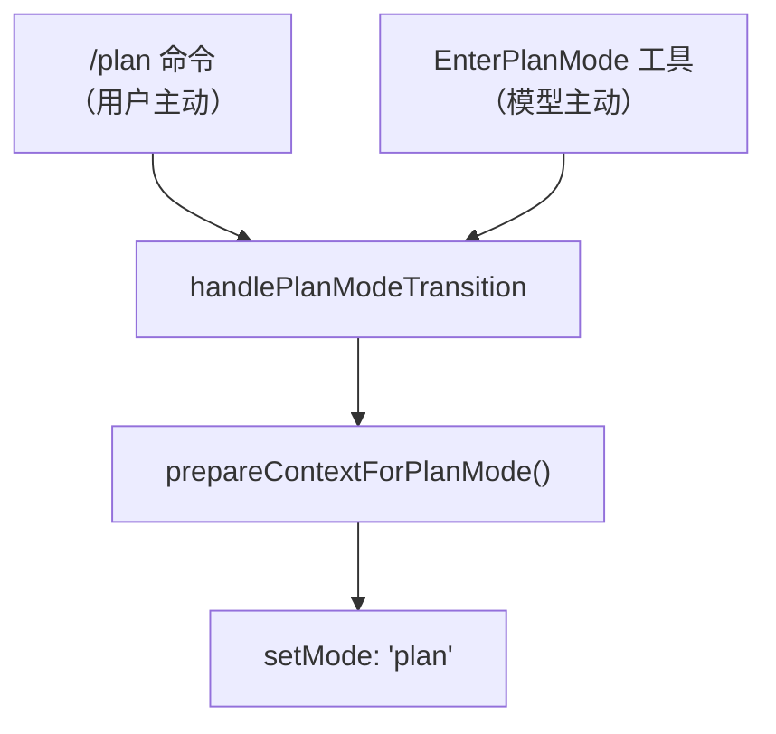

# 第 9 章：Plan 模式

> 先想清楚再动手——Plan 模式是 Claude Code 中唯一一个**主动降低自身权限**来换取用户信任的机制。

## 9.1 为什么需要 Plan 模式

想象这样一个场景：你让 Claude Code "重构整个认证系统"。它二话不说就开始改文件——改了 12 个文件、删了 3 个函数、引入了一个你完全不想要的 JWT 库。你只能 `git checkout .` 然后重来。

这就是没有 Plan 模式的世界。

Plan 模式的核心设计理念是：**对于复杂任务，让模型先探索、再规划、用户审批后才动手**。它通过权限降级（禁止一切写操作）强制模型进入"只读探索 + 输出计划"的工作模式，直到用户明确批准计划后才恢复写权限。

关键文件：

| 文件 | 行数 | 职责 |
|------|------|------|
| `src/tools/EnterPlanModeTool/EnterPlanModeTool.ts` | 127 行 | 进入 Plan 模式的工具 |
| `src/tools/ExitPlanModeTool/ExitPlanModeV2Tool.ts` | 493 行 | 退出 Plan 模式 + 审批流程 |
| `src/utils/plans.ts` | 398 行 | 计划文件管理（slug、读写、恢复） |
| `src/utils/planModeV2.ts` | 96 行 | 配置（Agent 数量、实验变体） |
| `src/utils/messages.ts:3136-3417` | ~280 行 | Plan 模式系统消息生成 |
| `src/utils/permissions/permissionSetup.ts` | ~60 行 | 权限上下文准备与恢复 |
| `src/bootstrap/state.ts:1349-1470` | ~120 行 | Plan 模式全局状态 |

## 9.2 全景：一次完整的 Plan 模式流程



整个流程的关键在于**状态转换的对称性**：进入时记住原模式（`prePlanMode`），退出时精确恢复。这保证了 Plan 模式是一个"可嵌套的插入层"——无论你原来是 default、auto 还是 bypassPermissions 模式，Plan 模式结束后都能无缝回到之前的状态。

## 9.3 进入 Plan 模式：两条路径

有两种方式进入 Plan 模式，但最终都汇聚到同一个状态转换函数：



### 9.3.1 用户主动：`/plan` 命令

用户在 REPL 中输入 `/plan` 或 `/plan 重构认证系统`，触发 `src/commands/plan/plan.tsx:64-121`：

```typescript
// src/commands/plan/plan.tsx
const currentMode = appState.toolPermissionContext.mode
if (currentMode !== 'plan') {
  handlePlanModeTransition(currentMode, 'plan')
  setAppState(prev => ({
    ...prev,
    toolPermissionContext: applyPermissionUpdate(
      prepareContextForPlanMode(prev.toolPermissionContext),
      { type: 'setMode', mode: 'plan', destination: 'session' },
    ),
  }))
}
```

如果命令带了描述（如 `/plan 重构认证系统`），会同时将描述作为用户消息提交给模型，触发一次完整的查询循环——模型在 plan 模式下收到这条消息后就会开始探索。

### 9.3.2 模型主动：EnterPlanMode 工具

这是更常见的路径。模型判断当前任务复杂度较高时，**主动调用** `EnterPlanMode` 工具请求进入计划模式。

`src/tools/EnterPlanModeTool/EnterPlanModeTool.ts:77-101`：

```typescript
async call(_input, context) {
  // 子 Agent 不允许进入 plan 模式——plan 是用户级别的决策
  if (context.agentId) {
    throw new Error('EnterPlanMode tool cannot be used in agent contexts')
  }

  const appState = context.getAppState()
  handlePlanModeTransition(appState.toolPermissionContext.mode, 'plan')

  context.setAppState(prev => ({
    ...prev,
    toolPermissionContext: applyPermissionUpdate(
      prepareContextForPlanMode(prev.toolPermissionContext),
      { type: 'setMode', mode: 'plan', destination: 'session' },
    ),
  }))

  return {
    data: { message: 'Entered plan mode. You should now focus on exploring...' },
  }
}
```

注意 `context.agentId` 的检查——这是一个关键的设计约束：**子 Agent 不能进入 Plan 模式**。原因很直接：Plan 模式需要用户交互（审批计划），但子 Agent 运行在后台，没有与用户直接交互的能力。如果允许子 Agent 进入 Plan 模式，它会永远卡在等待审批的状态。

### 9.3.3 工具的 Prompt：引导模型何时进入

模型怎么知道什么时候该进入 Plan 模式？答案在工具的 prompt 中。Claude Code 通过精心设计的 prompt 引导模型做出判断。

对于**外部用户**（`src/tools/EnterPlanModeTool/prompt.ts:16-99`），prompt 列出了 7 种应该进入 Plan 模式的条件：

```
1. 新功能实现：添加有意义的新功能
2. 多种可行方案：任务有多种合理解法
3. 代码修改：影响现有行为或结构的变更
4. 架构决策：需要在模式或技术间做选择
5. 多文件变更：可能涉及 2-3 个以上文件
6. 需求不明确：需要先探索才能理解范围
7. 用户偏好重要：实现可以有多种合理方向
```

而对于**内部用户**（ant），prompt 要更保守——只在"真正存在架构歧义"时才建议进入 Plan 模式，避免过度规划拖慢节奏。这反映了一个实际观察：**内部用户通常对代码库更熟悉，不需要那么多"先规划再动手"的保护**。

## 9.4 Plan 模式下的系统消息注入

进入 Plan 模式后，Claude Code 通过**附件系统（Attachment System）**在每轮对话中注入指令，告诉模型"你现在只能读不能写"以及"应该按什么流程工作"。

### 9.4.1 附件的节流机制

不是每轮都注入完整指令——那会浪费大量 token。Plan 模式的系统消息本质上是**模型行为的防护栏**（"你现在只能读不能写"），但如果每轮都重复完整指令，不仅浪费 token，还可能导致模型对这些指令产生"疲劳"——过于频繁的重复提醒反而削弱指令的效力。因此 Claude Code 采用了**渐进式提醒策略**：首轮提供完整上下文建立规则意识，中间若干轮信任模型的短期记忆，然后定期用轻量提醒刷新模型对当前模式的认知。

`src/utils/attachments.ts:1189-1242` 实现了这套节流逻辑的具体规则：

| 轮次 | 注入内容 | 原因 |
|------|---------|------|
| 第 1 轮 | **完整指令**（full） | 模型首次进入，需要完整上下文 |
| 第 2-4 轮 | 不注入 | 节省 token，模型应该还记得 |
| 第 5 轮 | **简短提醒**（sparse） | 防止模型"忘记"自己在 plan 模式 |
| 第 6-9 轮 | 不注入 | 继续节省 |
| 第 10 轮 | 简短提醒 | 继续提醒 |
| 每 25 轮 | 完整指令 | 长会话中完整刷新上下文 |

配置常量（`src/utils/attachments.ts:259-262`）：

```typescript
export const PLAN_MODE_ATTACHMENT_CONFIG = {
  TURNS_BETWEEN_ATTACHMENTS: 5,          // 每 5 轮注入一次
  FULL_REMINDER_EVERY_N_ATTACHMENTS: 5,  // 每 5 次注入中有 1 次是完整版
} as const
```

这意味着完整指令大约每 25 轮才出现一次（5 × 5），其余时候用极短的 sparse 提醒（约 300 字符）维持模型对当前模式的意识。

### 9.4.2 两种工作流模式

Claude Code 实际上有**两套**完全不同的 Plan 模式工作流，通过 feature gate 切换。

#### 5 阶段工作流（默认）

这是大多数用户看到的模式（`src/utils/messages.ts:3207-3297`）。注入的系统消息将整个规划过程分为 5 个严格的阶段：

```
Phase 1: Initial Understanding
  → 启动 Explore Agent 探索代码库
  → "你在这个阶段只能使用 Explore 子 agent"

Phase 2: Design
  → 启动 Plan Agent 设计方案
  → 可并行启动多个 Agent 从不同角度设计

Phase 3: Review
  → 综合各 Agent 结果，向用户提问澄清

Phase 4: Final Plan
  → 将最终方案写入计划文件

Phase 5: Call ExitPlanMode
  → 提交计划等待用户审批
```

每个阶段的 Agent 数量是动态的，取决于用户的订阅类型（`src/utils/planModeV2.ts:5-29`）：

```typescript
export function getPlanModeV2AgentCount(): number {
  // 环境变量覆盖优先
  if (process.env.CLAUDE_CODE_PLAN_V2_AGENT_COUNT) { ... }

  const subscriptionType = getSubscriptionType()
  const rateLimitTier = getRateLimitTier()

  // Max 20x 订阅：3 个并行 Plan Agent
  if (subscriptionType === 'max' && rateLimitTier === 'default_claude_max_20x') {
    return 3
  }
  // Enterprise/Team 用户：3 个
  if (subscriptionType === 'enterprise' || subscriptionType === 'team') {
    return 3
  }
  // 其他用户：1 个
  return 1
}
```

设计思路很实际：**Plan Agent 会消耗大量 token**（每个 Agent 独立探索代码库），只有高额度用户才能承受 3 个 Agent 并行规划的成本。

#### 迭代工作流（Interview Phase）

这是一种更灵活的替代方案（`src/utils/messages.ts:3323-3383`），通过 `isPlanModeInterviewPhaseEnabled()` 控制开启。核心区别是**不分阶段**，而是一个持续循环：

```
循环：
  1. Explore — 用只读工具读代码
  2. Update the plan file — 每次发现都立即写入计划
  3. Ask the user — 遇到歧义就问用户
  → 回到 1，直到计划完成
```

关键的 prompt 差异体现在对话风格上：

```
5 阶段模式："Launch up to 3 Explore agents IN PARALLEL"
  → 鼓励模型一次性大量探索，然后综合

迭代模式："Start by quickly scanning a few key files...
           Then write a skeleton plan and ask the user your first round of questions.
           Don't explore exhaustively before engaging the user."
  → 鼓励模型快速交互，渐进式深入
```

### 9.4.3 Phase 4 的四种实验变体

Phase 4（最终计划的格式要求）是一个**正在进行的 A/B 实验**（`tengu_pewter_ledger`），有四个变体（`src/utils/messages.ts:3156-3205`）：

| 变体 | 核心区别 | 目标 |
|------|---------|------|
| **control** | 完整格式：Context + 推荐方案 + 文件路径 + 验证步骤 | 基线 |
| **trim** | 一行 Context + 单个验证命令 | 中等压缩 |
| **cut** | 禁止写 Context 段落 + 每文件一行 + 单个验证命令 | 大幅压缩 |
| **cap** | 禁止一切 prose + 每文件一 bullet + **硬限制 40 行** | 极致压缩 |

> 这个实验的动机来自生产数据：基线（control）下的计划文件 p50 为 4,906 字符、p90 为 11,617 字符、均值 6,207 字符。Opus 输出价格是输入的 5 倍，过长的计划文件直接推高了成本。而且**拒绝率与计划长度正相关**：<2K 的计划拒绝率 20%，>20K 的拒绝率高达 50%。也就是说，**计划越长用户越不满意**。

## 9.5 计划文件管理

### 9.5.1 文件命名与存储

每个会话的计划文件存储在 `~/.claude/plans/` 目录下，文件名是一个随机生成的 word slug：

```
~/.claude/plans/bold-eagle.md          ← 主会话的计划
~/.claude/plans/bold-eagle-agent-7.md  ← 子 Agent 7 的计划
```

`src/utils/plans.ts:32-49`：

```typescript
export function getPlanSlug(sessionId?: SessionId): string {
  const id = sessionId ?? getSessionId()
  const cache = getPlanSlugCache()
  let slug = cache.get(id)
  if (!slug) {
    const plansDir = getPlansDirectory()
    // 最多重试 10 次以避免文件名冲突
    for (let i = 0; i < MAX_SLUG_RETRIES; i++) {
      slug = generateWordSlug()
      const filePath = join(plansDir, `${slug}.md`)
      if (!getFsImplementation().existsSync(filePath)) {
        break
      }
    }
    cache.set(id, slug!)
  }
  return slug!
}
```

Slug 在会话内缓存（`planSlugCache: Map<SessionId, string>`），确保同一会话始终写入同一个文件。为什么用 word slug 而不是 UUID？因为用户可能需要手动打开和编辑这个文件——`bold-eagle.md` 比 `a3f7b2c1-4d5e-6f78.md` 更易于识别和记忆。

### 9.5.2 Resume 与 Fork

当用户恢复之前的会话时，需要找回对应的计划文件。之所以需要多达 5 层恢复策略，根本原因在于**本地会话和远程会话（CCR）的文件持久化能力完全不同**：本地用户的计划文件安全地存储在磁盘上，恢复很简单；但远程用户的 pod 随时可能被回收，文件可能已经不存在，必须从 transcript 中的各种位置尝试恢复。

`copyPlanForResume()`（`src/utils/plans.ts:164-230`）的恢复策略是分层的：

```
1. 直接读取文件        → 文件还在磁盘上（本地会话的常见情况）
2. 文件快照恢复        → 从 transcript 中的 file_snapshot 消息恢复（远程会话）
3. ExitPlanMode 输入   → 从 tool_use 块中提取 plan 字段
4. planContent 字段    → 从 user message 的 planContent 字段提取
5. plan_file_reference → 从 auto-compact 创建的附件中提取
```

为了应对远程场景，Claude Code 在每次 `normalizeToolInput()` 时都会调用 `persistFileSnapshotIfRemote()`，将计划内容作为 `file_snapshot` 系统消息写入 transcript——这是远程会话中唯一可靠的持久化渠道。

Fork 会话（`copyPlanForFork()`，`src/utils/plans.ts:239-264`）更简单但有一个关键细节：**生成新的 slug**。如果复用原始 slug，原始会话和 fork 会话会写入同一个文件——导致互相覆盖。

## 9.6 退出 Plan 模式：审批与权限恢复

退出是整个 Plan 模式中最复杂的部分，因为它需要同时处理权限恢复、用户审批、计划同步和多种执行上下文。

### 9.6.1 验证：必须在 Plan 模式中

`ExitPlanModeV2Tool` 的第一道检查（`src/tools/ExitPlanModeTool/ExitPlanModeV2Tool.ts:195-219`）：

```typescript
async validateInput(_input, { getAppState, options }) {
  if (isTeammate()) {
    return { result: true }
  }
  const mode = getAppState().toolPermissionContext.mode
  if (mode !== 'plan') {
    logEvent('tengu_exit_plan_mode_called_outside_plan', { ... })
    return {
      result: false,
      message: 'You are not in plan mode. This tool is only for exiting plan mode...',
      errorCode: 1,
    }
  }
  return { result: true }
}
```

为什么还需要这个检查？因为**模型有时会"忘记"自己已经退出了 Plan 模式**，然后再次调用 `ExitPlanMode`。这种"失忆"主要有三个原因：

1. **上下文压缩（Compact）清除了关键信号**：早期的 ExitPlanMode 成功消息在压缩后可能被丢弃，模型看不到"已经退出"的证据
2. **Deferred tool 列表的误导**：模型在工具列表中仍然看到 `ExitPlanMode` 可用，容易误认为自己还在 Plan 模式中
3. **模式状态缺乏显式标记**：当前模式信息主要通过系统附件传递，如果附件因节流未注入，模型可能产生状态混淆

这个检查避免了重复退出导致的状态混乱。

### 9.6.2 用户审批

通过 `checkPermissions()` 触发权限请求对话框（`src/tools/ExitPlanModeTool/ExitPlanModeV2Tool.ts:221-239`）：

```typescript
async checkPermissions(input, context) {
  if (isTeammate()) {
    return { behavior: 'allow' as const, updatedInput: input }
  }
  return {
    behavior: 'ask' as const,
    message: 'Exit plan mode?',
    updatedInput: input,
  }
}
```

用户在审批对话框中可以：
- **直接批准**：计划原样通过
- **编辑后批准**：修改计划内容后批准（通过 `permissionResult.updatedInput.plan` 传回）
- **拒绝**：不退出 Plan 模式，继续修改计划

### 9.6.3 权限恢复的精密逻辑

`call()` 方法中的权限恢复是最精妙的部分（`src/tools/ExitPlanModeTool/ExitPlanModeV2Tool.ts:357-403`）：

```typescript
context.setAppState(prev => {
  if (prev.toolPermissionContext.mode !== 'plan') return prev
  setHasExitedPlanMode(true)
  setNeedsPlanModeExitAttachment(true)

  let restoreMode = prev.toolPermissionContext.prePlanMode ?? 'default'

  // 断路器防御：如果 prePlanMode 是 auto，但 auto gate 已关闭
  // → 回退到 default，不能绕过断路器
  if (feature('TRANSCRIPT_CLASSIFIER')) {
    if (restoreMode === 'auto' && !isAutoModeGateEnabled()) {
      restoreMode = 'default'  // 安全回退
    }
    autoModeStateModule?.setAutoModeActive(restoreMode === 'auto')
  }

  // 权限规则恢复
  let baseContext = prev.toolPermissionContext
  if (restoreMode === 'auto') {
    // 恢复到 auto：保持危险权限被剥离
    baseContext = stripDangerousPermissionsForAutoMode(baseContext)
  } else if (prev.toolPermissionContext.strippedDangerousRules) {
    // 恢复到非 auto：还原被剥离的危险权限
    baseContext = restoreDangerousPermissions(baseContext)
  }

  return {
    ...prev,
    toolPermissionContext: {
      ...baseContext,
      mode: restoreMode,
      prePlanMode: undefined,  // 清除，防止下次退出时误用
    },
  }
})
```

这段逻辑处理了一个非常细腻的边缘情况：**断路器防御**。假设用户原来在 auto 模式，进入 Plan 模式时系统记住了 `prePlanMode: 'auto'`。但在 Plan 模式期间，auto 模式的断路器触发了（比如连续失败次数超过阈值），auto gate 被关闭。此时如果盲目恢复到 `auto`，就相当于绕过了断路器——这是不允许的。所以要先检查 `isAutoModeGateEnabled()`，如果 gate 已关闭则回退到 `default`。

### 9.6.4 四种结果消息

`mapToolResultToToolResultBlockParam()` 根据不同的上下文返回 4 种不同的消息（`src/tools/ExitPlanModeTool/ExitPlanModeV2Tool.ts:419-492`）：

| 上下文 | 返回消息 | 后续行为 |
|--------|---------|---------|
| **Teammate 等待审批** | "Your plan has been submitted to the team lead..." + Request ID | 模型等待 inbox 消息 |
| **子 Agent** | "User has approved the plan. Please respond with 'ok'" | 子 Agent 结束 |
| **空计划** | "User has approved exiting plan mode. You can now proceed." | 直接开始工作 |
| **正常审批** | "User has approved your plan..." + 完整计划文本 | 按计划实施 |

正常审批的消息中会**回传完整的计划文本**，这不是冗余——它确保模型在后续实施中可以直接引用计划内容，而不需要重新读取计划文件。如果用户编辑了计划，标签会变成 `"Approved Plan (edited by user)"`，提醒模型注意用户的修改。

## 9.7 状态管理的全局视图

Plan 模式的状态分散在多个位置，但通过 `handlePlanModeTransition()` 函数统一管理转换逻辑（`src/bootstrap/state.ts:1349-1363`）：

```typescript
export function handlePlanModeTransition(fromMode: string, toMode: string): void {
  // 进入 plan：清除遗留的退出附件标志
  if (toMode === 'plan' && fromMode !== 'plan') {
    STATE.needsPlanModeExitAttachment = false
  }
  // 退出 plan：触发一次性退出附件
  if (fromMode === 'plan' && toMode !== 'plan') {
    STATE.needsPlanModeExitAttachment = true
  }
}
```

完整的状态字段：

```typescript
// src/bootstrap/state.ts
STATE = {
  hasExitedPlanMode: boolean,           // 会话级：是否曾退出 plan 模式
  needsPlanModeExitAttachment: boolean, // 一次性标志：下一轮注入退出消息
  needsAutoModeExitAttachment: boolean, // 一次性标志：auto 模式退出消息
  planSlugCache: Map<SessionId, string>, // 会话 → slug 的映射
}

// ToolPermissionContext 中的 plan 相关字段
{
  mode: 'default' | 'plan' | 'auto' | 'bypassPermissions',
  prePlanMode?: 'default' | 'auto' | 'bypassPermissions', // 进入 plan 前的模式
  strippedDangerousRules?: ..., // auto 模式被剥离的危险权限（plan 期间保存）
}
```

`needsPlanModeExitAttachment` 和 `needsAutoModeExitAttachment` 是**一次性标志**（fire-once flag）。它们在被消费后立即清除，确保退出消息只注入一次。这种设计避免了"退出 plan 模式"的通知在后续每轮都重复出现。

## 9.8 重入 Plan 模式

如果用户在同一会话中第二次进入 Plan 模式，系统会注入一条特殊的重入指引（`src/utils/messages.ts:3829-3847`）：

```
## Re-entering Plan Mode

You are returning to plan mode after having previously exited it.
A plan file exists at {planFilePath} from your previous planning session.

Before proceeding with any new planning, you should:
1. Read the existing plan file to understand what was previously planned
2. Evaluate the user's current request against that plan
3. Decide how to proceed:
   - Different task → start fresh by overwriting
   - Same task, continuing → modify existing plan
4. Always edit the plan file before calling ExitPlanMode
```

这条指引解决了一个实际问题：模型可能**误以为旧计划仍然有效**。明确要求"先读取旧计划、再判断是否相关"，避免了在过期的计划基础上继续工作。

## 9.9 与其他系统的交互

### 9.9.1 与权限系统

Plan 模式深度集成在 [权限系统](./11-permission-security.md) 中。`prepareContextForPlanMode()` 的行为取决于进入前的模式：

```
从 default 进入 plan：
  → 简单保存 prePlanMode = 'default'

从 auto 进入 plan（且 shouldPlanUseAutoMode = false）：
  → 关闭 auto mode
  → 恢复被剥离的危险权限
  → 设置 needsAutoModeExitAttachment = true
  → 保存 prePlanMode = 'auto'

从 auto 进入 plan（且 shouldPlanUseAutoMode = true）：
  → 保持 auto mode 活跃
  → 保存 prePlanMode = 'auto'
```

### 9.9.2 与多 Agent 系统

Plan 模式为 [多 Agent 架构](./07-multi-agent.md) 中的子 Agent 提供专用指令（`src/utils/messages.ts:3399-3417`）。子 Agent 的计划文件使用独立的命名空间（`{slug}-agent-{agentId}.md`），避免与主会话的计划文件冲突。

### 9.9.3 与 normalizeToolInput

`src/utils/api.ts:572-580` 中，`normalizeToolInput()` 对 `ExitPlanMode` 做了特殊处理——从磁盘读取计划内容并注入到工具输入中：

```typescript
case EXIT_PLAN_MODE_V2_TOOL_NAME: {
  const plan = getPlan(agentId)
  const planFilePath = getPlanFilePath(agentId)
  void persistFileSnapshotIfRemote()
  return plan !== null ? { ...input, plan, planFilePath } : input
}
```

注入的 `plan` 和 `planFilePath` 字段供 Hook 和 SDK 消费者使用，但在发送给 API 之前会被 `normalizeToolInputForAPI()` 剥离——因为 API schema 中没有这些字段。

## 9.10 设计洞察

1. **主动降权换信任**：Plan 模式是整个 Claude Code 中唯一一个"模型主动要求降低自己权限"的机制。这种设计将"我需要权限"的传统模式反转为"我主动放弃权限以换取你的信任"——当模型判断任务复杂时，它选择先束缚自己的双手，只用眼睛看，直到你说"可以动手了"。

2. **对称的状态转换**：进入时 `prePlanMode = currentMode`，退出时 `currentMode = prePlanMode`。这种对称性保证了 Plan 模式是一个"纯函数"——它不产生副作用，退出后系统状态与进入前完全一致（除了多了一个计划文件）。

3. **渐进式 prompt 注入**：full → sparse → full 的节流策略在 token 成本和模型记忆之间找到了平衡。完整指令约 4,700 字符（~1,200 token），sparse 提醒仅 300 字符（~75 token）。按平均 15 轮的 plan 会话计算，节流策略节省了约 10,000 token。

4. **实验驱动的迭代**：Phase 4 的四种变体不是拍脑袋设计的——它们基于 26.3M 次会话的基线数据，用科学的 A/B 测试验证"更短的计划是否导致更好的用户满意度"。这体现了工程团队将**用户满意度（拒绝率）而非技术指标（计划长度）**作为优化目标的思路。

5. **容灾设计无处不在**：从 5 层计划恢复策略、到断路器防御、到重入引导，Plan 模式的每个环节都在问"如果出了问题怎么办"。这不是过度设计——在一个 AI 系统中，模型的行为本质上是不可预测的，防御性编程是唯一合理的策略。

---

> **动手实践**：尝试在 Claude Code 中输入 `/plan 重构你项目中最复杂的模块`，观察模型如何探索代码、生成计划、等待你的审批。然后编辑计划文件（`~/.claude/plans/*.md`）后再批准，观察模型如何处理你的修改。

上一章：[多 Agent 架构](./07-multi-agent.md) | 下一章：[代码编辑策略](./05-code-editing-strategy.md)
