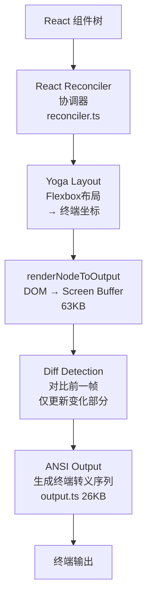

# 第 14 章：用户体验设计

> 好用 = 模型能力 x 交互设计 x 工程约束

### 章节概览

本章覆盖 Claude Code 终端 UI 的完整技术栈。全文围绕三层核心展开：

- **渲染引擎**（14.2）：自研 Ink/React 终端渲染器，包括 Yoga 布局、Screen Buffer diff、对象池内存优化
- **数据流**（14.3）：从 API SSE 到终端渲染的 `Stream<T>` + `async function*` 流式管线，以及 `StreamingMarkdown` 增量解析
- **交互层**（14.4–14.8）：工具调用透明度、错误自动恢复、键盘快捷键、Vim 模式、REPL 主界面（虚拟滚动、权限防误触、会话恢复）

此外还涵盖：终端协议支持（14.9）、诊断界面（14.10）、成本追踪（14.11）、搜索与文本选择（14.12）。最后在 14.13 提炼设计洞察。

## 14.1 设计哲学

每个 Code Agent 都面临一个核心 UX 矛盾：**自主性与信任之间的张力**。

给 Agent 太多自主权，用户会不安——"它在我看不见的地方改了什么文件？"。给 Agent 太少自主权，每一步都要确认，用户会烦躁——"这比我自己写还慢"。两种极端都不可用。

Claude Code 在这两者之间找到了一个精确的平衡点：**可观察的自主性（Observable Autonomy）**。Agent 自由行动，但让用户能实时看到每一步：

- **实时可见**：所有工具调用流式展示。这不是"等执行完告诉你结果"，而是"你能在执行过程中看到参数和进度"。好处是用户可以在 Agent 走错方向的 **前 3 秒** 就按 Ctrl+C 中断，而不是等 20 秒执行完再撤销——中断成本远低于撤销成本。
- **最小化打断**：只在真正需要权限确认时才中断用户流。权限弹窗甚至有 200ms 防误触延迟（14.8 节详述），说明团队对"中断的代价"有多重视。
- **流式输出支持决策**：用户边看流式输出边判断方向是否正确。如果模型输出了 3 秒发现方向不对，立即 Ctrl+C 可以节省剩余 15 秒的生成时间和 Token 成本。

可以用一句话总结这个哲学：**信任但实时验证**——给 Agent 充分的行动自由，但让每一个操作都是玻璃箱（glass box），而不是黑箱（black box）。

## 14.2 Ink/React 终端 UI

Claude Code 使用**自研的 Ink 终端渲染器**（基于 React），核心模块 `src/ink/ink.tsx` 达 251KB。这不是简单的 console.log 输出——它是一个完整的 React 应用，运行在终端中。

### 为什么选 React？

在终端中使用 React 看起来像"杀鸡用牛刀"，但如果你了解 Claude Code 的 UI 复杂度——流式 Markdown 渲染、虚拟滚动、多种动画状态、权限弹窗、Vim 模式、搜索高亮——就会理解这个选择的必然性：

1. **声明式消除 ANSI 状态管理**。终端 UI 的底层是 ANSI 转义序列——颜色、粗体、光标位置都需要手动跟踪。命令式编程需要维护"当前在哪一行、什么颜色是激活的、上一帧哪些区域需要擦除"这些状态，组件间的状态耦合会迅速失控。React 的声明式模型让开发者只需描述"UI 应该长什么样"，渲染器自动处理差异更新。

2. **组件模型天然支持组合**。`ToolUseLoader`、`SpinnerGlyph`、`PermissionRequest`、`Markdown` 都是独立组件，可以嵌套组合。不需要协调"Spinner 在第几行、权限弹窗弹出时 Spinner 是否要让位"这些位置计算——Flexbox 布局引擎自动处理。

3. **Reconciliation 最小化终端写入**。终端不像浏览器有 GPU 加速渲染——每个字符的写入都是一次 I/O 操作。如果每帧都全量重绘，哪怕只改了一个字符也要重写整个屏幕，会产生明显闪烁。React Reconciler 自动 diff 前后两帧，只更新真正变化的部分。

4. **复用 React 生态**。Hooks（`useState`、`useMemo`、`useEffect`）、Context（全局状态共享）、Memo（避免不必要渲染）——这些年积累的 React 优化模式直接可用。团队不需要为终端场景重新发明状态管理方案。

代价是 251KB 的自研渲染器代码。但考虑到替代方案——用命令式 ANSI 输出手动管理这个复杂度的 UI——这个代价完全值得。命令式方案在 10 个组件时还能勉强维护，到 50 个组件时就会成为维护噩梦。

### 渲染流水线



每个阶段都有明确的职责和存在理由：

- **React Reconciler**（`reconciler.ts`）：标准 React 协调过程，将组件树的变更转换为对内部 DOM 节点的操作。关键点是它只标记需要更新的节点，不会触碰未变化的部分。

- **Yoga Layout**：终端 UI 和 Web 布局面临同样的问题——内容动态变化、宽度不固定、需要嵌套。Yoga 是 Facebook 开源的 Flexbox 布局引擎（WebAssembly 版本），提供了经过实战检验的布局计算能力，开发者不需要自己实现"这段文字换行后下面的组件要下移几行"的逻辑。

- **Diff Detection**：Screen Buffer 逐 cell 对比前一帧，只有值或样式真正发生变化的 cell 才会生成 ANSI 输出序列。这是流畅体验的关键——用户在快速滚动或流式输出时不会看到闪烁，因为屏幕上大部分区域根本没被重写。

- **Blitting 优化**：更进一步，对于前一帧中完全没变化的连续行，直接从旧的 Screen Buffer 复制（blit），跳过 cell 级别的比较。这在大量静态内容 + 少量动态内容（如流式输出末尾几行在增长）的场景下效果显著。

- **ANSI Output**（`output.ts`）：将样式化的 cell 转换为终端转义序列。这一层处理了 256 色、TrueColor、粗体/斜体/下划线等样式的编码，以及 OSC 8 超链接协议。

### 内存优化

终端应用与 Web 应用有一个关键区别：它们可能连续运行数小时。一个持续数百轮对话的会话中，短生命周期的字符串和样式对象会给垃圾回收器带来巨大压力。

Screen Buffer（`src/ink/screen.ts`，49KB）借鉴了游戏引擎的 **对象池（Object Pooling）** 技术，使用三种池来避免重复创建对象：

| 对象池 | 作用 | 优化手段 |
|--------|------|---------|
| CharPool | 重复字符 intern 化 | ASCII 快速路径：直接数组查找（`chars[charCode]`），不需要 Map 查询 |
| StylePool | 重复样式 intern 化 | 位打包存储样式元数据（颜色、粗体等编码到一个整数中） |
| HyperlinkPool | 重复 URL intern 化 | URL 去重，数千个 cell 指向同一个超链接只存一份 |

"Intern 化"的意思是：屏幕上可能有 10000 个 cell 显示相同的白色普通字符 "a"，但它们共享同一个 CharPool 条目，而不是各自创建一个字符串对象。

跨帧优化：
- **Blitting**：从前一帧复制未变化区域，避免重新计算
- **代际重置**：帧间替换池中未被引用的条目，防止池无限膨胀

### 核心组件

| 组件 | 功能 |
|------|------|
| `App.tsx` (98KB) | 根组件，键盘/鼠标/焦点事件分发 |
| `Box.tsx` | Flexbox 布局容器 |
| `Text.tsx` | 样式化文本渲染 |
| `ScrollBox.tsx` | 可滚动容器（支持文本选择） |
| `Button.tsx` | 交互式按钮（焦点/点击） |
| `AlternateScreen.tsx` | 全屏模式 |
| `Ansi.tsx` | ANSI 转义码解析为 React Text |

### Context 系统

Claude Code 的终端 UI 使用 5 个 React Context 向深层组件树提供全局状态，避免逐层传递 props：

```typescript
// 5 个 React Context 提供全局状态访问
AppContext              // 全局应用状态（会话、配置、权限模式）
TerminalFocusContext    // 终端窗口焦点状态（用于暂停/恢复动画）
TerminalSizeContext     // 终端视口尺寸（行×列，响应式布局）
StdinContext            // 标准输入流（键盘事件源）
ClockContext            // 动画时钟（统一调度渲染帧）
```

这些 Context 的设计遵循"终端即浏览器"的理念。例如 `TerminalSizeContext` 在终端窗口尺寸变化时会触发 Yoga 重新计算布局，类似于浏览器中的 `resize` 事件驱动 CSS 重排。`TerminalFocusContext` 则在用户切换到其他窗口时暂停动画和流式输出的渲染，减少不必要的 CPU 开销。

### Hooks 库

在 Context 系统之上，Claude Code 封装了一组自定义 Hooks，每个 Hook 封装了终端 I/O 的一个复杂性维度：

```typescript
useInput(handler)           // 全局键盘事件监听（支持 Kitty 扩展键码）
useSelection()              // 文本选择状态管理（选区起止、选中内容）
useSearchHighlight(query)   // 搜索高亮渲染（匹配位置追踪 + 当前焦点）
useAnimationFrame(callback) // 帧调度（与 ClockContext 同步，避免不必要渲染）
useTerminalFocus()          // 终端焦点事件（窗口切换时暂停流式输出）
useTerminalViewport()       // 视口尺寸响应（触发 Yoga 重新布局）
```

其中两个 Hook 的设计特别值得关注：

**`useAnimationFrame(intervalMs)`**：所有动画组件（Spinner、Shimmer、Blink）不各自维护定时器，而是订阅同一个 `ClockContext` 提供的时钟源。当 `intervalMs` 为 `null` 时，组件自动取消订阅——这就是暂停的实现方式（终端失去焦点时，`useTerminalFocus()` 返回 false，动画 Hook 将 intervalMs 设为 null）。好处是：所有动画在同一帧内更新，避免多个组件各自触发渲染导致的性能浪费；且当没有任何活跃的动画订阅者时，时钟自动停止。

**`useBlink(enabled)`**（`src/hooks/useBlink.ts`）：所有闪烁的元素（比如多个正在执行的 ToolUseLoader）天然同步，因为它们使用同一个数学公式从共享时钟推导状态：

```typescript
const isVisible = Math.floor(time / BLINK_INTERVAL_MS) % 2 === 0
```

不需要一个"闪烁协调器"来同步多个组件——它们读同一个 `time`，用同一个公式，结果自然一致。BLINK_INTERVAL_MS = 600ms（300ms 亮、300ms 暗）——快到能表示"进行中"，慢到不会让人觉得刺眼。当终端失去焦点时，返回 `[ref, true]`（始终可见），避免后台无意义的动画。

以 `useInput()` 为例，它处理了原始键码解析（包括 Escape 序列和 Kitty 扩展键码），并根据当前模式（Normal/Vim/搜索）将键盘事件分发到正确的处理器。开发者只需关心"按下了什么键"和"当前在什么模式"，不需要了解底层终端协议的细节。

## 14.3 流式输出

Claude Code 的流式输出不是"等完了再显示"，而是**真正的实时流式渲染**。

从 API 到用户终端，整个链路基于 `async function*` 异步生成器：

```
API SSE → callModel() → query() → QueryEngine → REPL → Ink 渲染器
     ↓          ↓            ↓           ↓          ↓
   chunk      yield       yield       yield     React 更新
```

每个 Token 从 API 返回的瞬间就开始渲染，用户可以实时看到模型的"思考过程"。

### 流式事件类型

| 事件类型 | 来源 | 处理 |
|---------|------|------|
| `message_start` | API | 更新 usage |
| `content_block_delta` | API | 实时渲染文本 |
| `message_delta` | API | 累积 Token 计数 |
| `message_stop` | API | 累加到 totalUsage |
| `stream_event` | query() | 条件 yield |
| `progress` | 工具 | 行内进度更新 |

### Stream 类：队列式生产者-消费者

流式管线的底层基础设施是 `Stream<T>` 类（`src/utils/stream.ts`），一个仅 76 行的 `AsyncIterator<T>` 实现：

```typescript
export class Stream<T> implements AsyncIterator<T> {
  private readonly queue: T[] = []
  private readResolve?: (value: IteratorResult<T>) => void
  private isDone: boolean = false

  enqueue(value: T): void {
    if (this.readResolve) {
      // 消费者已经在等 → 直接交付，零延迟
      const resolve = this.readResolve
      this.readResolve = undefined
      resolve({ done: false, value })
    } else {
      // 消费者还没来 → 缓冲到队列
      this.queue.push(value)
    }
  }

  next(): Promise<IteratorResult<T>> {
    if (this.queue.length > 0) {
      // 队列有数据 → 立即返回
      return Promise.resolve({ done: false, value: this.queue.shift()! })
    }
    // 队列空 → 挂起，等生产者 enqueue
    return new Promise(resolve => { this.readResolve = resolve })
  }
}
```

设计要点：

- **双路径 `enqueue()`**：如果消费者的 `next()` 已经在等待（`readResolve` 存在），`enqueue()` 直接 resolve 那个 Promise，数据零延迟到达消费者。否则缓冲到内部队列。这比 Node.js Readable Stream 简单得多，没有高水位线、背压信号等复杂性。
- **单次迭代保证**：`started` 标志确保 Stream 只能被一个消费者迭代。这防止了一个微妙的 bug——如果两个消费者同时迭代同一个 Stream，每个只收到一半的事件，导致数据丢失。
- **天然背压**：如果消费者处理不过来（没有调用 `next()`），数据在 `queue` 中堆积。如果生产者太快，`enqueue()` 只是往数组 push，不会阻塞。背压最终由消费者的处理速度决定——当渲染跟不上 API 速度时，`next()` 的调用频率降低，queue 自然增长。
- **与 `async function*` 的配合**：`Stream` 用于需要**推式（push）**生产的场景（如 SSE 回调，API 决定何时 push 数据），而 `async function*` 生成器用于**拉式（pull）**的管道阶段（消费者决定何时拉取下一个值）。两者在 `callModel()` 层连接：SSE 回调 push 到 Stream，`callModel()` 的 `for await...of` 从 Stream 拉取并 yield 给上层。

### async function* 生成器链路

流式输出的核心是一条由 `async function*` 构成的数据管道。每个 Token 从 API 返回到终端渲染，经过 4 层处理，每层都通过 `yield` 将数据实时向下传递：

```typescript
// 完整的流式数据流：每个 Token 从 API 到终端的完整路径

// Layer 1: API SSE → SDK 解析
for await (const event of stream) {
  // content_block_delta: 文本增量
  // tool_use block: 工具调用参数（流式累积）
}

// Layer 2: callModel() → yield 给 query()
async function* callModel() {
  for await (const event of stream) {
    yield { type: 'text_delta', text }       // 文本增量
    yield { type: 'tool_use', block }        // 完整的工具调用
    yield { type: 'usage', inputTokens, outputTokens }
  }
}

// Layer 3: query() → yield 给 QueryEngine
async function* query() {
  for await (const event of callModel()) {
    // 工具调用在这里被拦截执行
    if (event.type === 'tool_use') {
      const result = await executeTool(event.block)
      yield { type: 'tool_result', result }
    }
    yield event  // 透传其他事件
  }
}

// Layer 4: REPL.tsx → React 状态更新 → Ink 重新渲染
handleMessageFromStream(event) {
  // 每个 yield 触发 setState → React reconciliation → 终端重绘
}
```

这种设计的关键优势是**背压控制**——如果终端渲染跟不上 API 返回的速度，`yield` 会自然地暂停上游生成器，避免内存中堆积大量未渲染的事件。

### StreamingMarkdown：增量解析

流式输出面临一个性能挑战：模型每输出一个 Token，累积文本就增长一点。如果每次 delta 都对全量文本重新运行 `marked.lexer()`（Markdown 解析），对于 10KB 的响应就意味着数千次 O(n) 的完整解析——这会导致明显卡顿。

`StreamingMarkdown`（`src/components/Markdown.tsx`）的解决方案很优雅：**在最后一个顶层 block 边界处切分，前面的稳定部分不再重新解析**。

```typescript
export function StreamingMarkdown({ children }: StreamingProps) {
  const stablePrefixRef = useRef('')
  const stripped = stripPromptXMLTags(children)

  // 只对边界之后的内容运行 lexer —— O(不稳定长度) 而非 O(全文)
  const boundary = stablePrefixRef.current.length
  const tokens = marked.lexer(stripped.substring(boundary))

  // 找到最后一个非空 token 之前的所有 token，推进边界
  // 最后一个 token 是"正在增长的 block"（如未关闭的代码块），不能固化
  let advance = 0
  for (let i = 0; i < tokens.length - 1; i++) {
    advance += tokens[i].raw.length
  }
  stablePrefixRef.current = stripped.substring(0, boundary + advance)

  // 稳定前缀由 <Markdown> 渲染（内部 useMemo 保证不重新解析）
  // 不稳定后缀每次 delta 重新解析（但长度很短）
  return <>
    {stablePrefix && <Markdown>{stablePrefix}</Markdown>}
    {unstableSuffix && <Markdown>{unstableSuffix}</Markdown>}
  </>
}
```

关键设计点：

- **单调递增边界**：`stablePrefixRef` 只向前推进，从不后退。这保证了在 React StrictMode 的双重渲染下仍然安全（幂等）。
- **`marked.lexer` 正确处理未关闭的代码块**：一个未关闭的 ` ``` ` 会被解析为一个完整的 token，所以 block 边界始终是安全的切分点。
- **稳定前缀的 `<Markdown>` 组件**：内部通过 `useMemo` 在 `children` 不变时跳过重新渲染。由于 `stablePrefix` 只在边界推进时改变（而非每个 Token），大部分帧完全不触发稳定部分的重渲染。

配合的 Token 缓存系统进一步优化了非流式场景（如历史消息的虚拟滚动重挂载）：

- `TOKEN_CACHE_MAX = 500`，以内容哈希为 key 的 LRU 缓存
- `hasMarkdownSyntax()`：检查前 500 个字符是否包含 Markdown 语法标记（`#`, `*`, `` ` ``, `|`, `[` 等）。纯文本直接构造一个 paragraph token，**跳过 `marked.lexer` 的完整解析**（省去约 3ms/条消息）
- LRU 淘汰 + 访问时提升：`delete(key)` + `set(key, hit)` 利用 Map 的插入顺序特性实现 LRU，避免了正在浏览的消息被意外淘汰

### Spinner 状态机

Spinner 不仅仅是一个"加载中"的指示——它通过视觉变化编码了系统的运行状态：

**旋转字符**（`src/components/Spinner/SpinnerGlyph.tsx`）：使用一组 Unicode Braille 字符（如 `⠋⠙⠹⠸⠼⠴⠦⠧⠇⠏`）做正向循环，然后反向循环，形成流畅的来回旋转效果。

**停滞指示**（`stalledIntensity`）：当模型超过一定时间没有产出新 Token 且没有活跃的工具调用时，`stalledIntensity` 从 0 渐增到 1。这驱动一个从主题色到 `ERROR_RED {r:171, g:43, b:63}` 的**平滑 RGB 插值**：

```typescript
// 平滑颜色过渡：theme color → red
const interpolated = interpolateColor(baseRGB, ERROR_RED, stalledIntensity)
```

这个设计的精妙之处在于：用户不需要阅读任何文字就能感知"有点不对劲"——Spinner 从正常颜色逐渐变红，潜意识里就传达了"可能卡住了"的信息。如果终端不支持 RGB，则在 `stalledIntensity > 0.5` 时离散跳变为 error 颜色。

**无障碍支持**（`reducedMotion`）：对于设置了减少动画偏好的用户，用静态圆点 `●` 替代旋转字符，配合 2000ms 的明暗呼吸循环（1秒亮、1秒暗），以最小的视觉运动表达"进行中"状态。

**Spinner 模式**：REPL 层根据流式事件类型设置不同的 Spinner 模式，每种模式对应不同的视觉反馈：

| 模式 | 触发条件 | 视觉表现 |
|------|---------|---------|
| `requesting` | 等待 API 首 Token | 快速 shimmer（50ms/帧） |
| `thinking` | 收到 thinking_delta | 慢速 shimmer（200ms/帧） |
| `responding` | 收到 text_delta | 旋转字符 |
| `tool-input` | 收到 input_json_delta | 旋转字符（不同颜色） |
| `tool-use` | 工具执行中 | 旋转字符 + 进度 |

Shimmer 动画有两档速度的原因：`requesting` 时系统在等待网络响应，50ms/帧的快速闪烁传达"正在积极工作"；`thinking` 时模型在做推理，200ms/帧的缓慢闪烁传达"正在深度思考"。

### 流式工具并行执行

流式输出带来的一个重要优化是：**工具执行不需要等待模型输出完毕**。当模型在流式输出过程中产生了一个完整的 `tool_use` block 时，该工具会立即开始执行，而模型可能还在继续输出后续内容。这由 `StreamingToolExecutor`（详见第 4.5 节）管理。

在实际场景中，模型的流式输出通常需要 5-30 秒，而工具执行（如文件读取、搜索）通常只需要不到 1 秒。通过并行执行，工具的延迟被完全"隐藏"在模型的输出时间中，用户几乎感觉不到工具执行的等待。这也是 Claude Code 在多工具调用场景下感觉比"串行执行"的 Agent 快得多的原因。

## 14.4 工具调用透明度

每个工具调用都通过 React 组件实时展示。每个 Tool 接口定义了自己的渲染方法：

```typescript
// 每个工具自带 4 种渲染
renderToolUseMessage(input, options): React.ReactNode       // 工具调用显示
renderToolResultMessage?(content, progress): React.ReactNode // 结果显示
renderToolUseRejectedMessage?(input): React.ReactNode        // 拒绝显示
renderToolUseErrorMessage?(result): React.ReactNode          // 错误显示
```

用户可以实时看到：
- 模型打算执行什么工具，带什么参数
- 工具执行的进度（Bash 命令的 stdout）
- 工具的结果或错误
- 权限确认对话框（如果需要）

### 工具分组渲染

`renderGroupedToolUse?()` 方法支持将多个同类型工具调用合并渲染，减少视觉噪音。例如多个文件读取可以合并显示为一个列表。

### ToolUseLoader：同步视觉反馈

`ToolUseLoader`（`src/components/ToolUseLoader.tsx`）是每个工具调用前面的状态指示器——一个小圆点 `●`，通过颜色和闪烁编码状态：

| 状态 | 颜色 | 动画 | 含义 |
|------|------|------|------|
| 未完成 + 动画中 | 暗淡 | 闪烁（600ms 周期） | 正在执行 |
| 未完成 + 排队中 | 暗淡 | 静止 | 等待执行 |
| 成功完成 | 绿色 | 静止 | 已完成 |
| 出错 | 红色 | 静止 | 执行失败 |

当多个工具并行执行时，所有"正在执行"的 ToolUseLoader 圆点会**同步闪烁**——它们在同一瞬间亮起或熄灭。这不是靠一个"闪烁协调器"实现的，而是利用了 `useBlink` Hook 的数学同步（详见 14.2 节）。同步闪烁给用户一种"系统在统一运作"的感觉，比各自独立闪烁更有秩序感。

源码中还有一个有趣的注释揭示了一个 ANSI 渲染陷阱：chalk 库的 `</dim>` 和 `</bold>` 都通过 `\x1b[22m` 重置，这意味着一个 dim 元素紧接一个 bold 元素时，bold 会被意外渲染为 dim。ToolUseLoader 特意将圆点和工具名放在不同的 `<Text>` 元素中并用 `<Box>` 间隔，来规避这个问题。

### Diff 渲染系统

当工具执行文件编辑时，Claude Code 会渲染一个类似 `git diff` 的差异视图，让用户在确认前看到具体改动。

差异计算基于 `structuredPatch`（`src/utils/diff.ts`）：

```typescript
structuredPatch(filePath, filePath, oldContent, newContent, {
  context: 3,      // 改动前后各展示 3 行上下文（与 git diff 一致）
  timeout: 5000    // 防止极端 diff 计算阻塞
})
```

渲染使用 `StructuredDiffList` 组件：删除行红色、新增行绿色、上下文行灰色，并附带行号。代码块支持语法高亮（通过 `cli-highlight` + `highlight.js`，支持 180+ 种语言）。

对于大文件，`readEditContext` 模块不会加载整个文件到内存，而是根据编辑位置分块读取（`CHUNK_SIZE` 大小的窗口），只加载改动周围的上下文区域。

Diff 组件使用 React `Suspense` 模式——异步加载文件内容和计算 patch 期间显示 `"…"` 占位符，加载完成后替换为完整 diff 视图。这确保了长文件的 diff 不会阻塞 UI 渲染。

### 权限分类器的 Shimmer 动画

当工具调用需要权限确认时，Claude Code 的安全分类器（classifier）会先判断这个操作的风险等级。分类器运行需要 1-3 秒，这段时间用户看到的是一个**字符级 shimmer 动画**——状态文字上有一个光点从左到右扫过，表示"正在判断是否需要你确认"。

`useShimmerAnimation` Hook 返回一个 `glimmerIndex`，每帧递增。每个字符根据自己的位置和 `glimmerIndex` 的距离决定亮度，形成一个波浪式的扫光效果。这个动画被隔离在独立组件 `ClassifierCheckingSubtitle` 中（使用 React.memo），以 20fps 的动画时钟运行，不会触发整个权限对话框的重渲染。

### 进度消息流

工具在执行过程中可以通过 `yield { type: 'progress', content }` 发射进度事件（例如 Bash 工具流式输出 stdout/stderr）。这些事件沿着流式管线一路传递到 REPL 组件，通过 `renderToolResultMessage(content, progress)` 渲染为工具输出区域的实时更新。

这意味着用户运行一个 `npm install` 时，不是等 30 秒后一次性看到全部输出，而是实时看到每一行包安装日志。这种即时反馈大幅降低了"Agent 在干嘛？为什么这么久？"的焦虑感。

## 14.5 错误处理与恢复

Claude Code 的错误处理策略是"尽可能自动恢复，实在不行才告诉用户"。但这不是简单的"重试一切"——它根据错误类型、查询来源和系统状态做出精细的判断。

### 重试策略详解

核心重试逻辑在 `src/services/api/withRetry.ts`，关键参数：

```
DEFAULT_MAX_RETRIES = 10      // 最大重试次数
BASE_DELAY_MS = 500           // 基础延迟
MAX_529_RETRIES = 3           // 连续 529 错误触发降级的阈值
```

退避策略采用**指数退避 + 随机抖动**：

| 重试次数 | 延迟（约） | 说明 |
|---------|-----------|------|
| 第 1 次 | 500ms | 基础延迟 |
| 第 2 次 | 1s | 500 × 2¹ |
| 第 3 次 | 2s | 500 × 2² |
| 第 4 次 | 4s | 500 × 2³ |
| ... | ... | |
| 第 7+ 次 | 32s | 上限封顶 |

每次延迟额外叠加 ±25% 的随机抖动，防止多个客户端在同一时刻重试造成 "thundering herd" 效应。如果 API 响应包含 `retry-after` header，则直接使用该值替代计算值。

### 前台 vs 后台查询：避免级联放大

这是重试系统中最精妙的设计之一：**不是所有查询都值得重试**。

```typescript
// 只有用户直接等待结果的前台查询才重试 529
const FOREGROUND_529_RETRY_SOURCES = new Set([
  'repl_main_thread',    // 用户在等模型回复
  'sdk',                 // SDK 调用
  'agent:default',       // Agent 子任务
  'compact',             // 上下文压缩
  'auto_mode',           // 安全分类器
  // ...
])
```

后台查询——摘要生成（summary）、标题建议（title suggestions）、命令补全建议——**在收到 529 时立即放弃，不重试**。理由：

1. **防止级联放大**：在容量紧张期间（429/529），每次重试都是对 API 网关的 3-10 倍放大。后台查询对用户不可见，它们重试失败了用户也不会注意到。但如果它们重试导致的流量放大让前台查询也开始超时，用户就会明显感知到卡顿。
2. **资源优先级**：前台查询是用户正在等待的，后台查询是"锦上添花"的。放弃后台查询，把容量留给前台查询。

这是一种**负载感知的重试策略**——在系统健康时全量重试，在容量紧张时只保护最关键的查询路径。

### Fast Mode 降级

当快速模式（Fast Mode）遇到容量错误时，系统执行分级降级：

```
短 retry-after（< 20秒）→ 等待后仍用快速模式重试
  理由：保留 prompt cache（同一个 model name，缓存命中）

长 retry-after（≥ 20秒）→ 进入冷却期，切换到标准模式
  冷却时长 = max(retry-after, 10分钟)
  理由：长时间等待说明容量问题严重，继续用快速模式会反复触发限流
```

10 分钟的最小冷却期（`MIN_COOLDOWN_MS`）是为了防止 **模式翻转（flip-flopping）**：如果冷却期太短，系统会在快速→标准→快速之间反复切换，每次切换都丢失 prompt cache，反而更慢。

还有一种特殊情况：如果 API 返回了 `anthropic-ratelimit-unified-overage-disabled-reason` header，说明该账户的快速模式额度已耗尽，系统**永久关闭**快速模式（仅当前会话），并显示具体原因。

### 连接恢复

长时间运行的会话中，HTTP keep-alive 连接可能在服务端超时失效。当客户端试图在已失效的连接上发送请求时，会收到 `ECONNRESET` 或 `EPIPE` 错误。

Claude Code 的处理：

```
ECONNRESET / EPIPE 检测
  → disableKeepAlive()    // 禁用连接池复用
  → 获取新的 client 实例  // 建立全新连接
  → 重试请求
```

这是一个 "自我修复" 的设计：第一次 ECONNRESET 失败后，后续所有请求都使用新连接，不会重复遇到同样的问题。

### 用户无感知的自动恢复

| 错误类型 | 自动恢复策略 |
|---------|------------|
| PTL（Prompt Too Long） | 解析错误消息提取 actual/limit Token 数（`/prompt is too long.*?(\d+)\s*tokens?\s*>\s*(\d+)/i`），计算超出量，触发上下文压缩（第 3 章） |
| Max-Output-Tokens | 自动升级 Token 限制或注入续写提示 |
| API 5xx | 指数退避重试（最多 10 次） |
| ECONNRESET | 禁用 Keep-Alive + 新连接重试 |
| OAuth 过期 | 检测 401 → `handleOAuth401Error()` 自动刷新 Token → 新 client 重试 |
| 媒体尺寸超限 | `isMediaSizeError()` 检测 → 在响应式压缩中移除超大图片/PDF |

### 需要用户干预的错误

- **API Key 无效**：提示 `Not logged in · Please run /login`
- **OAuth Token 被撤销**：提示 `OAuth token revoked · Please run /login`
- **速率限制（用户可见）**：显示等待时间 + 自动重试
- **预算超限**：显示已用成本并优雅终止（等当前操作完成，不粗暴中断）

### 模型降级通知

当连续 3 次 529 错误触发模型降级时：

```
连续 3 次 529 → 抛出 FallbackTriggeredError(originalModel, fallbackModel)
  → 清除之前的 assistant 消息（避免降级模型看到高级模型的输出格式）
  → 剥离思考签名块（降级模型可能不支持）
  → yield 系统消息告知用户降级
  → 用降级模型重试
```

用户会看到一条系统消息说明模型已降级，但不需要任何操作。

### 持久重试模式

对于无人值守的自动化场景（`CLAUDE_CODE_UNATTENDED_RETRY` 环境变量），系统采用更激进的重试策略：

```
无限重试 429/529
最大退避：5 分钟（PERSISTENT_MAX_BACKOFF_MS）
总上限：6 小时（PERSISTENT_RESET_CAP_MS）
心跳：每 30 秒 yield 一个 SystemAPIErrorMessage
  目的：防止宿主环境将会话标记为空闲而终止
```

## 14.6 键盘快捷键

Claude Code 支持丰富的键盘快捷键，覆盖从基本操作到高级功能的完整范围：

| 快捷键 | 功能 | 说明 |
|--------|------|------|
| Enter | 提交消息 | 发送当前输入给模型 |
| Option/Alt+Enter | 换行 | 在输入框中插入新行 |
| Ctrl+C | 中断 | 中断当前模型响应或工具执行 |
| Ctrl+L | 清屏 | 清除终端显示 |
| Ctrl+R | 搜索历史 | 模糊搜索历史消息 |
| Escape | 中止/退出 | 中止权限对话框或退出搜索模式 |
| Tab | 自动补全 | 文件路径和命令补全 |
| Up/Down | 浏览历史 | 切换历史输入 |
| Ctrl+D | 退出 | 退出 Claude Code |

### 自定义键绑定

Claude Code 支持用户自定义快捷键，配置文件位于 `~/.claude/keybindings.json`：

```json
// ~/.claude/keybindings.json
{
  "bindings": [
    {
      "key": "ctrl+s",
      "command": "submit",          // 用 Ctrl+S 替代 Enter 提交
      "when": "inputFocused"
    },
    {
      "key": "ctrl+k ctrl+s",       // 和弦快捷键（Chord）
      "command": "settings"
    }
  ]
}
```

键绑定系统支持三个关键特性：

- **和弦快捷键（Chord）**：多键组合，如 `ctrl+k ctrl+s` 需要依次按下两组按键才触发。这借鉴了 VS Code 的设计。终端环境下可用的键组合远比 GUI 应用少（很多组合被终端仿真器或 shell 占用），和弦机制通过序列组合扩展了可用的快捷键空间。
- **上下文条件（`when`）**：通过 `when` 字段限定快捷键的生效范围，如 `inputFocused`（输入框聚焦时）、`permissionDialogOpen`（权限对话框打开时）等。
- **扩展键码**：得益于 Kitty 键盘协议，Claude Code 能区分传统终端无法分辨的按键组合（如 Ctrl+Shift+A 与 Ctrl+A），提供更精细的快捷键支持。

## 14.7 Vim 模式

`src/vim/` 实现了终端输入的 Vim 键绑定（总计约 40KB），使习惯 Vim 的用户可以在 Claude Code 的输入框中使用熟悉的编辑模式。

### 四模式状态机

Vim 模式实现了完整的四模式状态机，模式间通过特定按键转换：

```mermaid
stateDiagram-v2
    [*] --> Normal
    Normal --> Insert: i, a, o, A, I, O
    Insert --> Normal: Escape
    Normal --> Visual: v, V
    Visual --> Normal: Escape
    Normal --> Command: :
    Command --> Normal: Escape, Enter
```

- **Normal 模式**：默认模式，用于导航和操作组合
- **Insert 模式**：文本输入模式，行为与普通编辑器一致
- **Visual 模式**：文本选择模式，支持字符选择（`v`）和行选择（`V`）
- **Command 模式**：命令行模式，通过 `:` 进入

### operators.ts（16KB）— 操作符

操作符是 Vim 的核心动词，与移动和文本对象组合形成完整的编辑命令：

| 操作符 | 键 | 功能 |
|--------|-----|------|
| Delete | d | 删除（可组合：dw=删除单词, dd=删除行, d$=删除到行尾） |
| Yank | y | 复制（yw=复制单词, yy=复制行） |
| Change | c | 修改（删除+进入Insert模式：cw=修改单词, cc=修改行） |
| Paste | p/P | 粘贴（p=光标后, P=光标前） |

### motions.ts（1.9KB）— 移动

移动命令定义了光标的位移方式，既可以单独使用，也可以与操作符组合：

| 移动 | 键 | 说明 |
|------|-----|------|
| 字符 | h, l | 左移、右移 |
| 单词 | w, b, e | 下一词首、上一词首、词尾 |
| 行 | 0, $, ^ | 行首、行尾、第一个非空白字符 |
| 文档 | gg, G | 文档开头、文档末尾 |

### textObjects.ts（5KB）— 文本对象

文本对象是 Vim 的"名词"，定义了操作的范围。分为 `inner`（内部）和 `a`（包含分隔符）两种：

| 文本对象 | 键 | 说明 |
|----------|-----|------|
| inner word | iw | 单词内部（不含空格） |
| a word | aw | 整个单词（含尾随空格） |
| inner paragraph | ip | 段落内部 |
| a paragraph | ap | 整个段落（含空行） |
| inner quotes | i", i' | 引号内部内容 |
| inner parens | i(, i{ | 括号/花括号内部 |

操作符、移动和文本对象三者可以自由组合，形成强大的编辑语法：`diw` = 删除单词内部，`ci"` = 修改引号内的内容，`ya{` = 复制花括号内（含花括号）的内容。这种组合式设计使得少量的基本元素就能覆盖大量编辑场景，对 Vim 用户而言尤其是编辑长提示词时体验非常自然。

## 14.8 REPL 主界面

`src/screens/REPL.tsx`（895KB）是整个应用的主要交互界面。它集成了：

- 流式消息处理（`handleMessageFromStream`）
- 工具执行编排
- 权限请求处理（`PermissionRequest` 组件）
- 消息压缩（`partialCompactConversation`）
- 搜索历史（`useSearchInput`）
- 会话恢复和 Worktree 管理
- 后台任务协调
- 成本追踪和速率限制
- 虚拟滚动（`VirtualMessageList`）

### 核心依赖组件

REPL 界面由多个关键子组件协同工作：

| 组件 | 功能 |
|------|------|
| `Messages` | 对话历史渲染（支持 Markdown、代码高亮、工具调用展示） |
| `PromptInput` | 用户输入控件（多行编辑、自动补全、Vim 模式切换） |
| `VirtualMessageList` | 虚拟滚动（只渲染可见区域，支持数百条消息） |
| `MessageSelector` | 消息选择对话框（用于引用、复制、删除历史消息） |
| `PermissionRequest` | 权限确认 UI（Allow/Deny 按钮 + 200ms 防误触） |

### 虚拟消息列表：为什么以及怎么做

对于一个可能持续数百轮的对话，如果同时渲染所有消息，会面临严重的性能问题：每个 `MessageRow` 需要 Yoga 布局计算、Markdown 解析、可能的语法高亮——全量渲染数百条消息意味着数秒的渲染时间和持续增长的内存占用。

`useVirtualScroll`（`src/hooks/useVirtualScroll.ts`）的方案是：**只挂载视口可见范围 + 上下缓冲区内的消息**，其余用空白 Spacer 占位保持滚动高度。

关键常量的设计推理（这些数字不是随意选择的，每个都有对应的权衡考量）：

| 常量 | 值 | 为什么 |
|------|-----|--------|
| `DEFAULT_ESTIMATE` | 3 行 | **故意偏低**。高估会导致空白：视口以为已渲染足够多的消息到达底部，实际上还没到。低估只是多挂载几条消息到 overscan 区域，代价很小。**不对称误差选择更安全的方向。** |
| `OVERSCAN_ROWS` | 80 行 | **很宽裕**。因为真实消息高度可以是估计值的 10 倍（一个长工具输出可能占 30+ 行）。如果 overscan 太小，用户快速滚动时会看到空白。 |
| `SCROLL_QUANTUM` | 40 行 | `= OVERSCAN_ROWS / 2`。用于量化 `scrollTop` 给 `useSyncExternalStore`。没有这个量化，每个滚轮 tick（一个滚轮 notch 产生 3-5 个 tick）都触发完整的 React commit + Yoga layout + Ink diff 循环。视觉上滚动仍然流畅（ScrollBox 直接读取 DOM 真实 scrollTop），只有当挂载范围需要实际移动时 React 才重新渲染。 |
| `SLIDE_STEP` | 25 项 | **每次 commit 最多新挂载 25 项**。没有限制的话，滚动到未测量区域会一次挂载约 194 项（2×overscan + viewport），每项首次渲染约 1.5ms（marked lexer + formatToken + ~11 个 createInstance），总计约 290ms 同步阻塞。分多次 commit 逐步滑动范围，每次阻塞可控。 |
| `MAX_MOUNTED_ITEMS` | 300 项 | React fiber 分配的硬上限，防止极端情况下内存爆炸。 |
| `PESSIMISTIC_HEIGHT` | 1 行 | 覆盖计算中对未测量项的最差假设。保证挂载范围物理上到达视口底部——即使所有未测量项都只有 1 行高。代价是可能多挂载一些项，但 overscan 吸收了这个代价。 |

终端 resize 时的处理也很有讲究：不是清空缓存重新测量（那会导致约 600ms 的渲染高峰——190 个新挂载 × 3ms/个），而是按列数比例**缩放**已缓存的高度。缩放值不完全精确，但在下一次 Yoga 布局时会被真实高度覆盖。

### 权限确认的 200ms 防误触

`PermissionRequest` 的 200ms 防误触不是一个 "nice to have"——它是一个**安全关键设计**。

场景：用户正在快速输入一段话。Agent 此时决定执行一个 Bash 命令，弹出了权限确认对话框。如果对话框弹出后立即响应按键，用户的下一个 Enter（本意是换行或提交消息）就会被解读为"Allow"——意外地批准了一个可能修改文件系统的操作。

200ms 的设计依据：人类快速打字的击键间隔通常在 50-150ms 之间。200ms 的延迟确保用户已经停止打字动作（视觉上注意到弹窗出现），然后才开始接受输入。这个值不能太长（否则影响想要快速确认的用户），也不能太短（否则无法防止误触）。

### 会话恢复

Claude Code 具备完整的会话恢复能力，确保意外中断不会丢失工作进度：

- **对话历史持久化**：对话记录保存在 `~/.claude/history.jsonl`，每轮交互实时写入
- **断点续传**：重启时检测到未完成的会话，提示用户是否恢复
- **Worktree 状态保留**：如果中断时有子 Agent 在 Git Worktree 中工作，该 Worktree 会被保留。恢复会话后可以继续从断点执行

这意味着即使 Claude Code 崩溃、终端意外关闭或系统重启，用户也不会丢失长时间对话的上下文。

## 14.9 终端协议支持

`src/ink/termio/` 处理底层终端协议，支持多种高级特性。下表按协议模块分类，列出每个模块负责的协议标准、提供的终端特性及说明：

| 模块 | 协议标准 | 提供的特性 | 说明 |
|------|---------|-----------|------|
| ANSI Parser | CSI, DEC, OSC | 事件解析 | 解析终端转义序列，转为结构化按键/鼠标/焦点事件 |
| SGR | Select Graphic Rendition | 样式渲染 | 颜色（256色+TrueColor）、粗体、斜体、下划线 |
| CSI | Control Sequence Introducer | 键盘 + 鼠标追踪 | 扩展键码（Kitty Protocol）、光标移动、鼠标事件（Mode-1003/1000） |
| OSC | Operating System Command | 超链接 + 剪贴板 | 可点击链接（OSC 8）、剪贴板访问（OSC 52）、标题设置 |
| bidi.ts | Unicode Bidirectional | 双向文本 | RTL 语言支持（阿拉伯语、希伯来语文本正确渲染） |
| Hit Testing | 自定义 | 点击测试 + 文本选择 | 鼠标坐标→Screen Buffer cell→精确元素定位，支持单词/行吸附 |
| Search | 自定义 | 搜索高亮 | 增量匹配 + 位置追踪，当前焦点匹配始终可见 |

数据流的完整路径是：

```
终端原始字节 → ANSI Parser 解析 → 结构化事件（按键、鼠标点击、焦点变化）
  → 通过 useInput() hook 分发到 React 组件
```

这个架构将终端的底层字节流转换为高层的语义事件，使得 React 组件不需要关心终端协议的细节。ANSI Parser 负责识别各种转义序列（CSI 序列用于键盘和光标，OSC 序列用于超链接和剪贴板，SGR 序列用于样式），将它们转换为类型化的事件对象，再通过 React 的事件系统分发到相应的组件。

## 14.10 诊断界面

`src/screens/Doctor.tsx`（73KB）提供系统诊断功能：

```
┌─────────────────────────────────────┐
│           Claude Code Doctor        │
│                                     │
│  ✓ API 连接            正常         │
│  ✓ 认证状态            已登录       │
│  ✓ 模型可用性          3 模型可用    │
│  ✗ MCP 服务端 "foo"    连接超时     │
│  ✓ 插件 "bar"          已加载       │
│  ✓ Git 状态            main 分支    │
│  ✓ 配置验证            无错误       │
└─────────────────────────────────────┘
```

## 14.11 成本与使用量展示

### 实际展示格式

每次会话结束时（`/cost` 命令或退出时），`formatTotalCost()`（`src/cost-tracker.ts`）输出如下格式的汇总：

```
Total cost:            $0.1234
Total duration (API):  2m 34s
Total duration (wall): 5m 12s
Total code changes:    42 lines added, 15 lines removed
Usage by model:
  claude-sonnet-4-20250514:  125.4K input, 15.2K output, 98.1K cache read, 12.3K cache write ($0.0823)
       claude-haiku-4-5:  10.2K input, 2.1K output, 8.5K cache read, 1.0K cache write ($0.0012)
```

几个设计细节：

**成本精度分档**：`formatCost()` 根据金额大小选择不同精度——超过 $0.50 保留 2 位小数（$1.23），否则保留 4 位小数（$0.0012）。理由：昂贵会话显示整洁的美元金额即可；便宜会话需要足够精度才有意义（$0.00 看不出差别，$0.0012 vs $0.0089 才能区分不同操作的成本）。

**模型级别汇总**：使用 `getCanonicalName()` 将不同日期后缀的模型 ID（如 `claude-sonnet-4-20250514`、`claude-sonnet-4-20250601`）归一化为同一个短名称，按短名称汇总显示。这样用户看到的不是一堆 API 版本号，而是清晰的"哪个模型花了多少钱"。

### 缓存命中的意义

输出中 `cache read` 和 `cache write` 两个指标非常重要，因为它们直接反映成本优化效果：

- **cache_read_tokens 的成本仅为正常 input tokens 的 1/10**。在一个长对话中，系统提示词和早期对话历史会被 API 缓存。命中缓存时这部分 Token 的费用大幅降低。
- **高 cache_read / 低 cache_write = 缓存效率好**：意味着 prompt 结构稳定，缓存反复命中，成本得到优化。
- **高 cache_write / 低 cache_read = 缓存频繁重建**：可能是因为上下文变化太频繁（如每轮都有大量新工具结果），缓存来不及命中就被更新了。

这些指标与第 3 章的上下文工程直接相关——Claude Code 精心设计的 prompt 结构（系统提示词在前、稳定内容在前）正是为了最大化 cache_read 的比例。

### 异步成本计算

成本计算采用 fire-and-forget 模式，不阻塞查询循环。每个 stream event 中的 `usage` 字段被收集并在后台异步累加到 `totalUsage`。对话结束时一次性计算并展示总成本，确保成本追踪不会影响交互性能。

### 速率限制与预算控制

```
429 Too Many Requests → 显示等待时间 + 自动重试（对用户透明）
预算超限 → 显示已用成本并优雅终止（不会突然中断当前操作）
```

当遇到速率限制时，Claude Code 会在界面上显示预计等待时间，并自动重试。而当用户设置的预算即将耗尽时，系统会在当前操作完成后优雅终止，而不是粗暴地中断正在进行的工具调用或模型输出。

## 14.12 搜索与文本选择

### 搜索高亮

Claude Code 内置了对话内搜索功能，由 `useSearchHighlight(query)` hook 驱动：

```typescript
// useSearchHighlight(query) 的工作流程：
// 1. 用户按 Ctrl+F 进入搜索模式
// 2. 输入搜索词 → 实时高亮所有匹配位置
// 3. 当前焦点匹配用不同颜色标识
// 4. Ctrl+N / Ctrl+P 在匹配间导航
// 5. 位置追踪确保当前匹配始终在可视区域内
```

搜索采用增量匹配——每输入一个字符立即更新高亮，不需要按 Enter 确认。当前焦点的匹配项与其他匹配项使用不同的颜色区分（类似浏览器的 Ctrl+F），并且视口会自动滚动以确保当前焦点匹配项始终可见。

### 文本选择

终端中的文本选择远比 GUI 应用复杂，因为需要将鼠标坐标映射到 Screen Buffer 中的具体文本位置。Claude Code 支持三种选择模式：

```typescript
// 文本选择支持三种模式：
// 1. 字符选择：鼠标拖拽精确选择
// 2. 单词吸附：双击选中整个单词
// 3. 行吸附：三击选中整行

// Hit Testing：精确确定鼠标位置对应的文本元素
// Screen Buffer 的每个 cell 记录其来源组件
// 鼠标坐标 → cell → 组件 → 文本位置 → 选区
```

Hit Testing 是文本选择的关键技术：Screen Buffer 中的每个 cell 不仅存储了字符和样式信息，还记录了它来自哪个 React 组件。当用户点击或拖拽鼠标时，系统通过 `鼠标坐标 → Screen Buffer cell → 源组件 → 文本偏移位置` 的链路，精确地确定选区范围。这使得在终端中也能实现与 GUI 应用相当的文本选择精度。

## 14.13 设计洞察

1. **React in Terminal 不是玩具**：251KB 的自研 Ink 渲染器证明了终端 UI 可以做到 Web 级别的交互体验。但真正的价值不在于渲染本身，而在于**开发效率**——新功能（Shimmer 动画、虚拟滚动、搜索高亮）可以从现有 React 原语组合而成，不需要触碰渲染管线。

2. **流式是用户体验的核心**：实时看到模型思考过程，比等 10 秒看到完整结果更好。`StreamingMarkdown` 的增量解析（稳定前缀 memoize + 只重新解析末尾 block）说明团队对这一点的承诺深度——不只是"把字符一个个打出来"，而是构建了完整的增量渲染管线让流式保持 O(delta) 而非 O(total)。

3. **工具透明度建立信任**：每个工具自带 4 种渲染方法（调用/结果/拒绝/错误），意味着所有可能的状态都被显式设计，不是退化为一个 "Something went wrong" 的通用错误页。用户能看到每一步操作，才愿意给 Agent 更多权限。

4. **自动恢复减少干扰**：但不是"重试一切"——前台/后台查询的重试区分表明这是有意识的设计。在容量紧张时，后台查询主动放弃以减少级联放大，把资源留给用户正在等待的前台查询。这是**负载感知的降级策略**，而非天真的"出错就重来"。

5. **渲染与逻辑耦合**：每个工具自带渲染方法，确保展示与行为一致。新增工具时开发者被迫思考"这个工具的每种状态应该怎么展示给用户"，而不是事后补一个通用的展示。

6. **动画即信息**：Spinner 从主题色渐变为红色（停滞指示）、Shimmer 的两档速度（50ms 请求中 / 200ms 思考中）、多个 ToolUseLoader 的同步闪烁——这些不是装饰性动画。每个动画都编码了系统状态信息，用户会在潜意识中学会"读取"这些视觉信号，不需要查看文字说明就能感知系统正在做什么。

7. **非对称误差预算**：虚拟滚动的多个常量一致选择**优雅降级的误差方向**——`DEFAULT_ESTIMATE=3`（低估多挂载几项 vs 高估出现空白）、`PESSIMISTIC_HEIGHT=1`（多挂载 vs 挂载不足显示空白）、`OVERSCAN_ROWS=80`（多缓冲 vs 快速滚动看到空白）。当不确定时，总是选择"多做一点无用功"而非"让用户看到瑕疵"。

---

上一章：[系统提示词设计](./14-system-prompt-design.md) | 下一章：[最小必要组件](./13-minimal-components.md)
