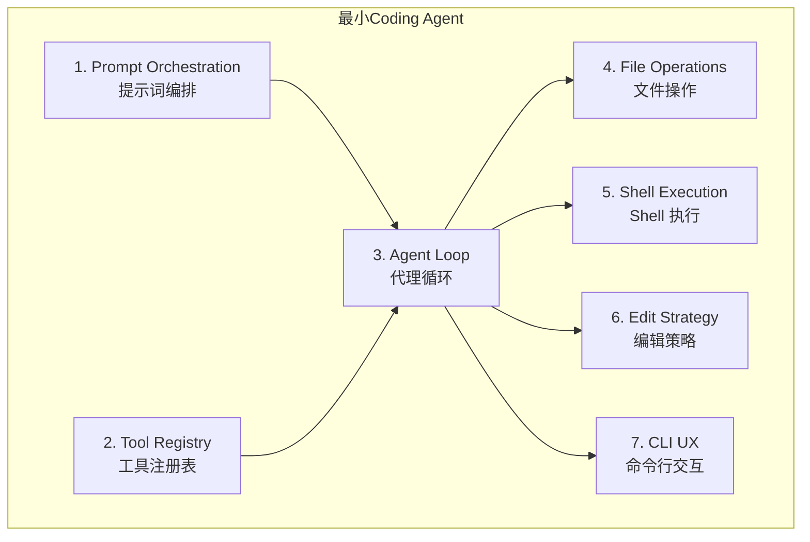

# 第 15 章：最小必要组件

> 从 512K+ 行源码到可运行的最小 coding agent——你真正需要的是什么？

## 15.1 为什么需要"最小必要"视角

Claude Code 是一个生产级系统，512K+ 行代码覆盖了从 OAuth 到 MCP 到 Vim 模式的方方面面。如果你试图通过阅读全部源码来理解 coding agent 的本质，你会迷失在大量的边界情况处理、UI 优化和平台适配代码中。这就像试图通过研究波音 747 的全部蓝图来理解"飞行"的原理一样——你需要的是先理解伯努利方程和四个基本力。

Fred Brooks 在《人月神话》中区分了**本质复杂性**（essential complexity）和**偶然复杂性**（accidental complexity）。对于 coding agent：

- **本质复杂性**：循环调用模型、执行工具、管理上下文——这 7 个组件是任何 coding agent 都必须解决的问题
- **偶然复杂性**：MCP 协议集成、Vim 模式、OSC 8 超链接、OAuth 认证——这些是生产环境和用户体验驱动的需求

[claude-code-from-scratch](https://github.com/Windy3f3f3f3f/claude-code-from-scratch) 项目正是围绕这个思路构建的：用 ~3000 行代码、11 个源文件，实现一个功能完整的 coding agent（含记忆、技能、多 Agent、权限规则等进阶能力）。本章的方法是——**从这个最小实现出发，逐组件追溯到 Claude Code 生产代码**，理解每一层复杂性是为了解决什么问题而存在的。

**阅读建议**：

- **15.2.1 - 15.2.3**（提示词编排、工具注册表、Agent 循环）是**核心循环层**——这三个组件构成了 agent 的骨架
- **15.2.4 - 15.2.6**（文件操作、Shell 执行、编辑策略）是**能力层**——赋予 agent 具体的编程能力
- **15.2.7**（CLI 交互）是**交互层**——让人类能够使用这个 agent

## 15.2 七个最小必要组件



### 组件 1：Prompt Orchestration（提示词编排）

> 对应源码：最小实现 `src/prompt.ts`（65 行）+ `src/system-prompt.md` | Claude Code `src/context.ts` + `src/utils/api.ts`

#### 为什么需要提示词编排

系统提示词是 agent 的"操作手册"。没有它，模型不知道自己是一个 coding agent，不知道有哪些工具可用，甚至不知道自己在哪个目录下工作。

一个有效的系统提示词必须包含三个要素：

1. **角色身份与行为准则**：告诉模型它是什么、该怎么做（"你是一个编程助手，修改前先阅读文件"）
2. **环境状态**：当前工作目录、操作系统、git 分支、最近提交——让模型拥有"上下文感知"
3. **项目特定指令**：CLAUDE.md 中的项目规则（"测试用 pytest"、"不要修改 API 接口"）

这里有一个容易被忽视的关键点：**系统提示词不是一个静态文本文件，而是一个运行时组装的文档**。每次启动 agent 时，当前目录、git 状态、项目指令都不同，所以提示词必须动态生成。这就是为什么它需要一个 builder 函数，而不是一个常量字符串。

#### 最小实现如何工作

最小实现的 `prompt.ts` 只有 65 行，但体现了完整的"运行时组装"思路：

```typescript
// prompt.ts — 系统提示词构造器

export function buildSystemPrompt(): string {
  // 1. 加载模板文件（含 {{变量}} 占位符）
  const template = readFileSync(join(__dirname, "system-prompt.md"), "utf-8");

  // 2. 收集运行时环境信息
  const date = new Date().toISOString().split("T")[0];
  const platform = `${os.platform()} ${os.arch()}`;
  const shell = process.env.SHELL || "unknown";
  const gitContext = getGitContext();   // git 分支/状态/最近提交
  const claudeMd = loadClaudeMd();      // 项目指令

  // 3. 替换占位符 → 生成最终提示词
  return template
    .replace("{{cwd}}", process.cwd())
    .replace("{{date}}", date)
    .replace("{{platform}}", platform)
    .replace("{{shell}}", shell)
    .replace("{{git_context}}", gitContext)
    .replace("{{claude_md}}", claudeMd);
}
```

三个关键子函数各有巧妙之处：

**`getGitContext()`** 运行三条 git 命令获取仓库状态：

```typescript
export function getGitContext(): string {
  try {
    const opts = { encoding: "utf-8", timeout: 3000, ... };
    const branch = execSync("git rev-parse --abbrev-ref HEAD", opts).trim();
    const log = execSync("git log --oneline -5", opts).trim();
    const status = execSync("git status --short", opts).trim();
    // ... 组装返回
  } catch {
    return "";  // 非 git 仓库时优雅降级
  }
}
```

注意 3 秒超时——这不是随意设置的。git 命令在大仓库或网络挂载的文件系统上可能很慢。超时防止启动时卡住，`catch` 返回空字符串让非 git 目录也能正常工作。这种"优雅降级"模式在 agent 开发中非常重要：**环境信息是锦上添花，不是必要条件。**

**`loadClaudeMd()`** 向上遍历目录树收集项目指令：

```typescript
export function loadClaudeMd(): string {
  const parts: string[] = [];
  let dir = process.cwd();
  while (true) {
    const file = join(dir, "CLAUDE.md");
    if (existsSync(file)) {
      parts.unshift(readFileSync(file, "utf-8"));  // unshift：祖先在前
    }
    const parent = resolve(dir, "..");
    if (parent === dir) break;  // 到达根目录
    dir = parent;
  }
  return parts.length > 0
    ? "\n\n# Project Instructions (CLAUDE.md)\n" + parts.join("\n\n---\n\n")
    : "";
}
```

为什么要向上遍历？因为 monorepo 中，根目录可能有全局规则（"所有代码用 TypeScript"），子项目目录有特定规则（"这个包用 Vitest 测试"）。`unshift` 保证祖先规则在前，子目录规则在后——后者可以覆盖前者，这符合直觉。

**`system-prompt.md`** 模板中的行为指令同样关键。它不只是告诉模型"你是一个编程助手"，还包含具体的操作准则：

- "Always read a file before editing it" — 防止盲改
- "Prefer editing existing files over creating new ones" — 防止文件膨胀
- "Use dedicated tools (read_file, grep_search) instead of shell commands (cat, grep)" — 引导模型使用更安全、更可控的专用工具

这些指令的实现成本为零（只是文本），但对模型行为的影响巨大。它们本质上是在**用自然语言编程模型的行为**。

#### Claude Code 的做法与为什么

Claude Code 的提示词系统远比模板替换复杂，主要增强了三个维度：

**1. 缓存感知的分层组装**

Claude Code 不是把所有内容拼成一个字符串，而是精心控制内容的排列顺序。静态内容（角色定义、工具使用规范）放在提示词的前部，动态内容（git 状态、最近操作的文件）放在后部。为什么？因为 Anthropic API 的提示词缓存是**前缀匹配**的——前部内容不变时，缓存命中率更高，这直接节省成本和延迟。最小版本不需要关心这个，因为短对话的 token 成本很低；但当你的 agent 一天处理上千次查询时，缓存优化能节省 30-50% 的 API 成本（详见[第 3 章 上下文工程](./03-context-engineering.md)）。

**2. 工具动态贡献提示词**

在 Claude Code 中，每个工具都有一个 `prompt()` 方法，可以根据当前上下文动态生成使用指南。例如 BashTool 的 prompt 会根据检测到的 shell 类型（bash/zsh/fish）调整建议。这意味着系统提示词的一部分是由工具自己"贡献"的，而不是在某个中央位置硬编码。这种设计让工具成为自描述的——添加一个新工具时，它的使用指南也一起带来了，不需要修改其他地方的代码。

**3. 多层 CLAUDE.md 发现**

生产版本不只是向上遍历目录树。它还搜索 `~/.claude/` 目录的全局指令、处理 `.claude/` 子目录的项目配置、支持 `CLAUDE.local.md`（不提交到 git 的本地指令）。这些都是真实用户场景驱动的：团队有共享规则（提交到 repo），个人有偏好设置（本地文件），组织有全局规范（用户目录）。

### 组件 2：Tool Registry（工具注册表）

> 对应源码：最小实现 `src/tools.ts`（326 行）| Claude Code `src/Tool.ts` + `src/tools.ts` + `src/services/tools/toolOrchestration.ts`

#### 为什么需要工具注册表

工具是 agent 连接"思考"和"行动"的桥梁。没有工具的 LLM 只是一个文本生成器；有了工具，它才能真正地读文件、改代码、跑测试。

工具注册表需要解决三个核心问题：

1. **发现**（Discovery）：模型需要知道有哪些工具可用，每个工具能做什么、接受什么参数
2. **分发**（Dispatch）：系统需要根据模型返回的工具名称，找到并调用对应的执行函数
3. **验证**（Validation）：在执行前检查输入参数是否合法，避免运行时错误

这三个问题有一个有趣的演进规律：在最小实现中，工具是**数据**（JSON 对象 + switch/case）；在生产系统中，工具是**行为**（类实例 + 方法）。这个从"数据"到"行为"的演进反映了一个通用的软件成熟模式——当一个实体需要的关联行为超过 5-8 个时，它就应该从数据结构升级为对象。

#### 最小实现如何工作

最小版本的工具系统分为两部分：**定义**和**执行**，共 326 行。

**工具定义**是一个纯 JSON Schema 数组，每个工具约 15 行：

```typescript
export const toolDefinitions: Anthropic.Tool[] = [
  {
    name: "read_file",
    description: "Read the contents of a file. Returns the file content with line numbers.",
    input_schema: {
      type: "object",
      properties: {
        file_path: { type: "string", description: "The path to the file to read" },
      },
      required: ["file_path"],
    },
  },
  // ... write_file, edit_file, list_files, grep_search, run_shell
];
```

这个设计有一个刻意的取舍：**没有抽象**。6 个工具的定义就是 6 个平坦的 JSON 对象，没有基类、没有接口、没有工厂函数。为什么？因为在 6 个工具的规模下，引入 class 层次结构的认知开销**大于**它带来的收益。读代码的人不需要理解继承链、泛型约束、生命周期钩子——直接看 JSON 就知道这个工具接受什么参数。

**工具执行**是一个 switch/case 分发函数：

```typescript
export async function executeTool(
  name: string,
  input: Record<string, any>
): Promise<string> {
  let result: string;
  switch (name) {
    case "read_file":
      result = readFile(input as { file_path: string });
      break;
    case "write_file":
      result = writeFile(input as { file_path: string; content: string });
      break;
    // ... 其他工具
    default:
      return `Unknown tool: ${name}`;
  }
  return truncateResult(result);
}
```

注意最后一行 `truncateResult(result)`——这是一个容易被忽视但极其重要的防护。如果模型调用 `read_file` 读取一个 10MB 的日志文件，结果会直接注入到消息历史中，一次就可能填满整个上下文窗口。`truncateResult` 将结果限制在 50,000 字符，保留首尾各一半：

```typescript
const MAX_RESULT_CHARS = 50000;

function truncateResult(result: string): string {
  if (result.length <= MAX_RESULT_CHARS) return result;
  const keepEach = Math.floor((MAX_RESULT_CHARS - 60) / 2);
  return (
    result.slice(0, keepEach) +
    "\n\n[... truncated " + (result.length - keepEach * 2) + " chars ...]\n\n" +
    result.slice(-keepEach)
  );
}
```

为什么保留首尾而不是只保留开头？因为很多信息在文件末尾（最新日志、函数定义的结尾、错误堆栈的底部）。这个简单的截断策略在最小版本中就能有效防止上下文溢出。

#### Claude Code 的做法与为什么

Claude Code 的工具系统从"JSON 数组 + switch/case"演进为一个完整的泛型类型系统：

```typescript
// Claude Code 生产版本：Tool 泛型接口，30+ 方法/属性
interface Tool<Input, Output, P extends z.ZodTypeAny> {
  name: string
  description: string
  inputSchema: P              // Zod schema（运行时验证 + 类型推导）
  prompt(): string            // 动态提示词（根据当前上下文生成使用指南）
  validateInput(input): boolean
  execute(input, context): Promise<Output>
  renderToolUseMessage(): JSX.Element  // React 组件渲染
  isReadOnly(): boolean       // 是否只读（影响并发策略）
  isConcurrencySafe(): boolean // 是否可以安全并发（更细粒度的判断）
  needsPermission(): boolean  // 是否需要用户授权
  // ... 更多方法
}
```

这个演进不是过度工程，而是被三个生产需求驱动的：

**1. 安全分类方法**

`isReadOnly()`、`isConcurrencySafe()`、`needsPermission()` 三个方法各服务于不同层面的安全判断。`isReadOnly()` 决定是否可以跳过权限检查；`isConcurrencySafe()` 决定是否可以和其他工具并行执行；`needsPermission()` 决定是否需要弹出确认对话框。在最小版本中，所有工具串行执行、统一检查权限，不需要这些区分。但当你有 66+ 工具且想要高性能时，这些分类变得至关重要。

**2. fail-closed 默认值**

Claude Code 的 `buildTool()` 工厂函数为新工具设置了保守的默认值：

```typescript
const TOOL_DEFAULTS = {
  isConcurrencySafe: false,  // 默认不可并发
  isReadOnly: false,         // 默认非只读（需要权限检查）
  // ...
}
```

这是一个**安全工程上的精妙设计**：任何新添加的工具，如果开发者忘记声明安全属性，它会自动被当作"可能危险、不可并发"来处理。系统默认安全，而非默认信任。要让一个工具被标记为可并发或免权限，开发者必须**显式声明**——这相当于需要主动证明安全性，而不是假设安全性。

**3. 并发工具编排**

Claude Code 的 `partitionToolCalls()` 函数（`toolOrchestration.ts`）实现了一个优雅的并发策略：

```typescript
// 将一批工具调用分区为可并发和不可并发的批次
function partitionToolCalls(toolUseMessages, toolUseContext): Batch[] {
  return toolUseMessages.reduce((acc, toolUse) => {
    const tool = findToolByName(toolUseContext.options.tools, toolUse.name);
    const isConcurrencySafe = tool?.isConcurrencySafe(parsedInput) ?? false;
    // 连续的安全工具合并为一批并行执行
    if (isConcurrencySafe && acc[acc.length - 1]?.isConcurrencySafe) {
      acc[acc.length - 1].blocks.push(toolUse);
    } else {
      acc.push({ isConcurrencySafe, blocks: [toolUse] });
    }
    return acc;
  }, []);
}
```

当模型在一次响应中同时调用 `GrepTool`、`GlobTool` 和 `ReadFileTool` 时，这三个只读工具会被分为一个批次并行执行，耗时从 3x 降为 1x。但如果其中夹了一个 `FileWriteTool`，它会被单独分为一个串行批次，确保写操作的原子性。这种并发编排在最小版本中不可能实现，因为最小版本的工具是 JSON 对象——没有地方声明 `isConcurrencySafe()`。

此外，Claude Code 还有 **ToolSearch 延迟加载**机制：66+ 工具并不全部放进系统提示词（那样会消耗太多 token），而是将不常用的工具标记为 `shouldDefer`，通过一个特殊的 ToolSearch 工具按需发现。这类似于操作系统的动态链接——不是把所有库都加载进内存，而是用到时才加载。

### 组件 3：Agent Loop（代理循环）

> 对应源码：最小实现 `src/agent.ts` 的 `chatAnthropic()`（65 行核心）| Claude Code `src/query.ts`（1,728 行）

#### 为什么需要代理循环

这是 coding agent 的**心脏**，也是 agent 与 chatbot 的根本区别。

Chatbot 是**请求-响应**模式：用户说一句，模型回一句，一次 API 调用就结束。Agent 是**请求-循环**模式：用户说一句，模型可能调用 5 个工具、读 10 个文件、修改 3 处代码，涉及几十次 API 调用——**模型自己决定何时停止**。

这个"模型决定停止"的机制极其优雅：模型在响应中不包含任何 `tool_use` 块时，循环自然终止。不需要特殊的"完成"信号，不需要计数器，不需要超时——模型通过"选择不调用工具"来表达"我认为任务完成了"。

循环也是所有可靠性问题的集中地：上下文窗口满了怎么办？API 超时了怎么办？工具执行失败了怎么办？最小版本的答案是"崩溃"——这对于原型来说够用了。生产版本则为每种故障场景都准备了恢复策略，这正是 `query.ts` 有 1,728 行的原因。

#### 最小实现如何工作

`chatAnthropic()` 方法是整个最小实现的核心，让我们逐段走查：

```typescript
private async chatAnthropic(userMessage: string): Promise<void> {
  // 1. 将用户消息加入历史
  this.anthropicMessages.push({ role: "user", content: userMessage });

  while (true) {
    // 2. 检查中止信号（来自 Ctrl+C）
    if (this.abortController?.signal.aborted) break;

    // 3. 流式调用模型
    const response = await this.callAnthropicStream();

    // 4. 追踪 token 使用量（用于成本显示和自动压缩判断）
    this.totalInputTokens += response.usage.input_tokens;
    this.totalOutputTokens += response.usage.output_tokens;
    this.lastInputTokenCount = response.usage.input_tokens;

    // 5. 提取工具调用
    const toolUses: Anthropic.ToolUseBlock[] = [];
    for (const block of response.content) {
      if (block.type === "tool_use") toolUses.push(block);
    }

    // 6. 保存 assistant 消息到历史
    this.anthropicMessages.push({ role: "assistant", content: response.content });

    // 7. 退出条件：没有工具调用 → 模型认为任务完成
    if (toolUses.length === 0) {
      printCost(this.totalInputTokens, this.totalOutputTokens);
      break;
    }

    // 8. 执行每个工具调用
    const toolResults: Anthropic.ToolResultBlockParam[] = [];
    for (const toolUse of toolUses) {
      if (this.abortController?.signal.aborted) break;
      const input = toolUse.input as Record<string, any>;
      printToolCall(toolUse.name, input);  // 展示给用户

      // 权限检查（非 yolo 模式）
      if (!this.yolo) {
        const confirmMsg = needsConfirmation(toolUse.name, input);
        if (confirmMsg && !this.confirmedPaths.has(confirmMsg)) {
          const confirmed = await this.confirmDangerous(confirmMsg);
          if (!confirmed) {
            toolResults.push({
              type: "tool_result",
              tool_use_id: toolUse.id,
              content: "User denied this action.",
            });
            continue;  // 跳过执行，但把"被拒绝"的结果反馈给模型
          }
          this.confirmedPaths.add(confirmMsg);  // 会话级白名单
        }
      }

      const result = await executeTool(toolUse.name, input);
      printToolResult(toolUse.name, result);
      toolResults.push({ type: "tool_result", tool_use_id: toolUse.id, content: result });
    }

    // 9. 把工具结果作为 "user" 消息加入历史
    this.anthropicMessages.push({ role: "user", content: toolResults });

    // 10. 检查是否需要压缩上下文
    await this.checkAndCompact();
  }
}
```

几个值得注意的设计决策：

**用户拒绝 ≠ 工具失败**：当用户拒绝一个危险操作时（第 8 步的 `"User denied this action."`），结果仍然被反馈给模型。这让模型知道操作被拒绝了，可以选择替代方案（比如用更安全的命令），而不是困惑于"为什么没有结果"。

**会话级权限白名单**：`confirmedPaths` 是一个 `Set<string>`，存储已确认的操作。如果用户确认了 `rm -rf dist/`，后续相同命令不会再次询问。这是一个简单但重要的用户体验优化——想象一下如果每次 `rm` 命令都要确认，修复一个涉及清理构建目录的问题会多么烦人。

**工具结果的消息角色**：工具结果以 `role: "user"` 的形式加入消息历史。这不是一个 hack——这是 Anthropic API 的设计约定。在 API 的消息格式中，对话总是 user → assistant → user → assistant 交替。工具结果虽然不是人类说的话，但在消息结构上占据 "user" 的位置。

**流式调用**包装在 `callAnthropicStream()` 中：

```typescript
private async callAnthropicStream(): Promise<Anthropic.Message> {
  return withRetry(async (signal) => {
    const stream = this.anthropicClient!.messages.stream(createParams, { signal });

    let firstText = true;
    stream.on("text", (text) => {
      if (firstText) { printAssistantText("\n"); firstText = false; }
      printAssistantText(text);  // 实时输出每个文本片段
    });

    const finalMessage = await stream.finalMessage();

    // 过滤 thinking blocks（不存入历史，它们是推理过程的内部状态）
    if (this.thinking) {
      finalMessage.content = finalMessage.content.filter(
        (block: any) => block.type !== "thinking"
      );
    }
    return finalMessage;
  }, this.abortController?.signal);
}
```

这里有两个巧妙之处：

1. **流式 + 最终消息分离**：`stream.on("text")` 用于实时显示（用户体验），`stream.finalMessage()` 用于获取完整响应（用于后续处理）。流式是给人看的，最终消息是给代码用的。
2. **thinking block 过滤**：Claude 的 extended thinking 功能会产生 `thinking` 类型的内容块。这些块对调试有用，但不应存入消息历史——它们会消耗大量上下文空间，而且重新发送给模型没有意义（模型不需要"回忆"自己的思考过程）。

**重试机制** `withRetry()` 实现了指数退避加随机抖动：

```typescript
async function withRetry<T>(fn, signal, maxRetries = 3): Promise<T> {
  for (let attempt = 0; ; attempt++) {
    try {
      return await fn(signal);
    } catch (error: any) {
      if (signal?.aborted) throw error;  // 用户主动中止，不重试
      if (attempt >= maxRetries || !isRetryable(error)) throw error;
      // 指数退避 + 随机抖动（防止多客户端同时重试的"惊群效应"）
      const delay = Math.min(1000 * Math.pow(2, attempt), 30000) + Math.random() * 1000;
      printRetry(attempt + 1, maxRetries, reason);
      await new Promise((r) => setTimeout(r, delay));
    }
  }
}
```

可重试的错误码精心选择：429（速率限制）、503（服务不可用）、529（API 过载）。这三个都是临时性错误——等一等通常就能恢复。而 400（请求格式错误）、401（认证失败）不会重试——这些是永久性错误，重试没有意义。

**自动压缩** `checkAndCompact()` 是保持长对话不崩溃的关键机制：

```typescript
private async checkAndCompact(): Promise<void> {
  // 当上下文使用率超过 85% 时触发压缩
  if (this.lastInputTokenCount > this.effectiveWindow * 0.85) {
    await this.compactConversation();
  }
}
```

为什么是 85% 而不是 95%？因为压缩本身需要调用一次 API——把当前历史发送给模型并请求总结。这次调用本身会消耗 token。如果等到 95% 再压缩，压缩请求可能因为上下文不够而失败。85% 留出了足够的余量。

压缩策略本身也值得分析：

```typescript
private async compactAnthropic(): Promise<void> {
  if (this.anthropicMessages.length < 4) return;  // 太短不需要压缩

  // 保留最后一条用户消息（当前正在处理的任务）
  const lastUserMsg = this.anthropicMessages[this.anthropicMessages.length - 1];

  // 请求模型总结之前的对话
  const summaryResp = await this.anthropicClient!.messages.create({
    model: this.model,
    max_tokens: 2048,
    system: "You are a conversation summarizer. Be concise but preserve important details.",
    messages: [...this.anthropicMessages.slice(0, -1), summaryReq],
  });

  // 用总结替换整个历史
  this.anthropicMessages = [
    { role: "user", content: `[Previous conversation summary]\n${summaryText}` },
    { role: "assistant", content: "Understood. I have the context from our previous conversation." },
  ];
  // 恢复最后一条用户消息
  if (lastUserMsg.role === "user") this.anthropicMessages.push(lastUserMsg);
}
```

这个策略有三个关键点：(1) 保留最后一条用户消息，确保当前任务不丢失；(2) 用合成的 user-assistant 对话对替换历史，保持 Anthropic API 要求的消息交替格式；(3) 总结指令要求"preserve key decisions, file paths, and context"——这些是继续工作所必需的信息。

#### Claude Code 的做法与为什么

Claude Code 的 `query()` 是一个 1,728 行的异步生成器。它之所以这么大，不是因为代码写得冗余，而是因为**每一段代码都对应一种在生产环境中发现的真实故障场景**。

**7 个 Continue Sites**：循环不是简单的 `while(true)`，而是有 7 个不同的"重新进入点"。当遇到不同类型的错误时，恢复策略不同：

- **Prompt Too Long（PTL）**：上下文超限 → 先压缩消息，然后从"API 调用"步骤重新进入
- **Max Output Tokens**：模型输出被截断 → 增加 token 限制，从"API 调用"步骤重试
- **API 过载**：服务暂时不可用 → 指数退避后从"API 调用"步骤重试
- **工具执行失败**：某个工具报错 → 把错误信息反馈给模型（而非用户），让模型尝试修复

这最后一点——**错误扣留**（error withholding）——是一个特别聪明的设计。当一个工具执行失败时，错误信息不直接展示给用户，而是作为工具结果反馈给模型。模型经常能够自己修复问题——比如换一个文件路径、修改命令参数、或者尝试不同的方法。只有模型无法自修复的错误才最终呈现给用户（详见[第 2 章 系统主循环](./02-agent-loop.md)）。

**流式工具并行执行**：在最小版本中，工具一个接一个串行执行。Claude Code 使用 `toolOrchestration.ts` 的 `runTools()` 实现了前面提到的并发编排——只读工具并行执行，写操作串行执行。

**Token 预算管理**：不仅追踪已用 token，还管理剩余预算。`taskBudget` 跨压缩操作结转——即使对话历史被压缩了，已消耗的 token 预算不会重置。这防止了"通过不断压缩来无限使用"的情况，也使成本控制更加精确。

### 组件 4：File Operations（文件操作）

> 对应源码：最小实现 `src/tools.ts` 中的 `readFile`/`grepSearch`/`listFiles` | Claude Code `src/tools/FileReadTool/` + `src/tools/GrepTool/` + `src/tools/GlobTool/`

#### 为什么需要文件操作

文件操作是 coding agent 的"眼睛"。一个不能读代码的 agent 就像一个闭着眼睛的程序员——即使它的推理能力再强，也无法有效工作。

这里有三种不同的信息检索需求，各需要专门的工具：

| 需求 | 工具 | 使用场景 |
|------|------|---------|
| "这个文件写了什么" | `read_file` | 阅读已知路径的文件内容 |
| "哪些文件包含这个关键词" | `grep_search` | 在未知位置搜索特定代码模式 |
| "项目里有哪些 TypeScript 文件" | `list_files` | 了解项目结构和文件分布 |

一个常被低估的事实：在典型的编程任务中，**模型的读操作远多于写操作**。修复一个 bug 可能需要读 5-15 个文件（理解上下文、追踪调用链、查看测试），但只需要修改 1-3 个文件。这意味着文件读取的效率和上下文效率直接决定了 agent 的整体表现。

#### 最小实现如何工作

**`readFile`** 实现只有 12 行，但包含一个关键设计：

```typescript
function readFile(input: { file_path: string }): string {
  const content = readFileSync(input.file_path, "utf-8");
  const lines = content.split("\n");
  const numbered = lines
    .map((line, i) => `${String(i + 1).padStart(4)} | ${line}`)
    .join("\n");
  return numbered;
}
```

为什么要添加行号？不是为了好看，而是为了给后续的 `edit_file` 工具提供定位参考。当模型看到 `  42 | function processData(input) {`，它能更准确地构造 `old_string` 参数来定位要编辑的代码段。行号是 read 和 edit 两个工具之间的隐式协作机制。

**`grepSearch`** 包装了系统 grep：

```typescript
function grepSearch(input: { pattern: string; path?: string; include?: string }): string {
  const args = ["--line-number", "--color=never", "-r"];
  if (input.include) args.push(`--include=${input.include}`);
  args.push(input.pattern);
  args.push(input.path || ".");
  const result = execSync(`grep ${args.join(" ")}`, { ... });
  const lines = result.split("\n").filter(Boolean);
  return lines.slice(0, 100).join("\n") +
    (lines.length > 100 ? `\n... and ${lines.length - 100} more matches` : "");
}
```

100 行结果上限不是随意选择的。grep 在大项目中可能返回几万行匹配。如果全部返回，一次搜索就会吃掉大量上下文窗口。100 行足够模型判断是否找到了需要的信息，如果没有，它可以缩小搜索范围重新搜索。

**`listFiles`** 使用 glob 模式匹配：

```typescript
async function listFiles(input: { pattern: string; path?: string }): Promise<string> {
  const files = await glob(input.pattern, {
    cwd: input.path || process.cwd(),
    nodir: true,
    ignore: ["node_modules/**", ".git/**"],  // 忽略最大的噪音源
  });
  return files.slice(0, 200).join("\n") + ...;
}
```

`ignore: ["node_modules/**", ".git/**"]` 是基于实际经验的优化。在一个典型的 Node.js 项目中，`node_modules` 可能包含几万个文件；`.git` 包含大量二进制对象。这两个目录在绝大多数情况下都不是用户想搜索的目标。默认忽略它们既节省时间，也减少噪音。

#### Claude Code 的做法与为什么

**FileReadTool 的多格式支持**：生产版本不仅读文本文件，还支持图片（base64 编码后作为多模态内容发送给模型）、PDF（提取指定页面的文本）、Jupyter Notebook（解析 JSON 结构展示 cell 内容）。为什么需要图片支持？因为调试 UI 问题时，"看一眼截图"是最自然的动作。模型是多模态的——限制它只处理文本是人为的浪费。

**GrepTool 基于 ripgrep**：ripgrep 比系统 grep 快 10-100 倍（在大型代码库上差异更明显），默认尊重 `.gitignore`（自动排除构建产物和依赖），支持更丰富的正则语法。对于需要频繁搜索的 coding agent，这个性能差异直接影响用户体验。

**大结果持久化**：当工具结果超过内联大小限制时，Claude Code 将完整结果写入临时文件，在消息历史中只保留一个引用。这样，上下文窗口不会被单次大结果撑满，但模型仍然可以通过读取临时文件来访问完整数据。这是一种用文件系统换上下文空间的策略。

### 组件 5：Shell Execution（Shell 执行）

> 对应源码：最小实现 `src/tools.ts` 中的 `runShell` + `DANGEROUS_PATTERNS` | Claude Code `src/tools/BashTool/`

#### 为什么需要 Shell 执行

Shell 执行让 agent 从"只能读写文件"升级为"能做程序员做的一切事"——运行测试、安装依赖、使用 git、编译代码、启动服务。这是 coding agent 最强大的能力。

但它同时也是最危险的。一个能执行任意 Shell 命令的程序，本质上拥有用户的全部权限。`rm -rf ~` 能删除用户的所有文件；`curl ... | bash` 能执行任意远程代码。这创造了一个根本性的张力：**最大化能力的需求与最小化风险的需求直接冲突**。

每个 agent 的设计者都必须在这个张力中找到平衡点。最小版本选择了一个简单但有效的方案：正则黑名单 + 用户确认。

#### 最小实现如何工作

**执行器**本身很简单——包装 `execSync`：

```typescript
function runShell(input: { command: string; timeout?: number }): string {
  try {
    const result = execSync(input.command, {
      encoding: "utf-8",
      maxBuffer: 5 * 1024 * 1024,  // 5MB 输出上限
      timeout: input.timeout || 30000,  // 30 秒超时
      stdio: ["pipe", "pipe", "pipe"],  // 捕获 stdin/stdout/stderr
    });
    return result || "(no output)";
  } catch (e: any) {
    // 命令失败时返回退出码 + stdout + stderr（都有用）
    const stderr = e.stderr ? `\nStderr: ${e.stderr}` : "";
    const stdout = e.stdout ? `\nStdout: ${e.stdout}` : "";
    return `Command failed (exit code ${e.status})${stdout}${stderr}`;
  }
}
```

5MB 输出上限防止内存溢出（例如 `cat` 一个巨大的日志文件）。30 秒超时防止命令卡死（例如等待网络连接的命令）。`stdio: ["pipe", "pipe", "pipe"]` 确保 stdout 和 stderr 都被捕获——很多有用的错误信息在 stderr 中。

**危险命令检测**是一个正则黑名单：

```typescript
const DANGEROUS_PATTERNS = [
  /\brm\s/,           // rm 命令
  /\bgit\s+(push|reset|clean|checkout\s+\.)/, // 破坏性 git 操作
  /\bsudo\b/,         // 提权
  /\bmkfs\b/,         // 格式化磁盘
  /\bdd\s/,           // 底层磁盘操作
  />\s*\/dev\//,      // 写入设备文件
  /\bkill\b/,         // 终止进程
  /\bpkill\b/,        // 按名称终止进程
  /\breboot\b/,       // 重启
  /\bshutdown\b/,     // 关机
];
```

这 10 个模式覆盖了最常见的危险操作。注意 `\b` 单词边界的使用——`/\brm\s/` 匹配 `rm -rf` 但不匹配 `perform`。但这种正则方式有明显的局限性：`r''m -rf /`（引号打断）、`$(rm -rf /)`（命令替换）、`echo rm | bash`（间接执行）都能绕过检测。这在最小版本中是可接受的——用户确认机制作为第二道防线，而且最小版本的用户群通常是开发者自己。

**统一的权限检查函数** `needsConfirmation()` 将不同类型的危险操作统一处理：

```typescript
export function needsConfirmation(toolName: string, input: Record<string, any>): string | null {
  if (toolName === "run_shell" && isDangerous(input.command)) return input.command;
  if (toolName === "write_file" && !existsSync(input.file_path)) return `write new file: ${input.file_path}`;
  if (toolName === "edit_file" && !existsSync(input.file_path)) return `edit non-existent file: ${input.file_path}`;
  return null;
}
```

返回 `null` 表示安全，返回字符串（确认信息）表示需要用户确认。这种设计让权限逻辑集中在一处，而不是分散在每个工具的执行代码中。

#### Claude Code 的做法与为什么

Claude Code 的 Shell 安全系统是整个项目中最复杂的部分之一，因为它面对的是一个**开放式的攻击面**——Shell 语法几乎无限灵活。

**Bash AST 分析**：Claude Code 使用 tree-sitter 解析器将命令解析为抽象语法树，然后在 AST 上执行安全检查。为什么 AST 比正则强大得多？考虑这个命令：

```bash
echo "hello" && $(rm -rf /)
```

正则 `/\brm\s/` 能匹配到。但这个呢？

```bash
eval "$(echo cm0gLXJmIC8= | base64 -d)"
```

这是 base64 编码的 `rm -rf /`，正则完全无法检测。AST 分析可以识别 `eval` + 命令替换的模式，将其标记为潜在危险（详见[第 12 章 权限与安全](./11-permission-security.md)）。

**命令分类**：Claude Code 将命令分为 search/read/list/neutral/write/destructive 六个类别。只读类别（search、read、list）的命令可以免权限执行。这大幅减少了权限确认弹窗的频率——在一个典型的编程任务中，`grep`、`find`、`ls`、`git log` 等命令占调用总量的 60% 以上。如果每次都要确认，用户体验会极差（这就是"权限疲劳"问题）。

**Zsh 特有防御**：Zsh 有一些 bash 没有的危险功能——`zmodload` 可以加载内核模块、`emulate -c` 可以改变 shell 行为、`sysopen/syswrite` 可以绕过正常的文件操作。Claude Code 的安全检查包含 60+ 行 Zsh 特定的模式。这些模式不是凭空想象的——每一条都来自安全测试中发现的真实绕过路径。

**沙箱模式**：在最高安全级别下，Claude Code 使用平台特定的沙箱技术（macOS Seatbelt、Linux 命名空间）限制命令的文件系统和网络访问。即使命令内容通过了所有静态检查，沙箱作为最后一道防线确保它不能访问不该访问的资源。

### 组件 6：Edit Strategy（编辑策略）

> 对应源码：最小实现 `src/tools.ts` 中的 `editFile`/`writeFile` | Claude Code `src/tools/FileEditTool/` + `src/tools/FileWriteTool/`

#### 为什么需要编辑策略

文件编辑是 agent 最有后果的操作——一次错误的编辑可以破坏构建、引入 bug、甚至导致数据丢失。编辑策略的选择直接决定了 agent 的可用性和可靠性。

三种常见的编辑方式各有优劣：

| 方式 | 优点 | 致命缺陷 |
|------|------|---------|
| **全文件重写** | 实现最简单 | 大文件消耗大量 token；模型可能"遗忘"未修改的部分 |
| **行号编辑** | 精确定位 | 多步编辑时行号偏移：改了第 10 行后，原来的第 20 行变成了第 21 行 |
| **search-and-replace** | 基于内容定位，不受行号变化影响 | 需要唯一性约束 |

Claude Code 选择了 **search-and-replace**，这是一个深思熟虑的决策。核心原因是：**模型"思考"的单位是文本内容，而不是坐标位置**。让模型指定"把这段代码改成那段代码"比让模型指定"修改第 42 行到第 45 行"更自然、更可靠。当模型看到代码并决定修改时，它直接在脑中形成了"旧代码 → 新代码"的映射——search-and-replace 直接对应这个心智模型。

#### 最小实现如何工作

`editFile` 只有 18 行，但实现了完整的 search-and-replace 逻辑：

```typescript
function editFile(input: { file_path: string; old_string: string; new_string: string }): string {
  try {
    const content = readFileSync(input.file_path, "utf-8");

    // 核心：唯一性检查
    const count = content.split(input.old_string).length - 1;
    if (count === 0) return `Error: old_string not found in ${input.file_path}`;
    if (count > 1) return `Error: old_string found ${count} times. Must be unique.`;

    // 唯一匹配 → 安全替换
    const newContent = content.replace(input.old_string, input.new_string);
    writeFileSync(input.file_path, newContent);
    return `Successfully edited ${input.file_path}`;
  } catch (e: any) {
    return `Error editing file: ${e.message}`;
  }
}
```

**唯一性约束**是这个工具最重要的设计决策：

- `count === 0`（找不到）：说明模型的 `old_string` 与文件实际内容不匹配。可能是模型"幻觉"了不存在的代码，或者文件自读取后被修改了。无论哪种情况，拒绝编辑都是正确的。
- `count > 1`（多次匹配）：说明 `old_string` 不够具体，无法确定修改哪一处。例如 `old_string: "return null"` 可能在文件中出现 5 次。强制唯一性逼迫模型提供更多上下文（比如包含函数签名和周围几行代码），这反而提高了编辑的精确度。
- `count === 1`：唯一匹配，安全替换。

`content.split(old_string).length - 1` 这种计数方式比正则搜索更好，因为它不需要转义特殊字符。如果用正则，`old_string` 中的 `(`、`)`、`*`、`.` 等都需要转义，否则会导致匹配错误。`split` 使用的是字面量字符串匹配，完全避免了这个问题。

**`writeFile`** 用于创建新文件（全文件写入）：

```typescript
function writeFile(input: { file_path: string; content: string }): string {
  const dir = dirname(input.file_path);
  if (!existsSync(dir)) mkdirSync(dir, { recursive: true });  // 自动创建目录
  writeFileSync(input.file_path, input.content);
  return `Successfully wrote to ${input.file_path}`;
}
```

`mkdirSync(dir, { recursive: true })` 自动创建不存在的目录链——这个小细节避免了"目录不存在"的常见错误。

注意这两个工具的分工：`edit_file` 用于修改已有文件，`write_file` 用于创建新文件。系统提示词中明确要求模型"Use edit_file instead of write_file for existing files"。这个行为指令和唯一性约束共同确保了模型不会用全文件重写来"修改"文件——那样做会丢失信息、消耗更多 token、且更容易出错。

#### Claude Code 的做法与为什么

**`replace_all` 选项**：当你需要把一个变量从 `oldName` 改为 `newName`，它可能在文件中出现 20 次。唯一性约束在这种场景下反而碍事。`replace_all: true` 放松了唯一性要求，允许批量替换。这是一个"大多数时候限制严格，特殊情况提供逃生通道"的设计。

**`readFileState` 集成**：Claude Code 维护了一个文件读取状态缓存。当模型调用 `edit_file` 时，系统检查这个文件是否已经被读取过，以及读取后是否被修改。如果模型试图编辑一个从未读取的文件（盲改），系统会拒绝。如果文件在读取后被外部修改了，系统会警告。这两个检查极大地减少了编辑错误，是从最小版本到生产版本最值得添加的增强之一。

**Diff 生成和彩色显示**：每次编辑后，Claude Code 生成并显示一个彩色 diff（删除的行红色、新增的行绿色）。这不改变功能，但极大地改善了用户信任——用户可以直观地看到"agent 改了什么"，而不需要自己去对比文件。透明度是建立用户对 agent 信任的关键因素（详见[第 10 章 代码编辑策略](./05-code-editing-strategy.md)）。

### 组件 7：CLI UX（命令行交互）

> 对应源码：最小实现 `src/cli.ts`（240 行）+ `src/ui.ts`（102 行）+ `src/session.ts`（64 行）| Claude Code `src/screens/REPL.tsx` + `src/ink/`

#### 为什么需要 CLI 交互层

CLI 是用户观察和控制 agent 的唯一窗口。即使 agent 的底层能力再强，如果用户不能理解它在做什么、不能在需要时打断它、不能知道花了多少钱，这个 agent 就是不可用的。

Agent CLI 和传统 CLI 有一个根本区别：**传统 CLI 的输出是可预测的**（`ls` 总是列出文件），**agent CLI 的输出是非确定性的且可能无限延续**。用户输入"修复这个 bug"后，agent 可能读 3 个文件就完成了，也可能进入一个漫长的调试循环，读 30 个文件、运行 10 次测试、修改 5 处代码。这种不确定性要求 CLI 提供三种能力：

1. **实时可见性**：用户必须能看到 agent 正在做什么（流式输出、工具调用提示）
2. **可中断性**：用户必须能在 agent "跑偏"时打断它（Ctrl+C）
3. **成本感知**：用户必须知道这次操作花了多少 token / 多少钱

#### 最小实现如何工作

**REPL 循环** (`cli.ts`) 提供了双模式设计：

```typescript
async function main() {
  // ... 参数解析和 Agent 初始化

  if (prompt) {
    // 一次性模式：执行命令后退出
    await agent.chat(prompt);
  } else {
    // 交互式 REPL 模式
    await runRepl(agent);
  }
}
```

一次性模式（`mini-claude "fix the bug in app.ts"`）适合脚本集成和快速任务；REPL 模式（`mini-claude`）适合探索性工作和多轮对话。两种模式共享同一个 Agent 实例，唯一的区别是输入来源。

**Ctrl+C 处理**是 agent CLI 中最微妙的交互设计之一：

```typescript
let sigintCount = 0;
process.on("SIGINT", () => {
  if (agent.isProcessing) {
    // agent 正在工作：中止当前操作
    agent.abort();
    console.log("\n  (interrupted)");
    sigintCount = 0;
    printUserPrompt();  // 回到输入提示符
  } else {
    // agent 空闲：准备退出
    sigintCount++;
    if (sigintCount >= 2) {
      console.log("\nBye!\n");
      process.exit(0);
    }
    console.log("\n  Press Ctrl+C again to exit.");
    printUserPrompt();
  }
});
```

两层设计：
- **agent 工作中按 Ctrl+C**：中止当前操作（通过 AbortController），但不退出程序。用户可以查看已完成的部分，或者给出新指令。这比直接退出要好得多——agent 可能已经完成了 80% 的工作，用户不想全部丢失。
- **agent 空闲时按 Ctrl+C 两次**：退出程序。单次 Ctrl+C 显示提示信息，避免误操作退出。这借鉴了 Node.js REPL 和 Python 交互式环境的惯例。

**REPL 命令** 提供了三个基本的会话管理能力：

```typescript
if (input === "/clear") {
  agent.clearHistory();   // 清空对话历史，从零开始
  askQuestion(); return;
}
if (input === "/cost") {
  agent.showCost();       // 显示 token 用量和费用估算
  askQuestion(); return;
}
if (input === "/compact") {
  await agent.compact();  // 手动触发对话压缩
  askQuestion(); return;
}
```

`/clear` 用于"换个话题"——当前对话的上下文已经不相关了。`/cost` 满足成本感知需求——开发者需要知道这次调试花了多少钱。`/compact` 让用户在觉得"对话太长模型开始犯糊涂"时主动触发压缩，而不必等到 85% 阈值。

**终端 UI**（`ui.ts`）虽然只有 102 行，但细节考究：

```typescript
export function printToolCall(name: string, input: Record<string, any>) {
  const icon = getToolIcon(name);      // 📖 read_file, 🔧 edit_file, 💻 run_shell
  const summary = getToolSummary(name, input);  // 文件路径或命令摘要
  console.log(chalk.yellow(`\n  ${icon} ${name}`) + chalk.gray(` ${summary}`));
}

export function printToolResult(name: string, result: string) {
  const maxLen = 500;
  const truncated = result.length > maxLen
    ? result.slice(0, maxLen) + chalk.gray(`\n  ... (${result.length} chars total)`)
    : result;
  // ...
}
```

工具调用使用黄色 + 图标显示，让用户一眼看出"这是工具操作，不是模型的文本输出"。结果在**显示时**截断为 500 字符（完整结果仍然在上下文中，模型能看到全部内容）。这种"给人看简短版，给模型看完整版"的双轨设计在最小版本中就已经体现了。

**会话持久化** (`session.ts`) 用 64 行实现了基础的"关闭后恢复"能力：

```typescript
const SESSION_DIR = join(homedir(), ".mini-claude", "sessions");

export function saveSession(id: string, data: SessionData): void {
  ensureDir();
  writeFileSync(join(SESSION_DIR, `${id}.json`), JSON.stringify(data, null, 2));
}

export function getLatestSessionId(): string | null {
  const sessions = listSessions();
  sessions.sort((a, b) => new Date(b.startTime).getTime() - new Date(a.startTime).getTime());
  return sessions[0]?.id || null;
}
```

`--resume` 标志加载最近的会话，恢复完整的消息历史。这意味着用户可以关闭终端去吃午饭，回来后继续之前的工作。实现只是简单的 JSON 序列化/反序列化，但它解决了一个真实的用户痛点。

#### Claude Code 的做法与为什么

**React + Ink 终端渲染器**：Claude Code 用 React 组件来构建终端 UI。这看起来像是过度工程，但有一个合理的理由：agent UI 本质上是**高度有状态的**。同一时刻可能有：流式文本在输出、工具调用进度在更新、权限确认弹窗在等待响应、状态栏在显示 token 计数。用 `console.log` 管理这些并发的 UI 更新会变成意大利面代码。React 的声明式模型——"给定这些状态，UI 应该长这样"——让复杂的 UI 状态管理变得可维护。

**虚拟滚动**：长时间的 agent 会话可能产生几万行输出。如果全部渲染到终端缓冲区，会导致内存膨胀和终端卡顿。虚拟滚动只渲染可见区域的内容，让任意长度的会话都保持流畅。

**OSC 8 超链接**：输出中的文件路径（如 `src/utils/helper.ts:42`）会被渲染为终端超链接。在支持的终端中（iTerm2、VSCode 终端等），点击就能跳转到对应文件和行号。这个小功能的实现成本很低（几十行代码），但对日常工作流的提升非常大——用户不需要复制路径再手动打开文件。

## 15.3 从最小到生产：渐进式增强路线


### 阶段 1：最小可用（~500 行）

```
用户输入 → 系统提示词 + 消息 → API 调用 → 工具执行 → 循环
```

工具：`read_file`、`write_file`、`run_shell`——只需这三个就构成了完整的读-执行-写循环。

**为什么从这三个工具开始？** 因为它们覆盖了 agent 的基本操作周期：用 `read_file` 理解现状，用 `run_shell` 执行命令（测试、编译、git），用 `write_file` 创建或修改文件。`edit_file`（search-and-replace）、`grep_search`、`list_files` 都是"更好的方式"来做 `read_file` + `run_shell` 已经能做的事。

**实现提示**：从 Anthropic SDK 的 `messages.create()`（非流式）开始，而不是 `messages.stream()`。非流式更简单，返回完整的响应对象，不需要处理事件流。等基础循环跑通后，再升级到流式。

**这个阶段最大的风险**：上下文窗口溢出。没有 `truncateResult` 的话，一次 `run_shell("cat huge_file.log")` 就能填满整个窗口。即使在最小版本中，也建议加上结果截断——这 15 行代码能避免大量的调试时间。

### 阶段 2：基础增强（~2000 行）

**新增权限确认**：10 个正则模式 + 一个确认对话框。实现简单但效果显著——这是让 agent 从"自己的玩具"变为"敢给别人用"的关键步骤。不需要 AST 分析那么复杂的东西，正则黑名单 + 用户确认已经覆盖了 95% 的危险场景。

**新增 `edit_file` 工具**：这是阶段 2 最高价值的功能。有了 search-and-replace，agent 从"只能创建文件"升级为"能精确修改已有代码"。实现只需 18 行（唯一性计数 + 替换），但它对 agent 能力的提升是质变的。

**新增 `grep_search` + `list_files`**：让 agent 能够导航不熟悉的代码库。没有这两个工具，agent 只能操作它已经知道路径的文件。有了搜索能力，它可以自主探索项目结构。

**新增对话历史持久化**：JSON 文件 + `--resume` 标志。64 行代码解决"关闭终端后工作丢失"的问题。

### 阶段 3：体验优化（~5000 行）

**新增流式输出**：从 `messages.create()` 升级到 `messages.stream()`。这是一个中等规模的重构，但带来的体验提升巨大——用户不再盯着空白屏幕等待，而是看到文字逐字出现。在 agent 思考 10-30 秒的场景中（常见），流式输出是"感觉快了 10 倍"和"以为卡死了"的区别。

**新增自动压缩**：当上下文达到 85% 时，自动总结并压缩对话历史。这是让 agent 支持长会话的关键——没有压缩，20-30 轮工具调用后就会触及上下文上限。实现约 50 行（总结请求 + 历史替换），但有一个棘手的细节：总结请求本身消耗 token，所以触发阈值不能太晚。

**新增错误重试**：指数退避 + 可重试错误码识别。API 429（速率限制）在高频使用时很常见，自动重试让用户不需要手动处理临时性错误。

**新增 Token 追踪和成本显示**：累计 input/output token 计数，乘以单价显示费用。帮助用户建立成本感知，也为后续的预算管理功能铺路。

### 阶段 4：生产就绪（~20000 行）

**多级压缩流水线**：阶段 3 的"全量总结"是最粗暴的压缩方式。生产版本有 4 级渐进式压缩策略——先截断过大的工具结果，再裁剪早期消息，然后微压缩缓存标注，最后才总结。每一级都尽量保留信息量，只在必要时升级到更激进的策略（详见[第 3 章 上下文工程](./03-context-engineering.md)）。

**Bash AST 安全分析**：tree-sitter 解析 + 23 项静态检查。这是从正则黑名单到结构化分析的质变。每一条检查规则都对应一种在安全测试中发现的绕过方式。

**MCP 协议集成**：通过 Model Context Protocol 支持外部工具扩展（数据库查询、Slack 发消息、Jira 操作等）。这让 agent 的能力边界从"本地文件操作"扩展到"任意外部服务"。

**多 Agent**（AgentTool）：将复杂任务分解给子 agent 并行执行。主 agent 负责规划和协调，子 agent 负责具体执行。这是处理大型项目级任务的关键架构（详见[第 8 章 多 Agent 架构](./07-multi-agent.md)）。

**提示词缓存优化**：精心排列系统提示词的内容顺序，最大化 API 的前缀缓存命中率。在高频使用场景下可节省 30-50% 的 API 成本。

## 15.4 claude-code-from-scratch 项目

[claude-code-from-scratch](https://github.com/Windy3f3f3f3f/claude-code-from-scratch) 项目提供了一个可运行的最小实现（~3000 行核心代码），帮助你：

1. **理解核心机制**：不被 512K 行代码淹没，聚焦于 11 个本质组件
2. **动手实验**：修改循环逻辑、添加新工具、调整系统提示词
3. **学习设计决策**：理解每个组件为什么存在、为什么这样实现
4. **渐进式构建**：从最小版本逐步添加功能，体会每层复杂性的价值

该项目还提供了**双后端支持**（Anthropic 原生 + OpenAI 兼容 API），这意味着你可以用它连接几乎任何 LLM 后端。通过 `--api-base` 参数切换到任何 OpenAI 兼容的端点。

**定制建议**：如果你想基于这个最小实现构建自己的 agent，**系统提示词模板**（`src/system-prompt.md`）是最高杠杆的定制点。修改行为指令、添加领域特定知识、调整工具使用偏好——这些零成本的文本修改就能显著改变 agent 的行为方式。

详细的分步教程请参考 [claude-code-from-scratch 文档](https://github.com/Windy3f3f3f3f/claude-code-from-scratch)。

## 15.5 最小版本 vs 生产版本的关键差异

| 维度 | 最小版本 | Claude Code 生产版本 |
|------|---------|-------------------|
| 上下文管理 | 85% 阈值全量总结 | 4 级渐进式压缩流水线 |
| 安全 | 10 个正则 + 用户确认 | 7 层验证 + 23 项 AST 检查 + 沙箱 |
| 并发 | 串行执行 | 只读工具并行 + 写操作串行 |
| 错误处理 | 直接报错 | 错误扣留 → 模型自修复 → 持续失败才显示 |
| 工具结果 | 50K 字符截断 | 大结果持久化到磁盘 + 引用替换 |
| 流式处理 | 文本流式输出 | 文本 + 工具参数同时流式，支持流式工具执行 |
| UI | chalk 彩色 console.log | React + Ink 终端渲染器 |
| 扩展性 | 硬编码 6 个工具 | MCP + 插件 + 技能 + ToolSearch 延迟加载 |
| 多 Agent | 无 | AgentTool + 协调器 + Swarm |
| 缓存 | 无 | 多层提示词缓存 + 前缀命中率优化 |
| 记忆系统 | 无 | MEMORY.md + 语义召回 |
| 提示词 | 模板替换（6 个变量） | 多层动态组装 + 工具贡献 + 缓存感知排序 |
| 模型后端 | Anthropic + OpenAI 兼容 | Anthropic + OpenAI 兼容 + Bedrock + Vertex |
| 会话管理 | JSON 文件持久化 | JSONL 转录 + 快照恢复 |
| Token 追踪 | 简单计数 | 预算管理 + 成本显示 + 跨压缩结转 |

## 15.6 核心洞察

构建 coding agent 的最大误区是认为"写一个好的 prompt 就够了"。实际上：

1. **循环才是核心**：Agent 的价值不在单次调用，而在持续的工具循环。最小版本的 `while (true)` 循环只有 15 行，但它是整个系统的心脏。从 15 行到 1,728 行的演进，不是代码膨胀，而是对每一种真实故障场景的防御——每段新增代码都对应一个"在生产环境中发现的、导致 agent 卡死或崩溃的问题"。

2. **编辑策略决定可用性**：选择 search-and-replace 而非行号编辑，不是实现复杂度的考量，而是对模型认知方式的适配。模型"思考"的单位是文本内容，让它指定"改什么"比指定"改哪里"更可靠。唯一性约束进一步保证了安全性——宁可拒绝一次编辑，也不要改错位置。

3. **上下文管理决定上限**：没有压缩系统的 agent，对话长度被限制在 ~200K tokens 的硬上限内（大约 20-30 轮复杂的工具调用）。生产级压缩可以让对话无限延续。这是"能处理简单任务的玩具"和"能处理复杂项目的工具"的分界线。

4. **安全不是可选的**：在用户环境中执行代码，安全是前提。即使最小版本也不应该省略基本的危险命令确认——10 个正则 + 用户确认只需 30 行代码，但能避免灾难性的误操作。从正则到 AST 分析的演进，不是"更好的工程"，而是对更聪明的攻击向量的防御。

5. **体验是乘数效应**：同样的模型能力，流式输出让等待感消失，彩色终端让信息层次分明，进度提示让用户安心。这些不改变 agent 的实际能力，但改变用户对它的信任度和使用意愿。一个用户不信任的 agent，无论多强大都不会被使用。

6. **从数据到行为的演进**：最小版本的工具是 JSON 对象（数据），生产版本的工具是类实例（行为）。这不是过度工程，而是一个自然的软件成熟过程——当一个实体关联的行为超过 5-8 个（验证、权限、并发声明、UI 渲染、动态提示词...），它就从数据结构自然演进为对象。识别这个"演进时机"是软件设计的关键判断力之一。

7. **系统提示词被低估了**：最小实现的 74 行 `system-prompt.md` 中的行为指令——"read before edit"、"prefer editing over creating"、"use dedicated tools over shell"——对 agent 行为的影响不亚于几百行代码。这些指令的实现成本为零（只是文本），但它们在用自然语言"编程"模型的决策逻辑。在你写一行代码之前，先把系统提示词写好——这可能是 ROI 最高的工作。

---

> **动手实践**：[claude-code-from-scratch](https://github.com/Windy3f3f3f3f/claude-code-from-scratch) 就是本章"最小必要组件"理念的完整实现——~1,300 行 TypeScript，涵盖 Agent 循环、6 个工具、系统提示词、流式输出和基础权限控制。`npm run build && npm start` 即可运行。

上一章：[用户体验设计](./12-user-experience.md) | 返回：[快速入门](./quick-start.md)
