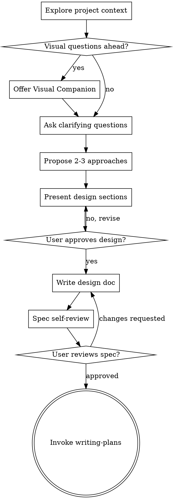

# Brainstorming 技能使用完全指南

> 来源：obra/superpowers 插件 v5.0.7
> 整理：2026-05-05

---

## 概述

Brainstorming 是 Superpowers 工作流的第一个技能，在任何创意工作之前触发。它的核心作用是：**通过自然协作对话，将模糊的想法转化为完整的设计方案**。

```
★ 核心原则：
- 先理解项目上下文
- 一次只问一个问题
- 多选优于开放问题
- 未经用户批准，绝不开始实现
```

---

## 何时使用 Brainstorming

**必须触发的情况：**
- 创建新功能
- 构建组件
- 添加功能
- 修改现有行为

**特殊情况：**
- 即使是"简单"的任务列表、单函数工具、配置变更 — 也必须走这个流程
- "简单"项目是未经检验假设造成最大浪费的地方
- 设计可以很短（对于真正简单的项目几句话即可），但必须呈现并获得批准

---

## 完整流程图



---

## 9 步检查清单

| 步骤 | 任务 | 说明 |
|------|------|------|
| 1 | **探索项目上下文** | 检查文件、文档、最近提交 |
| 2 | **提供视觉伴侣**（如需要） | 单独消息，不与其他内容合并 |
| 3 | **问澄清问题** | 一次一个，理解目的/约束/成功标准 |
| 4 | **提出 2-3 个方案** | 含权衡和推荐 |
| 5 | **呈现设计方案** | 按复杂度分节，每节获批后继续 |
| 6 | **写设计文档** | 保存到 `docs/superpowers/specs/YYYY-MM-DD-<topic>-design.md` |
| 7 | **Spec 自检** | 占位符、内部一致性、范围、歧义 |
| 8 | **用户审批** | 请求用户审查书面 spec |
| 9 | **过渡到实现** | 调用 writing-plans 技能 |

---

## 详细步骤说明

### Step 1: 探索项目上下文

**必须做：**
- 检查当前文件结构
- 读取相关文档
- 查看最近的 git 提交
- 了解现有代码模式

**目的：** 在问问题之前，了解你正在工作的环境

---

### Step 2: 提供视觉伴侣（可选）

**触发条件：** 如果预期问题涉及视觉内容（线框图、布局、图表）

**重要：** 这必须是**独立消息**，不能与澄清问题合并

**标准文本：**
> "Some of what we're working on might be easier to explain if I can show it to you in a web browser. I can put together mockups, diagrams, comparisons, and other visuals as we go. This feature is still new and can be token-intensive. Want to try it? (Requires opening a local URL)"

**等待用户回复后再继续。**

---

### Step 3: 问澄清问题

**核心规则：**
- **一次只问一个问题**
- 如果一个主题需要更多探索，拆成多个问题
- 多选优于开放问题
- 聚焦理解：目的、约束、成功标准

**示例多选问题：**
```
用户想要添加用户认证

❌ 一次问太多：
"你想要的认证系统是什么样子的？需要什么功能？"

✅ 一次问一个：
"用户认证方式，你想要：
A) 仅邮箱密码
B) 邮箱密码 + 社交登录（Google/GitHub）
C) 邮箱密码 + 社交登录 + 企业 SSO

推荐 B，平衡安全性和实现复杂度。"
```

**问题方向：**
1. **目的** — 用户真正想解决什么问题？
2. **范围** — 什么是必须有的，什么是可选的？
3. **约束** — 有技术限制、时间限制、预算限制吗？
4. **成功标准** — 怎么判断这个功能完成了？

---

### Step 4: 提出 2-3 个方案

**要求：**
- 提出 2-3 个不同方案
- 每个方案说明权衡
- 给出推荐并解释原因
- 用对话方式呈现

**格式示例：**
```
在我们深入细节之前，有几个方向可以考虑：

**方案 A：简单邮箱密码（推荐）**
- 优点：实现最快，用户熟悉
- 缺点：密码管理风险

**方案 B：邮箱 + 社交登录**
- 优点：平衡安全性和便利性
- 缺点：需要处理多提供商

**方案 C：完整 SSO 方案**
- 优点：最企业级
- 缺点：实现复杂，依赖外部服务

我推荐方案 B，因为它在安全性和实现工作量之间取得最佳平衡。你倾向哪个？"
```

---

### Step 5: 呈现设计方案

**原则：**
- 按复杂度缩放每个部分：简单项目几句话，复杂项目 200-300 字
- 每节之后问"这样看起来对吗？"
- 覆盖：架构、组件、数据流、错误处理、测试
- 如果有不清楚的地方，准备好回头澄清

**设计分节示例：**
```
**1. 概述（1-2 句）**
用户可以通过邮箱密码或社交登录进行认证。

**2. 架构**
[详细描述组件和它们如何交互]

**3. 数据模型**
[描述用户表、session 表等]

**4. API 设计**
[认证端点、token 处理等]

这样看起来对吗？如果看起来不错，我继续介绍错误处理..."
```

---

### Step 6: 写设计文档

**保存位置：**
```
docs/superpowers/specs/YYYY-MM-DD-<topic>-design.md
```

**注意：** 用户偏好可以覆盖此默认位置

**文档结构：**
```markdown
# [功能名] 设计文档

## 概述
[功能的高层描述]

## 架构
[系统架构说明]

## 组件
[各个组件及其职责]

## 数据流
[数据如何流动]

## 错误处理
[错误场景及处理方式]

## 测试策略
[如何验证这个功能]
```

---

### Step 7: Spec 自检

写完 spec 后，用新眼光检查：

**1. 占位符扫描：**
- 有 "TBD"、"TODO"、不完整部分、或模糊需求吗？修复它们

**2. 内部一致性：**
- 各节是否矛盾？架构与功能描述匹配吗？

**3. 范围检查：**
- 这个 spec 专注到足以产生单一实现计划吗？需要分解吗？

**4. 歧义检查：**
- 任何需求可以有两种解释吗？如果有，选一个并明确

**发现问题就内联修复。无需重新审查 — 修复后继续。**

---

### Step 8: 用户审批

**标准文本：**
> "Spec written and committed to `<path>`. Please review it and let me know if you want to make any changes before we start writing out the implementation plan."

**等待用户回复。**

- 如果用户请求更改 → 做出更改 → 重新运行 spec 审查循环
- 只有用户批准后才继续

---

### Step 9: 过渡到实现

**调用 writing-plans 技能创建详细实现计划**

**重要：**
- 这之后不要调用其他技能
- writing-plans 是唯一正确的下一步

---

## Visual Companion 视觉伴侣

### 何时使用

**使用浏览器：** 内容本身是视觉的
- UI 线框图
- 架构图
- 并排比较
- 设计细节

**使用终端：** 内容是文本或表格
- 需求和范围问题
- 概念性选择
- 权衡列表
- 技术决策

### 工作原理

1. 服务器监视目录中的 HTML 文件
2. 你写入 `screen_dir`
3. 用户在浏览器中看到
4. 选择记录到 `state_dir/events`
5. 你在下一轮读取

### 启动服务器

```bash
# 启动服务器（持久化到项目）
scripts/start-server.sh --project-dir /path/to/project
```

返回：
```json
{"type":"server-started","port":52341,"url":"http://localhost:52341",
 "screen_dir":"/path/to/project/.superpowers/brainstorm/12345-1706000000/content",
 "state_dir":"/path/to/project/.superpowers/brainstorm/12345-1706000000/state"}
```

### 编写内容片段

```html
<h2>哪个布局更好？</h2>
<p class="subtitle">考虑可读性和视觉层次</p>

<div class="options">
  <div class="option" data-choice="a" onclick="toggleSelect(this)">
    <div class="letter">A</div>
    <div class="content">
      <h3>单列</h3>
      <p>干净、专注的阅读体验</p>
    </div>
  </div>
  <div class="option" data-choice="b" onclick="toggleSelect(this)">
    <div class="letter">B</div>
    <div class="content">
      <h3>两列</h3>
      <p>侧边栏导航配主内容区</p>
    </div>
  </div>
</div>
```

### 可用 CSS 类

| 类 | 用途 |
|-----|------|
| `.options` | A/B/C 选择 |
| `.cards` | 视觉设计卡片 |
| `.mockup` | 预览容器 |
| `.split` | 并排视图 |
| `.pros-cons` | 优缺点 |
| `.mock-nav` | 导航线框 |
| `.mock-sidebar` | 侧边栏线框 |
| `.mock-button` | 按钮线框 |
| `.mock-input` | 输入框线框 |

### 循环流程

1. 检查服务器存活 → 写入 HTML 到 `screen_dir`
2. 告知用户 URL 并结束回合
3. 下一轮：读取 `$STATE_DIR/events`
4. 迭代或前进
5. 返回终端时推等待屏幕

### 等待屏幕

```html
<div style="display:flex;align-items:center;justify-content:center;min-height:60vh">
  <p class="subtitle">Continuing in terminal...</p>
</div>
```

---

## 关键原则

| 原则 | 说明 |
|------|------|
| **一次一个问题** | 不要用多个问题压垮用户 |
| **多选优于开放** | 更容易回答 |
| **YAGNI 严格** | 从所有设计中移除不必要的功能 |
| **探索替代方案** | 总是提出 2-3 个方案再定 |
| **增量验证** | 呈现设计，获得批准后再继续 |
| **保持灵活** | 有不清楚的随时回头澄清 |

---

## 大型项目分解

**信号：** 如果请求描述多个独立子系统，立即标记

**分解流程：**
1. 识别独立部分
2. 说明它们如何关联
3. 确定构建顺序
4. 第一个子项目走正常设计流程
5. 每个子项目获得自己的 spec → plan → implementation 循环

**示例：**
```
用户："我想构建一个带聊天、文件存储、计费和分析的平台"

→ 立即标记：
"这听起来像 4 个独立子系统。让我建议的分解方式：

1. 聊天基础设施
2. 文件存储系统
3. 计费集成
4. 分析仪表板

我们从哪个开始？推荐聊天，因为它影响其他系统的设计决策。"
```

---

## 常见错误

| 错误 | 正确做法 |
|------|----------|
| 跳过上下文探索直接问问题 | 先了解项目状态 |
| 一次问多个问题 | 一次一个 |
| 忽略 YAGNI | 严格移除不必要功能 |
| 假设简单就不需要设计 | 任何项目都需要审批 |
| 跳过 spec 自检 | 必须检查占位符和歧义 |
| 未经用户审批就实现 | 等待明确批准 |

---

## 输出物

**设计文档：** `docs/superpowers/specs/YYYY-MM-DD-<topic>-design.md`

**包含内容：**
- 概述
- 架构
- 组件设计
- 数据流
- 错误处理
- 测试策略
- 任何相关细节

---

## 后续流程

```
Brainstorming 完成
    ↓
Writing Plans 激活
    ↓
Subagent-Driven Development 或 Executing Plans
    ↓
Finishing A Development Branch
```

---

## 快速参考

```
★ 启动时说："I'm using the brainstorming skill to..."
★ 一次只问一个问题
★ 多选优于开放
★ 呈现分节设计，每节获批后继续
★ 写 spec 到 docs/superpowers/specs/
★ 自检后请求用户审批
★ 只有用户批准后才调用 writing-plans
```

---

## 参考资源

- Superpowers 官方：https://github.com/obra/superpowers
- 视觉伴侣脚本：`scripts/start-server.sh`
- 帧模板：`scripts/frame-template.html`
- 助手脚本：`scripts/helper.js`
