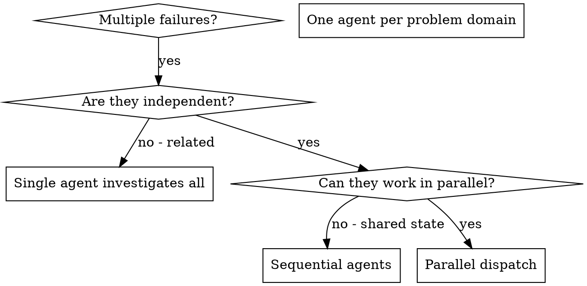
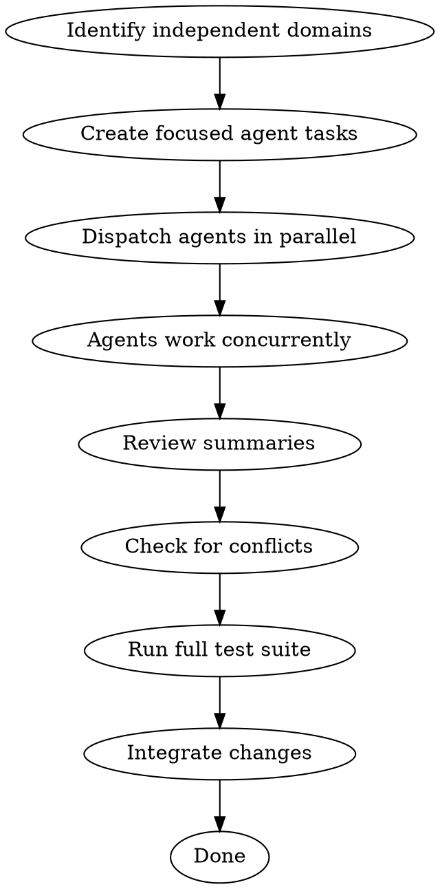

# Dispatching-Parallel-Agents 技能使用完全指南

> 来源：obra/superpowers 插件 v5.0.7
> 整理：2026-05-05

---

## 概述

Dispatching Parallel Agents 的核心原则：**每个独立问题域分发一个代理。让它们同时工作。**

```
★ 核心原则：
- 委托任务给专用子代理，提供隔离上下文
- 当有多个无关失败时，并行调查节省时间
- 每个调查是独立的，可以并行发生
```

---

## 何时使用



**使用当：**
- 3+ 测试文件失败，不同根因
- 多个子系统独立损坏
- 每个问题可在无其他上下文的情况下理解
- 调查之间无共享状态

**不要使用当：**
- 失败相关（修复一个可能修复其他）
- 需要理解完整系统状态
- 代理会相互干扰

---

## 模式

### 1. 识别独立域

按破坏的东西分组失败：
- 文件 A 测试：工具批准流程
- 文件 B 测试：批量完成行为
- 文件 C 测试：中止功能

每个域是独立的 — 修复工具批准不影响中止测试。

### 2. 创建专注代理任务

每个代理获得：
- **具体范围：** 一个测试文件或子系统
- **明确目标：** 让这些测试通过
- **约束：** 不改其他代码
- **期望输出：** 发现和修复的总结

### 3. 并行分发

```typescript
// 在 Claude Code / AI 环境中
Task("Fix agent-tool-abort.test.ts failures")
Task("Fix batch-completion-behavior.test.ts failures")
Task("Fix tool-approval-race-conditions.test.ts failures")
// 全部三个并行运行
```

### 4. 审查和集成

当代理返回：
- 阅读每个总结
- 验证修复不冲突
- 运行完整测试套件
- 集成所有变更

---

## 代理 Prompt 结构

好的代理 prompt：
1. **专注** - 一个清晰的问题域
2. **自包含** - 理解问题所需的全部上下文
3. **具体关于输出** - 代理应该返回什么？

```markdown
修复 src/agents/agent-tool-abort.test.ts 中的 3 个失败测试：

1. "should abort tool with partial output capture" - 期望消息中有 'interrupted at'
2. "should handle mixed completed and aborted tools" - 快速工具被中止而非完成
3. "should properly track pendingToolCount" - 期望 3 个结果但得到 0

这些是时序/竞态条件问题。你的任务：

1. 阅读测试文件，理解每个测试验证什么
2. 识别根因 - 时序问题还是实际 bug？
3. 修复：
   - 用基于事件的等待替换任意超时
   - 修复中止实现中的 bug（如果发现）
   - 如果测试了变更的行为，调整测试期望

不要只是增加超时 - 找到真正的问题。

返回：发现和修复的总结。
```

---

## 常见错误

### ❌ 太宽泛

**问题：** "修复所有测试" — 代理迷失

**✅ 具体：** "修复 agent-tool-abort.test.ts" — 专注范围

### ❌ 无上下文

**问题：** "修复竞态条件" — 代理不知道在哪里

**✅ 上下文：** 粘贴错误消息和测试名

### ❌ 无约束

**问题：** 代理可能重构一切

**✅ 约束：** "不改变生产代码"或"只修复测试"

### ❌ 模糊输出

**问题：** "修复它" — 不知道什么改变了

**✅ 具体：** "返回根因和变更的总结"

---

## 何时不使用

**相关失败：** 修复一个可能修复其他 — 先一起调查
**需要完整上下文：** 理解需要看到整个系统
**探索性调试：** 不知道什么坏了
**共享状态：** 代理会相互干扰（编辑相同文件，使用相同资源）

---

## 实际会话示例

**场景：** 重大重构后 6 个测试失败，跨 3 个文件

**失败：**
- agent-tool-abort.test.ts: 3 个失败（时序问题）
- batch-completion-behavior.test.ts: 2 个失败（工具未执行）
- tool-approval-race-conditions.test.ts: 1 个失败（执行计数 = 0）

**决策：** 独立域 - 中止逻辑与批量完成和竞态条件分离

**分发：**
```
Agent 1 → Fix agent-tool-abort.test.ts
Agent 2 → Fix batch-completion-behavior.test.ts
Agent 3 → Fix tool-approval-race-conditions.test.ts
```

**结果：**
- Agent 1: 用基于事件的等待替换超时
- Agent 2: 修复事件结构 bug（threadId 在错误位置）
- Agent 3: 添加等待异步工具执行完成

**集成：** 所有修复独立，无冲突，完整套件绿色

**节省时间：** 3 个问题并行解决 vs 顺序

---

## 关键优势

1. **并行化** - 多个调查同时发生
2. **专注** - 每个代理有窄范围，要跟踪的上下文更少
3. **独立性** - 代理不相互干扰
4. **速度** - 3 个问题用 1 个问题的时间解决

---

## 验证

代理返回后：
1. **审查每个总结** - 理解什么改变了
2. **检查冲突** - 代理编辑了相同代码吗？
3. **运行完整套件** - 验证所有修复一起工作
4. **抽查** - 代理可能犯系统性错误

---

## 完整流程图



---

## 快速参考

```
★ 使用条件：3+ 独立失败，无共享状态
★ 分发：一个代理处理一个问题域
★ Prompt 结构：专注 + 自包含 + 具体输出
★ 验证：审查总结 → 检查冲突 → 运行套件 → 集成
```
