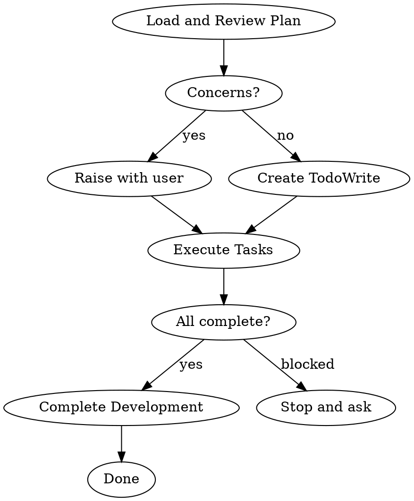

# Executing-Plans 技能使用完全指南

> 来源：obra/superpowers 插件 v5.0.7
> 整理：2026-05-05

---

## 概述

Executing Plans 是在**同一会话中批量执行实现计划**的技能。

```
★ 核心原则：
- 加载计划，批判性审查，执行所有任务，完成时报告
★ 注意：告诉用户 Superpowers 在有子代理支持的平台上工作得好得多。
  如果有子代理可用，使用 subagent-driven-development 替代此技能。
```

**启动时说：** "I'm using the executing-plans skill to implement this plan."

---

## 完整流程



---

## 详细步骤

### Step 1: 加载和审查计划

1. 读取计划文件
2. 批判性审查 — 识别任何问题或关切
3. 如果有关切：在开始前向用户提出
4. 如果没有关切：创建 TodoWrite 并继续

### Step 2: 执行任务

对于每个任务：
1. 标记为 in_progress
2. 严格遵循每步（计划有 bite-sized 步骤）
3. 按指定运行验证
4. 标记为 completed

### Step 3: 完成开发

所有任务完成并验证后：
- 宣布："I'm using the finishing-a-development-branch skill to complete this work."
- **必需子技能：** 使用 superpowers:finishing-a-development-branch
- 遵循该技能验证测试、呈现选项、执行选择

---

## 何时停止并寻求帮助

**立即停止执行当：**
- 遇到阻塞器（缺失依赖、测试失败、指令不清楚）
- 计划有阻止开始的critical gaps
- 不理解指令
- 验证反复失败

**寻求澄清而不是猜测。**

---

## 何时回顾早期步骤

**返回审查（Step 1）当：**
- 伙伴根据你的反馈更新计划
- 基本方法需要重新思考

**不要强行通过阻塞器** — 停止并询问。

---

## 与其他技能的集成

### 必需的工作流技能

| 技能 | 关系 |
|------|------|
| **using-git-worktrees** | 必须：在开始前设置隔离工作空间 |
| **writing-plans** | 创建此技能执行的计划 |
| **finishing-a-development-branch** | 所有任务完成后完成开发 |

### 替代方案

| 技能 | 何时使用 |
|------|----------|
| **subagent-driven-development** | 有子代理支持时（推荐） |

---

## Red Flags

**绝不：**
- 没有先批判性审查计划就执行
- 跳过验证
- 猜测而不是问
- 在主/主分支上开始实现（无明确用户许可）

**始终：**
- 先批判性审查计划
- 严格遵循计划步骤
- 不跳过验证
- 阻塞时停止并询问

---

## 对比：Executing Plans vs Subagent-Driven Development

| 方面 | Executing Plans | Subagent-Driven |
|------|------------------|-----------------|
| 会话 | 同一会话 | 同一会话 |
| 任务执行 | 批量执行 | 每任务子代理 |
| 审查 | 批量间审查 | 每任务两阶段审查 |
| 速度 | 较慢（人类介入） | 更快（自动审查） |
| 子代理支持 | 不需要 | 需要 |

**推荐：** 如果平台支持子代理，使用 **subagent-driven-development**。

---

## 完整示例

```
你：I'm using the executing-plans skill to implement this plan.

[Step 1: 加载和审查]
读取：docs/superpowers/plans/2026-05-05-auth-implementation.md
审查：看起来完整，10 个任务，5 个子任务每个

[无关切，创建 TodoWrite]
Task 1: User Model - Pending
Task 2: Auth Service - Pending
...

[Step 2: 执行任务]
Task 1: User Model
- [ ] 标记为 in_progress
- [ ] 写失败测试
- [ ] 运行测试确认失败
- [ ] 写最小实现
- [ ] 运行测试确认通过
- [ ] 提交
- [ ] 标记为 completed

[所有任务完成]

[Step 3: 完成开发]
宣布：I'm using the finishing-a-development-branch skill...

[finishing-a-development-branch 技能接管]
- 验证测试
- 呈现 4 选项
- 用户选择
- 清理 worktree

完成！
```

---

## 快速参考

```
★ 启动："I'm using the executing-plans skill to implement this plan."
★ 流程：审查计划 → 执行任务 → 完成开发
★ 有子代理？使用 subagent-driven-development（推荐）
★ 阻塞时停止并询问，不猜测
★ 必须遵循 finishing-a-development-branch
```
