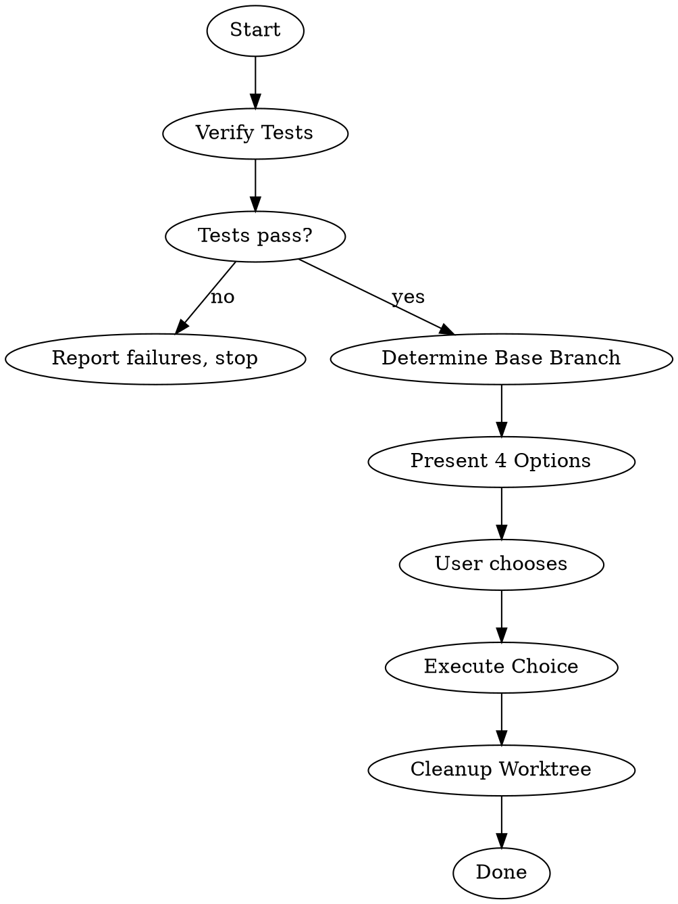

# Finishing-A-Development-Branch 技能使用完全指南

> 来源：obra/superpowers 插件 v5.0.7
> 整理：2026-05-05

---

## 概述

Finishing A Development Branch 的核心原则：**验证测试 → 呈现选项 → 执行选择 → 清理**。

```
★ 核心原则：
- 完成开发工作的结构化指导
- 清晰的选项，无歧义
★ 启动时说："I'm using the finishing-a-development-branch skill to complete this work."
```

---

## 完整流程



---

## 详细步骤

### Step 1: 验证测试

**在呈现选项前，验证测试通过：**

```bash
# 运行项目测试套件
npm test / cargo test / pytest / go test ./...
```

**如果测试失败：**
```
Tests failing (<N> failures). Must fix before completing:

[Show failures]

Cannot proceed with merge/PR until tests pass.
```

停止。不要进入 Step 2。

**如果测试通过：** 继续 Step 2。

---

### Step 2: 确定基础分支

```bash
# 尝试常见基础分支
git merge-base HEAD main 2>/dev/null || git merge-base HEAD master 2>/dev/null
```

或问："此分支从 main 分出 - 正确吗？"

---

### Step 3: 呈现选项

**呈现恰好这 4 个选项：**

```
Implementation complete. What would you like to do?

1. Merge back to <base-branch> locally
2. Push and create a Pull Request
3. Keep the branch as-is (I'll handle it later)
4. Discard this work

Which option?
```

**不要添加解释** - 保持选项简洁。

---

### Step 4: 执行选择

#### 选项 1: 本地合并

```bash
# 切换到基础分支
git checkout <base-branch>

# 拉取最新
git pull

# 合并功能分支
git merge <feature-branch>

# 在合并结果上验证测试
<test command>

# 如果测试通过
git branch -d <feature-branch>
```

然后：清理 worktree（Step 5）

#### 选项 2: 推送并创建 PR

```bash
# 推送分支
git push -u origin <feature-branch>

# 创建 PR
gh pr create --title "<title>" --body "$(cat <<'EOF'
## Summary
<2-3 bullets of what changed>

## Test Plan
- [ ] <verification steps>
EOF
)"
```

然后：清理 worktree（Step 5）

#### 选项 3: 保持原样

报告：`Keeping branch <name>. Worktree preserved at <path>.`

**不要清理 worktree。**

#### 选项 4: 丢弃

**先确认：**
```
This will permanently delete:
- Branch <name>
- All commits: <commit-list>
- Worktree at <path>

Type 'discard' to confirm.
```

等待确切确认。

如果确认：
```bash
git checkout <base-branch>
git branch -D <feature-branch>
```

然后：清理 worktree（Step 5）

---

### Step 5: 清理 Worktree

**对于选项 1, 2, 4：**

检查是否在 worktree 中：
```bash
git worktree list | grep $(git branch --show-current)
```

如果是：
```bash
git worktree remove <worktree-path>
```

**对于选项 3：** 保持 worktree。

---

## 快速参考表

| 选项 | 合并 | 推送 | 保持 Worktree | 清理分支 |
|------|------|------|---------------|----------|
| 1. 本地合并 | ✓ | - | - | ✓ |
| 2. 创建 PR | - | ✓ | ✓ | - |
| 3. 保持原样 | - | - | ✓ | - |
| 4. 丢弃 | - | - | - | ✓ (force) |

---

## 常见错误

### ❌ 跳过测试验证

**问题：** 合并坏代码，创建失败的 PR

**修复：** 始终在提供选项前验证测试

### ❌ 开放式问题

**问题：** "下一步做什么？" → 模糊

**修复：** 呈现恰好 4 个结构化选项

### ❌ 自动清理 worktree

**问题：** 在可能需要时移除 worktree（选项 2, 3）

**修复：** 只为选项 1 和 4 清理

### ❌ 丢弃无确认

**问题：** 意外删除工作

**修复：** 要求输入"discard"确认

---

## Red Flags

**绝不：**
- 继续失败的测试
- 不验证结果上的测试就合并
- 不确认就删除工作
- 无明确请求 force-push

**始终：**
- 验证测试后才提供选项
- 呈现恰好 4 个选项
- 为选项 4 获取输入"discard"确认
- 只为选项 1 和 4 清理 worktree

---

## 与其他技能的集成

### 被谁调用

| 技能 | 阶段 |
|------|------|
| **subagent-driven-development** | 步骤 7 - 所有任务完成后 |
| **executing-plans** | 步骤 5 - 所有批次完成后 |

### 与谁配合

| 技能 | 关系 |
|------|------|
| **using-git-worktrees** | 清理该技能创建的工作空间 |

---

## 完整示例

```
你：I'm using the finishing-a-development-branch skill to complete this work.

[验证测试]
$ npm test
> myproject@1.0.0 test
> jest

PASS  src/models/user.test.ts
PASS  src/services/auth.test.ts

Test Suites: 2 passed, 2 total
Tests:       34 passed, 34 total

[确定基础分支]
git merge-base HEAD main
→ base-branch = main

[呈现选项]
Implementation complete. What would you like to do?

1. Merge back to main locally
2. Push and create a Pull Request
3. Keep the branch as-is (I'll handle it later)
4. Discard this work

Which option? [用户选择 2]

[执行选项 2]
git push -u origin feature/auth
gh pr create --title "feat: add user authentication" ...

[清理 worktree]
git worktree list | grep feature/auth
→ .worktrees/auth
git worktree remove .worktrees/auth

完成！
```

---

## 快速参考

```
★ 启动："I'm using the finishing-a-development-branch skill..."
★ 流程：验证测试 → 4 选项 → 执行 → 清理
★ 测试失败 = 停止，不能继续
★ 丢弃 = 必须确认
★ 只为选项 1, 4 清理 worktree
```
