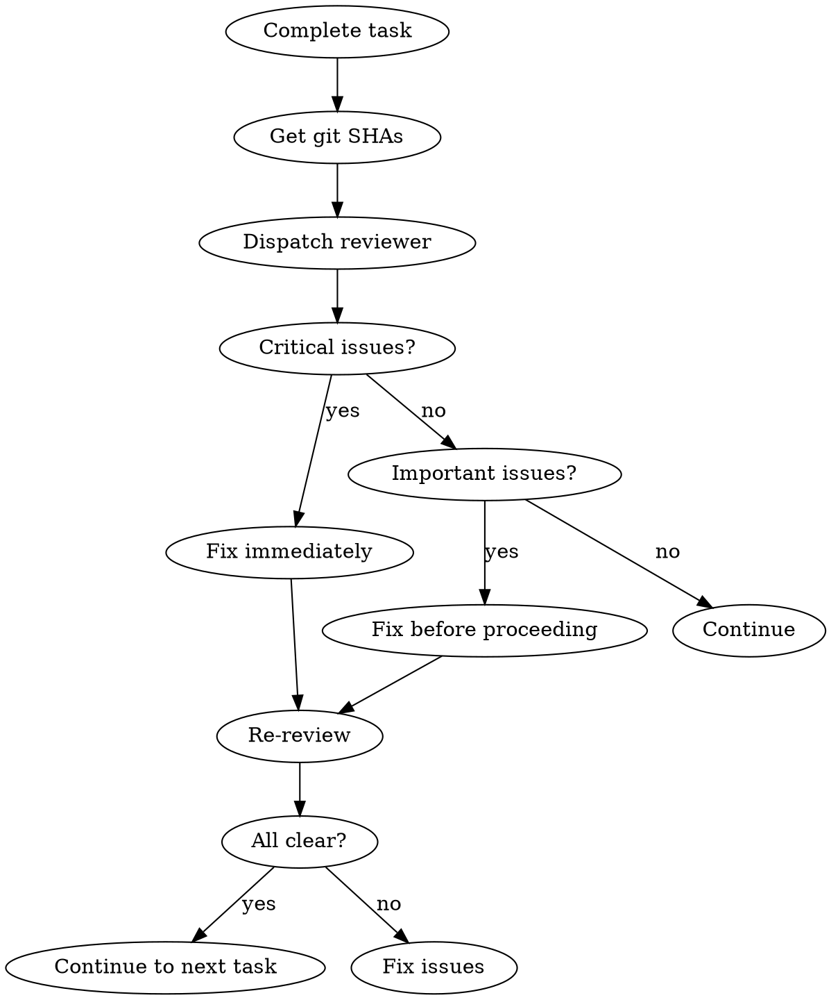

# Requesting-Code-Review 技能使用完全指南

> 来源：obra/superpowers 插件 v5.0.7
> 整理：2026-05-05

---

## 概述

Requesting Code Review 的核心原则：**早审查，常审查**。

```
★ 核心原则：
- 分发 superpowers:code-reviewer 子代理
- 审查者获得精确构建的上下文进行评估
- 保持自己的上下文用于协调工作
```

---

## 何时请求审查

### 强制

- 在 subagent-driven development 中每个任务后
- 重大功能完成后
- 合并到 main 前

### 可选但有价值

- 卡住时（新鲜视角）
- 重构前（基线检查）
- 复杂 bug 修复后

---

## 如何请求

### Step 1: 获取 Git SHA

```bash
BASE_SHA=$(git rev-parse HEAD~1)  # or origin/main
HEAD_SHA=$(git rev-parse HEAD)
```

### Step 2: 分发 Code Reviewer 子代理

使用 Task 工具，类型为 `superpowers:code-reviewer`，填充 `code-reviewer.md` 模板。

**占位符：**
- `{WHAT_WAS_IMPLEMENTED}` - 你刚刚构建的
- `{PLAN_OR_REQUIREMENTS}` - 应该做什么
- `{BASE_SHA}` - 起始提交
- `{HEAD_SHA}` - 结束提交
- `{DESCRIPTION}` - 简要总结

### Step 3: 处理反馈

- 立即修复 Critical 问题
- 继续前修复 Important 问题
- Minor 问题记下后续处理
- 如果审查者错误，用推理反驳

---

## 完整流程图



---

## 示例工作流

```
[刚完成 Task 2: 添加验证函数]

你：让我在继续前请求代码审查。

BASE_SHA=$(git log --oneline | grep "Task 1" | head -1 | awk '{print $1}')
HEAD_SHA=$(git rev-parse HEAD)

[分发 superpowers:code-reviewer 子代理]
  WHAT_WAS_IMPLEMENTED: 验证和修复会话索引的函数
  PLAN_OR_REQUIREMENTS: docs/superpowers/plans/deployment-plan.md 的 Task 2
  BASE_SHA: a7981ec
  HEAD_SHA: 3df7661
  DESCRIPTION: 添加了 verifyIndex() 和 repairIndex()，4 种问题类型

[子代理返回]：
  Strengths: 清晰架构，真实测试
  Issues:
    Important: 缺失进度指示器
    Minor: 报告间隔的魔法数字 (100)
  Assessment: 可以继续

你：[修复进度指示器]
[继续到 Task 3]
```

---

## 与工作流集成

### Subagent-Driven Development

- 每个任务后审查
- 在问题累积前捕获
- 修复后再继续下一任务

### Executing Plans

- 每批（3 任务）后审查
- 获取反馈，应用，继续

### Ad-Hoc Development

- 合并前审查
- 卡住时审查

---

## Red Flags

**绝不：**
- 因为"简单"跳过审查
- 忽略 Critical 问题
- 继续未修复的 Important 问题
- 用技术反馈争辩

**如果审查者错误：**
- 用技术推理反驳
- 展示证明其工作的代码/测试
- 请求澄清

---

## 快速参考

```
★ 时机：每个任务后 / 重大功能后 / 合并前
★ 获取 SHA：BASE_SHA 和 HEAD_SHA
★ 分发：superpowers:code-reviewer 子代理
★ 处理：Critical 立即修复，Important 继续前修复，Minor 记下
★ 审查者错误 = 反驳（带推理）
```
