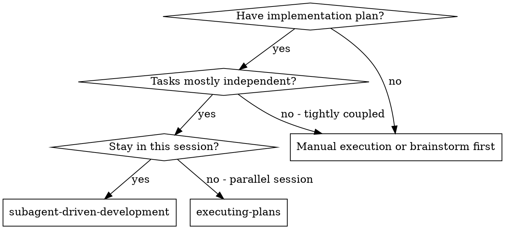
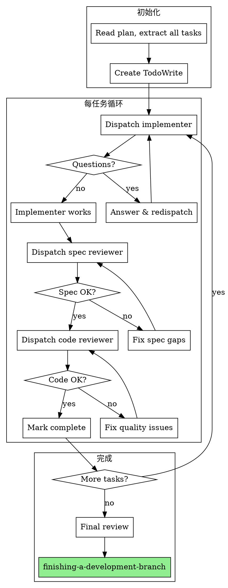

# Subagent-Driven Development 技能使用完全指南

> 来源：obra/superpowers 插件 v5.0.7
> 整理：2026-05-05

---

## 概述

Subagent-Driven Development 是最高效的实现方式，通过**每任务新鲜子代理 + 两阶段审查**实现高质量快速迭代。

```
★ 核心原则：
- 新鲜子代理处理每任务（无上下文污染）
- 两阶段审查：spec 合规性 → 代码质量
- 同一会话持续迭代
```

**启动时说：** "I'm using Subagent-Driven Development to execute this plan."

---

## 何时使用



| 条件 | 选择 |
|------|------|
| 有实施计划 + 任务独立 + 同一会话 | **subagent-driven-development** |
| 有实施计划 + 任务独立 + 平行会话 | executing-plans |
| 有实施计划 + 任务紧耦合 | Manual（先 brainstorming） |
| 无实施计划 | brainstorming |

---

## 完整流程图



---

## 初始化步骤

### 1. 读取计划文件

```bash
Read: docs/superpowers/plans/2026-05-05-auth-implementation.md
```

### 2. 提取所有任务

对于每个任务，提取：
- 完整文本
- 上下文
- 文件路径
- 期望结果

### 3. 创建 TodoWrite

```
Task 1: User Model - Pending
Task 2: Database Schema - Pending
Task 3: Auth Service - Pending
...
```

---

## 每任务执行流程

### Step 1: 分发 Implementer 子代理

**提供内容：**
- 任务完整文本和上下文
- 不让子代理读计划文件（提供完整文本）

**Prompt 模板参考：**
```markdown
Implement Task 1: User Model

[Task 1 complete text with all context]

Files:
- Create: src/models/user.ts
- Modify: src/database/schema.sql
- Test: tests/unit/models/user.test.ts

Requirements:
[Extract requirements from spec]

Do:
1. Write failing test
2. Run test to confirm it fails
3. Write minimal implementation
4. Run test to confirm it passes
5. Commit with conventional message

Report back with status: DONE / DONE_WITH_CONCERNS / NEEDS_CONTEXT / BLOCKED
```

### Step 2: 处理 Implementer 状态

| 状态 | 处理方式 |
|------|----------|
| **DONE** | 进入 spec 审查 |
| **DONE_WITH_CONCERNS** | 读取关注点后再决定 |
| **NEEDS_CONTEXT** | 提供缺失信息，重新分发 |
| **BLOCKED** | 评估原因后重新分发或升级 |

### Step 3: Spec 合规性审查

**分发 Spec Reviewer 子代理**

审查问题：
- 代码是否满足 spec 的所有要求？
- 是否有 spec 外的额外实现？
- 是否有遗漏的需求？

**Spec 审查结果：**
- ✅ 通过 → 进入代码质量审查
- ❌ 失败 → implementer 修复 → 重新审查

### Step 4: 代码质量审查

**分发 Code Quality Reviewer 子代理**

审查问题：
- 代码质量、风格、可读性
- 是否有明显问题
- 测试覆盖是否充分

**代码质量结果：**
- ✅ 通过 → 标记任务完成
- ❌ 失败 → implementer 修复 → 重新审查

---

## 模型选择策略

| 任务类型 | 示例 | 推荐模型 |
|----------|------|----------|
| **机械实现** | 孤立函数、清晰 spec、1-2 文件 | 快速、便宜模型 |
| **集成/判断** | 多文件协调、模式匹配、调试 | 标准模型 |
| **架构/设计** | 设计判断、广泛代码库理解 | 最强模型 |

**复杂度信号：**
- 1-2 文件 + 完整 spec → 便宜模型
- 多文件 + 集成关注 → 标准模型
- 需要设计判断 → 最强模型

---

## 实施者状态详解

### DONE

```
实现者完成了工作。

→ 直接进入 spec 合规性审查
```

### DONE_WITH_CONCERNS

```
实现者完成了工作但标记了疑虑。

→ 先读关注点：
  - 关于正确性/范围的疑虑 → 审查前解决
  - 观察性（如"文件变大"）→ 记录，继续审查
```

### NEEDS_CONTEXT

```
实现者需要未提供的信息。

→ 提供缺失的上下文
→ 重新分发（同一模型）
```

### BLOCKED

```
实现者无法完成任务。

→ 评估阻塞原因：
  1. 上下文问题 → 提供更多上下文，重新分发（同一模型）
  2. 需要更多推理 → 重新分发（更强模型）
  3. 任务太大 → 拆分为更小任务
  4. 计划本身错误 → 升级给人类
```

---

## 审查循环示例

```
Task 2: Recovery modes

[Implementer 完成]

[Spec Reviewer 审查]
❌ 问题：
  - 缺失：进度报告（spec 说 "每 100 项报告"）
  - 额外：添加了 --json flag（未请求）

[Implementer 修复]
- 移除 --json flag
- 添加进度报告

[Spec Reviewer 重新审查]
✅ Spec 合规

[Code Quality Reviewer 审查]
问题（重要）：Magic number (100)

[Implementer 修复]
提取 PROGRESS_INTERVAL 常量

[Code Quality Reviewer 重新审查]
✅ 批准

[标记 Task 2 完成]
```

---

## 优势分析

### vs 手动执行

| 方面 | 手动执行 | Subagent-Driven |
|------|----------|-----------------|
| TDD 遵循 | 依赖自律 | 自然遵循 |
| 上下文 | 随时间污染 | 每任务新鲜 |
| 并行安全 | 需协调 | 子代理不干扰 |
| 问题提问 | 只能在任务前 | 任务前和期间均可 |

### vs Executing Plans

| 方面 | Executing Plans | Subagent-Driven |
|------|------------------|-----------------|
| 会话 | 切换（上下文损失） | 同一会话 |
| 审查 | 人类介入 | 自动审查 |
| 迭代速度 | 较慢 | 更快 |

### 效率提升

- 无文件读取开销（controller 提供完整文本）
- Controller 精确提供所需上下文
- 子代理获得完整信息
- 问题在开始前浮现（而非之后）

---

## Red Flags（必须避免）

**绝不：**
- 在主分支上开始实现（无明确用户许可）
- 跳过审查（spec 合规或代码质量）
- 继续未修复的问题
- 并行分发多个实现子代理（冲突）
- 让子代理读计划文件（提供完整文本）
- 跳过场景设置上下文
- 忽略子代理问题
- 接受"差不多"的 spec 合规
- 跳过审查循环
- 用自检替代实际审查
- **在 spec 合规审查通过前进行代码质量审查**
- 在任一审查有未解决问题时进入下一任务

**如果子代理问问题：**
- 清晰完整回答
- 按需提供额外上下文
- 不要催促实现

**如果审查发现问题：**
- Implementer（同一子代理）修复
- 审查者重新审查
- 重复直到批准
- 不要跳过重新审查

**如果子代理失败：**
- 分发修复子代理带具体指令
- 不要手动修复（上下文污染）

---

## 与其他技能的集成

### 必须的工作流技能

| 技能 | 关系 |
|------|------|
| **using-git-worktrees** | 必须：开始前设置隔离工作空间 |
| **writing-plans** | 创建此技能执行的计划 |
| **requesting-code-review** | 代码审查模板 |
| **finishing-a-development-branch** | 全部任务完成后完成开发 |

### 子代理应使用的技能

| 技能 | 用途 |
|------|------|
| **test-driven-development** | 子代理每任务遵循 TDD |

### 替代工作流

| 技能 | 何时使用 |
|------|----------|
| **executing-plans** | 平行会话而非同一会话 |

---

## 完整示例工作流

```
你：I'm using Subagent-Driven Development to execute this plan.

[读取计划文件一次]
[提取所有 5 个任务的完整文本和上下文]
[创建 TodoWrite]

Task 1: Hook installation script

[获取 Task 1 文本和上下文]
[分发实现子代理]

实现者："开始前 — hook 应该安装在用户级还是系统级？"

你："用户级（~/.config/superpowers/hooks/）"

实现者："明白了。正在实现..."
[稍后] 实现者：
  - 实现了 install-hook 命令
  - 添加了测试，5/5 通过
  - 自检：发现遗漏了 --force flag，添加了
  - 提交

[分发 spec 合规审查]
Spec 审查者：✅ Spec 合规 - 所有需求满足，无额外

[获取 git SHA，分发代码质量审查]
代码审查者：优势：好测试覆盖，干净。问题：无。批准。

[标记 Task 1 完成]

Task 2: Recovery modes

...

[所有任务后]
[分发最终代码审查者]
最终审查者：所有需求满足，可以合并

完成！
```

---

## 快速参考

```
★ 启动："I'm using Subagent-Driven Development to execute this plan."
★ 初始化：读取计划，提取任务，创建 TodoWrite
★ 每任务：dispatch implementer → spec review → code review
★ 模型选择：机械任务用便宜模型，集成用标准模型，架构用最强模型
★ 审查顺序：spec 合规性审查 → 代码质量审查（不可颠倒）
★ 审查失败：implementer 修复 → 重新审查
★ 状态处理：BLOCKED 需要评估后重新分发或升级
```
