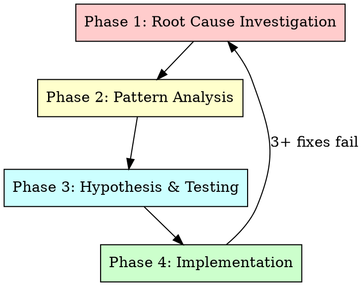
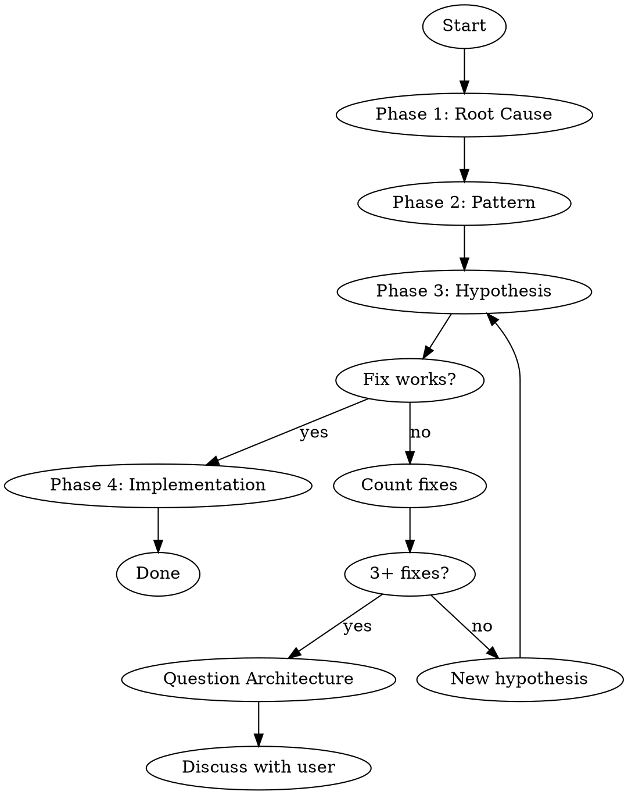

# Systematic Debugging 技能使用完全指南

> 来源：obra/superpowers 插件 v5.0.7
> 整理：2026-05-05

---

## 概述

Systematic Debugging 是解决技术问题的系统性方法，核心是：**在尝试修复前必须找到根因**。

```
★ 核心原则：永远在尝试修复前找到根因。症状修复是失败。
★ 铁律：没有完成第 1 阶段，不能提出任何修复方案。
```

---

## 何时使用

**用于任何技术问题：**
- 测试失败
- 生产环境 bug
- 意外行为
- 性能问题
- 构建失败
- 集成问题

**特别要使用当：**
- 时间压力大时（紧急情况容易猜测）
- "快速修复"看起来很明显时
- 已经尝试了多次修复
- 上次修复没有效果
- 不完全理解问题时

**不要跳过当：**
- 问题看起来简单时（简单 bug 也有根因）
- 赶时间时（匆忙保证返工）
- 经理想要现在就修复时（系统性调试比盲目修复更快）

---

## 铁律

```
NO FIXES WITHOUT ROOT CAUSE INVESTIGATION FIRST
```

没有完成第 1 阶段，你不能提出任何修复方案。

---

## 四阶段流程



---

## Phase 1: 根因调查

**在尝试任何修复前：**

### 1. 仔细阅读错误信息

- 不要跳过错误或警告
- 通常包含确切解决方案
- 完全阅读堆栈跟踪
- 记录行号、文件路径、错误码

### 2. 稳定复现

- 能可靠触发吗？
- 确切步骤是什么？
- 每次都发生吗？
- 如果不能复现 → 收集更多数据，不要猜测

### 3. 检查最近变更

- 什么变更可能导致这个？
- Git diff、最近提交
- 新依赖、配置变更
- 环境差异

### 4. 多组件系统收集证据

**当系统有多个组件时（CI → 构建 → 签名，API → 服务 → 数据库）：**

**在提出修复前，为每个组件边界添加诊断：**
```
对于每个组件边界：
  - 记录进入组件的数据
  - 记录离开组件的数据
  - 验证环境/配置传播
  - 检查每层状态

运行一次收集证据显示在哪里打破
然后分析证据识别失败的组件
然后调查那个特定组件
```

**示例（多层系统）：**
```bash
# Layer 1: Workflow
echo "=== Secrets available in workflow: ==="
echo "IDENTITY: ${IDENTITY:+SET}${IDENTITY:-UNSET}"

# Layer 2: Build script
echo "=== Env vars in build script: ==="
env | grep IDENTITY || echo "IDENTITY not in environment"

# Layer 3: Signing script
echo "=== Keychain state: ==="
security list-keychains
security find-identity -v

# Layer 4: Actual signing
codesign --sign "$IDENTITY" --verbose=4 "$APP"
```

**这揭示了：** 哪层失败（secrets → workflow ✓, workflow → build ✗）

### 5. 追踪数据流

**当错误在调用栈深处时：**

快速版本：
- 坏值从哪里起源？
- 谁用坏值调用了这个？
- 继续追踪直到找到源头
- 在源头修复，而非症状

---

## Phase 2: 模式分析

**修复前找到模式：**

### 1. 找工作的例子

- 在相同代码库中找类似工作的代码
- 什么工作类似于这个坏的？

### 2. 对比参考

- 如果实现模式，完全阅读参考实现
- 不要略读 — 阅读每一行
- 在应用前完全理解模式

### 3. 识别差异

- 工作的和坏的是什么差异？
- 列出每个差异，无论多小
- 不要假设"那个没关系"

### 4. 理解依赖

- 这个需要什么其他组件？
- 什么设置、配置、环境？
- 它做什么假设？

---

## Phase 3: 假设和测试

**科学方法：**

### 1. 形成单一假设

- 清楚声明："我认为 X 是根因因为 Y"
- 写下来
- 要具体，不要模糊

### 2. 最小化测试

- 做最小可能改变来测试假设
- 一次一个变量
- 不要一次修复多个

### 3. 验证后再继续

- 有效了吗？是 → Phase 4
- 没效？形成新假设
- 不要在上面添加更多修复

### 4. 当不知道时

- 说"我不理解 X"
- 不要假装知道
- 寻求帮助
- 做更多研究

---

## Phase 4: 实施

**修复根因，不是症状：**

### 1. 创建失败测试用例

- 最简单的复现
- 可以的话用自动化测试
- 没有框架的话用一次性测试脚本
- 修复前必须有
- 使用 `superpowers:test-driven-development` 技能写适当的失败测试

### 2. 实施单一修复

- 解决识别的根因
- 一次一个变更
- 不要"顺手"改进
- 不要捆绑重构

### 3. 验证修复

- 测试现在通过？
- 没有其他测试坏？
- 问题实际解决了？

### 4. 如果修复不工作

- 停止
- 数一下：尝试了多少次修复？
- 如果 < 3：返回 Phase 1，用新信息重新分析
- **如果 ≥ 3：停止并质疑架构（见下面 step 5）**
- 没有架构讨论不要尝试修复 #4

### 5. 如果 3+ 次修复失败：质疑架构

**表明架构问题的模式：**
- 每个修复在不同地方揭示新的共享状态/耦合/问题
- 修复需要"大规模重构"才能实施
- 每个修复在其他地方产生新症状

**停止并质疑基础：**
- 这个模式根本上是合理的吗？
- 我们是"靠惯性坚持"吗？
- 应该是重构架构还是继续修复症状？

**在尝试更多修复前与用户讨论**

这不是失败的假设 — 这是错误的架构。

---

## Red Flags - 停止并遵循流程

如果你发现自己想：
- "先快速修复，稍后调查"
- "试试改 X 看是否有效"
- "加多个变更，运行测试"
- "跳过测试，我手动验证"
- "可能是 X，让我修复那个"
- "我不完全理解但这可能有效"
- "模式说 X 但我会不同地适应"
- "主要问题有：[列出修复但不调查]"
- 在追踪数据流前提出解决方案
- **"再来一次修复"（已经尝试 2+ 次后）**
- **每个修复在不同地方揭示新问题**

**所有这些意味着：停止。返回 Phase 1。**

**3+ 次修复失败：** 质疑架构（见 Phase 4.5）

---

## 用户信号你做错了

**注意这些重定向：**
- "那没有发生吗？" — 你没有验证就假设了
- "会向我们展示...吗？" — 你应该添加证据收集
- "停止猜测" — 你在提出没有理解的修复
- "Ultrathink 这个" — 质疑基础，不只是症状
- "我们卡住了？"（沮丧）— 你的方法不工作

**看到这些时：** 停止。返回 Phase 1。

---

## 常见合理化

| 借口 | 现实 |
|------|------|
| "问题简单，不需要流程" | 简单问题也有根因。流程对简单 bug 也快。 |
| "紧急，没时间流程" | 系统性调试比猜和检查更快。 |
| "先试试这个，然后调查" | 第一次修复设置了模式。从一开始就用正确方法。 |
| "确认修复有效后写测试" | 未测试的修复不持久。测试优先证明它。 |
| "一次多个修复节省时间" | 无法隔离什么有效。导致新 bug。 |
| "参考太长，我适应模式" | 部分理解保证 bug。完全阅读。 |
| "我看到问题了，让我修复" | 看到症状 ≠ 理解根因。 |
| "再来一次修复"（2+ 次后） | 3+ 次失败 = 架构问题。质疑模式，不要再次修复。 |

---

## 快速参考表

| 阶段 | 关键活动 | 成功标准 |
|------|----------|----------|
| **1. 根因** | 阅读错误、复现、检查变更、收集证据 | 理解 WHAT 和 WHY |
| **2. 模式** | 找工作例子、对比 | 识别差异 |
| **3. 假设** | 形成理论、最小测试 | 确认或新假设 |
| **4. 实施** | 创建测试、修复、验证 | Bug 解决，测试通过 |

---

## 什么时候揭示"没有根因"

如果系统性调查揭示问题确实是环境的、时序依赖的、或外部的：

1. 你完成了流程
2. 记录你调查了什么
3. 实施适当处理（重试、超时、错误消息）
4. 添加监控/日志供将来调查

**但是：** 95% 的"没有根因"案例是调查不完整。

---

## 支持技术

这些技术是系统调试的一部分，在此目录可用：

| 技术 | 用途 |
|------|------|
| `root-cause-tracing.md` | 通过调用栈向后追踪 bug 找到原始触发器 |
| `defense-in-depth.md` | 找到根因后在多层添加验证 |
| `condition-based-waiting.md` | 用条件轮询替换任意超时 |

---

## 与其他技能集成

| 技能 | 关系 |
|------|------|
| **test-driven-development** | 为 Phase 4 Step 1 创建失败测试用例 |
| **verification-before-completion** | 验证修复工作后才声称成功 |

---

## 实际影响

从调试会话：
- 系统方法：15-30 分钟修复
- 随机修复方法：2-3 小时折腾
- 首次修复率：95% vs 40%
- 引入新 bug：接近零 vs 常见

---

## 流程图



---

## 快速参考

```
★ 铁律：没有完成 Phase 1，不能提出任何修复
★ 4 阶段：Root Cause → Pattern → Hypothesis → Implementation
★ 3+ 次修复失败 = 架构问题，停止并质疑
★ 不要猜测：复现 → 证据 → 假设 → 测试 → 修复
★ 支持技术：root-cause-tracing, defense-in-depth, condition-based-waiting
```
