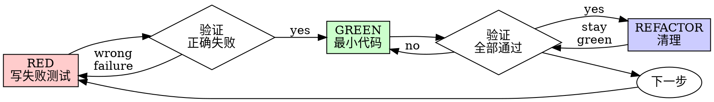

# Test-Driven Development (TDD) 技能使用完全指南

> 来源：obra/superpowers 插件 v5.0.7
> 整理：2026-05-05

---

## 概述

TDD 是 Superpowers 的核心纪律技能，通过**先写测试、观察失败、再写最小代码**的循环，确保代码的正确性和可测试性。

```
★ 核心原则：
- 如果没有观察测试失败，你不知道它是否测试了正确的东西
★ 铁律：没有先失败的测试，绝不写生产代码
★ 违反 = 删除代码，重新开始
```

---

## 何时使用

**必须使用：**
- 新功能
- Bug 修复
- 重构
- 行为变更

**例外（需询问用户）：**
- 一次性原型
- 生成代码
- 配置文件

**思考"这次跳过 TDD"？停止。这是合理化。**

---

## 铁律

```
NO PRODUCTION CODE WITHOUT A FAILING TEST FIRST
```

**测试前写代码？删除它。从头开始。**

**无例外：**
- 不要保留为"参考"
- 不要在写测试时"适应"它
- 不要看它
- 删除意味着删除

从测试重新实现。就是这样。

---

## 红绿重构循环



---

## 详细步骤

### RED - 写失败测试

**写一个展示应该发生什么的最小测试。**

#### 好的测试示例

```typescript
test('retries failed operations 3 times', async () => {
  let attempts = 0;
  const operation = () => {
    attempts++;
    if (attempts < 3) throw new Error('fail');
    return 'success';
  };

  const result = await retryOperation(operation);

  expect(result).toBe('success');
  expect(attempts).toBe(3);
});
```

**要求：**
- 一个行为
- 清晰名称
- 真实代码（除非不可避免，否则不用 mock）

#### 坏的测试示例

```typescript
test('retry works', async () => {
  const mock = jest.fn()
    .mockRejectedValueOnce(new Error())
    .mockRejectedValueOnce(new Error())
    .mockResolvedValueOnce('success');
  await retryOperation(mock);
  expect(mock).toHaveBeenCalledTimes(3);
});
```

问题：名称模糊，测试 mock 而非代码

---

### 验证 RED - 观察它失败

**强制。绝不跳过。**

```bash
npm test path/to/test.test.ts
```

**确认：**
- 测试失败（不是错误）
- 失败消息是预期的
- 因为功能缺失而失败（不是拼写错误）

**测试通过了？** 你在测试已有行为。修复测试。

**测试错误？** 修复错误，重新运行直到正确失败。

---

### GREEN - 最小代码

**写最简单的代码让测试通过。**

#### 好的实现

```typescript
async function retryOperation<T>(fn: () => Promise<T>): Promise<T> {
  for (let i = 0; i < 3; i++) {
    try {
      return await fn();
    } catch (e) {
      if (i === 2) throw e;
    }
  }
  throw new Error('unreachable');
}
```

刚好足够通过

#### 坏的实现

```typescript
async function retryOperation<T>(
  fn: () => Promise<T>,
  options?: {
    maxRetries?: number;
    backoff?: 'linear' | 'exponential';
    onRetry?: (attempt: number) => void;
  }
): Promise<T> {
  // YAGNI - 过度工程化
}
```

不要添加功能、重构其他代码、或超出测试的"改进"。

---

### 验证 GREEN - 观察它通过

**强制。**

```bash
npm test path/to/test.test.ts
```

**确认：**
- 测试通过
- 其他测试仍然通过
- 输出干净（无错误、警告）

**测试失败？** 修复代码，不是测试。

**其他测试失败？** 立即修复。

---

### REFACTOR - 清理

**只有在 green 之后：**
- 移除重复
- 改进名称
- 提取辅助函数

保持测试绿色。不添加行为。

---

## 好测试的标准

| 质量 | 好 | 坏 |
|------|-----|-----|
| **最小** | 一件事。名称里有"和"？拆分。 | `test('验证邮箱和域名和空白')` |
| **清晰** | 名称描述行为 | `test('test1')` |
| **展示意图** | 展示期望的 API | 掩盖代码应该做什么 |

---

## 为什么顺序重要

### "我之后写测试来验证它工作"

测试在代码后写，立即通过。通过立即证明不了什么：
- 可能测试了错误的东西
- 可能测试实现而非行为
- 可能遗漏了忘记的边缘情况
- 从未见过它捕获 bug

测试优先强迫你看到测试失败，证明它实际测试了某些东西。

### "我已经手动测试了所有边缘情况"

手动测试是随意的。你以为测试了一切但：
- 没有记录测试了什么
- 代码变更时无法重新运行
- 压力大时容易忘记情况
- "我测试时它工作了" ≠ 全面

自动化测试是系统性的。每次以相同方式运行。

### "删除 X 小时的工作是浪费的"

沉没成本谬误。时间已经过去了。你的选择：
- 删除并用 TDD 重写（再多 X 小时，高置信度）
- 保留并之后添加测试（30 分钟，低置信度，可能有 bug）

"浪费"是保留你无法信任的代码。没有真正测试的工作代码是技术债务。

---

## 常见合理化

| 借口 | 现实 |
|------|------|
| "太简单不需要测试" | 简单代码也会坏。测试只需 30 秒。 |
| "我之后测试" | 测试立即通过什么都证明不了。 |
| "之后测试达到相同目标" | 之后测试 = "这是做什么的？" 测试优先 = "这应该做什么？" |
| "已经手动测试了" | 随意的 ≠ 系统的。无记录，无法重新运行。 |
| "删除 X 小时是浪费" | 沉没成本谬误。保留无法信任的代码是技术债务。 |
| "保留为参考，先写测试" | 你会适应它。这是之后测试。删除意味着删除。 |
| "需要先探索" | 可以。扔掉探索，从 TDD 开始。 |
| "测试难 = 设计不清" | 倾听测试。难测试 = 难使用。 |
| "TDD 会拖慢我" | TDD 比调试快。务实的 = 测试优先。 |
| "手动测试更快" | 手动不能证明边缘情况。每次变更你会重新测试。 |
| "现有代码没有测试" | 你在改进它。为现有代码添加测试。 |

---

## Red Flags - 停止并重新开始

- 测试前写代码
- 实现后写测试
- 测试立即通过
- 无法解释为什么测试失败
- "之后"添加测试
- "就这一次"合理化
- "我已经手动测试了"
- "之后测试达到相同目的"
- "这是关于精神不是仪式"
- "保留为参考"或"适应现有代码"
- "已经花了 X 小时，删除是浪费"
- "TDD 是教条的，我是务实的"
- "这个不一样因为..."

**所有这些意味着：删除代码。用 TDD 从头开始。**

---

## Bug 修复示例

**Bug：** 空邮箱被接受

**RED**
```typescript
test('rejects empty email', async () => {
  const result = await submitForm({ email: '' });
  expect(result.error).toBe('Email required');
});
```

**验证 RED**
```bash
$ npm test
FAIL: expected 'Email required', got undefined
```

**GREEN**
```typescript
function submitForm(data: FormData) {
  if (!data.email?.trim()) {
    return { error: 'Email required' };
  }
  // ...
}
```

**验证 GREEN**
```bash
$ npm test
PASS
```

**REFACTOR**
如需要，提取多字段验证。

---

## 验证清单

完成工作前：
- [ ] 每个新函数/方法有测试
- [ ] 观察每个测试在实现前失败
- [ ] 每个测试因预期原因失败（功能缺失，不是拼写错误）
- [ ] 写了最小代码让每个测试通过
- [ ] 所有测试通过
- [ ] 输出干净（无错误、警告）
- [ ] 测试使用真实代码（除非不可避免，否则不用 mock）
- [ ] 覆盖边缘情况和错误

无法勾选所有？你跳过了 TDD。从头开始。

---

## 卡住时

| 问题 | 解决方案 |
|------|----------|
| 不知道怎么测试 | 写期望的 API。先写断言。询问用户。 |
| 测试太复杂 | 设计太复杂。简化接口。 |
| 必须 mock 一切 | 代码太耦合。使用依赖注入。 |
| 测试设置巨大 | 提取辅助函数。仍然复杂？简化设计。 |

---

## 与其他技能集成

| 技能 | 关系 |
|------|------|
| **test-driven-development** | 是此技能描述的纪律 |
| **subagent-driven-development** | 子代理每任务遵循 TDD |
| **systematic-debugging** | 发现 bug？写失败测试重现。遵循 TDD 循环。 |

---

## 快速参考

```
★ 铁律：没有先失败的测试，绝不写生产代码
★ 循环：RED → 验证失败 → GREEN → 验证通过 → REFACTOR
★ 违反 = 删除代码，重新开始
★ 好测试：最小、清晰、展示意图
★ Bug 修复：先写失败测试重现 bug，再修复
```
