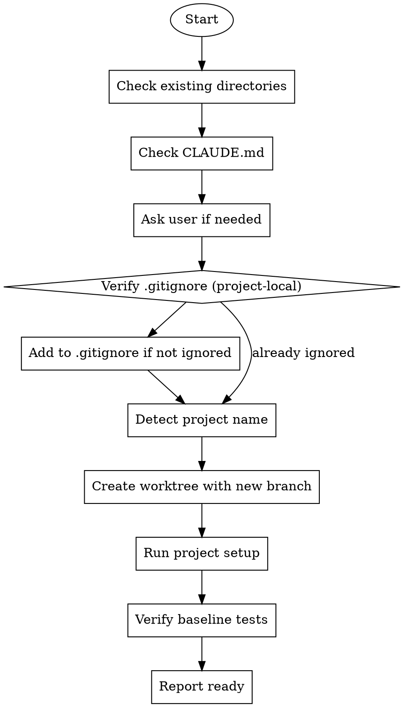

# Using-Git-Worktrees 技能使用完全指南

> 来源：obra/superpowers 插件 v5.0.7
> 整理：2026-05-05

---

## 概述

Git worktrees 创建**隔离的工作空间**，共享同一个仓库，允许同时在多个分支上工作而无需切换。

```
★ 核心原则：系统性目录选择 + 安全验证 = 可靠的隔离
★ 启动时说："I'm using the using-git-worktrees skill to set up an isolated workspace."
```

---

## 核心概念

### 什么是 Git Worktree？

```
┌─────────────────────────────────────────────────┐
│              Main Repository                      │
│  ┌─────────────────────────────────────────┐   │
│  │  .git (共享)                              │   │
│  └─────────────────────────────────────────┘   │
│                                                 │
│  ┌──────────┐  ┌──────────┐  ┌──────────┐     │
│  │ worktree │  │ worktree │  │ worktree │     │
│  │   /main  │  │ /feat-a  │  │ /fix-b   │     │
│  └──────────┘  └──────────┘  └──────────┘     │
│                                                 │
│  每个 worktree 是独立的目录                      │
│  但共享同一个 .git 数据库                       │
└─────────────────────────────────────────────────┘
```

### 为什么需要 Worktree？

| 场景 | 没有 Worktree | 使用 Worktree |
|------|---------------|---------------|
| 同时开发两个功能 | 频繁切换分支 | 各分支独立工作 |
| 需要紧急修复 bug | 保存当前工作、切换、修复 | 新建 worktree，保留当前工作 |
| Code review 时测试 | 切换到 PR 分支 | 新建 worktree 测试 |

---

## 目录选择流程

### 优先级顺序

```
1. .worktrees/        ← 首选（隐藏目录）
2. worktrees/          ← 备选
3. CLAUDE.md 配置      ← 如有指定
4. 询问用户            ← 前三者都没有时
```

### 步骤 1：检查现有目录

```bash
# 按优先级检查
ls -d .worktrees 2>/dev/null     # 优先检查
ls -d worktrees 2>/dev/null      # 备选检查
```

**如果找到：** 使用该目录（若两个都存在，`.worktrees` 优先）

### 步骤 2：检查 CLAUDE.md

```bash
grep -i "worktree.*director" CLAUDE.md 2>/dev/null
```

**如果配置指定：** 无需询问，直接使用

### 步骤 3：询问用户

如果目录不存在且 CLAUDE.md 无配置：

```
No worktree directory found. Where should I create worktrees?

1. .worktrees/ (project-local, hidden)
2. ~/.config/superpowers/worktrees/<project-name>/ (global location)

Which would you prefer?
```

---

## 安全验证（关键！）

### 项目本地目录必须验证

```bash
# 检查目录是否被 .gitignore 忽略
git check-ignore -q .worktrees 2>/dev/null || git check-ignore -q worktrees 2>/dev/null
```

**如果目录 NOT 被忽略：**

根据 Jesse 的规则 "Fix broken things immediately"：

1. 添加适当行到 `.gitignore`
2. 提交更改
3. 继续创建 worktree

**为什么关键：** 防止 worktree 内容意外提交到仓库

### 全局目录无需验证

```
~/.config/superpowers/worktrees/  # 在项目外部，无需 .gitignore 验证
```

---

## 创建流程

### 完整流程图



### 步骤 1：检测项目名称

```bash
project=$(basename "$(git rev-parse --show-toplevel)")
```

### 步骤 2：创建 Worktree

```bash
# 确定完整路径
case $LOCATION in
  .worktrees|worktrees)
    path="$LOCATION/$BRANCH_NAME"
    ;;
  ~/.config/superpowers/worktrees/*)
    path="~/.config/superpowers/worktrees/$project/$BRANCH_NAME"
    ;;
esac

# 创建 worktree 和新分支
git worktree add "$path" -b "$BRANCH_NAME"
cd "$path"
```

### 步骤 3：运行项目设置

**自动检测并运行相应设置：**

```bash
# Node.js
if [ -f package.json ]; then npm install; fi

# Rust
if [ -f Cargo.toml ]; then cargo build; fi

# Python
if [ -f requirements.txt ]; then pip install -r requirements.txt; fi
if [ -f pyproject.toml ]; then poetry install; fi

# Go
if [ -f go.mod ]; then go mod download; fi
```

### 步骤 4：验证基线测试

```bash
# 运行项目适当的测试命令
npm test
cargo test
pytest
go test ./...
```

**如果测试失败：**
```
Tests failing (<N> failures). Must fix before completing:

[Show failures]

Cannot proceed until tests pass on baseline.
```

**如果测试通过：** 继续报告

### 步骤 5：报告位置

```
Worktree ready at <full-path>
Tests passing (<N> tests, 0 failures)
Ready to implement <feature-name>
```

---

## 快速参考表

| 情况 | 操作 |
|------|------|
| `.worktrees/` 存在 | 使用它（验证被忽略） |
| `worktrees/` 存在 | 使用它（验证被忽略） |
| 两者都存在 | 使用 `.worktrees/` |
| 两者都不存在 | 检查 CLAUDE.md → 询问用户 |
| 目录未被忽略 | 添加到 .gitignore + 提交 |
| 基线测试失败 | 报告失败 + 询问 |
| 无 package.json/Cargo.toml | 跳过依赖安装 |

---

## 常见错误

### ❌ 跳过 .gitignore 验证

**问题：** Worktree 内容被跟踪，污染 git status

**修复：** 创建项目本地 worktree 前始终使用 `git check-ignore`

### ❌ 假设目录位置

**问题：** 造成不一致，违反项目约定

**修复：** 遵循优先级：现有 > CLAUDE.md > 询问

### ❌ 测试失败时继续

**问题：** 无法区分新 bug 和已有问题

**修复：** 报告失败，获得明确许可后再继续

### ❌ 硬编码设置命令

**问题：** 在使用不同工具的项目上失败

**修复：** 从项目文件自动检测（package.json 等）

---

## 示例工作流

```
用户：我完成了设计，想开始实现认证功能

助手：I'm using the using-git-worktrees skill to set up an isolated workspace.

[检查 .worktrees/ - 存在]
[验证被忽略 - git check-ignore 确认 .worktrees/ 被忽略]
[创建 worktree: git worktree add .worktrees/auth -b feature/auth]
[运行 npm install]
[运行 npm test - 47 通过]

Worktree ready at /Users/jesse/myproject/.worktrees/auth
Tests passing (47 tests, 0 failures)
Ready to implement auth feature
```

---

## 集成关系

### 被谁调用

| 技能 | 阶段 |
|------|------|
| **brainstorming** | 阶段 4（设计批准后实现前） |
| **subagent-driven-development** | 执行任务前（必须） |
| **executing-plans** | 执行任务前（必须） |
| 任何需要隔离工作空间的技能 | 按需 |

### 与谁配合

| 技能 | 关系 |
|------|------|
| **finishing-a-development-branch** | 完成后清理 worktree（必须） |

---

## 实际命令速查

```bash
# 1. 检查 worktree 目录
ls -d .worktrees 2>/dev/null || ls -d worktrees 2>/dev/null

# 2. 检查 CLAUDE.md 配置
grep -i "worktree.*director" CLAUDE.md

# 3. 验证 .gitignore
git check-ignore -q .worktrees && echo "ignored" || echo "NOT ignored"

# 4. 检测项目名
project=$(basename "$(git rev-parse --show-toplevel)")

# 5. 创建 worktree
git worktree add .worktrees/feature-name -b feature/feature-name

# 6. 列出所有 worktree
git worktree list

# 7. 移除 worktree
git worktree remove .worktrees/feature-name
```

---

## Red Flags（必须避免）

**绝不：**
- 创建 worktree 前不验证是否被忽略（项目本地）
- 跳过基线测试验证
- 不询问就继续失败的测试
- 目录位置不明确时假设
- 跳过 CLAUDE.md 检查

**始终：**
- 遵循目录优先级：现有 > CLAUDE.md > 询问
- 验证项目本地目录被忽略
- 自动检测并运行项目设置
- 验证干净的测试基线

---

## 与其他技能的完整流程

```
brainstorming 完成
    ↓
using-git-worktrees 激活
    ↓  (创建隔离工作空间)
writing-plans 激活
    ↓
subagent-driven-development 激活
    ↓  (执行实现任务)
finishing-a-development-branch 激活
    ↓  (验证 → 选项 → 清理)
```

---

## Windows 注意事项

在 Windows 上运行时：

1. 使用 Unix 风格路径（`/` 而非 `\`）
2. Git worktree 命令跨平台兼容
3. 项目设置脚本需检测 Windows 环境

---

## 快速参考

```
★ 启动："I'm using the using-git-worktrees skill to set up an isolated workspace."
★ 目录优先级：.worktrees > worktrees > CLAUDE.md > 询问
★ 项目本地必须验证 .gitignore
★ 全局目录无需验证
★ 必须运行基线测试
★ 测试失败必须报告并询问
```
