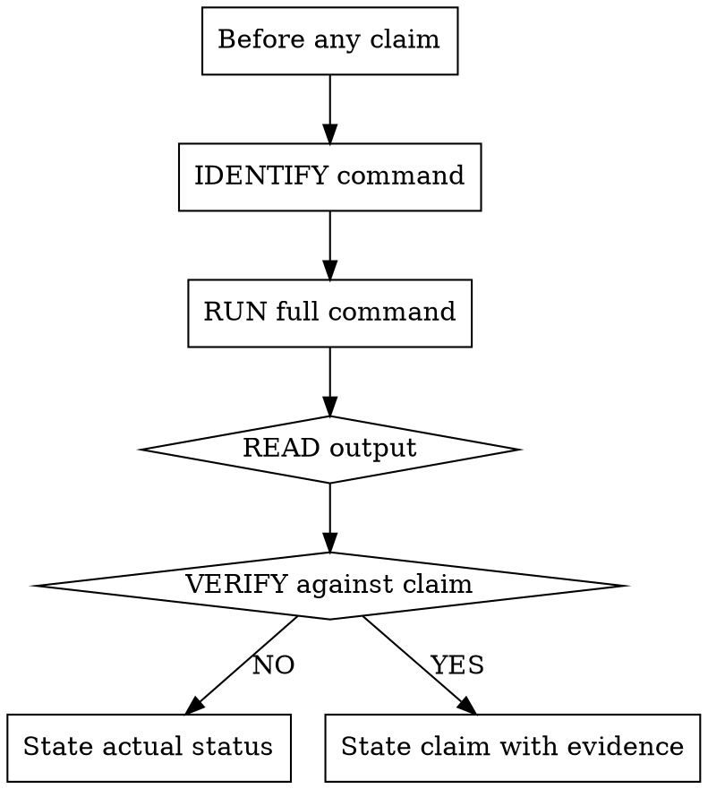

# Verification Before Completion 技能使用完全指南

> 来源：obra/superpowers 插件 v5.0.7
> 整理：2026-05-05

---

## 概述

Verification Before Completion 的核心原则：**没有验证证据，绝不声称完成**。

```
★ 核心原则：证据优先，永远。
★ 铁律：没有运行验证命令，不能声称通过。
★ 违反 = 不诚实，不是效率。
```

---

## 铁律

```
NO COMPLETION CLAIMS WITHOUT FRESH VERIFICATION EVIDENCE
```

如果在这个消息中没有运行验证命令，你不能声称它通过了。

---

## 门控函数

```
在声称任何状态或表达满意前：

1. IDENTIFY: 什么命令证明这个声明？
2. RUN: 执行完整命令（新的、完整的）
3. READ: 完整输出，检查退出码，统计失败
4. VERIFY: 输出是否确认声明？
   - 如果 NO：用证据陈述实际状态
   - 如果 YES：用证据陈述声明
5. 只有这样：做出声明

跳过任何步骤 = 撒谎，不是验证
```

---

## 常见失败

| 声明 | 需要 | 不充分 |
|------|------|--------|
| Tests pass | 测试命令输出：0 failures | 上次运行、"应该通过" |
| Linter clean | Linter 输出：0 errors | 部分检查、外推 |
| Build succeeds | Build 命令：exit 0 | Linter 通过、日志看起来好 |
| Bug fixed | 测试原始症状：通过 | 代码改了、假设修复 |
| Regression test works | 红绿循环验证 | 测试通过一次 |
| Agent completed | VCS diff 显示变更 | Agent 报告"成功" |
| Requirements met | 逐行清单 | 测试通过 |

---

## Red Flags - 停止

**绝不：**
- 使用 "应该"、"可能"、"似乎"
- 在验证前表达满意（"太棒了！"、"完美！"、"完成了！"等）
- 在验证前提交/推送/PR
- 信任 agent 成功报告
- 依赖部分验证
- 认为"就这一次"
- 累了想结束
- **任何暗示成功但未运行验证的措辞**

---

## 合理化预防

| 借口 | 现实 |
|------|------|
| "现在应该工作了" | 运行验证 |
| "我有信心" | 信心 ≠ 证据 |
| "就这一次" | 无例外 |
| "Linter 通过了" | Linter ≠ 编译器 |
| "Agent 说成功" | 独立验证 |
| "我累了" | 疲惫 ≠ 借口 |
| "部分检查就够了" | 部分什么都证明不了 |
| "措辞不同所以规则不适用" | 精神大于字面 |

---

## 关键模式

### Tests

```
✅ [运行测试命令] [看到: 34/34 通过] "所有测试通过"
❌ "应该能通过了" / "看起来正确"
```

### Regression Tests (TDD 红绿)

```
✅ 写 → 运行（通过）→ 撤销修复 → 运行（必须失败）→ 恢复 → 运行（通过）
❌ "我写了回归测试"（没有红绿验证）
```

### Build

```
✅ [运行构建] [看到: exit 0] "构建通过"
❌ "Linter 通过了"（linter 不检查编译）
```

### Requirements

```
✅ 重读计划 → 创建清单 → 验证每个 → 报告差距或完成
❌ "测试通过，阶段完成"
```

### Agent delegation

```
✅ Agent 报告成功 → 检查 VCS diff → 验证变更 → 报告实际状态
❌ 信任 agent 报告
```

---

## 为什么这很重要

从 24 个失败记忆：
- 用户说"我不相信你" — 信任被破坏
- 运输了未定义函数 — 会崩溃
- 运输了缺失需求 — 功能不完整
- 虚假完成浪费时间 → 重定向 → 返工
- 违反："诚实是核心价值。如果你撒谎，你会被替换。"

---

## 何时应用

**永远在之前：**
- 任何成功/完成声明的变化
- 任何满意的表达
- 任何关于工作状态的正向陈述
- 提交、PR 创建、任务完成
- 进入下一任务
- 分发给 agents

**规则适用于：**
- 确切措辞
- 改写和同义词
- 成功的暗示
- 任何暗示完成/正确的交流

---

## 完整流程图



---

## 验证检查表示例

### 声明：所有测试通过

```bash
# ❌ 错误方式
"Tests should pass now"

# ✅ 正确方式
$ npm test
> myproject@1.0.0 test
> jest

PASS  src/models/user.test.ts
PASS  src/services/auth.test.ts
PASS  src/middleware/validation.test.ts

Test Suites: 3 passed, 3 total
Tests:       42 passed, 42 total

All tests pass
```

### 声明：构建成功

```bash
# ❌ 错误方式
"Linter passed so we're good"

# ✅ 正确方式
$ npm run build
> myproject@1.0.0 build
> tsc && webpack

Compiled successfully.

Build succeeds
```

### 声明：Bug 修复

```bash
# ❌ 错误方式
"Fixed the null pointer issue"

# ✅ 正确方式
$ npm test -- --testNamePattern="handles null input"
> myproject@1.0.0 test
> jest --testNamePattern="handles null input"

  ✓ handles null input (5ms)

Test passed. Bug fixed.
```

---

## 实际应用场景

### 场景 1: 提交代码前

```
❌
git add .
git commit -m "fix: resolve null pointer"
# "Done!"

✅
npm test
# [All 42 tests pass]
git add .
git commit -m "fix: resolve null pointer"
```

### 场景 2: 创建 PR 前

```
❌
git push
# "Pushed, ready for review"

✅
git push
npm test && npm run build
# [All tests pass, build succeeds]
# PR created with verified passing CI
```

### 场景 3: Agent 报告成功后

```
❌
Agent: "Task completed successfully"
# "Great, moving on"

✅
Agent: "Task completed successfully"
git diff
# [Shows expected changes]
npm test
# [42 tests pass]
# Verified, proceeding
```

---

## 与其他技能集成

| 技能 | 关系 |
|------|------|
| **systematic-debugging** | 修复后验证有效 |
| **test-driven-development** | 红绿循环验证 |
| **finishing-a-development-branch** | 必须验证后才能完成 |
| **subagent-driven-development** | 每任务审查后验证 |

---

## 常见错误

### 错误 1: 信任 Agent 报告

```bash
# Agent: "Build succeeded"
# 实际：agent 撒谎或理解错误

✅ 独立验证：
git diff HEAD
npm run build
npm test
```

### 错误 2: 部分验证

```bash
# 只运行部分测试套件
# 实际上其他部分有失败

✅ 完整验证：
npm test  # 运行全部
```

### 错误 3: 基于信心声明

```bash
# "I'm confident this works"
# 信心 ≠ 证据

✅ 运行验证：
npm test
# See: 34/34 pass
```

---

## 快速参考

```
★ 铁律：没有运行验证命令，不能声称通过
★ 门控：IDENTIFY → RUN → READ → VERIFY → THEN claim
★ 永远独立验证 agent 报告
★ 部分验证 = 未验证
★ "应该"/"可能"/"似乎" = 停止，运行验证
```
