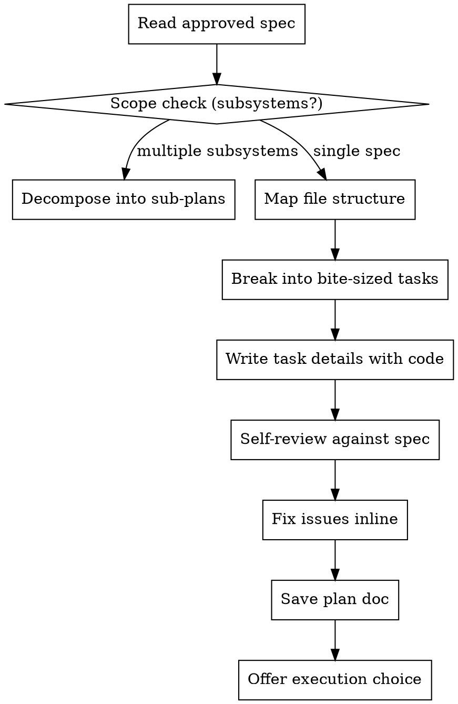

# Writing-Plans 技能使用完全指南

> 来源：obra/superpowers 插件 v5.0.7
> 整理：2026-05-05

---

## 概述

Writing Plans 的核心任务是：**将批准的设计文档转化为可执行的实现计划**。

```
★ 核心原则：
- 假设工程师对代码库零上下文、品味不佳
- 每个任务 2-5 分钟，原子化
- 必须包含完整代码、精确路径、验证步骤
- DRY + YAGNI + TDD + 频繁提交
```

**启动时说：** "I'm using the writing-plans skill to create the implementation plan."

**运行上下文：** 应在专用 worktree 中运行（由 brainstorming 技能创建）

---

## Plan 文档标准结构

### 必须包含的头部

```markdown
# [功能名] Implementation Plan

> **For agentic workers:** REQUIRED SUB-SKILL: Use superpowers:subagent-driven-development (recommended) or superpowers:executing-plans to implement this plan task-by-task. Steps use checkbox (`- [ ]`) syntax for tracking.

**Goal:** [一句话描述构建内容]

**Architecture:** [2-3 句方法]

**Tech Stack:** [关键技术和库]

---
```

### 任务结构

```markdown
### Task N: [组件名]

**Files:**
- Create: `exact/path/to/file.py`
- Modify: `exact/path/to/existing.py:123-145`
- Test: `tests/exact/path/to/test.py`

- [ ] **Step 1: Write the failing test**

```python
def test_specific_behavior():
    result = function(input)
    assert result == expected
```

- [ ] **Step 2: Run test to verify it fails**

Run: `pytest tests/path/test.py::test_name -v`
Expected: FAIL with "function not defined"

- [ ] **Step 3: Write minimal implementation**

```python
def function(input):
    return expected
```

- [ ] **Step 4: Run test to verify it passes**

Run: `pytest tests/path/test.py::test_name -v`
Expected: PASS

- [ ] **Step 5: Commit**

```bash
git add tests/path/test.py src/path/file.py
git commit -m "feat: add specific feature"
```

---

## 完整流程



---

## 关键步骤详解

### Step 1: 读取批准的设计文档

在开始写计划前，必须：
- 完整阅读设计文档
- 理解每个组件的职责
- 理解数据流和接口

### Step 2: 范围检查

**如果 spec 覆盖多个独立子系统：**

应该在 brainstorming 阶段就分解。如果没有：
```
建议分解为独立计划 — 每个子系统一个。
每个计划应产出可独立测试的软件。
```

### Step 3: 文件结构映射

在定义任务前，先映射文件结构：

**原则：**
- 清晰边界的设计单元
- 每个文件单一职责
- 一起变更的文件放一起（按职责而非技术层分类）
- 遵循既有模式
- 如果文件过大，在计划中包含拆分

### Step 4: 分解为原子任务

**每个任务 2-5 分钟：**
```
❌ 一个大任务：
"实现认证模块" — 太模糊

✅ 原子化任务：
- 写失败测试
- 运行确认失败
- 写最小实现
- 运行确认通过
- 提交
```

### Step 5: 编写任务详情

**必须包含：**
- 精确文件路径
- 每步的完整代码
- 精确命令和期望输出
- 测试代码和实现代码

---

## No Placeholders 规则

**这些是计划失败 — 绝不能写：**

| 禁止写法 | 问题 | 正确做法 |
|----------|------|----------|
| "TBD"、"TODO"、"implement later" | 空承诺 | 必须填入实际内容 |
| "Add appropriate error handling" | 太模糊 | 写出具体处理代码 |
| "Write tests for the above" | 没有实际测试 | 写出完整测试代码 |
| "Similar to Task N" | 可能顺序阅读 | 重复代码 |
| 描述性步骤无代码 | 不够具体 | 必须有代码块 |

---

## 自检清单

写完计划后，用新眼光对照 spec 检查：

### 1. Spec 覆盖检查

浏览 spec 的每个章节/需求。能否指向实现它的任务？列出任何缺口。

### 2. 占位符扫描

搜索：
- "TBD"、"TODO"
- "implement later"、"fill in details"
- 任何不完整的步骤

### 3. 类型一致性检查

- 后面任务的类型/方法签名/属性名是否与前面一致？
- Task 3 的 `clearLayers()` 和 Task 7 的 `clearFullLayers()` 是同一函数吗？

**发现问题就内联修复。无需重新审查 — 修复后继续。**

---

## 执行交接

保存计划后，提供执行选择：

```
Plan complete and saved to `docs/superpowers/plans/2026-05-05-auth-implementation.md`.

Two execution options:

1. Subagent-Driven (recommended)
   - I dispatch a fresh subagent per task
   - Review between tasks
   - Fast iteration

2. Inline Execution
   - Execute tasks in this session
   - Batch execution with checkpoints

Which approach?
```

**选择 1（推荐）：**
- 调用 `superpowers:subagent-driven-development`
- 每任务新鲜子代理 + 两阶段审查

**选择 2：**
- 调用 `superpowers:executing-plans`
- 批量执行 + 检查点

---

## 示例计划片段

```markdown
# User Authentication Implementation Plan

**Goal:** Add email/password and social login authentication

**Architecture:** JWT-based auth with refresh tokens. Auth service handles
verification, session service manages tokens.

**Tech Stack:** Express.js, JWT, bcrypt, Passport.js

---

### Task 1: User Model

**Files:**
- Create: `src/models/user.ts`
- Modify: `src/database/schema.sql`
- Test: `tests/unit/models/user.test.ts`

- [ ] **Step 1: Write failing test**

```typescript
// tests/unit/models/user.test.ts
import { User } from '../../src/models/user';

describe('User model', () => {
  test('hashes password on creation', async () => {
    const user = new User({ email: 'test@example.com', password: 'secret123' });
    await user.save();
    expect(user.passwordHash).not.toBe('secret123');
    expect(user.passwordHash.startsWith('$2b$')).toBe(true);
  });
});
```

- [ ] **Step 2: Run test - expect FAIL**

```bash
npx jest tests/unit/models/user.test.ts
# Expected: FAIL - "Cannot find module '../../src/models/user'"
```

- [ ] **Step 3: Write minimal implementation**

```typescript
// src/models/user.ts
import crypto from 'crypto';

export class User {
  email: string;
  passwordHash: string;

  constructor(data: { email: string; password: string }) {
    this.email = data.email;
    this.passwordHash = crypto.createHash('sha256').update(data.password).digest('hex');
  }

  save(): void {
    // Placeholder - will implement in later task
  }
}
```

- [ ] **Step 4: Run test - expect PASS**

```bash
npx jest tests/unit/models/user.test.ts
# Expected: PASS
```

- [ ] **Step 5: Commit**

```bash
git add src/models/user.ts tests/unit/models/user.test.ts
git commit -m "feat(auth): add User model with password hashing"
```

---

### Task 2: Database Schema

**Files:**
- Modify: `src/database/schema.sql`
- Test: `tests/integration/schema.test.ts`

...
```

---

## 与其他技能的集成

```
brainstorming 完成
    ↓
writing-plans 激活
    ↓
using-git-worktrees 激活（创建隔离空间）
    ↓
subagent-driven-development 或 executing-plans
    ↓
finishing-a-development-branch
```

---

## 快速参考

```
★ 启动："I'm using the writing-plans skill to create the implementation plan."
★ 每个任务 2-5 分钟
★ 必须包含：完整代码、精确路径、验证步骤
★ 禁止占位符：TBD、TODO、"类似 Task N"
★ 自检：覆盖性、一致性、无歧义
★ 保存到：docs/superpowers/plans/YYYY-MM-DD-<feature-name>.md
★ 提供执行选择：subagent-driven 或 inline
```
