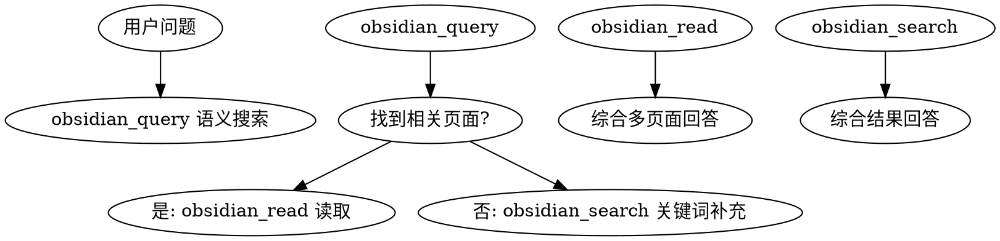
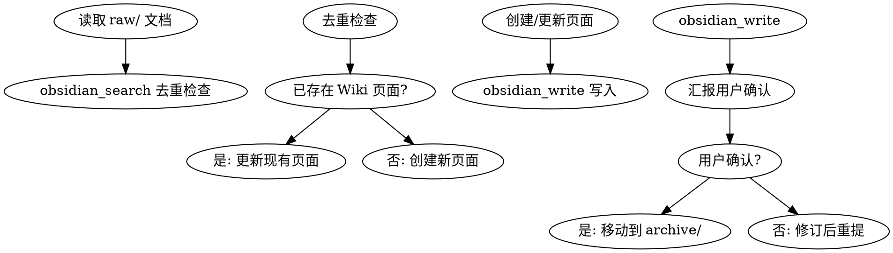
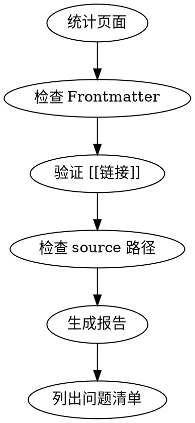
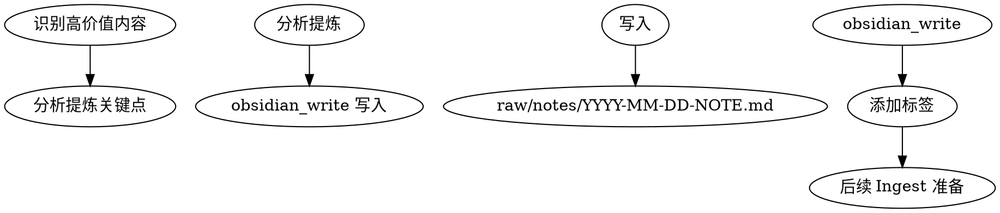

# Wiki Workflow Skills Implementation Plan

> **For agentic workers:** REQUIRED SUB-SKILL: Use superpowers:subagent-driven-development (recommended) or superpowers:executing-plans to implement this plan task-by-task. Steps use checkbox (`- [ ]`) syntax for tracking.

**Goal:** 创建 4 个 Wiki 工作流 Skills（docs-ingest, inspool, wiki-lint, wiki-query），集成 obsidian-cli MCP 工具，实现知识摄取→Wiki 体系化→归档的完整流程

**Architecture:** 分布式架构，每个 Skill 独立文件（<200行），基于 TDD RED-GREEN-REFACTOR 周期，obsidian-cli MCP 工具提供语义搜索和 Wiki 操作能力

**Tech Stack:** obsidian-cli MCP (obsidian_query, obsidian_search, obsidian_read, obsidian_write), SKILL.md YAML frontmatter

---

## Task 1: wiki-query Skill

**Files:**
- Create: `~/.claude/skills/wiki-query/SKILL.md`

### 1.1: 创建 wiki-query 目录结构

```bash
mkdir -p ~/.claude/skills/wiki-query
```

### 1.2: 编写 wiki-query SKILL.md

```markdown
---
name: wiki-query
description: Use when answering questions about Claude Code concepts, commands, or workflows — searches Wiki before generating new summaries
---

# Wiki Query Skill

## Overview
基于 Wiki 回答问题的技能，遵循 Wiki-First 原则，避免重复生成摘要。

## When to Use

**触发条件：**
- 用户询问 Claude Code 功能、概念、最佳实践
- 需要查找命令用法、配置选项、技巧
- 任何需要准确信息的问题

**症状：**
- 倾向直接回答而非查询 Wiki
- 生成一次性摘要而非引用现有页面

## Core Pattern



## Quick Reference

| 工具 | 用途 |
|------|------|
| `obsidian_query` | 语义搜索 Wiki 页面 |
| `obsidian_search` | 关键词/标签搜索 |
| `obsidian_read` | 读取具体页面内容 |

## Implementation

1. **查询**: 使用 `obsidian_query` 语义搜索相关页面
2. **补充**: 关键词搜索 `obsidian_search` 补充遗漏
3. **读取**: `obsidian_read` 获取关键页面内容
4. **综合**: 整合多个页面答案回答问题
5. **引用**: 标注来源页面链接

## Common Mistakes

| 错误 | 正确做法 |
|------|----------|
| 直接生成摘要 | 先 obsidian_query 搜索 |
| 只用一个关键词 | 语义+关键词双重搜索 |
| 不引用来源 | 标注 [[page-slug]] 链接 |

## Real-World Impact

- Token 节省 30-50%
- 答案一致性提升
- Wiki 页面持续更新
```

### 1.3: 提交 Task 1

```bash
git add ~/.claude/skills/wiki-query/SKILL.md
git commit -m "feat: add wiki-query skill for Wiki-first question answering"
```

---

## Task 2: docs-ingest Skill

**Files:**
- Create: `~/.claude/skills/docs-ingest/SKILL.md`

### 2.1: 创建 docs-ingest 目录结构

```bash
mkdir -p ~/.claude/skills/docs-ingest
```

### 2.2: 编写 docs-ingest SKILL.md

```markdown
---
name: docs-ingest
description: Use when raw documents need to be analyzed, summarized, and integrated into Wiki system
---

# Docs Ingest Skill

## Overview
文档摄取技能：分析 raw/ 目录文档 → 创建/更新 Wiki 页面 → 用户确认后归档到 archive/

## When to Use

**触发条件：**
- 发现新文档在 raw/ 目录
- 用户要求摄取外部文档到 Wiki
- 需要将现有知识体系化

**症状：**
- 直接使用 raw 文档而不体系化
- 不检查 Wiki 是否存在重复内容

## Core Pattern



## Quick Reference

| 阶段 | 工具 | 操作 |
|------|------|------|
| 分析 | Read | 读取 raw/ 文档 |
| 去重 | obsidian_search | 检查是否已有相关页面 |
| 创建 | obsidian_write | 创建 Wiki 页面 |
| 归档 | Bash mv | 移动到 archive/ |

## Implementation Steps

1. **Analyze**: 读取 raw/ 文档，分析结构和内容
2. **Deduplicate**: obsidian_search 检查 Wiki 是否存在相关内容
3. **Create**: 创建/更新 Wiki 页面，添加正确 frontmatter
4. **Report**: 汇报摄取结果给用户（新增/更新/待处理）
5. **Archive**: 用户确认后，mv 源文件到 archive/

## Frontmatter 模板

```yaml
---
name: {category}/{slug}
description: 一句话描述
type: concept | entity | source | synthesis | guide
tags: [{tags}]
created: {date}
updated: {date}
source: ../../archive/{category}/{filename}.md
---
```

## Common Mistakes

| 错误 | 正确做法 |
|------|----------|
| 不检查重复直接创建 | 先 obsidian_search 去重 |
| 跳过用户确认 | 必须汇报并等待确认 |
| 不添加 source 字段 | 归档后添加源文件路径 |

## Real-World Impact

- 知识一致性提升
- Wiki 持续生长
- 避免重复内容
```

### 2.3: 提交 Task 2

```bash
git add ~/.claude/skills/docs-ingest/SKILL.md
git commit -m "feat: add docs-ingest skill for document ingestion workflow"
```

---

## Task 3: wiki-lint Skill

**Files:**
- Create: `~/.claude/skills/wiki-lint/SKILL.md`

### 3.1: 创建 wiki-lint 目录结构

```bash
mkdir -p ~/.claude/skills/wiki-lint
```

### 3.2: 编写 wiki-lint SKILL.md

```markdown
---
name: wiki-lint
description: Use when performing Wiki health checks — validates frontmatter, cross-references, and source paths
---

# Wiki Lint Skill

## Overview
Wiki 健康检查技能：验证 frontmatter 完整性、交叉引用有效性、source 路径正确性

## When to Use

**触发条件：**
- 定期 Wiki 维护
- 添加新页面后验证
- 发现链接失效问题
- 报告 Wiki 健康状况

**症状：**
- 链接失效未被检测
- Frontmatter 字段缺失
- Source 指向不存在的文件

## Core Pattern



## Quick Reference

| 检查项 | 方法 | 标准 |
|--------|------|------|
| Frontmatter | Grep 文件头 | 必需字段存在 |
| 交叉引用 | Grep `[[` | 目标页面存在 |
| Source 路径 | 验证文件 | 指向 archive/ 中的文件 |

## Required Frontmatter Fields

```yaml
---
name: page-slug          # 必需
description: 描述         # 必需
type: category           # 必需
tags: [tag1, tag2]       # 必需
created: YYYY-MM-DD     # 必需
updated: YYYY-MM-DD     # 必需
source: ../../archive/.. # 建议添加
---
```

## Lint 检查标准

### 1. Frontmatter 检查
- `name` 字段存在且非空
- `description` 字段存在
- `type` 字段在允许值内
- `created`/`updated` 格式正确

### 2. 交叉引用检查
```bash
# 查找所有 [[链接]]
grep -r '\[\[' wiki/ --include="*.md"
# 验证每个链接目标存在
```

### 3. Source 路径检查
```bash
# 验证 source 指向存在文件
grep "^source:" wiki/**/*.md | while read line; do
  file=$(echo $line | sed 's|.*source: ||')
  [ -f "$file" ] || echo "Missing: $file"
done
```

## Common Mistakes

| 错误 | 正确做法 |
|------|----------|
| 跳过 source 检查 | source 必须指向 archive/ 中文件 |
| 忽略交叉引用问题 | [[链接]] 必须对应存在页面 |
| 不记录问题清单 | 生成报告便于追踪修复 |

## Output Format

```markdown
## Wiki Lint Report

### 统计
- 总页面数: N
- 问题数: N

### 问题清单
| 级别 | 文件 | 问题 |
|------|------|------|
| 🔴 | file.md | 缺少必需字段 |
| 🟡 | file.md | [[链接]] 目标不存在 |
```

## Real-World Impact

- Wiki 质量持续监控
- 问题早发现早修复
- 维护成本降低
```

### 3.3: 提交 Task 3

```bash
git add ~/.claude/skills/wiki-lint/SKILL.md
git commit -m "feat: add wiki-lint skill for Wiki health checks"
```

---

## Task 4: inspool Skill

**Files:**
- Create: `~/.claude/skills/inspool/SKILL.md`

### 4.1: 创建 inspool 目录结构

```bash
mkdir -p ~/.claude/skills/inspool
```

### 4.2: 编写 inspool SKILL.md

```markdown
---
name: inspool
description: Use when capturing high-value conversation insights for future Wiki integration and knowledge沉淀
---

# Inspool Skill

## Overview
会话知识沉淀技能：将高价值回答、阶段性结果、经验教训总结到 raw/notes/ 目录

## When to Use

**触发条件：**
- 完成复杂问题解答
- 发现新的 Claude Code 使用模式
- 积累实用技巧或经验
- 会话结束前的知识沉淀

**症状：**
- 重要发现未记录
- 重复解决问题
- 知识随会话消失

## Core Pattern



## Quick Reference

| 阶段 | 工具 | 操作 |
|------|------|------|
| Identify | 分析对话 | 识别高价值内容 |
| Extract | 提炼要点 | 提取关键信息 |
| Write | obsidian_write | 写入 raw/notes/ |
| Tag | 添加 frontmatter | 标记类型和来源 |

## Note 模板

```markdown
---
name: notes/YYYY-MM-DD-{topic}
description: 一句话描述
type: insight | pattern | tip | lesson
tags: [session, {relevant-tags}]
created: {date}
source: conversation
---

# {Topic}

## 关键发现
- 要点 1
- 要点 2

## 上下文
{相关背景}

## 应用场景
{何时使用}

## 相关 Wiki 页面
- [[existing-page]]（如果已有）
```

## When to Use - Decision Tree

```
应该 inspool?
├── 解决方案复杂度 > 5 分钟? → 是 → ✅ 记录
├── 发现通用模式? → 是 → ✅ 记录
├── 错误教训值得分享? → 是 → ✅ 记录
├── 纯执行无新知? → 否 → 不记录
├── 已知信息确认? → 否 → 不记录
```

## Common Mistakes

| 错误 | 正确做法 |
|------|----------|
| 会话结束不沉淀 | 会话结束前运行 inspool |
| 记录太笼统 | 具体：问题→解决→结果 |
| 不标记类型 | 用 type 字段区分类型 |
| 不关联已有 Wiki | 检查 [[links]] 避免重复 |

## Types

| Type | 用途 | 特点 |
|------|------|------|
| insight | 新发现 | 突破性认知 |
| pattern | 通用模式 | 可复用方法 |
| tip | 实用技巧 | 小而美 |
| lesson | 经验教训 | 失败教训 |

## Real-World Impact

- 知识不再随会话消失
- 为 Wiki 持续供源
- 经验可复用
- 团队知识共享
```

### 4.3: 提交 Task 4

```bash
git add ~/.claude/skills/inspool/SKILL.md
git commit -m "feat: add inspool skill for session knowledge spooling"
```

---

## Task 5: 验证与测试

### 5.1: 列出所有创建的 Skills

```bash
ls -la ~/.claude/skills/wiki-*/
```

### 5.2: 验证文件行数 <200

```bash
wc -l ~/.claude/skills/wiki-*/SKILL.md
# 预期输出: 每个文件 <200 行
```

### 5.3: 验证 YAML frontmatter

```bash
for f in ~/.claude/skills/wiki-*/SKILL.md; do
  head -5 "$f" | grep -q "^---" && echo "OK: $f" || echo "FAIL: $f"
done
```

### 5.4: 提交验证结果

```bash
git add ~/.claude/skills/
git commit -m "feat: complete wiki workflow skills (wiki-query, docs-ingest, wiki-lint, inspool)"
```

---

## 执行选项

**Plan 完成并保存到 `docs/superpowers/plans/2026-04-26-wiki-workflow-skills.md`**

**1. Subagent-Driven（推荐）** — 每个 Task 派发独立 subagent，任务间两阶段 review（spec compliance → code quality）

**2. Inline Execution** — 在当前 session 使用 executing-plans 执行，带 checkpoint 审核

**选择哪种方式？**
