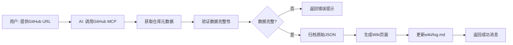

# GitHub 资源收集器 - 设计文档

**创建日期**: 2026-04-28
**状态**: 设计阶段
**作者**: touchx + Claude Code

---

## 1. 功能概述

### 1.1 目标
构建一个自动化的 GitHub 仓库资源收集系统，无缝集成到现有的 Wiki 工作流中。

### 1.2 核心功能
- 输入 GitHub URL，自动提取仓库元数据
- 生成符合 Wiki 规范的 Markdown 页面
- 归档原始 JSON 数据到 archive/ 目录
- 更新操作日志到 wiki/log.md
- 支持通过 Dataview 查询和过滤

### 1.3 使用场景
**主要场景**: 被动收集 - 在浏览 GitHub 或其他渠道时，遇到好的仓库快速记录

### 1.4 设计原则
- ✅ **完全兼容现有工作流** - 不修改任何现有 Wiki 页面
- ✅ **增量式集成** - 新功能独立可测试，可随时禁用
- ✅ **遵循现有规范** - Frontmatter、目录结构、日志格式
- ✅ **数据可追溯** - 源文件归档到 archive/

---

## 2. 系统架构

### 2.1 架构图

```
┌─────────────────────────────────────────────────────────┐
│                    用户交互层                            │
│  提供GitHub URL → 调用 Skill/MCP                        │
└────────────────────┬────────────────────────────────────┘
                     │
┌────────────────────▼────────────────────────────────────┐
│                  数据获取层                              │
│  GitHub MCP Server → 获取仓库元数据                      │
│  (owner, repo, description, stars, language, license)   │
└────────────────────┬────────────────────────────────────┘
                     │
┌────────────────────▼────────────────────────────────────┐
│                  数据处理层                              │
│  1. 验证数据完整性                                        │
│  2. 归档原始 JSON → archive/resources/github/          │
│  3. 生成 frontmatter（符合 WIKI.md 规范）                │
└────────────────────┬────────────────────────────────────┘
                     │
┌────────────────────▼────────────────────────────────────┐
│                  Wiki 生成层                            │
│  1. 创建 Wiki 页面 → wiki/resources/github-repos/      │
│  2. 更新 index.md（Dataview 自动）                       │
│  3. 记录操作日志 → wiki/log.md                          │
└─────────────────────────────────────────────────────────┘
```

### 2.2 目录结构

```
现有 Wiki 系统                    新增 GitHub 收集功能
     │                                  │
     │    ┌──────────────────────────────┘
     │    │
     ▼    ▼
┌──────────────────────────────────────────┐
│           Wiki 知识库（wiki/）            │
│  ┌────────────────────────────────────┐ │
│  │ 现有分类（不变）                    │ │
│  │ - concepts/                        │ │
│  │ - entities/                        │ │
│  │ - sources/                         │ │
│  │ - guides/                          │ │
│  └────────────────────────────────────┘ │
│  ┌────────────────────────────────────┐ │
│  │ 新增分类（隔离）                    │ │
│  │ + resources/                       │ │
│  │   + github-repos/  ← 新增          │ │
│  └────────────────────────────────────┘ │
└──────────────────────────────────────────┘
     │                                    │
     ▼                                    ▼
┌─────────────┐                  ┌──────────────────┐
│ 现有归档     │                  │ 新增归档          │
│ - reports/   │                  │ + resources/     │
│ - tips/      │                  │   + github/      │
│ - tutorial/  │                  └──────────────────┘
└─────────────┘
```

### 2.3 核心组件

| 组件 | 功能 | 实现方式 |
|------|------|----------|
| GitHub MCP Client | 获取仓库元数据 | 使用现有 GitHub MCP 工具 |
| Wiki Page Generator | 生成标准化 Wiki 页面 | 基于模板生成 |
| Archive Manager | 管理源文件归档 | JSON 文件存储 |
| Logger | 记录操作日志 | 追加到 wiki/log.md |

---

## 3. 数据流与工作流

### 3.1 完整工作流



### 3.2 数据获取字段

```yaml
通过 GitHub MCP 获取：
  - name: 仓库名称
  - description: 描述
  - stars: Star 数量
  - language: 主要语言
  - license: 许可证
  - url: 仓库链接
  - created_at: 创建时间
  - updated_at: 更新时间
  - topics: 仓库标签（可选）
```

### 3.3 文件命名规范

**Wiki 页面**: `wiki/resources/github-repos/{owner}-{repo}.md`
**归档文件**: `archive/resources/github/{owner}-{repo}-{YYYY-MM-DD}.json`

---

## 4. Wiki 页面模板

### 4.1 Frontmatter 模板

```markdown
---
name: {owner}-{repo}
description: {description}
type: source
tags: [github, {language}]
created: YYYY-MM-DD
updated: YYYY-MM-DD
source: ../../../archive/resources/github/{owner}-{repo}-{YYYY-MM-DD}.json
stars: {star_count}
language: {language}
license: {license}
github_url: https://github.com/{owner}/{repo}
---

# {repository_name}

{description}

## 基本信息

| 字段 | 值 |
|------|-----|
| 作者 | [{owner}](https://github.com/{owner}) |
| 语言 | {language} |
| Stars |  |
| 许可证 | {license} |

## 链接

- **GitHub**: https://github.com/{owner}/{repo}
- **文档**: （如果有文档链接）
- **Issue**: https://github.com/{owner}/{repo}/issues

## 标签

`{language}` `github` `resource`

## 相关资源

<!-- Dataview 自动填充 -->
```

### 4.2 实际示例

```markdown
---
name: vercel-nextjs
description: The React Framework
type: source
tags: [github, typescript]
created: 2026-04-28
updated: 2026-04-28
source: ../../../archive/resources/github/vercel-nextjs-2026-04-28.json
stars: 125000
language: TypeScript
license: MIT
github_url: https://github.com/vercel/next.js
---

# Next.js

The React Framework

## 基本信息

| 字段 | 值 |
|------|-----|
| 作者 | [vercel](https://github.com/vercel) |
| 语言 | TypeScript |
| Stars |  |
| 许可证 | MIT |

## 链接

- **GitHub**: https://github.com/vercel/next.js
- **文档**: https://nextjs.org/docs
- **Issue**: https://github.com/vercel/next.js/issues

## 标签

`TypeScript` `github` `resource`

## 相关资源
```

---

## 5. 错误处理

### 5.1 错误场景矩阵

| 场景 | 处理方式 | 用户反馈 |
|------|----------|----------|
| URL 格式错误 | 立即返回，不创建文件 | ❌ "无效的 GitHub URL 格式" |
| 仓库不存在 | 立即返回，不创建文件 | ❌ "仓库 {owner}/{repo} 不存在" |
| API 速率限制 | 建议稍后重试 | ⚠️ "GitHub API 速率限制，请稍后重试" |
| 网络错误 | 重试 1 次 | ⚠️ "网络错误，正在重试..." |
| 数据不完整 | 记录日志，继续处理 | ⚠️ "数据不完整，部分字段缺失" |
| 仓库已存在 | 更新模式：替换旧页面 + 重新归档（保留旧归档） | ℹ️ "更新现有仓库页面" |

### 5.2 数据验证规则

```typescript
// 必须字段
{
  name: string;        // 非空
  description: string; // 可为空字符串
  url: string;         // 有效 URL
  stars: number;       // >= 0
  language: string | null;
}

// 可选字段
{
  license: string | null;
  topics: string[];
  created_at: string;
  updated_at: string;
}
```

---

## 6. 测试策略

### 6.1 测试场景

**正常流程**
- ✅ 收集公开仓库（有许可证）
- ✅ 收集无许可证仓库
- ✅ 收集多语言项目

**边界条件**
- ✅ URL 大小写混合
- ✅ 特殊字符仓库名
- ✅ 已存在的仓库（更新模式）

**错误处理**
- ❌ 无效 URL 格式
- ❌ 不存在的仓库
- ❌ 私有仓库（无权限）

### 6.2 验证清单

```bash
# 1. Wiki 页面创建
[ ] 页面路径正确: wiki/resources/github-repos/{owner}-{repo}.md
[ ] Frontmatter 格式符合 WIKI.md 规范
[ ] source 字段指向正确的归档文件
[ ] 文件名使用小写 kebab-case

# 2. 数据归档
[ ] JSON 文件已归档到: archive/resources/github/
[ ] 文件名格式正确: {owner}-{repo}-{YYYY-MM-DD}.json
[ ] 数据完整性验证通过

# 3. 日志记录
[ ] wiki/log.md 已更新
[ ] 日志格式符合现有规范
[ ] 包含时间戳和操作描述

# 4. 兼容性
[ ] wiki-lint.sh 通过
[ ] 不影响现有 Wiki 页面
[ ] Dataview 索引正常工作
[ ] 现有工作流无变化
```

---

## 7. 兼容性保证

### 7.1 零影响承诺

**不修改的内容：**
- ❌ 现有 Wiki 页面（concepts/, entities/, sources/ 等）
- ❌ `wiki/index.md`（Dataview 自动索引新页面）
- ❌ `scripts/wiki-lint.sh`（自动包含新目录）
- ❌ 现有的 frontmatter 类型定义

**新增的内容：**
- ✅ `wiki/resources/github-repos/` - 新分类
- ✅ `archive/resources/github/` - 新归档目录
- ✅ wiki/log.md 中的新日志条目

### 7.2 回滚策略

如需移除此功能：
```bash
# 1. 删除新分类
rm -rf wiki/resources/github-repos/
rm -rf archive/resources/github/

# 2. 清理日志（手动编辑 wiki/log.md）
# 3. 无需恢复 - 现有系统完全独立
```

---

## 8. 实现计划（下一阶段）

### 8.1 开发任务

1. **创建目录结构**
   - `wiki/resources/github-repos/`
   - `archive/resources/github/`

2. **实现 GitHub MCP 集成**
   - 配置 GitHub MCP Server
   - 实现数据获取逻辑
   - 添加错误处理

3. **开发 Wiki 页面生成器**
   - 创建 frontmatter 模板
   - 实现 Markdown 生成逻辑
   - 添加文件写入功能

4. **实现归档管理**
   - JSON 文件存储
   - 文件命名逻辑
   - 路径计算规则

5. **日志记录**
   - 追加到 wiki/log.md
   - 遵循现有日志格式

6. **测试与验证**
   - 单元测试
   - 集成测试
   - wiki-lint.sh 验证

### 8.2 技术栈

- **GitHub API**: GitHub MCP Server
- **文件操作**: Node.js fs / Bash scripts
- **模板引擎**: 简单的字符串替换
- **验证**: 手动测试 + wiki-lint.sh

---

## 9. 成功标准

### 9.1 功能标准
- ✅ 能成功收集公开 GitHub 仓库
- ✅ 生成的 Wiki 页面符合 WIKI.md 规范
- ✅ 源文件正确归档到 archive/
- ✅ 操作日志正确记录

### 9.2 质量标准
- ✅ wiki-lint.sh 零错误
- ✅ 不影响现有 Wiki 功能
- ✅ 错误处理覆盖所有主要场景
- ✅ 文档完整清晰

### 9.3 用户体验标准
- ✅ 一键完成，无需手动编辑
- ✅ 清晰的成功/失败反馈
- ✅ 支持通过 Dataview 查询

---

## 10. 附录

### 10.1 参考资料
- [Wiki Schema 规范](../../wiki/WIKI.md)
- [Frontmatter 标准](../../.claudian/rules/markdown-docs.md)
- [Dataview 文档](https://blacksmithgu.github.io/obsidian-dataview/)

### 10.2 变更历史
- 2026-04-28: 初始设计文档创建

---

**文档状态**: ✅ 设计完成，等待用户审查
**下一步**: 用户批准后，调用 writing-plans skill 创建详细实现计划
