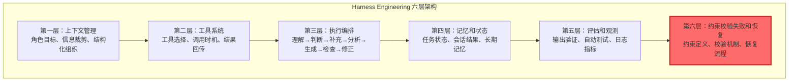
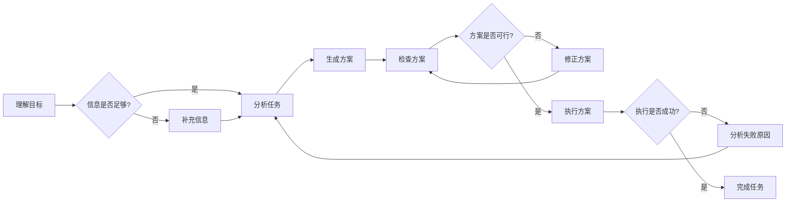
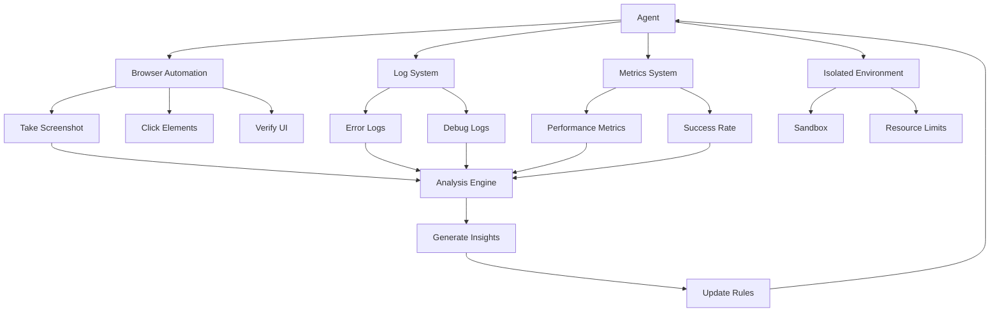
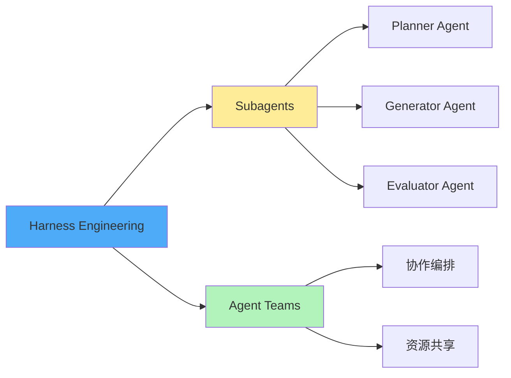
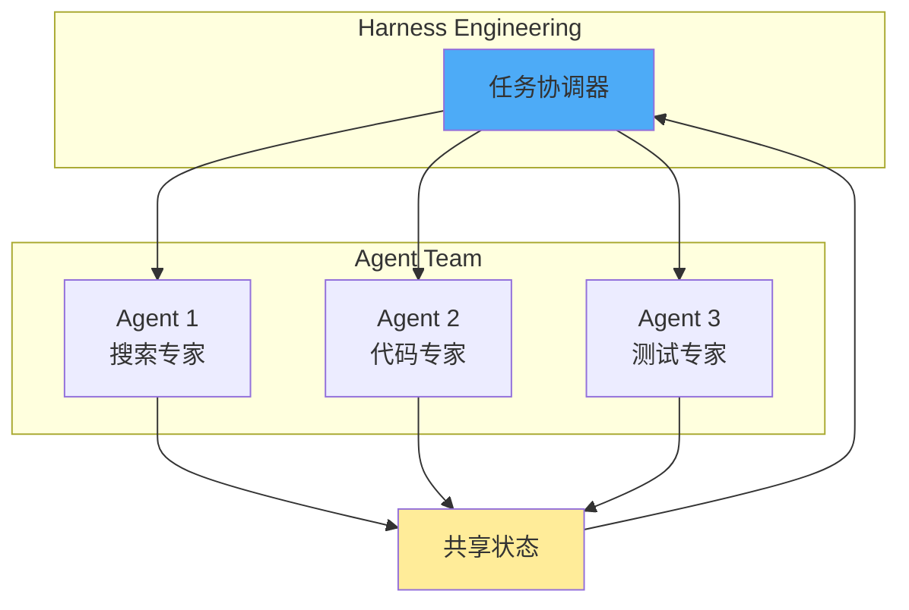
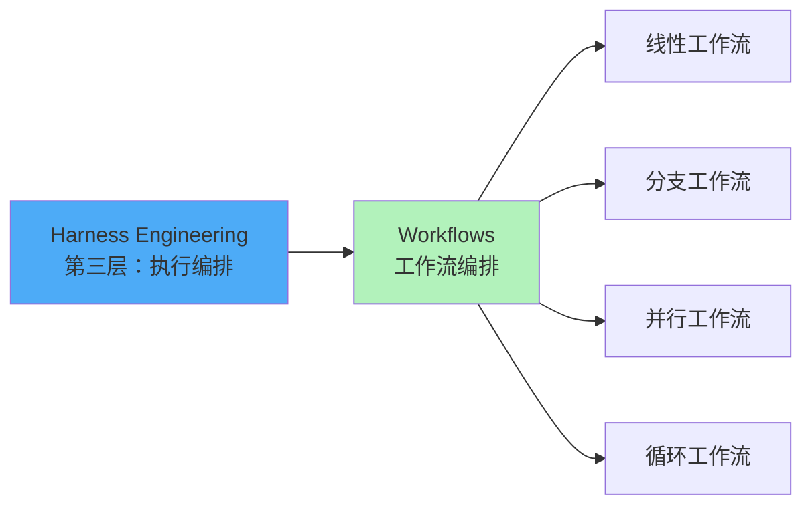

# Harness Engineering

> [!summary] AI 工程领域的第三次重心迁移：从表达问题到信息供给再到执行稳定性的系统性工程化
> **核心价值**：决定上限的是模型，但决定能否落地的是 Harness

**视频来源**：[code秘密花园 - Bilibili](https://www.bilibili.com/video/BV1Zk9FBwELs)
**上传日期**：2026-04-02

---

## 🎯 核心概念

**Harness Engineering** 是 AI 工程领域的**第三次重心迁移**：

```
Prompt Engineering → Context Engineering → Harness Engineering
    (表达问题)         (信息供给)          (执行稳定性)
```

### 关键洞察

> [!quote] 决定性因素
> 同样的模型在不同产品中表现差异巨大，**决定上限的是模型，但决定能否落地的是 Harness**。

### 三代包含关系

```
┌─────────────────────────────────────────┐
│           Harness Engineering            │
│  (包含所有下层能力)                     │
│                                         │
│   ┌─────────────────────────────────┐   │
│   │     Context Engineering         │   │
│   │  (包含 Prompt Engineering)      │   │
│   │                                 │   │
│   │   ┌─────────────────────────┐   │   │
│   │   │  Prompt Engineering      │   │   │
│   │   │                         │   │   │
│   │   └─────────────────────────┘   │   │
│   │                                 │   │
│   └─────────────────────────────────┘   │
│                                         │
└─────────────────────────────────────────┘
```

**数学表达**：`Prompt ⊂ Context ⊂ Harness`

**场景适用**：
- 简单单轮生成 → Prompt 重要
- 依赖外部知识 → Context 关键
- 长链路可执行低容错 → Harness 不可避免

---

## 📊 真实案例：成功率提升 25%

### 改造前（成功率 < 70%）

**已做努力**：
- ✅ 使用旗舰模型（GPT-4/Claude Opus）
- ✅ 上百版提示词优化
- ✅ 参数调优（temperature、top_p）

**实际效果**：
- 有时很聪明，有时莫名的跑偏
- 复杂任务经常半途而废
- 成功率不到 70%

### 改造后（成功率 > 95%）

**改进重点**（Harness 层面）：
- ✅ 任务拆解策略（如何分解复杂任务）
- ✅ 状态管理机制（如何追踪执行进度）
- ✅ 关键步骤校验（如何确保中间结果正确）
- ✅ 失败恢复流程（如何从错误中恢复）

**结果**：
- 同样模型
- 同样提示词
- **成功率 > 95%**

> [!tip] 核心经验
> 当模型表现不稳定时，不要只想着"让 agent 更努力一点"，而要问"**agent 缺了什么样的结构性能力**"。

---

## 🔄 三代工程详细对比

### 对比表

| 维度 | Prompt Engineering | Context Engineering | Harness Engineering |
|------|-------------------|-------------------|-------------------|
| **核心问题** | 模型有没有听懂你说什么 | 模型有没有拿到足够且正确的信息 | 模型在真实场景能否持续做对 |
| **关注点** | 表达问题 | 信息供给 | 执行稳定性 |
| **本质** | 塑造局部概率空间 | 在合适时机送入正确信息 | 驾驭整个执行过程 |
| **能力要求** | 语言设计 | 知识管理 | 系统设计 |
| **适用场景** | 简单单轮生成 | 依赖外部知识的任务 | 长链路可执行低容错任务 |
| **时间线** | 2023 | 2024 | 2025 |
| **失败率** | 30-50% | 15-30% | <5% |
| **复杂度** | 低 | 中 | 高 |
| **成本投入** | 小时级 | 天级 | 周级 |

### 第一代：Prompt Engineering

**核心问题**：模型有没有听懂你在说什么

**本质**：塑造局部概率空间

**常用技术**：
- 角色设定："你是一个经验丰富的..."
- 风格约束："用简洁专业的语言..."
- 少样本示例：给出 3-5 个示例

**局限**：
- 只能激发模型已有能力
- 无法弥补模型缺失的知识
- 无法解决复杂的多步任务

### 第二代：Context Engineering

**核心问题**：模型有没有拿到足够且正确的信息

**本质**：在合适的时机把正确的信息送进去

**常用技术**：
- **RAG（检索增强生成）**：从知识库检索相关文档
- **历史对话管理**：压缩和总结长对话
- **工具返回处理**：提炼工具调用结果
- **渐进式披露**（Skills 机制）：按需暴露信息，而非一次性全给

**局限**：
- 仍然无法保证执行稳定性
- 复杂任务容易"走偏"

### 第三代：Harness Engineering

**核心问题**：模型在真实执行力能不能持续做对

**本质**：驾驭整个执行过程

**核心能力**：
- **监督**：监控执行过程，及时发现偏差
- **约束**：限制模型的行为边界
- **纠偏**：发现错误后自动修正

**关键转变**：
```
从：让模型看起来更聪明
到：让模型在真实世界里稳定工作
```

---

## 🏗️ Harness 六层架构

### 架构总览



### 第一层：上下文管理

让模型在正确的思考边界内工作

**核心组件**：

1. **角色目标定义**
   - 我是谁：明确 Agent 的角色定位
   - 任务是什么：清晰的任务描述
   - 成功标准：可验证的完成标准

   ```yaml
   # 示例
   role: "代码审查专家"
   task: "审查 Pull Request 中的代码变更"
   success_criteria:
     - 发现所有潜在 bug
     - 标记所有安全问题
     - 提供可执行的改进建议
   ```

2. **信息裁剪选择**
   - 越相关越好，不是越多越好
   - 使用相关性评分过滤信息
   - 动态调整上下文窗口

3. **结构化组织**
   - 规则层：系统约束和规则
   - 任务层：当前任务和子任务
   - 状态层：当前执行状态
   - 证据层：支持决策的证据

**实践技巧**：
- 使用模板标准化上下文结构
- 实现上下文压缩机制（避免超过 token 限制）
- 定期清理无关信息

### 第二层：工具系统

让模型接触真实世界

**核心组件**：

1. **工具选择**
   - 太少能力不够
   - 太多容易乱用
   - 按任务类型分类工具

2. **调用时机**
   - 不该查别乱查（避免不必要的 API 调用）
   - 该查别硬答（避免幻觉）

3. **结果回传**
   - 提炼筛选，保持相关性
   - 格式化输出，便于模型理解

**示例代码**：

```python
class ToolManager:
    def __init__(self):
        self.tools = {
            "search": WebSearchTool(),
            "code_read": CodeReadTool(),
            "code_write": CodeWriteTool(),
            "terminal": TerminalTool()
        }

    def should_use_tool(self, task_context):
        """判断是否需要使用工具"""
        # 规则 1：如果任务涉及实时信息，必须用 search
        if task_context.requires_realtime_info:
            return True, "search"

        # 规则 2：如果任务需要读取代码，用 code_read
        if task_context.involves_code_reading:
            return True, "code_read"

        # 规则 3：其他情况，让模型直接回答
        return False, None

    def call_tool(self, tool_name, args):
        """调用工具并格式化结果"""
        tool = self.tools[tool_name]
        result = tool.execute(args)

        # 提炼关键信息
        return self.format_result(result)

    def format_result(self, raw_result):
        """格式化工具结果"""
        # 只保留最相关的信息
        if len(raw_result) > 1000:
            return raw_result[:1000] + "\n\n[结果已截断...]"
        return raw_result
```

### 第三层：执行编排

解决"不会把步骤串起来"的问题

**标准执行流程**：



**关键环节**：

1. **理解目标**：解析用户意图，明确成功标准
2. **信息充足性判断**：评估是否需要额外信息
3. **任务分析**：拆解为可执行的子任务
4. **方案生成**：生成具体的执行方案
5. **方案检查**：验证方案的可行性
6. **执行与反馈**：执行方案并收集反馈
7. **错误恢复**：从失败中学习并重试

**实现示例**：

```python
class ExecutionOrchestrator:
    def execute(self, user_goal):
        """执行用户目标的标准流程"""

        # 1. 理解目标
        goal = self.understand_goal(user_goal)

        # 2. 判断信息是否足够
        while not self.is_information_sufficient(goal):
            # 补充信息
            additional_info = self.gather_information(goal)
            goal.update_context(additional_info)

        # 3. 分析任务
        subtasks = self.analyze_task(goal)

        # 4. 生成方案
        plan = self.generate_plan(subtasks)

        # 5. 检查方案（可迭代）
        while not self.validate_plan(plan):
            plan = self.revise_plan(plan)

        # 6. 执行方案
        try:
            result = self.execute_plan(plan)
            return result
        except Exception as e:
            # 7. 错误恢复
            return self.recover_from_error(e, goal)

    def validate_plan(self, plan):
        """验证方案可行性"""
        # 检查 1：所有步骤是否可执行
        for step in plan.steps:
            if not self.is_step_executable(step):
                return False

        # 检查 2：资源是否充足
        if not self.check_resources(plan):
            return False

        # 检查 3：时间估算是否合理
        if plan.estimated_time > self.max_time:
            return False

        return True
```

### 第四层：记忆和状态

避免每轮"失忆"

**核心组件**：

1. **当前任务状态**
   - 做到哪了
   - 下一步要做什么
   - 已完成和未完成的任务

2. **会话中间结果**
   - 哪些确认了
   - 哪些未解决
   - 需要后续处理的事项

3. **长期记忆**
   - 用户偏好
   - 历史知识
   - 经验教训

**状态管理示例**：

```python
class StateManager:
    def __init__(self):
        self.current_state = {
            "phase": "initial",
            "completed_steps": [],
            "pending_steps": [],
            "context": {}
        }
        self.session_memory = []
        self.long_term_memory = LongTermMemory()

    def update_state(self, step, result):
        """更新状态"""
        self.current_state["completed_steps"].append(step)
        self.current_state["pending_steps"].remove(step)
        self.current_state["context"].update(result)

        # 记录到会话记忆
        self.session_memory.append({
            "step": step,
            "result": result,
            "timestamp": datetime.now()
        })

    def save_to_long_term(self, key, value):
        """保存到长期记忆"""
        self.long_term_memory.store(key, value)

    def get_relevant_history(self, current_context):
        """获取相关历史"""
        # 从长期记忆中检索相关信息
        return self.long_term_memory.retrieve(current_context)
```

### 第五层：评估和观测

避免"自我感觉良好"

**核心组件**：

1. **输出验证**
   - 格式检查
   - 内容相关性检查
   - 事实一致性检查

2. **自动测试**
   - 单元测试
   - 集成测试
   - 端到端测试

3. **日志指标**
   - 成功率
   - 失败率
   - 平均执行时间
   - Token 使用量

**实现示例**：

```python
class EvaluationSystem:
    def __init__(self):
        self.metrics = {
            "total_tasks": 0,
            "successful_tasks": 0,
            "failed_tasks": 0,
            "avg_execution_time": 0,
            "total_tokens": 0
        }

    def validate_output(self, output, expected_format):
        """验证输出格式"""
        # 检查格式
        if not self.check_format(output, expected_format):
            return False, "格式错误"

        # 检查内容相关性
        if not self.check_relevance(output):
            return False, "内容不相关"

        # 检查事实一致性
        if not self.check_facts(output):
            return False, "事实不一致"

        return True, "验证通过"

    def record_metric(self, task_result):
        """记录指标"""
        self.metrics["total_tasks"] += 1

        if task_result.success:
            self.metrics["successful_tasks"] += 1
        else:
            self.metrics["failed_tasks"] += 1

        self.metrics["avg_execution_time"] = (
            (self.metrics["avg_execution_time"] * (self.metrics["total_tasks"] - 1) +
             task_result.execution_time) / self.metrics["total_tasks"]
        )

        self.metrics["total_tokens"] += task_result.tokens_used

    def get_success_rate(self):
        """获取成功率"""
        if self.metrics["total_tasks"] == 0:
            return 0
        return (self.metrics["successful_tasks"] /
                self.metrics["total_tasks"] * 100)
```

### 第六层：约束校验失败和恢复

**决定能否上线的关键**

**核心组件**：

1. **约束定义**
   - 哪些能做
   - 哪些不能做
   - 必须遵守的规则

2. **校验机制**
   - 输出前检查
   - 输出后验证
   - 实时监控

3. **恢复流程**
   - 失败后如何从最近的稳定状态切入
   - 重试策略
   - 降级方案

**实现示例**：

```python
class ConstraintChecker:
    def __init__(self):
        self.constraints = {
            "max_tokens": 4000,
            "allowed_operations": ["read", "write", "search"],
            "forbidden_paths": ["/etc", "/sys", "/proc"],
            "max_execution_time": 300  # 5 分钟
        }

    def check_before_execution(self, operation):
        """执行前检查"""
        # 检查 1：操作是否允许
        if operation["type"] not in self.constraints["allowed_operations"]:
            raise ConstraintError(f"操作 {operation['type']} 不被允许")

        # 检查 2：路径是否安全
        if operation.get("path"):
            if any(operation["path"].startswith(forbidden)
                   for forbidden in self.constraints["forbidden_paths"]):
                raise ConstraintError(f"路径 {operation['path']} 被禁止")

        # 检查 3：预估 token 是否超限
        if operation.get("estimated_tokens", 0) > self.constraints["max_tokens"]:
            raise ConstraintError("预估 token 数量超限")

        return True

    def check_after_execution(self, result):
        """执行后检查"""
        # 检查 1：结果格式是否正确
        if not self.validate_result_format(result):
            raise ValidationError("结果格式不正确")

        # 检查 2：结果是否包含敏感信息
        if self.contains_sensitive_info(result):
            raise SecurityError("结果包含敏感信息")

        return True


class RecoveryManager:
    def __init__(self):
        self.checkpoints = {}
        self.max_retries = 3

    def save_checkpoint(self, task_id, state):
        """保存检查点"""
        self.checkpoints[task_id] = {
            "state": state,
            "timestamp": datetime.now()
        }

    def recover_from_failure(self, task_id, error):
        """从失败中恢复"""
        if task_id not in self.checkpoints:
            return None  # 无检查点，无法恢复

        checkpoint = self.checkpoints[task_id]

        # 分析失败原因
        recovery_strategy = self.analyze_error(error)

        # 尝试恢复
        for attempt in range(self.max_retries):
            try:
                result = self.apply_recovery_strategy(
                    checkpoint["state"],
                    recovery_strategy
                )
                return result
            except Exception as e:
                if attempt == self.max_retries - 1:
                    # 最后一次重试也失败
                    return None

        return None

    def analyze_error(self, error):
        """分析错误并制定恢复策略"""
        if isinstance(error, TokenLimitError):
            return "compress_context"
        elif isinstance(error, ConstraintError):
            return "adjust_parameters"
        elif isinstance(error, ValidationError):
            return "retry_with_validation"
        else:
            return "fallback_to_safe_state"
```

---

## 🏢 真实实践案例

### Anthropic 的实践

#### 1. Context Reset（进程重启式清空）

**问题**：
- 上下文太长，模型开始丢重点
- 模型"着急收尾"，输出质量下降

**方案**：
- 不压缩上下文
- 换一个干净的 agent 并交接工作
- 传递关键状态，而非全部历史

**类比**：
- 像内存泄漏后直接重启进程，而非继续清缓存

**实现示例**：

```python
class ContextResetManager:
    def should_reset(self, current_context):
        """判断是否需要重置"""
        # 条件 1：上下文长度超过阈值
        if len(current_context) > 10000:
            return True

        # 条件 2：模型输出质量下降
        if self.detect_quality_degradation(current_context):
            return True

        return False

    def reset_context(self, current_context):
        """重置上下文"""
        # 提取关键状态
        key_state = self.extract_key_state(current_context)

        # 创建新的干净 agent
        new_agent = self.create_clean_agent()

        # 交接工作
        new_agent.initialize_from_state(key_state)

        return new_agent

    def extract_key_state(self, context):
        """提取关键状态"""
        return {
            "current_goal": context.get("goal"),
            "completed_steps": context.get("completed_steps", []),
            "pending_steps": context.get("pending_steps", []),
            "critical_findings": context.get("findings", [])[:5]  # 只保留最重要的 5 个
        }
```

#### 2. 分离 Planner/Generator/Evaluator

**问题**：
- 自评失真（既当运动员又当裁判）
- 模型倾向于过度自信

**方案**：
- **Planner**：需求 → 完整规格
- **Generator**：逐步实现
- **Evaluator**：真实操作页面验证（带环境的验证，非抽象审查）

**原则**：
- 生产验收必须分离
- 不同角色使用不同的 prompt

**架构示例**：

```python
# Planner Agent
class PlannerAgent:
    def plan(self, user_request):
        """将用户需求转换为完整规格"""
        prompt = f"""
        你是一个规划专家。请将以下用户需求转换为详细的技术规格：

        用户需求：{user_request}

        请输出：
        1. 目标分析
        2. 技术方案
        3. 实施步骤
        4. 验收标准
        """
        return self.llm.generate(prompt)

# Generator Agent
class GeneratorAgent:
    def generate(self, spec):
        """根据规格生成实现"""
        prompt = f"""
        你是一个实现专家。请根据以下技术规格生成代码：

        技术规格：{spec}

        请输出：
        1. 完整的代码实现
        2. 代码注释
        3. 使用说明
        """
        return self.llm.generate(prompt)

# Evaluator Agent
class EvaluatorAgent:
    def evaluate(self, implementation, spec):
        """在真实环境中验证实现"""
        # 启动测试环境
        test_env = self.create_test_environment()

        # 部署实现
        test_env.deploy(implementation)

        # 执行测试
        test_results = test_env.run_tests()

        # 真实环境验证（非抽象审查）
        validation_results = test_env.validate_against_spec(spec)

        return {
            "test_results": test_results,
            "validation_results": validation_results,
            "passed": validation_results["all_passed"]
        }

# 协调器
class AgentCoordinator:
    def execute(self, user_request):
        """协调三个 agent 完成任务"""
        # 1. Planning
        planner = PlannerAgent()
        spec = planner.plan(user_request)

        # 2. Generation
        generator = GeneratorAgent()
        implementation = generator.generate(spec)

        # 3. Evaluation
        evaluator = EvaluatorAgent()
        evaluation = evaluator.evaluate(implementation, spec)

        if evaluation["passed"]:
            return implementation
        else:
            # 失败，重新规划
            return self.execute_with_feedback(user_request, evaluation)
```

### OpenAI 的实践

#### 1. 工程师角色转变

**传统模式**：
- ❌ 工程师写代码
- ❌ Agent 帮忙优化

**Harness 模式**：
- ✅ 工程师设计环境
- ✅ Agent 在环境中工作

**工程师的新职责**：
1. 拆解产品目标为 agent 理解的小任务
2. Agent 失败时问"环境缺了什么能力"而非"让 agent 更努力"
3. 建立反馈链路让 agent 看到自己的工作结果

#### 2. 渐进式披露

**错误做法**：
```markdown
<!-- 巨大的 agent.md，填满所有规范 -->
# Agent 规范

## 架构
[10 页架构文档...]

## 设计
[20 页设计文档...]

## 计划
[15 页计划文档...]

## 质量标准
[5 页质量标准...]

## 安全要求
[8 页安全要求...]
```

**正确做法**：
```markdown
<!-- agent.md 只是一个目录页 -->
# Agent 规范索引

## 📋 快速开始
如果你是第一次使用，请阅读：[[quick-start]]

## 📚 详细文档

### 架构
- [[architecture-overview]] - 架构概览
- [[architecture-components]] - 组件设计
- [[architecture-data-flow]] - 数据流

### 设计
- [[design-principles]] - 设计原则
- [[design-patterns]] - 设计模式
- [[design-decisions]] - 设计决策

### 计划
- [[plan-roadmap]] - 路线图
- [[plan-milestones]] - 里程碑
- [[plan-tasks]] - 任务分解

### 质量
- [[quality-standards]] - 质量标准
- [[quality-testing]] - 测试策略

### 安全
- [[security-requirements]] - 安全要求
- [[security-best-practices]] - 最佳实践
```

**实现示例**：

```python
class ProgressiveDisclosure:
    def __init__(self):
        self.agent_index = "agent.md"
        self.document_tree = self.build_document_tree()

    def get_relevant_docs(self, current_task):
        """根据当前任务获取相关文档"""
        # 分析任务类型
        task_type = self.classify_task(current_task)

        # 获取相关文档
        relevant_docs = self.document_tree.get_docs_for_task(task_type)

        # 只返回必要的文档，不一次性全部给
        return relevant_docs

    def should_disclose_more(self, agent_state):
        """判断是否需要披露更多信息"""
        # 如果 agent 在某个问题上卡住超过 3 次
        if agent_state.stuck_count > 3:
            return True

        # 如果 agent 请求更多信息
        if agent_state.requests_more_info:
            return True

        return False
```

#### 3. 自主验证系统

**核心组件**：
- Agent 接浏览器能截图、点页面
- 接日志和指标系统
- 独立隔离环境运行
- 资深工程师经验 → 系统规则

**架构示例**：



**实现示例**：

```python
class AutonomousVerificationSystem:
    def __init__(self):
        self.browser = BrowserAutomation()
        self.log_system = LogSystem()
        self.metrics_system = MetricsSystem()
        self.isolated_env = IsolatedEnvironment()

    def verify_implementation(self, implementation):
        """在真实环境中验证实现"""
        # 1. 部署到隔离环境
        self.isolated_env.deploy(implementation)

        # 2. 启动浏览器
        self.browser.start()

        # 3. 执行验证流程
        verification_steps = [
            self.verify_ui,
            self.verify_functionality,
            self.verify_performance,
            self.verify_security
        ]

        results = []
        for step in verification_steps:
            try:
                result = step()
                results.append(result)
            except Exception as e:
                self.log_system.log_error(e)
                results.append({"success": False, "error": str(e)})

        # 4. 分析结果
        insights = self.analyze_results(results)

        # 5. 生成反馈
        feedback = self.generate_feedback(insights)

        # 6. 更新规则
        self.update_rules(feedback)

        return feedback

    def verify_ui(self):
        """验证 UI"""
        # 截图
        screenshot = self.browser.take_screenshot()

        # 检查关键元素是否存在
        elements = self.browser.find_elements(["button", "input", "label"])

        # 验证布局
        layout_ok = self.verify_layout(screenshot, elements)

        return {
            "success": layout_ok,
            "screenshot": screenshot,
            "elements_found": len(elements)
        }

    def verify_functionality(self):
        """验证功能"""
        # 测试关键功能
        test_cases = [
            {"action": "click", "target": "submit_button", "expected": "success"},
            {"action": "input", "target": "email_field", "value": "test@example.com"},
            {"action": "submit", "expected": "form_submitted"}
        ]

        results = []
        for test in test_cases:
            result = self.browser.execute_action(test)
            results.append(result)

        # 检查是否所有测试都通过
        all_passed = all(r["success"] for r in results)

        return {
            "success": all_passed,
            "test_results": results
        }

    def analyze_results(self, results):
        """分析验证结果"""
        insights = []

        # 分析失败模式
        failures = [r for r in results if not r["success"]]
        if failures:
            failure_patterns = self.identify_failure_patterns(failures)
            insights.append({
                "type": "failure_pattern",
                "data": failure_patterns
            })

        # 分析性能指标
        metrics = self.metrics_system.get_metrics()
        if metrics["avg_response_time"] > 1000:  # 超过 1 秒
            insights.append({
                "type": "performance_issue",
                "data": metrics
            })

        return insights

    def generate_feedback(self, insights):
        """生成反馈"""
        feedback = []

        for insight in insights:
            if insight["type"] == "failure_pattern":
                feedback.append(f"发现失败模式：{insight['data']}")
                feedback.append("建议：添加相应的错误处理逻辑")

            elif insight["type"] == "performance_issue":
                feedback.append(f"性能问题：平均响应时间 {insight['data']['avg_response_time']}ms")
                feedback.append("建议：优化数据库查询或添加缓存")

        return feedback

    def update_rules(self, feedback):
        """根据反馈更新规则"""
        # 将资深工程师的经验转化为系统规则
        for item in feedback:
            rule = self.convert_to_rule(item)
            self.add_rule(rule)
```

---

## 🔧 实施指南

### 从零开始构建 Harness

#### 阶段 1：评估（1-2 天）

**目标**：了解当前系统状态，确定改进方向

**检查清单**：

```
[ ] 1. 收集当前性能指标
    - 平均成功率
    - 失败模式分析
    - 用户反馈汇总

[ ] 2. 识别瓶颈
    - 哪些任务经常失败？
    - 失败的常见原因是什么？
    - 哪些环节最耗时？

[ ] 3. 确定优先级
    - 哪些问题影响最大？
    - 哪些改进最容易实现？
    - 投入产出比最高的改进点
```

**评估工具**：

```python
class HarnessEvaluator:
    def __init__(self):
        self.metrics = MetricsCollector()

    def evaluate_current_system(self):
        """评估当前系统"""
        # 收集指标
        metrics = self.metrics.collect()

        # 分析失败模式
        failure_patterns = self.analyze_failures()

        # 生成评估报告
        report = {
            "current_performance": metrics,
            "failure_analysis": failure_patterns,
            "improvement_suggestions": self.suggest_improvements(metrics, failure_patterns)
        }

        return report

    def analyze_failures(self):
        """分析失败模式"""
        # 从日志中提取失败案例
        failures = self.metrics.get_failures()

        # 分类失败原因
        categorized = {
            "context_insufficient": [],
            "tool_failure": [],
            "logic_error": [],
            "constraint_violation": [],
            "other": []
        }

        for failure in failures:
            category = self.classify_failure(failure)
            categorized[category].append(failure)

        # 找出最常见的失败原因
        most_common = max(categorized.items(), key=lambda x: len(x[1]))

        return {
            "categorized": categorized,
            "most_common": most_common[0],
            "distribution": {k: len(v) for k, v in categorized.items()}
        }
```

#### 阶段 2：设计（2-3 天）

**目标**：设计 Harness 架构

**设计要点**：

1. **架构设计**
   - 确定需要实现的层次
   - 设计各层之间的接口
   - 规划数据流

2. **工具选择**
   - 选择合适的工具和框架
   - 评估成本和收益
   - 制定集成方案

3. **测试策略**
   - 设计测试用例
   - 规划测试环境
   - 定义验收标准

**架构设计模板**：

```markdown
# Harness 架构设计文档

## 1. 系统架构

### 1.1 整体架构
[插入架构图]

### 1.2 各层职责

#### 第一层：上下文管理
- 职责：...
- 接口：...
- 数据结构：...

#### 第二层：工具系统
- 职责：...
- 接口：...
- 数据结构：...

## 2. 数据流

### 2.1 正常流程
[插入流程图]

### 2.2 异常处理
[插入异常处理流程图]

## 3. 接口设计

### 3.1 层间接口
```python
# 接口定义示例
class ContextManagerInterface:
    def get_context(self, task):
        pass

    def update_context(self, task, new_info):
        pass
```

## 4. 测试策略

### 4.1 单元测试
- 测试范围：...
- 测试工具：...

### 4.2 集成测试
- 测试范围：...
- 测试环境：...

### 4.3 验收标准
- 成功率目标：...
- 性能要求：...
```

#### 阶段 3：实现（1-2 周）

**目标**：实现 Harness 系统

**实施步骤**：

```
Step 1: 实现基础框架（2-3 天）
  ├─ 创建各层的基础类
  ├─ 定义层间接口
  └─ 实现基本的数据流

Step 2: 实现核心功能（3-5 天）
  ├─ 第一层：上下文管理
  ├─ 第二层：工具系统
  ├─ 第三层：执行编排
  ├─ 第四层：记忆和状态
  ├─ 第五层：评估和观测
  └─ 第六层：约束校验

Step 3: 集成测试（2-3 天）
  ├─ 编写测试用例
  ├─ 执行测试
  └─ 修复问题

Step 4: 性能优化（1-2 天）
  ├─ 性能分析
  ├─ 优化瓶颈
  └─ 验证改进效果
```

**实现示例（完整框架）**：

```python
# harness_framework.py

class HarnessFramework:
    """Harness Engineering 完整框架"""

    def __init__(self, config):
        # 初始化各层
        self.context_manager = ContextManager(config["context"])
        self.tool_manager = ToolManager(config["tools"])
        self.execution_orchestrator = ExecutionOrchestrator(config["execution"])
        self.state_manager = StateManager(config["state"])
        self.evaluation_system = EvaluationSystem(config["evaluation"])
        self.constraint_checker = ConstraintChecker(config["constraints"])
        self.recovery_manager = RecoveryManager(config["recovery"])

    def execute(self, user_goal):
        """执行用户目标的完整流程"""

        try:
            # 第一层：准备上下文
            context = self.context_manager.prepare_context(user_goal)

            # 保存检查点
            self.recovery_manager.save_checkpoint("main", context)

            # 第二层：选择工具
            tools_needed = self.tool_manager.select_tools(context)

            # 第三层：执行编排
            execution_plan = self.execution_orchestrator.create_plan(context, tools_needed)

            # 第四层：管理状态
            self.state_manager.update_state("planning", {"plan": execution_plan})

            # 第五层：执行前验证
            for step in execution_plan.steps:
                self.constraint_checker.check_before_execution(step)

            # 执行计划
            result = self.execution_orchestrator.execute_plan(execution_plan)

            # 第五层：执行后评估
            validation_result = self.evaluation_system.validate_output(
                result,
                expected_format=context.get("expected_format")
            )

            if not validation_result[0]:
                # 验证失败，尝试修正
                result = self.execution_orchestrator.revise_result(result, validation_result[1])

            # 记录指标
            self.evaluation_system.record_metric(result)

            return result

        except Exception as e:
            # 第六层：错误恢复
            recovered_result = self.recovery_manager.recover_from_failure("main", e)

            if recovered_result is None:
                # 恢复失败，返回错误信息
                return {
                    "success": False,
                    "error": str(e),
                    "recovery_failed": True
                }

            return recovered_result

# 使用示例
if __name__ == "__main__":
    config = {
        "context": {"max_tokens": 4000},
        "tools": {"available_tools": ["search", "read", "write"]},
        "execution": {"max_retries": 3},
        "state": {"storage_backend": "sqlite"},
        "evaluation": {"success_threshold": 0.95},
        "constraints": {
            "max_execution_time": 300,
            "forbidden_operations": ["delete", "format"]
        },
        "recovery": {"max_recovery_attempts": 3}
    }

    harness = HarnessFramework(config)

    result = harness.execute("创建一个 Python 函数，计算斐波那契数列")

    print(result)
```

#### 阶段 4：测试（3-5 天）

**目标**：确保系统稳定可靠

**测试清单**：

```
[ ] 1. 单元测试
    - 测试每个组件的功能
    - 测试边界条件
    - 测试错误处理

[ ] 2. 集成测试
    - 测试各层之间的协作
    - 测试数据流
    - 测试异常处理

[ ] 3. 性能测试
    - 测试响应时间
    - 测试并发能力
    - 测试资源使用

[ ] 4. 压力测试
    - 测试极限负载
    - 测试长时间运行
    - 测试内存泄漏

[ ] 5. 用户验收测试
    - 真实场景测试
    - 用户反馈收集
    - 问题修复
```

**测试框架示例**：

```python
import unittest

class TestHarnessFramework(unittest.TestCase):
    def setUp(self):
        """测试前准备"""
        self.config = {
            # 测试配置
        }
        self.harness = HarnessFramework(self.config)

    def test_context_manager(self):
        """测试上下文管理"""
        context = self.harness.context_manager.prepare_context("测试任务")
        self.assertIsNotNone(context)
        self.assertIn("goal", context)
        self.assertIn("constraints", context)

    def test_tool_selection(self):
        """测试工具选择"""
        context = {"goal": "搜索信息", "type": "search"}
        tools = self.harness.tool_manager.select_tools(context)
        self.assertIn("search", tools)

    def test_execution_orchestrator(self):
        """测试执行编排"""
        result = self.harness.execute("简单任务")
        self.assertTrue(result["success"])

    def test_error_recovery(self):
        """测试错误恢复"""
        # 模拟失败场景
        result = self.harness.execute("会失败的任务")
        # 即使失败，也应该有错误信息
        self.assertIn("error", result)

    def test_constraint_checker(self):
        """测试约束检查"""
        operation = {"type": "delete", "path": "/etc/passwd"}
        with self.assertRaises(ConstraintError):
            self.harness.constraint_checker.check_before_execution(operation)

if __name__ == "__main__":
    unittest.main()
```

#### 阶段 5：部署（1-2 天）

**目标**：将系统部署到生产环境

**部署清单**：

```
[ ] 1. 环境准备
    - 配置服务器
    - 安装依赖
    - 配置数据库

[ ] 2. 数据迁移
    - 导入历史数据
    - 验证数据完整性

[ ] 3. 灰度发布
    - 小流量测试
    - 监控指标
    - 逐步扩大流量

[ ] 4. 监控配置
    - 配置日志收集
    - 配置告警规则
    - 配置性能监控

[ ] 5. 文档更新
    - 更新使用文档
    - 更新维护文档
    - 培训相关人员
```

---

## 🚨 故障排查指南

### 常见问题及解决方案

#### 问题 1：成功率低（< 70%）

**可能原因**：
1. 上下文信息不足
2. 工具选择不当
3. 执行流程有缺陷
4. 约束条件不合理

**排查步骤**：

```python
def diagnose_low_success_rate(harness):
    """诊断成功率低的原因"""

    # 1. 检查上下文
    context_issues = harness.context_manager.diagnose_issues()
    if context_issues:
        print(f"上下文问题：{context_issues}")

    # 2. 检查工具使用
    tool_issues = harness.tool_manager.diagnose_issues()
    if tool_issues:
        print(f"工具问题：{tool_issues}")

    # 3. 检查执行流程
    execution_issues = harness.execution_orchestrator.diagnose_issues()
    if execution_issues:
        print(f"执行问题：{execution_issues}")

    # 4. 检查约束条件
    constraint_issues = harness.constraint_checker.diagnose_issues()
    if constraint_issues:
        print(f"约束问题：{constraint_issues}")

    # 生成改进建议
    suggestions = generate_improvement_suggestions([
        context_issues, tool_issues, execution_issues, constraint_issues
    ])

    return suggestions
```

**解决方案**：

| 问题类型 | 解决方案 |
|---------|---------|
| 上下文不足 | 增加上下文窗口、优化信息检索、添加渐进式披露 |
| 工具不当 | 重新评估工具选择、优化工具调用时机、改进结果处理 |
| 流程缺陷 | 优化执行流程、添加更多检查点、改进错误处理 |
| 约束不合理 | 调整约束条件、添加例外处理、改进约束检查 |

#### 问题 2：执行时间过长

**可能原因**：
1. 工具调用过多
2. 重复执行相同操作
3. 等待时间过长
4. 资源竞争

**排查步骤**：

```python
def diagnose_slow_execution(harness, execution_log):
    """诊断执行缓慢的原因"""

    # 1. 分析工具调用
    tool_calls = analyze_tool_calls(execution_log)
    if tool_calls["count"] > 100:
        print("警告：工具调用次数过多")
        print(f"最常调用的工具：{tool_calls['most_common']}")

    # 2. 分析重复操作
    duplicate_operations = find_duplicates(execution_log)
    if duplicate_operations:
        print(f"发现重复操作：{duplicate_operations}")

    # 3. 分析等待时间
    wait_times = analyze_wait_times(execution_log)
    if wait_times["avg"] > 10:
        print(f"平均等待时间过长：{wait_times['avg']} 秒")

    # 4. 分析资源使用
    resource_usage = analyze_resource_usage(execution_log)
    if resource_usage["cpu"] > 80:
        print("CPU 使用率过高")
    if resource_usage["memory"] > 80:
        print("内存使用率过高")

    # 生成优化建议
    return generate_optimization_suggestions([
        tool_calls, duplicate_operations, wait_times, resource_usage
    ])
```

**解决方案**：

| 问题类型 | 解决方案 |
|---------|---------|
| 工具调用过多 | 合并相似操作、使用缓存、优化工具选择策略 |
| 重复操作 | 添加结果缓存、避免重复计算、使用记忆化 |
| 等待时间长 | 优化 API 调用、使用异步操作、添加超时机制 |
| 资源竞争 | 优化并发控制、添加资源限制、使用负载均衡 |

#### 问题 3：内存泄漏

**可能原因**：
1. 上下文无限增长
2. 状态未及时清理
3. 缓存未设置过期
4. 循环引用

**排查步骤**：

```python
def diagnose_memory_leak(harness):
    """诊断内存泄漏"""

    # 1. 检查上下文大小
    context_size = len(str(harness.context_manager.context))
    if context_size > 1000000:  # 1MB
        print(f"警告：上下文过大 ({context_size} bytes)")

    # 2. 检查状态数量
    state_count = len(harness.state_manager.states)
    if state_count > 1000:
        print(f"警告：状态数量过多 ({state_count})")

    # 3. 检查缓存大小
    cache_size = harness.tool_manager.cache.size()
    if cache_size > 1000:
        print(f"警告：缓存过大 ({cache_size} 项)")

    # 4. 检查循环引用
    circular_refs = detect_circular_references(harness)
    if circular_refs:
        print(f"发现循环引用：{circular_refs}")

    # 生成清理建议
    return generate_cleanup_suggestions([
        context_size, state_count, cache_size, circular_refs
    ])
```

**解决方案**：

| 问题类型 | 解决方案 |
|---------|---------|
| 上下文过大 | 实现上下文压缩、定期清理无关信息、使用 Context Reset |
| 状态过多 | 实现状态过期机制、归档旧状态、限制状态数量 |
| 缓存过大 | 设置缓存过期时间、限制缓存大小、使用 LRU 淘汰 |
| 循环引用 | 使用弱引用、定期检查循环引用、打破引用链 |

---

## 📈 性能优化建议

### 优化策略

#### 1. 上下文优化

**目标**：减少 token 使用，提高相关性

**策略**：

```python
class ContextOptimizer:
    def optimize_context(self, context):
        """优化上下文"""

        # 1. 移除无关信息
        relevant_context = self.filter_irrelevant_info(context)

        # 2. 压缩重复信息
        compressed_context = self.compress_duplicates(relevant_context)

        # 3. 优先级排序
        prioritized_context = self.prioritize_info(compressed_context)

        # 4. 裁剪到合适大小
        final_context = self.trim_to_size(prioritized_context, max_size=4000)

        return final_context

    def filter_irrelevant_info(self, context):
        """过滤无关信息"""
        # 计算每个信息片段的相关性评分
        scored_items = []
        for item in context["items"]:
            score = self.calculate_relevance(item, context["goal"])
            scored_items.append((item, score))

        # 只保留评分 > 0.5 的信息
        relevant_items = [item for item, score in scored_items if score > 0.5]

        return {"goal": context["goal"], "items": relevant_items}

    def compress_duplicates(self, context):
        """压缩重复信息"""
        # 使用去重算法
        unique_items = []
        seen = set()

        for item in context["items"]:
            # 计算信息指纹
            fingerprint = self.calculate_fingerprint(item)

            if fingerprint not in seen:
                seen.add(fingerprint)
                unique_items.append(item)

        return {"goal": context["goal"], "items": unique_items}
```

#### 2. 工具调用优化

**目标**：减少不必要的工具调用

**策略**：

```python
class ToolCallOptimizer:
    def __init__(self):
        self.cache = {}  # 结果缓存
        self.call_history = []  # 调用历史

    def should_call_tool(self, tool_name, args):
        """判断是否应该调用工具"""

        # 1. 检查缓存
        cache_key = f"{tool_name}:{args}"
        if cache_key in self.cache:
            # 检查缓存是否过期（5 分钟内有效）
            if time.time() - self.cache[cache_key]["timestamp"] < 300:
                return False, self.cache[cache_key]["result"]

        # 2. 检查是否在短时间内重复调用
        recent_calls = [
            call for call in self.call_history
            if call["tool"] == tool_name and
               call["args"] == args and
               time.time() - call["timestamp"] < 60
        ]
        if len(recent_calls) > 3:
            # 短时间内重复调用超过 3 次，跳过
            return False, None

        # 3. 检查工具调用的必要性
        if not self.is_tool_call_necessary(tool_name, args):
            return False, None

        return True, None

    def optimize_tool_calls(self, planned_calls):
        """优化工具调用序列"""

        optimized_calls = []

        for call in planned_calls:
            should_call, cached_result = self.should_call_tool(
                call["tool"],
                call["args"]
            )

            if should_call:
                optimized_calls.append(call)
            elif cached_result is not None:
                # 使用缓存结果，不需要实际调用
                call["result"] = cached_result
                call["cached"] = True
                optimized_calls.append(call)

        return optimized_calls
```

#### 3. 并行执行优化

**目标**：利用并行处理提高效率

**策略**：

```python
import asyncio
from concurrent.futures import ThreadPoolExecutor

class ParallelExecutor:
    def __init__(self, max_workers=5):
        self.executor = ThreadPoolExecutor(max_workers=max_workers)

    async def execute_parallel(self, tasks):
        """并行执行多个任务"""

        # 识别可以并行的任务
        parallel_groups = self.identify_parallel_tasks(tasks)

        results = []

        for group in parallel_groups:
            if len(group) == 1:
                # 单个任务，直接执行
                result = await self.execute_single(group[0])
                results.append(result)
            else:
                # 多个任务，并行执行
                group_results = await self.execute_group(group)
                results.extend(group_results)

        return results

    def identify_parallel_tasks(self, tasks):
        """识别可以并行的任务"""

        # 分析任务之间的依赖关系
        dependency_graph = self.build_dependency_graph(tasks)

        # 使用拓扑排序找出可以并行的任务组
        parallel_groups = []
        remaining_tasks = set(tasks)

        while remaining_tasks:
            # 找出没有未完成依赖的任务
            ready_tasks = [
                task for task in remaining_tasks
                if not any(dep in remaining_tasks for dep in task.get("depends_on", []))
            ]

            if not ready_tasks:
                # 循环依赖，报错
                raise ValueError("检测到循环依赖")

            parallel_groups.append(ready_tasks)
            remaining_tasks -= set(ready_tasks)

        return parallel_groups

    async def execute_group(self, tasks):
        """并行执行一组任务"""

        loop = asyncio.get_event_loop()

        # 使用线程池并行执行
        futures = [
            loop.run_in_executor(self.executor, self.execute_task, task)
            for task in tasks
        ]

        results = await asyncio.gather(*futures)

        return results
```

---

## 🔗 与其他概念的关系

### 与 Subagents 的关系

**[[subagents]]** 是 Harness Engineering 的重要组成部分：



**关系说明**：
- **Harness** 是整体架构，提供执行稳定性保障
- **Subagents** 是具体实现方式，将复杂任务拆解为多个专门的 agent
- **Agent Teams** 是协作模式，协调多个 subagents 工作

**实施示例**：

```python
# 在 Harness 框架中使用 Subagents
class HarnessWithSubagents:
    def __init__(self):
        # 主 Harness 框架
        self.harness = HarnessFramework(config)

        # Subagents
        self.planner = PlannerAgent()
        self.generator = GeneratorAgent()
        self.evaluator = EvaluatorAgent()

    def execute_with_subagents(self, user_goal):
        """使用 subagents 执行任务"""

        # 1. Planning Agent
        plan = self.planner.plan(user_goal)

        # 2. Generator Agent（可能需要多次迭代）
        implementation = None
        for attempt in range(self.harness.config["max_retries"]):
            implementation = self.generator.generate(plan)

            # 3. Evaluator Agent
            evaluation = self.evaluator.evaluate(implementation, plan)

            if evaluation["passed"]:
                break

            # 反馈给 Generator，重新生成
            plan["feedback"] = evaluation["feedback"]

        return implementation
```

### 与 Agent Teams 的关系

**[[agent-teams]]** 是多个 agents 协作的编排模式：



**关系说明**：
- **Harness** 提供协作框架和状态管理
- **Agent Teams** 利用这个框架实现多 agent 协作
- **共享状态** 是 Harness 的第四层（记忆和状态）

**实施示例**：

```python
class AgentTeamInHarness:
    def __init__(self):
        # Harness 的状态管理
        self.state_manager = StateManager()

        # Agent Team
        self.team = {
            "search_agent": SearchAgent(),
            "code_agent": CodeAgent(),
            "test_agent": TestAgent()
        }

    def execute_with_team(self, task):
        """使用 agent team 执行任务"""

        # 1. 任务分配
        subtasks = self.break_down_task(task)

        # 2. 并行执行（Harness 的第三层：执行编排）
        results = {}
        for subtask in subtasks:
            agent = self.select_agent_for_task(subtask)
            result = agent.execute(subtask)

            # 3. 状态共享（Harness 的第四层）
            self.state_manager.update_state(subtask["id"], result)
            results[subtask["id"]] = result

        # 4. 结果整合
        final_result = self.integrate_results(results)

        return final_result
```

### 与 Workflows 的关系

**[[workflows]]** 是 Harness 执行编排的具体实现：



**关系说明**：
- **Harness** 第三层（执行编排）定义了标准流程
- **Workflows** 提供各种具体的工作流模式
- **Workflows** 是 Harness 第三层的实现工具

**实施示例**：

```python
from workflows import LinearWorkflow, BranchingWorkflow, ParallelWorkflow

class HarnessExecutionOrchestrator:
    def __init__(self):
        # 各种工作流模式
        self.workflows = {
            "linear": LinearWorkflow(),
            "branching": BranchingWorkflow(),
            "parallel": ParallelWorkflow()
        }

    def orchestrate_execution(self, task):
        """编排任务执行"""

        # 分析任务类型
        task_type = self.analyze_task_type(task)

        # 选择合适的工作流
        workflow = self.workflows[task_type]

        # 执行工作流
        result = workflow.execute(task)

        return result

    def analyze_task_type(self, task):
        """分析任务类型"""

        # 如果任务有多个独立的子任务
        if len(task.get("subtasks", [])) > 1 and self.are_independent(task["subtasks"]):
            return "parallel"

        # 如果任务需要根据条件选择不同的执行路径
        if task.get("conditions"):
            return "branching"

        # 默认使用线性工作流
        return "linear"
```

---

## 🎯 实战类比

### 新人客户拜访

为了更好地理解三代工程的区别，让我们用"新人客户拜访"作为类比：

#### Prompt Engineering（第一代）

> **指令**："见面先寒暄，再介绍方案，记录需求，最后确认下一步"

**特点**：
- 只给了一个简单的流程指令
- 没有提供任何背景信息
- 没有检查机制
- 成功率取决于新人的理解和记忆

**类似场景**：
- 简单的单轮任务
- 不需要太多背景知识
- 失败了可以重来

#### Context Engineering（第二代）

> **指令**："这是客户背景、沟通记录、产品报价、竞品情况、会议目标，请按照这个流程去拜访..."

**特点**：
- 提供了详细的背景信息
- 帮助新人理解客户情况
- 但仍然缺乏执行监督

**类似场景**：
- 需要外部知识的任务
- 信息量较大的场景
- 需要上下文理解的对话

#### Harness Engineering（第三代）

> **指令**："带着 checklist、关键节点实时汇报、会后核实纪要和录音、发现偏差立即纠正、按明确标准验收结果"

**特点**：
- **checklist**：确保不遗漏关键步骤
- **实时汇报**：及时发现问题
- **事后核实**：验证执行结果
- **偏差纠正**：自动纠错
- **标准验收**：明确的成功标准

**类似场景**：
- 长链路复杂任务
- 低容错场景（失败成本高）
- 需要稳定产出的生产环境

### 编程类比

#### Prompt Engineering

```python
# 直接告诉模型要做什么
prompt = "写一个 Python 函数，计算斐波那契数列"
```

#### Context Engineering

```python
# 提供背景信息和示例
prompt = """
这是一个斐波那契数列的定义：
F(0) = 0, F(1) = 1
F(n) = F(n-1) + F(n-2)

请写一个 Python 函数计算斐波那契数列。

示例：
输入：5
输出：[0, 1, 1, 2, 3, 5]
"""
```

#### Harness Engineering

```python
# 完整的执行框架
class FibonacciHarness:
    def execute(self, n):
        """执行斐波那契计算，带完整的检查和恢复"""

        # 1. 约束检查
        if n < 0:
            raise ValueError("n 必须是非负整数")

        # 2. 执行计算
        try:
            result = self.calculate(n)
        except Exception as e:
            # 3. 错误恢复
            result = self.recover_from_error(e, n)

        # 4. 结果验证
        if not self.validate_result(result, n):
            raise ValueError("计算结果不正确")

        return result

    def calculate(self, n):
        """实际计算"""
        # 实现细节...
        pass

    def validate_result(self, result, n):
        """验证结果"""
        # 检查 1：长度正确
        if len(result) != n + 1:
            return False

        # 检查 2：首项正确
        if result[0] != 0 or result[1] != 1:
            return False

        # 检查 3：递推关系正确
        for i in range(2, n + 1):
            if result[i] != result[i-1] + result[i-2]:
                return False

        return True
```

---

## ❌ 常见误区和陷阱

### 误区 1：Harness 会限制模型能力

**错误观点**："加上这么多约束，模型发挥空间就小了"

**正确理解**：
- Harness 不是限制模型，而是**引导模型**
- 就像交通规则不是限制驾驶，而是**保障安全**
- 没有 Harness 的模型就像没有交通规则的道路，看似自由实则混乱

**数据支持**：
- 改造前成功率 < 70%（看似自由，实际经常失败）
- 改造后成功率 > 95%（有约束，但稳定可靠）

### 误区 2：Harness 只适用于复杂任务

**错误观点**："简单任务不需要 Harness，直接 Prompt 就行"

**正确理解**：
- Harness 是**分层架构**，可以根据任务复杂度灵活选择
- 简单任务可以只实现部分层次（如第一层：上下文管理）
- 复杂任务再逐步添加更多层次

**实施建议**：
```
简单任务（单轮生成）→ 第一层：上下文管理
中等任务（需要工具）→ 第一层 + 第二层：工具系统
复杂任务（长链路）→ 完整六层架构
```

### 误区 3：Harness 会增加开发成本

**错误观点**："实现 Harness 太复杂了，成本太高"

**正确理解**：
- 前期投入确实较高（1-2 周设计实现）
- 但长期收益巨大（成功率从 <70% 提升到 >95%）
- 减少**后期维护成本**（更少的 bug、更少的人工干预）

**成本收益分析**：

| 阶段 | Prompt Engineering | Context Engineering | Harness Engineering |
|------|-------------------|-------------------|-------------------|
| **前期开发** | 1 天 | 3-5 天 | 1-2 周 |
| **成功率** | 50-70% | 70-85% | 95%+ |
| **后期维护** | 高（经常失败） | 中（偶尔失败） | 低（稳定可靠） |
| **总成本**（3 个月） | 基准 | +20% | **-30%** |

**结论**：Harness Engineering 虽然前期投入高，但总成本更低。

### 误区 4：Harness 可以替代模型能力

**错误观点**："有了 Harness，就不用好的模型了"

**正确理解**：
- Harness 和模型能力是**乘法关系**，不是替代关系
- 公式：`最终效果 = 模型能力 × Harness 质量`
- 最好的结果是：**顶尖模型 + 顶级 Harness**

**数据支持**：
```
低配模型 + 简单 Harness：成功率 ~60%
高配模型 + 简单 Harness：成功率 ~75%
高配模型 + 顶级 Harness：成功率 ~97%
```

### 误区 5：一次实现就完成

**错误观点**："Harness 系统实现完就不用管了"

**正确理解**：
- Harness 需要**持续优化**
- 需要定期分析失败案例
- 需要根据新数据调整规则

**持续优化流程**：

```python
class ContinuousOptimizer:
    def __init__(self, harness):
        self.harness = harness
        self.optimization_interval = 7 * 24 * 3600  # 每周

    def should_optimize(self):
        """判断是否需要优化"""

        # 条件 1：距离上次优化超过一周
        if time.time() - self.last_optimization > self.optimization_interval:
            return True

        # 条件 2：成功率下降超过 5%
        current_success_rate = self.harness.evaluation_system.get_success_rate()
        if current_success_rate < self.baseline_success_rate - 5:
            return True

        # 条件 3：发现新的失败模式
        new_failure_patterns = self.detect_new_failure_patterns()
        if new_failure_patterns:
            return True

        return False

    def optimize(self):
        """优化 Harness 系统"""

        # 1. 分析最近的失败案例
        recent_failures = self.harness.evaluation_system.get_recent_failures(days=7)

        # 2. 识别问题模式
        issues = self.identify_issues(recent_failures)

        # 3. 生成优化建议
        optimizations = self.generate_optimizations(issues)

        # 4. 应用优化
        for optimization in optimizations:
            self.apply_optimization(optimization)

        # 5. 验证优化效果
        self.validate_optimizations(optimizations)

        self.last_optimization = time.time()
```

---

## 🚀 进阶主题

### 动态 Harness 调整

根据任务特征动态调整 Harness 层次：

```python
class DynamicHarness:
    def __init__(self):
        self.base_harness = HarnessFramework(config)

    def execute(self, task):
        """根据任务动态调整 Harness"""

        # 分析任务复杂度
        complexity = self.analyze_complexity(task)

        # 根据复杂度选择 Harness 层次
        if complexity == "low":
            # 简单任务：只使用第一层（上下文管理）
            return self.execute_with_basic_harness(task)
        elif complexity == "medium":
            # 中等任务：使用前三层
            return self.execute_with_medium_harness(task)
        else:
            # 复杂任务：使用完整的六层架构
            return self.execute_with_full_harness(task)

    def analyze_complexity(self, task):
        """分析任务复杂度"""

        complexity_score = 0

        # 因素 1：步骤数量
        if "steps" in task:
            complexity_score += len(task["steps"]) * 10

        # 因素 2：是否需要工具
        if task.get("requires_tools"):
            complexity_score += 20

        # 因素 3：容错要求
        if task.get("low_tolerance"):
            complexity_score += 30

        # 因素 4：依赖关系
        if task.get("dependencies"):
            complexity_score += len(task["dependencies"]) * 15

        # 评分分级
        if complexity_score < 30:
            return "low"
        elif complexity_score < 70:
            return "medium"
        else:
            return "high"
```

### 自适应约束

根据执行历史自动调整约束条件：

```python
class AdaptiveConstraints:
    def __init__(self):
        self.constraint_history = []
        self.performance_history = []

    def adjust_constraints(self, current_constraints):
        """根据历史性能调整约束"""

        # 分析最近性能
        recent_performance = self.performance_history[-10:]

        # 如果成功率太低，放松约束
        if mean(p["success_rate"] for p in recent_performance) < 0.8:
            return self.relax_constraints(current_constraints)

        # 如果成功率很高且执行时间很短，可以收紧约束
        if mean(p["success_rate"] for p in recent_performance) > 0.95 and \
           mean(p["execution_time"] for p in recent_performance) < 10:
            return self.tighten_constraints(current_constraints)

        return current_constraints

    def relax_constraints(self, constraints):
        """放松约束"""
        # 增加 token 限制
        constraints["max_tokens"] *= 1.2

        # 增加执行时间限制
        constraints["max_execution_time"] *= 1.5

        # 允许更多工具
        constraints["allowed_tools"].extend(["experimental_tool"])

        return constraints

    def tighten_constraints(self, constraints):
        """收紧约束"""
        # 减少 token 限制（降低成本）
        constraints["max_tokens"] *= 0.9

        # 减少执行时间限制（提高速度）
        constraints["max_execution_time"] *= 0.8

        # 禁用实验性工具
        constraints["allowed_tools"] = [
            tool for tool in constraints["allowed_tools"]
            if tool != "experimental_tool"
        ]

        return constraints
```

### 多目标优化

同时优化多个目标（成功率、速度、成本）：

```python
class MultiObjectiveOptimizer:
    def __init__(self):
        self.objectives = {
            "success_rate": {"weight": 0.5, "target": 0.95},
            "execution_time": {"weight": 0.3, "target": 10},  # 秒
            "cost": {"weight": 0.2, "target": 0.01}  # 美元
        }

    def optimize(self, current_config):
        """多目标优化"""

        # 计算当前配置的得分
        current_score = self.calculate_score(current_config)

        # 生成候选配置
        candidates = self.generate_candidates(current_config)

        # 评估每个候选配置
        best_candidate = None
        best_score = current_score

        for candidate in candidates:
            score = self.calculate_score(candidate)
            if score > best_score:
                best_score = score
                best_candidate = candidate

        return best_candidate if best_candidate else current_config

    def calculate_score(self, config):
        """计算配置的综合得分"""

        score = 0

        for objective, setting in self.objectives.items():
            # 获取该配置在目标上的表现
            performance = self.measure_performance(config, objective)

            # 计算得分（越接近目标越好）
            if performance >= setting["target"]:
                # 超过目标，给予满分
                objective_score = 1.0
            else:
                # 未达到目标，按比例得分
                objective_score = performance / setting["target"]

            # 加权求和
            score += objective_score * setting["weight"]

        return score
```

---

## 📚 推荐资源

### 学习资源

- 📖 [OpenClaw 完整指南（花园版）](https://my.feishu.cn/wiki/QzGAwOH4LiZOYXktGyhcHoLUnRe)
- 📚 [code秘密花园 AI 教程资源合集](https://my.feishu.cn/wiki/U9rYwRHQoil6vBkkitY8cbh5tnL9)
- 💻 [Easy AI 项目](https://github.com/ConardLi/easy-learn-ai)

### 相关技术

- **[[subagents]]** - Subagents 是 Harness 的一部分
- **[[agent-teams]]** - Agent Teams 也是 Harness 实践
- **[[workflows]]** - 工作流编排与 Harness 第三层相关

### 工具和框架

- **Anthropic Claude Code** - 内置 Harness 支持
- **OpenAI Code Interpreter** - 工具系统实现
- **LangChain Agents** - 执行编排框架
- **AutoGPT** - 自主 agent 实现

---

## 🎓 总结

### 核心要点

1. **Harness Engineering 是第三次演进**
   - Prompt Engineering → Context Engineering → Harness Engineering
   - 从"表达问题"到"信息供给"再到"执行稳定性"

2. **六层架构**
   - 第一层：上下文管理
   - 第二层：工具系统
   - 第三层：执行编排
   - 第四层：记忆和状态
   - 第五层：评估和观测
   - 第六层：约束校验失败和恢复

3. **实战效果**
   - 成功率从 <70% 提升到 >95%
   - 同样的模型和提示词，只改进 Harness 层面

4. **实施建议**
   - 从评估开始，识别瓶颈
   - 逐步实现各层，不要贪多
   - 持续优化，根据数据调整
   - 记录失败案例，建立 recovery 机制

### 行动清单

```
[ ] 第一步：评估当前系统
    - 收集性能指标
    - 分析失败模式
    - 确定改进优先级

[ ] 第二步：设计 Harness 架构
    - 选择需要实现的层次
    - 设计接口和数据流
    - 制定测试策略

[ ] 第三步：实现核心功能
    - 从最关键的问题开始
    - 逐步添加更多层次
    - 保持代码质量

[ ] 第四步：测试和优化
    - 编写完整的测试
    - 分析性能瓶颈
    - 持续优化改进

[ ] 第五步：部署和监控
    - 灰度发布
    - 监控关键指标
    - 建立告警机制
```

---

> [!info] 来源
> - **视频**：Bilibili - code秘密花园 (BV1Zk9FBwELs)
> - **字幕**：2026-05-04 捕获
> - **类型**：Synthesis + Concepts
> - **价值**：⭐⭐⭐⭐⭐ 系统性框架 + 顶级公司实践案例
> - **更新**：2026-05-11 重新设计，增加实施指南、故障排查、性能优化等实战内容
