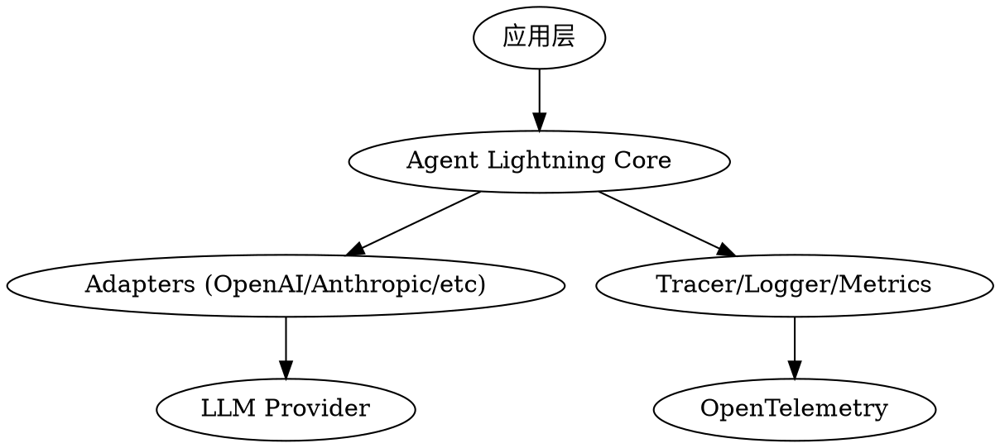

# Agent Lightning

> Microsoft 轻量级 AI Agent 框架 — 从开发到部署的完整工具链

## 基本信息

| 属性 | 值 |
|------|-----|
| **仓库** | [microsoft/agent-lightning](https://github.com/microsoft/agent-lightning) |
| **语言** | Python |
| **许可证** | MIT |
| **平台支持** | Python, Claude Code |

## 核心特色

### 🚀 轻量级 Agent 框架

**Microsoft 官方出品** — 专为 AI Agent 设计的开发、训练和部署框架。

| 特性 | 说明 |
|------|------|
| **快速开发** | 简洁的 API 设计，快速原型验证 |
| **生产就绪** | OpenTelemetry 追踪、日志、监控 |
| **强化学习** | 内置 RL 训练支持 |
| **可观测性** | 完整的追踪和插桩系统 |

### 📦 核心组件

#### 开发工具链
| 组件 | 功能 |
|------|------|
| **agentlightning/** | 核心框架代码 |
| **cli/** | 命令行工具 |
| **adapter/** | 多平台适配器 |
| **execution/** | 执行引擎 |
| **instrumentation/** | 自动插桩 |

#### 训练与优化
| 组件 | 功能 |
|------|------|
| **trainer/** | Agent 训练器 |
| **algorithm/** | RL 算法库 |
| **verl/** | 强化学习集成 |
| **reward/** | 奖励函数定义 |

#### 可观测性
| 组件 | 功能 |
|------|------|
| **tracer/** | OpenTelemetry 追踪 |
| **emitter/** | 指标导出器 |
| **logging/** | 结构化日志 |
| **dashboard/** | 可视化面板 |

## 项目结构

```
agent-lightning/
├── agentlightning/       # 核心框架
│   ├── __init__.py
│   ├── client.py         # 客户端 API
│   ├── server.py         # 服务器 API
│   ├── config.py         # 配置管理
│   ├── llm_proxy.py      # LLM 代理
│   ├── adapter/          # 适配器层
│   ├── algorithm/        # 算法库
│   ├── cli/              # CLI 工具
│   ├── execution/        # 执行引擎
│   ├── instrumentation/  # 自动插桩
│   ├── litagent/         # 轻量级 Agent
│   ├── runner/           # 运行器
│   ├── tracer/           # 追踪器
│   ├── trainer/          # 训练器
│   ├── types/            # 类型定义
│   ├── utils/            # 工具函数
│   └── verl/             # RL 集成
├── examples/             # 示例代码
├── tests/                # 测试套件
├── docs/                 # 文档
├── dashboard/            # 可视化
├── docker/               # Docker 配置
├── scripts/              # 构建脚本
├── pyproject.toml        # Python 项目配置
├── mkdocs.yml            # 文档配置
├── AGENTS.md             # Claude Code Agents
├── CLAUDE.md             # Claude Code 配置
├── README.md             # 项目说明
├── LICENSE               # MIT 许可证
└── SECURITY.md           # 安全策略
```

## 技术架构

### 分层设计



### 核心模块

| 模块 | 文件 | 功能 |
|------|------|------|
| **Client** | `client.py` (17KB) | 客户端 SDK |
| **Server** | `server.py` (17KB) | 服务器 API |
| **LLM Proxy** | `llm_proxy.py` (61KB) | LLM 请求代理 |
| **Config** | `config.py` (14KB) | 配置管理 |
| **Logging** | `logging.py` (14KB) | 日志系统 |

## 使用场景

| 场景 | 推荐模块 |
|------|----------|
| **快速原型** | `litagent/`, `cli/` |
| **生产部署** | `server/`, `adapter/` |
| **性能优化** | `tracer/`, `instrumentation/` |
| **RL 训练** | `trainer/`, `algorithm/`, `verl/` |
| **监控调试** | `dashboard/`, `emitter/` |

## 开发工作流

### 1. Agent 开发
```python
from agentlightning import LightningAgent

class MyAgent(LightningAgent):
    def __init__(self):
        super().__init__()
    
    def act(self, observation):
        # 定义 Agent 行为
        return action
```

### 2. 追踪集成
```python
from agentlightning.tracer import OpenTelemetryTracer

tracer = OpenTelemetryTracer()
with agent.trace("action"):
    result = agent.act(observation)
```

### 3. 训练循环
```python
from agentlightning.trainer import Trainer

trainer = Trainer(agent, environment)
trainer.train(episodes=1000)
```

## 集成生态

### Claude Code 集成

通过 `AGENTS.md` 和 `CLAUDE.md` 与 Claude Code 深度集成：

- ✅ Agent 定义标准化
- ✅ 技能(Skills)可复用
- ✅ MCP 服务集成
- ✅ 自动化工作流

### 可观测性标准

遵循 OpenTelemetry 标准：

| 标准 | 支持情况 |
|------|----------|
| **Traces** | ✅ 完整支持 |
| **Metrics** | ✅ 自动导出 |
| **Logs** | ✅ 结构化日志 |
| **Semantic Conventions** | ✅ 遵循 semconv |

## 快速开始

### 安装

```bash
# 使用 uv（推荐）
pip install uv
uv sync

# 或使用 pip
pip install -e .
```

### 运行示例

```bash
# CLI 工具
python -m agentlightning.cli --help

# 运行示例 Agent
python examples/simple_agent.py

# 启动 Dashboard
python -m agentlightning.dashboard
```

## Microsoft 优势

### 为什么选择 Agent Lightning？

1. **企业级质量** — Microsoft 官方维护
2. **生产就绪** — 完整的可观测性支持
3. **开箱即用** — 丰富的示例和文档
4. **标准兼容** - 遵循 OpenTelemetry 等行业标准
5. **持续演进** — 活跃开发和社区支持

## 相关资源

| 资源 | 链接 |
|------|------|
| GitHub | https://github.com/microsoft/agent-lightning |
| 文档 | https://microsoft.github.io/agent-lightning/ |
| Issues | https://github.com/microsoft/agent-lightning/issues |
| 许可证 | MIT License |

## 对标项目

| 项目 | Stars | 特色 |
|------|-------|------|
| [[affaan-m-everything-claude-code]] | 171K+ | Claude Code 技能库（最大规模） |
| [[Yeachan-Heo-oh-my-claudecode]] | - | 韩国开发者本地化 |
| [[luongnv89-claude-howto]] | - | 结构化教程 |
| **microsoft/agent-lightning** | - | 🏢 **Microsoft 官方 Agent 框架** |

---

*归档时间: 2026-05-01*
