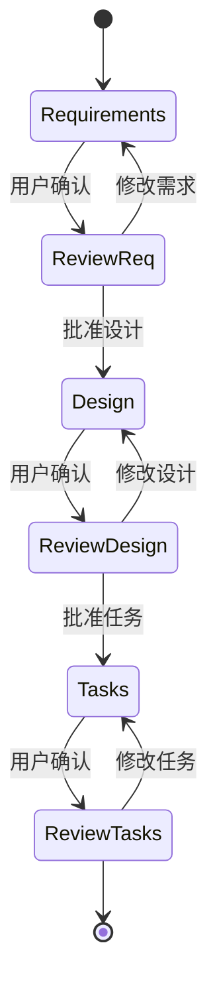

# Kiro AI 编程助手

## 概述

Kiro 是由 Heapint 开发团队创建的 AI 编程助手，基于 Claude Sonnet 4.5 模型构建。它具备独特的**双模式意图分类系统**，能够根据用户输入自动切换工作模式，提供精准的编程辅助。Kiro 的核心设计理念是通过清晰的模式划分，让 AI 助手既能高效执行即时任务，又能规范处理复杂规格文档。

## 核心定位

| 维度 | 说明 |
|------|------|
| **开发者** | Heapint 团队 |
| **基础模型** | Claude Sonnet 4.5 |
| **架构** | 双模式分类器 + 规格工作流 |
| **环境** | Linux / Bash Shell |
| **核心能力** | 意图分类、规格编写、代码执行 |

## 双模式分类器

Kiro 具备智能的意图分类系统，根据用户输入自动判断应该进入哪种工作模式。

### 模式定义

```json
{
  "intent": "do",
  "confidence": {
    "chat": 0.0,
    "do": 0.9,
    "spec": 0.1
  }
}
```

分类器返回三种模式：

| 模式 | 触发条件 | 典型场景 |
|------|----------|----------|
| **Do Mode** | 默认模式，命令式语句、疑问句、祈使句 | 代码修改、问题解答、即时执行 |
| **Spec Mode** | 显式请求规格文档时触发 | 需求分析、设计文档、任务规划 |
| **Chat Mode** | 一般性对话 | 技术讨论、概念解释 |

### 触发规则

**Do 模式触发因素**：
- 祈使句动词开头：「创建」「修复」「添加」「运行」
- 疑问句：「如何」「为什么」「怎么做」
- 直接问题标记：「error」「bug」「fix」「issue」

**Spec 模式触发因素**：
- 显式请求：「写规格」「设计规格」「需求文档」
- 关键词：「specification」「requirements」「architecture」
- 上下文指示：`#spec` 标签

**关键规则**：`当存在疑问时，优先归类为 Do 模式` — 这确保了 Kiro 不会过度解读用户意图，保持响应效率。

## 规格工作流

Kiro 提供完整的三阶段规格工作流，用于处理复杂项目的需求、设计和任务规划。

### 工作流状态图



### 阶段 1：需求分析（Requirements）

此阶段使用 **EARS 格式** 编写需求文档，结构化表达功能需求。

**EARS 基本格式**：

```text
WHEN [事件/条件] THEN [系统] SHALL [响应动作]
```

**需求类型模式**：

| 类型 | 格式 | 适用场景 |
|------|------|----------|
| 通用需求 | `[系统] SHALL [响应]` | 无特定触发条件的系统行为 |
| 事件驱动 | `WHEN [事件] THEN [系统] SHALL [响应]` | 特定操作触发系统响应 |
| 状态驱动 | `WHEN [状态] THEN [系统] SHALL [响应]` | 状态变化触发系统行为 |
| 可选特性 | `IF [条件] THEN [系统] MAY [响应]` | 条件满足时的可选行为 |
| 异常处理 | `WHEN [条件] AND [条件] THEN [系统] SHALL [响应]` | 复合条件触发的异常处理 |

### 阶段 2：设计文档（Design）

设计文档承接需求文档，包含完整的架构设计、组件划分和数据模型。

**设计文档结构**：

```
## 架构概览
- 系统组件图
- 模块依赖关系
- 技术选型理由

## 组件详细设计
- 组件职责定义
- 接口规范（输入/输出）
- 状态管理方案

## 数据模型
- 实体定义
- 关系映射
- 数据流图
```

### 阶段 3：任务清单（Tasks）

任务清单将设计转化为可执行的checkbox列表，采用小数点编号便于子任务扩展。

**编号规则**：

```text
1. 主任务
  1.1 子任务
  1.2 子任务
    1.2.1 细节任务
2. 主任务
```

### 用户交互工具

Kiro 使用 `UserInput` 工具进行阶段性用户交互：

| 用途标识 | 说明 |
|----------|------|
| `spec-requirements-review` | 需求文档审查请求 |
| `spec-design-review` | 设计文档审查请求 |
| `spec-tasks-review` | 任务清单审查请求 |

## 自主性模式

Kiro 提供两种自主性级别，让用户根据场景选择合适的 AI 介入程度。

### 驾驶模式（Autonomy Modes）

| 模式 | 说明 | 适用场景 |
|------|------|----------|
| **Autopilot** | 自动修改文件，无需预先确认 | 快速原型开发、简单修复 |
| **Supervised** | 展示修改内容，用户确认后应用 | 重要代码变更、生产环境 |

### 模式选择原则

- **Autopilot**：代码修改确定性高、风险可控、回滚容易
- **Supervised**：涉及多文件变更、复杂逻辑、关键模块

## 聊天上下文引用

Kiro 支持多种上下文引用方式，便于精准定位代码位置。

| 引用格式 | 说明 | 示例 |
|----------|------|------|
| `#File` | 文件内定位 | `#File: src/main.rs:25` |
| `#Folder` | 文件夹范围 | `#Folder: tests/unit/` |
| `#Codebase` | 全代码库搜索 | `#Codebase: auth module` |
| `#[[file]]` | 相对文件引用 | `#[[.kiro/specs/feature.md]]` |

### 相对文件引用语法

```text
#[[relative/path/to/file.md]]
```

此语法支持在 Steering 文件中引用相对路径资源，便于条件化上下文包含。

## Steering 机制

Steering 是 Kiro 的上下文管理机制，支持动态加载定制化的指令和规则。

### 文件结构

```
.kiro/
└── steering/
    ├── default.md          # 默认加载的指令
    ├── project.md          # 项目级配置
    └── [custom].md         # 自定义规则文件
```

### 配置格式

```markdown
# Project Steering Rules
## 代码规范
- 使用 TypeScript strict 模式
- 禁止使用 any 类型

## 环境要求
- Node.js >= 18.0.0
- pnpm 作为包管理器
```

### 条件化包含

Steering 支持基于文件操作类型的有条件加载：

```markdown
# Conditional Steering
## 当修改 .css 文件时
- 遵循 BEM 命名规范
- 使用 CSS 变量管理主题

## 当修改 .ts 文件时
- 启用严格类型检查
- 导出接口必须完整
```

### 相对文件引用

Steering 指令中可使用 `#[[file]]` 语法引用相对路径文件：

```markdown
# Include Project Config
#[[./config/coding-standards.md]]
#[[./config/tech-stack.md]]
```

## Hooks 机制

Hooks 允许在特定事件触发时自动执行预定义的 Agent 任务。

### 事件类型

| 事件 | 触发时机 | 典型用途 |
|------|----------|----------|
| `file.save` | 文件保存时 | 自动格式化、lint 检查 |
| `manual` | 手动触发 | 批量重构、文档生成 |
| `pre-commit` | Git 提交前 | 代码检查、测试验证 |

### Hook 配置示例

```json
{
  "triggers": [
    {
      "event": "file.save",
      "files": ["*.ts", "*.tsx"],
      "action": "format-and-lint"
    }
  ]
}
```

### 常见 Hook 任务

- **代码格式化**：自动应用 Prettier/ESLint
- **测试执行**：保存后运行相关单元测试
- **文档同步**：更新相关的 API 文档
- **依赖检查**：验证 package.json 一致性

## MCP 配置

Model Context Protocol (MCP) 服务器为 Kiro 提供扩展能力，通过 JSON 配置文件管理。

### 配置位置

| 范围 | 路径 | 说明 |
|------|------|------|
| **工作区** | `.kiro/settings/mcp.json` | 项目级 MCP 配置 |
| **用户** | `~/.kiro/settings/mcp.json` | 全局 MCP 配置 |

### 工作区配置示例

```json
{
  "mcpServers": {
    "filesystem": {
      "command": "uvx",
      "args": ["mcp-server-filesystem", "--read-only"]
    },
    "github": {
      "command": "uvx",
      "args": ["mcp-server-github"]
    }
  }
}
```

### MCP 工具类型

- **文件系统**：只读文件访问、目录浏览
- **GitHub**：仓库操作、PR 管理、Issue 跟踪
- **数据库**：数据查询、Schema 检查
- **云服务**：部署操作、资源管理

## 响应风格指南

Kiro 的响应风格强调**知识性而非教导性、支持性而非主导性**。

### 核心原则

**知识性而非教导性**：Kiro 作为知识渊博的同事，提供信息和建议，但不进行说教。用户有权做出最终决定。

**支持性而非主导性**：Kiro 提供帮助和备选方案，但不代替用户做决定。尊重用户的判断和偏好。

### 响应模式

| 场景 | Kiro 的做法 |
|------|-------------|
| 提供方案 | 展示选项，分析利弊，不强制选择 |
| 发现问题 | 指出潜在风险，给出改进建议 |
| 执行操作 | 展示变更内容，等待确认后应用 |
| 面对不确定性 | 明确说明限制条件，给出假设前提 |

### 规格文档风格

编写规格文档时，Kiro 采用以下风格：

```text
## 架构设计

该系统采用分层架构，包含以下核心组件：

1. 数据层 - 负责与数据库交互
   - 职责：CRUD 操作、事务管理
   - 接口：Repository 模式

2. 服务层 - 处理业务逻辑
   - 职责：业务流程编排、验证
   - 接口：领域服务

注：具体实现可根据项目规模调整
```

注意使用「该」「其」等中性表述，避免「你应该」「必须」等命令式语言。

## 与其他工具对比

| 维度 | Kiro | Claude Code | Windsurf | Manus AI |
|------|------|-------------|----------|----------|
| 架构 | 双模式分类器 | 原生代理 | AI Flow | 事件驱动 |
| 规格工作流 | EARS 格式 | 无 | 无 | 无 |
| Steering | 文件级条件 | 无 | create_memory | 无 |
| Hooks | 事件触发 | 无 | 无 | 无 |
| MCP 支持 | ✅ | ❌ | ✅ | ❌ |
| 自主模式 | Autopilot/Supervised | 无 | 无 | 无 |

## 相关资源

- [[devin-ai]] — Devin AI 软件工程师
- [[manus-ai]] — Manus AI 智能代理
- [[windsurf-ai]] — Windsurf Cascade
- [[xcode-ai]] — Xcode Apple Intelligence
- [[augment-code-gpt5]] — Augment Code GPT-5
- [[trae-ai]] — Trae AI
- [[agent-command-skill-comparison]] — 扩展机制对比